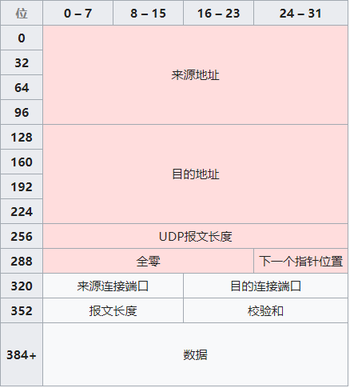

# TCP 和 UDP 报文结构

## TCP Header

- 来源连接端口（16 位长）－识别发送连接端口
- 目的连接端口（16 位长）－识别接收连接端口
- 序列号（seq，32 位长）
  - 如果含有同步化旗标（SYN），则此为最初的序列号；第一个数据比特的序列码为本序列号加一。
  - 如果没有同步化旗标（SYN），则此为第一个数据比特的序列码。
- 确认号（ack，32 位长）—期望收到的数据的开始序列号。也即已经收到的数据的字节长度加 1。
- 数据偏移（4 位长）—以 4 字节为单位计算出的数据段开始地址的偏移值。
- 保留（3 比特长）—须置 0
- 标志符（9 比特长）
  - NS—ECN-nonce。ECN 显式拥塞通知（Explicit Congestion Notification）是对 TCP 的扩展，定义于 RFC 3540（2003）。ECN 允许拥塞控制的端对端通知而避免丢包。ECN 为一项可选功能，如果底层网络设施支持，则可能被启用 ECN 的两个端点使用。在 ECN 成功协商的情况下，ECN 感知路由器可以在 IP 头中设置一个标记来代替丢弃数据包，以标明阻塞即将发生。数据包的接收端回应发送端的表示，降低其传输速率，就如同在往常中检测到包丢失那样。
  - CWR—Congestion Window Reduced，定义于 RFC 3168（2001）。
  - ECE—ECN-Echo 有两种意思，取决于 SYN 标志的值，定义于 RFC 3168（2001）。
  - URG—为 1 表示高优先级数据包，紧急指针字段有效。
  - ACK—为 1 表示确认号字段有效
  - PSH—为 1 表示是带有 PUSH 标志的数据，指示接收方应该尽快将这个报文段交给应用层而不用等待缓冲区装满。
  - RST—为 1 表示出现严重差错。可能需要重新创建 TCP 连接。还可以用于拒绝非法的报文段和拒绝连接请求。
  - SYN—为 1 表示这是连接请求或是连接接受请求，用于创建连接和使顺序号同步
  - FIN—为 1 表示发送方没有数据要传输了，要求释放连接。
- 窗口（WIN，16 位长）—表示从确认号开始，本报文的发送方可以接收的字节数，即接收窗口大小。用于流量控制。
- 校验和（Checksum，16 位长）—对整个的 TCP 报文段，包括 TCP 头部和 TCP 数据，以 16 位字进行计算所得。这是一个强制性的字段。
- 紧急指针（16 位长）—本报文段中的紧急数据的最后一个字节的序号。
- 选项字段—最多 40 字节。每个选项的开始是 1 字节的 kind 字段，说明选项的类型。
  - 0：选项表结束（1 字节）
  - 1：无操作（1 字节）用于选项字段之间的字边界对齐。
  - 2：最大报文段长度（4 字节，Maximum Segment Size，MSS）通常在创建连接而设置 SYN 标志的数据包中指明这个选项，指明本端所能接收的最大长度的报文段。通常将 MSS 设置为（MTU-40）字节，携带 TCP 报文段的 IP 数据报的长度就不会超过 MTU（MTU 最大长度为 1518 字节，最短为 64 字节），从而避免本机发生 IP 分片。只能出现在同步报文段中，否则将被忽略。
  - 3：窗口扩大因子（4 字节，wscale），取值 0-14。用来把 TCP 的窗口的值左移的位数，使窗口值乘倍。只能出现在同步报文段中，否则将被忽略。这是因为现在的 TCP 接收数据缓冲区（接收窗口）的长度通常大于 65535 字节。
  - 4：sackOK—发送端支持并同意使用 SACK 选项。
  - 5：SACK 实际工作的选项。
  - 8：时间戳（10 字节，TCP Timestamps Option，TSopt）
    - 发送端的时间戳（Timestamp Value field，TSval，4 字节）
    - 时间戳回显应答（Timestamp Echo Reply field，TSecr，4 字节）

## UDP Header

**报文长度**：该字段指定 UDP 报头和数据总共占用的长度。可能的最小长度是 8 字节，因为 UDP 报头已经占用了 8 字节。由于这个字段的存在，UDP 报文总长不可能超过 65535 字节（包括 8 字节的报头，和 65527 字节的数据）。实际上通过 IPv4 协议传输时，由于 IPv4 的头部信息要占用 20 字节，因此数据长度不可能超过 65507 字节（65,535 − 8 字节 UDP 报头 − 20 字节 IP 头部）。

在 IPv6 的 jumbogram 中，是有可能传输超过 65535 字节的 UDP 数据包的。依据 RFC 2675，如果这种情况发生，报文长度应被填写为 0。

**校验和**：校验和字段可以用于发现头部信息和数据中的传输错误。该字段在 IPv4 中是可选的，在 IPv6 中则是强制的。如果不使用校验和，该字段应被填充为全 0。

**UDP 校验和计算**：

当 UDP 运行在 IPv4 之上时，为了能够计算校验和，需要在 UDP 数据包前添加一个“伪头部”。伪头部包括了 IPv4 头部中的一些信息，但它并不是发送 IP 数据包时使用的 IP 数据包的头部，而只是一个用来计算校验和而已。

当 UDP 运行于 IPV6 之上时，校验和是必须的，其计算方法位于 RFC 2460:

任何包含来自 IP 头地址的传输层或其他上层协议，其校验和的计算必须被修改，以适应 IPv6 的 128 位 ip 地址。

IPv6 伪头部是生成校验和所用的数据。

