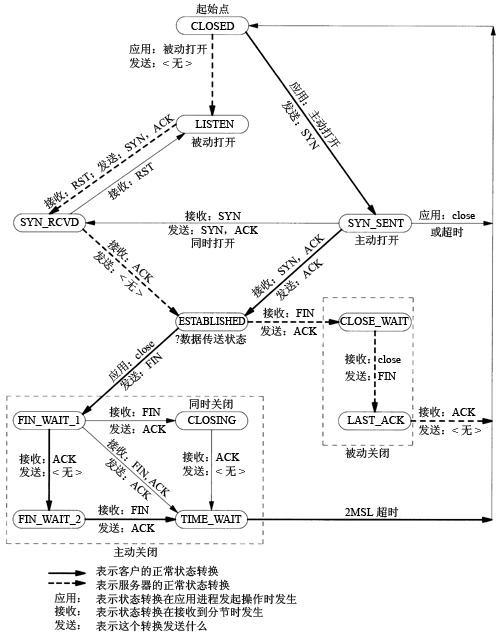

# TCP 状态转换

- [TCP 状态转换](#tcp-%e7%8a%b6%e6%80%81%e8%bd%ac%e6%8d%a2)
  - [tcp 11 种状态](#tcp-11-%e7%a7%8d%e7%8a%b6%e6%80%81)
  - [TCP 3 次握手和 4 次握手描述](#tcp-3-%e6%ac%a1%e6%8f%a1%e6%89%8b%e5%92%8c-4-%e6%ac%a1%e6%8f%a1%e6%89%8b%e6%8f%8f%e8%bf%b0)
    - [TCP 建立 3 次握手](#tcp-%e5%bb%ba%e7%ab%8b-3-%e6%ac%a1%e6%8f%a1%e6%89%8b)
    - [TCP 4 次挥手](#tcp-4-%e6%ac%a1%e6%8c%a5%e6%89%8b)
  - [TCP 网络编程中 connect(),listen()和 accept()三者之间的关系](#tcp-%e7%bd%91%e7%bb%9c%e7%bc%96%e7%a8%8b%e4%b8%ad-connectlisten%e5%92%8c-accept%e4%b8%89%e8%80%85%e4%b9%8b%e9%97%b4%e7%9a%84%e5%85%b3%e7%b3%bb)
    - [connect()函数](#connect%e5%87%bd%e6%95%b0)
    - [listen()函数](#listen%e5%87%bd%e6%95%b0)
    - [三次握手的连接队列](#%e4%b8%89%e6%ac%a1%e6%8f%a1%e6%89%8b%e7%9a%84%e8%bf%9e%e6%8e%a5%e9%98%9f%e5%88%97)
    - [accept()函数](#accept%e5%87%bd%e6%95%b0)
  - [参考](#%e5%8f%82%e8%80%83)

## tcp 11 种状态

- tcp 11 种状态转换图




三次握手：

- LISTEN：等待从任何远端 TCP 和端口的连接请求。(server)
- SYN_SENT：发送完一个连接请求后等待一个匹配的连接请求。(client)
- SYN_RECEIVED：发送连接请求并且接收到匹配的连接请求以后等待请求确认。(server)
- ESTABLISHED：表示一个打开的连接，接收到的数据可以被投递给用户。连接的数据数据传输阶段的正常状态。(server/client)

四次挥手：

- FIN_WAIT_1：**等待远端的连接终止请求**，等待远端 TCP 的连接终止请求，或者等待之前发送的连接终止请求的确认。(active close)
- FIN_WAIT_2：等待远端 TCP 的连接终止请求。(active close)
- CLOSE_WAIT：等待本地用户的连接终止请求。(passive close)
- CLOSING：等待远端 TCP 的连接终止请求确认。(active close)
- LAST_ACK：等待先前发送给远端 TCP 的连接终止请求的确认（包括它字节的连接终止请求的确认）(passive close)
- TIME_WAIT：等待足够的时间过去以确保远端 TCP 接收到它的连接终止请求的确认。(active close)
  - TIME_WAIT 两个存在的理由：
    1. 可靠的实现 tcp 全双工连接的终止；
    2. 允许老的重复分节在网络中消逝。
- CLOSED：不在连接状态（这是为方便描述假想的状态，实际不存在）

## TCP 3 次握手和 4 次握手描述

### TCP 建立 3 次握手

server 常处于监听状态(LISTEN)，accept()处于阻塞状态

当客户端连接服务器时，此时客户端的 connect()刚刚调用并处于阻塞状态，将会触发以下事件：

- 首先客户端的应用程序会使 tcp 进程**发送 SYN，MSS**，此时客户端处于 SYN_SENT
- 通过网络传输给服务器端后，服务器端 tcp 接收到后服务器端将会由 LISTEN 状态变为 SYN_RCVD
- 然后服务器端也会发送一个 SYN,MSS 还有一个 ACK,注意这个 ACK 是客户端发送的 SYN 值加 1
- 客户端在接收到服务器端的 SYN,MSS,ACK 核对无误后将会由 SYN_SENT 状态变为 ESTABLILSHED
- 此时客户端的**connect()函数将会返回不再处于阻塞状态**，同时客户端发送 ACK，此 ACK 是服务器端发送的 SYN 值加 1，服务器端在接收到客户端的**ACK 核对无误后**，**accept()将从阻塞状态返回**，**同时 read()处于阻塞状态**，此时连接已经建立。

### TCP 4 次挥手

一端发送完数据之后断开连接，通常是客户端主动断开，这种情况下：

- 客户端调用**close(fd)关闭套接字**，这将触发 tcp 进程发送 FIN，此时客户端会处于 FIN_WAIT_1
- 服务器端在接收到这个 FIN 后将会处于 close_wait()状态，同时 read() return 0，然后服务器端将会发送 ACK 值为客户端发送的 FIN 值加 1
- 客户端在接收到服务器端发送给它的 ACK 后将会处于 FIN_WAIT_2
- 然后服务器端将客户端的文件描述符读端关闭，此时服务器端可能还会有未发送的数据，通常会悄悄丢弃掉，然后关闭客户端描述符 close()
- 然后服务器端 tcp 进程将会发送 FIN 此时服务器端将会处于 LAST_ACK 状态，客户端在接收到服务器端发送的 FIN 后将会由 FIN_WAIT_2 状态变为 TIME_WAIT 状态，同时发送 ACK 值为客户端发送的 FIN 值加 1
- 服务器端在接收到客户端发送的 ACK 后核对无误后将由 LAST_ACK 状态变为 CLOSED 状态。注意客户端在**处于 TIME_WAIT 状态时要经历 2 个 MSL 时间才会将状态变为 CLOSED，通常这个等待的时间为 60 秒**

## TCP 网络编程中 connect(),listen()和 accept()三者之间的关系


### connect()函数

该函数功能为客户端主动连接服务器，通过 3 次握手建立连接，**连接过程由内核完成**，不是这个函数完成，该函数的作用仅是通知 Linux 内核，让 Linux 内核自动完成 TCP 三次握手，最后把连接的结果返回给这个函数的返回值（成功连接为 0， 失败为-1）。通常的情况，客户端的 connect() 函数默认会一直阻塞，直到三次握手成功或超时失败才返回（正常的情况，这个过程很快完成）。

### listen()函数

```c
#include<sys/socket.h>
int listen(int sockfd, int backlog);
```

函数的主要作用就是将套接字(sockfd)变成被动的连接监听套接字(被动等待客户端的连接)，至于参数 **backlog 的作用是设置内核中连接队列的长度**（这个长度有什么用，后面做详细的解释），**TCP 三次握手也不是由这个函数完成，listen()的作用仅仅告诉内核一些信息。**

**这里需要注意的是**，**listen()函数不会阻塞**，它主要做的事情为，将该套接字和套接字对应的连接队列长度告诉 Linux 内核，然后，listen()函数就结束。

这样的话，当有一个客户端主动连接（connect()），Linux 内核就自动完成 TCP 三次握手，将建立好的链接自动存储到队列中，如此重复。

所以，只要 TCP 服务器调用了 listen()，客户端就可以通过 connect() 和服务器建立连接，而**这个连接的过程是由内核完成。**


### 三次握手的连接队列

这里详细的介绍一下 listen() 函数的第二个参数（ backlog）的作用：**告诉内核连接队列的长度**。

为了更好的理解 backlog 参数，我们必须认识到内核为任何一个给定的监听套接口维护两个队列：

1. 未完成连接队列（incomplete connection queue），每个这样的 SYN 分节对应其中一项：已由某个客户发出并到达服务器，而服务器正在等待完成相应的 TCP  三次握手过程。这些套接口处于 SYN_RCVD 状态。
2. 已完成连接队列（completed connection queue），每个已完成 TCP 三次握手过程的客户对应其中一项。这些套接口处于 ESTABLISHED 状态。


当来自客户的 SYN 到达时，TCP 在未完成连接队列中创建一个新项，然后响应以三次握手的第二个分节：服务器的 SYN 响应，其中稍带对客户 SYN 的 ACK（即 SYN+ACK），这一项一直保留在未完成连接队列中，直到三次握手的第三个分节（客户对服务器 SYN 的 ACK ）到达或者该项超时为止（曾经源自 Berkeley 的实现为这些未完成连接的项设置的超时值为 75 秒）。

如果三次握手正常完成，该项就从未完成连接队列移到已完成连接队列的队尾。

**backlog 参数**历史上被定义为上面两个队列的大小之和，大多数实现默认值为 5，当服务器把这个完成连接队列的某个连接取走后，这个队列的位置又空出一个，这样来回实现动态平衡，但在高并发 web 服务器中此值显然不够。

### accept()函数

accept()函数功能是，从处于 established 状态的连接队列头部取出一个已经完成的连接，如果这个队列没有已经完成的连接，accept()函数就会阻塞，直到取出队列中已完成的用户连接为止。

如果，服务器不能及时调用 accept() 取走队列中已完成的连接，队列满掉后会怎样呢？服务器的连接队列满掉后，服务器不会对再对建立新连接的 syn 进行应答，所以客户端的 connect 就会返回 ETIMEDOUT。**但实际上 Linux 的并不是这样的！**

**TCP 的连接队列满后，Linux 不会如书中所说的拒绝连接**，只是有些会延时连接，而且 accept()未必能把已经建立好的连接全部取出来（如：当队列的长度指定为 0 ），写程序时服务器的 listen() 的第二个参数最好还是根据需要填写，写太大不好（具体可以看 cat /proc/sys/net/core/somaxconn，默认最大值限制是 128），浪费资源，写太小也不好，延时建立连接。

## 参考

> - [参考](https://blog.csdn.net/pearl_c/article/details/51226320)
> - [TCP 网络编程中 connect()、listen()和 accept()三者之间的关系](https://blog.csdn.net/tennysonsky/article/details/45621341)
