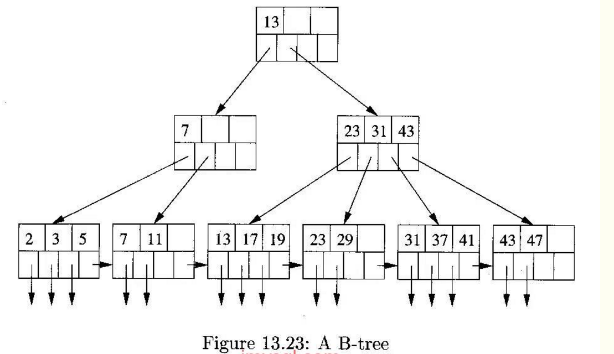
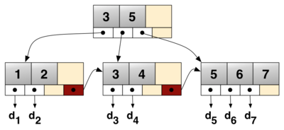
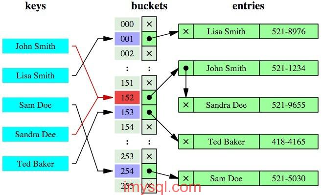
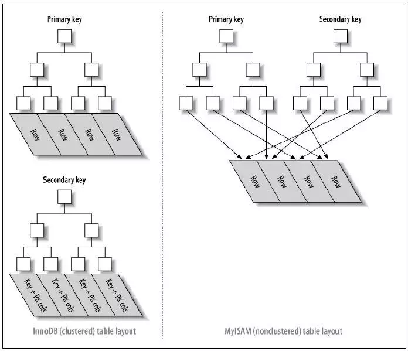
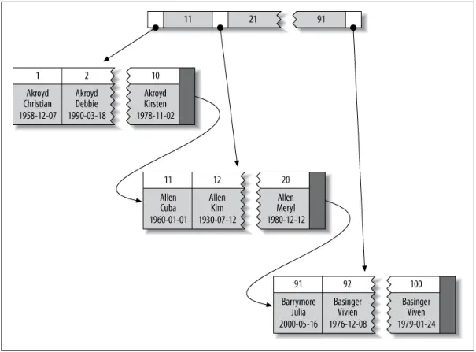
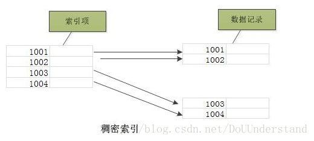
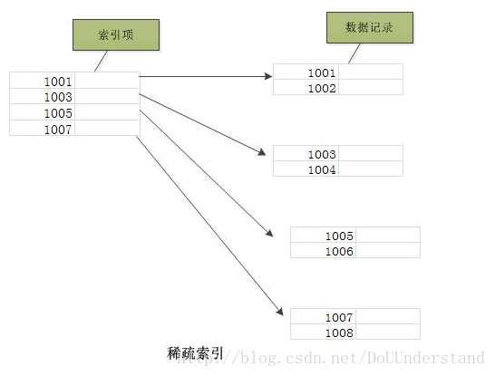

# MySQL 索引

## 本质

索引(Index)是帮助 MySQL 高效获取数据的数据结构。

索引需要额外的磁盘空间存储，对插入、更新、删除等操作，更新索引会增加额外的开销。

索引适合读多写少的场景

## 索引的存储分类

索引是在 MySQL 的存储引擎实现的，而不是服务层实现的。所以每种存储引擎的索引都不一定完全相同，也不是所有的存储引擎都支持所有的索引类型。MYSQL 目前提供了一下 4 种索引。

- **B-Tree 索引**：最常见的索引类型，大部分引擎都支持 B 树索引。适用于范围查询
- **HASH 索引**：只有 Memory 引擎支持，使用场景简单。不支持排序和范围查找
- **R-Tree 索引(空间索引)**：空间索引是 MyISAM 的一种特殊索引类型，用于处理多维数据的数据结构，主要用于地理空间数据类型。
- **Full-text (全文索引)**：全文索引也是 MyISAM 的一种特殊索引类型，主要用于全文索引，InnoDB 从 MYSQL5.6 版本提供对全文索引的支持。
- **函数索引**：在 MySQL 5.7 中，支持两种 Generated Column

  - **Virtual Generated Column（虚拟生成的列）**：不存储该列值，即 MySQL 只是将这一列的元信息保存在数据字典中，并不会将这一列数据持久化到磁盘上，而是当读取该行时，触发触发器对该列进行计算显示。InnoDB 支持 Virtual Generated Column，具体参考“https://dev.mysql.com/doc/refman/5.7/en/create-table-secondary-indexes.html”
  - **Stored Generated Column（存储生成的列）**： 存储该列值，即该列值在插入或更新行时进行计算和存储。所以相对于 Virtual Column 列需要更多的磁盘空间，与 Virtual Column 相比并没有优势。因此，MySQL 5.7 中，不指定 Generated Column 的类型，默认是 Virtual Column
  - 在表中**允许 Virtual Column 和 Stored Column 的混合使用**
  - **提高效率**：由于 mysql 在普通索引上加函数会造成索引失效，造成查询性能下降，Generated Column（函数索引）刚好可以解决这个问题，可以在 Generated Column 加上索引来提高效率

  ```sql
  col_name data_type [GENERATED ALWAYS] AS (expr)
    [VIRTUAL | STORED] [NOT NULL | NULL]
    [UNIQUE [KEY]] [[PRIMARY] KEY]
    [COMMENT 'string']

  -- e.g.
    CREATE TABLE triangle (
    sidea DOUBLE,
    sideb DOUBLE,
    sidec DOUBLE AS (SQRT(sidea * sidea + sideb * sideb))
  );
  INSERT INTO triangle (sidea, sideb) VALUES(1,1),(3,4),(6,8);
  ```

## MyISAM,InnoDB 引擎,Memory 三个常用引擎类型比较

| 索引           | MyISAM 引擎 | InnoDB 引擎  | Memory 引擎 |
| -------------- | ----------- | ------------ | ----------- |
| B-Tree 索引    | 支持        | 支持         | 支持        |
| HASH 索引      | 不支持      | 不支持       | 支持        |
| R-Tree 索引    | 支持        | 不支持       | 不支持      |
| Full-text 索引 | 支持        | 支持(>5.6.4) | 不支持      |

## B-TREE 索引类型

**普通索引**

- 创建索引: CREATE INDEX 索引名 ON 表名(列名 1，列名 2,...);
- 修改表: ALTER TABLE 表名 ADD INDEX 索引名 (列名 1，列名 2,...);
- 创建表时指定索引：CREATE TABLE 表名 ( [...], INDEX 索引名 (列名 1，列名 2,...) );

**UNIQUE 索引**

- 创建索引：CREATE UNIQUE INDEX 索引名 ON 表名(列的列表);
- 修改表：ALTER TABLE 表名 ADD UNIQUE 索引名 (列的列表);
- 创建表时指定索引：CREATE TABLE 表名( [...], UNIQUE 索引名 (列的列表) );

**主键：PRIMARY KEY 索引**

- 主键一般在创建表的时候指定：“CREATE TABLE 表名( [...], PRIMARY KEY (列的列表) ); ”。
- 但是，我们也可以通过修改表的方式加入主键：“ALTER TABLE 表名 ADD PRIMARY KEY (列的列表); ”。
- 每个表只能有一个主键。 （主键相当于聚合索引，是查找最快的索引）

## 索引相关操作

## 设置索引

- **ALTER TABLE**：ALTER TABLE 用来创建普通索引、UNIQUE 索引或 PRIMARY KEY 索引。

  - ALTER TABLE table_name ADD **INDEX** index_name (column_list)
  - ALTER TABLE table_name ADD **UNIQUE** (column_list)
  - ALTER TABLE table_name ADD **PRIMARY KEY** (column_list)

- **CREATE INDEX**：CREATE INDEX 可对表增加普通索引或 UNIQUE 索引。

  - CREATE INDEX index_name ON table_name (column_list)
  - CREATE UNIQUE INDEX index_name ON table_name (column_list)

## 删除索引

可利用**ALTER TABLE**或**DROP INDEX**语句来删除索引。类似于 CREATE INDEX 语句，DROP INDEX 可以在 ALTER TABLE 内部作为一条语句处理，语法如下。

- DROP INDEX index_name ON talbe_name
- ALTER TABLE table_name DROP INDEX index_name
- ALTER TABLE table_name DROP PRIMARY KEY

其中，前两条语句是等价的，删除掉 table_name 中的索引 index_name。

第 3 条语句只在删除 PRIMARY KEY 索引时使用，因为一个表只可能有一个 PRIMARY KEY 索引，因此不需要指定索引名。如果没有创建 PRIMARY KEY 索引，但表具有一个或多个 UNIQUE 索引，则 MySQL 将删除第一个 UNIQUE 索引。

> 如果从表中删除了某列，则索引会受到影响。对于多列组合的索引，如果删除其中的某列，则该列也会从索引中删除。如果删除组成索引的所有列，则整个索引将被删除。

## 查看索引

```sql
mysql> show index from tblname;
mysql> show keys from tblname;
```

- Table：表的名称
- Non_unique：如果索引不能包括重复词，则为 0。如果可以，则为 1
- Key_name：索引的名称
- Seq_in_index：索引中的列序列号，从 1 开始
- Column_name：列名称
- Collation：列以什么方式存储在索引中。在 MySQL 中，有值‘A’（升序）或 NULL（无分类）。
- Cardinality：索引中唯一值的数目的估计值。通过运行 ANALYZE TABLE 或 myisamchk -a 可以更新。基数根据被存储为整数的统计数据来计数，所以即使对于小型表，该值也没有必要是精确的。基数越大，当进行联合时，MySQL 使用该索引的机会就越大。
- Sub_part：如果列只是被部分地编入索引，则为被编入索引的字符的数目。如果整列被编入索引，则为 NULL。
- Packed：指示关键字如何被压缩。如果没有被压缩，则为 NULL。
- Null：如果列含有 NULL，则含有 YES。如果没有，则该列含有 NO。
- Index_type：用过的索引方法（BTREE, FULLTEXT, HASH, RTREE）。
- Comment：更多评注。

## 索引选择性

## 选择原则

基数太小，不适合；字段空间小或空间固定适合；更新频繁不适合；where 子句常用字段适合；要符合最左原则；使用前缀索引；可以用组合索引代替多个索引的创建

字段空间占用，固定字段，where 子句，

1. 表的某**字段值的离散度越高**，该字段**越适合选作索引关键字**。主键字段以及唯一性约束字段适合选作索引的关键字，原因就是这些字段的值非常离散。尤其是在主键字段创建索引时，cardinality（基数，集的势）的值就等于该表的行数。MySQL 在处理主键约束以及唯一性约束时，考虑周全。数据库用户创建主键约束的同时，MySQL 自动创建主索引（primary index），且索引名称为 Primary；数据库用户创建唯一性索引时，MySQL 自动创建唯一性索引（unique index），默认情况下，索引名为唯一性索引的字段名。
2. **占用存储空间少的字段更适合选作索引关键字**。例如，与字符串相比，整形字段占用存储空间较少，更适合选作索引关键字。
3. **存储空间固定的字段更适合选作索引的关键字**。与 text 类型的字段相比，char 类型的字段较为适合选作索引关键字。
4. **Where 子句经常使用的字段、分组字段(group by)、排序字段(order by)、两个表的连接字段(join)应该创建索引**。
5. **更新频繁的字段、不会出现在 where 子句的字段**不适合创建索引。
6. 索引创建要符合**最左前缀原则**。
7. 尽量使用前缀索引。
8. 使用**短索引**，如果对字符串列进行索引，应该指定一个前缀长度，可节省大量索引空间，提升查询速度；

如果数据库表的存储引擎是 MyISAM，那么创建主键的约束的同时，MySQL 会自动创建主键索引。如果数据库表的存储引擎是 InnoDB，那么创建主键约束的同时，MySQL 会自动创建聚簇索引。

MySQL 还支持**全文索引**（fulltext），当查询数据量大的字符串信息时，使用全文索引可以大幅提升**字符串的检索效率**。需要注意的是，全文索引只能创建在 char、varchar 或者 text 字符串类型的字段上，且**全文索引不支持前缀索引**。

## 注意事项

索引虽然加快了查询速度，但索引也是有代价的：索引文件本身要消耗存储空间，同时索引会加重插入、删除和修改记录时的负担，另外，MySQL 在运行时也要消耗资源维护索引，因此索引并不是越多越好。一般两种情况下不建议建索引：

1. 表记录比较少，例如一两千条甚至只有几百条记录的表，没必要建索引，让查询做全表扫描就好了;
2. 索引的选择性较低。所谓索引的选择性（Selectivity），是指不重复的索引值（也叫基数，Cardinality）与表记录数（#T）的比值：`Index Selectivity = Cardinality / #T`。显然选择性的取值范围为(0, 1]，选择性越高的索引价值越大，这是由 B+Tree 的性质决定的。
3. MySQL 只对一下操作符才使用索引：**<,<=,=,>,>=,between,in**, 以及某些时候的**like(不以通配符%或\_开头的情形)**。
4. 不要过度索引，只保持所需的索引。每个额外的索引都要占用额外的磁盘空间，并降低写操作的性能。 在修改表的内容时，索引必须进行更新，有时可能需要重构，因此，索引越多，所花的时间越长。

## 索引的弊端

索引能够极大地提高数据检索效率，也能够改善排序分组操作的性能，但有不能忽略的一个问题就是索引是完全独立于基础数据之外的一部分数据。假设在 Table ta 中的 Column ca 创建了索引 idx_ta_ca，那么任何更新 Column ca 的操作，MySQL 在更新表中 Column ca 的同时，都须要更新 Column ca 的索引数据，调整因为更新带来键值变化的索引信息。而如果没有对 Column ca 进行索引，MySQL 要做的仅仅是更新表中 Column ca 的信息。这样，最明显的资源消耗就是增加了更新所带来的 IO 量和调整索引所致的计算量。此外，Column ca 的索引 idx_ta_ca 须要占用存储空间，而且随着 Table ta 数据量的增加，idx_ta_ca 所占用的空间也会不断增加，所以索引还会带来存储空间资源消耗的增加。

## b-tree 索引和 hash 索引

## b-tree 索引

创建 table 并未索引指定 BTREE 类型

```sql
CREATE TABLE t(
  aid int unsigned not null auto_increment,
  userid int unsigned not null default 0,
  username varchar(20) not null default ‘’,
  detail varchar(255) not null default ‘’,
  primary key(aid),
  unique key(uid) USING BTREE,
  key (username(12)) USING BTREE — 此处 uname 列只创建了最左12个字符长度的部分索引
)engine=InnoDB;
```

一个经典的 BTREE 索引数据结构见下图：



B-Tree 索引是 MySQL 数据库中使用最为频繁的索引类型，除了 Archive 存储引擎之外的其他所有的存储引擎都支持 B-Tree 索引。B-Tree 索引的存储结构在数据库的数据检索中有非常优异的表现，B+树索引被广泛应用于数据库、文件系统等场景。

在 Innodb 存储引擎中，存在两种不同形式的索引：

- 一种是 Cluster 形式的主键索引（ Primary Key ）；
- 另外一种则是和其他存储引擎（如 MyISAM 存储引擎）存放形式基本相同的普通 B-Tree 索引，这种索引在 Innodb 存储引擎中被称为 Secondary Index。

### b 树和 b+树区别

- B+树非叶子节点不保存关键字记录指针，只进行数据索引，这样非叶子节点可以保存的关键字大大增加（B+树层级更少）
- B+树叶子节点保存了父节点的所有关键字记录的指针，所有数据地址需要到叶节点获取。所以每次查询都一样。(B+树查询速度更稳定)
- B+树叶子节点的关键字从小到大有序排列，左边结尾数据会保存右边节点开始数据的指针。（B+树天然具备排序功能，B+树全节点遍历更快）
- 非叶子节点的子节点数=关键字数
- B树的优点是如果数据离根节点近，那么获取数据的速度会比B+树更快。



## hash 索引

哈希索引的示意图：



Hash 索引结构的特殊性，其检索效率非常高，索引的检索可以一次定位，不像 B-Tree 索引需要从根节点到枝节点，最后才能访问到页节点这样多次的 IO 访问，所以 Hash 索引的查询效率要远高于 B-Tree 索引。

Hash 索引本身由于其特殊性也带来了很多限制和弊端：

1. **Hash 索引仅仅能满足"=","IN"和"<=>"查询，不能使用范围查询**。
2. **Hash 索引无法被用来避免数据的排序操作**。
3. **Hash 索引不能利用部分索引键查询**。组合索引和部分索引的 hash 值不相同。
4. **Hash 索引在任何时候都不能避免表扫描**。不同索引键可能存在相同 Hash 值。
5. **Hash 索引遇到大量 Hash 值相等的情况后性能并不一定就会比 B-Tree 索引高。**

## 区别

1. 如果是等值查询，那么哈希索引明显有绝对优势，因为只需要经过一次算法即可找到相应的键值；当然了，这个前提是，键值都是唯一的。如果键值不是唯一的，就需要先找到该键所在位置，然后再根据链表往后扫描，直到找到相应的数据；
2. 如果是范围查询检索，这时候哈希索引就毫无用武之地了，因为原先是有序的键值，经过哈希算法后，有可能变成不连续的了，就没办法再利用索引完成范围查询检索；
3. 同理，哈希索引也没办法利用索引完成排序，以及 like ‘xxx%’ 这样的部分模糊查询（这种部分模糊查询，其实本质上也是范围查询）；
4. 哈希索引也不支持多列联合索引的最左匹配规则；
5. B+树索引的关键字检索效率比较平均，不像 B 树那样波动幅度大，在有大量重复键值情况下，哈希索引的效率也是极低的，因为存在所谓的哈希碰撞问题。

在 MySQL 中，只有 HEAP/MEMORY 引擎表才能显式支持哈希索引（NDB 也支持，但这个不常用），InnoDB 引擎的自适应哈希索引（adaptive hash index）不在此列，因为这不是创建索引时可指定的。还需要注意到：HEAP/MEMORY 引擎表在 mysql 实例重启后，数据会丢失。

通常，B+树索引结构适用于绝大多数场景，像下面这种场景用哈希索引才更有优势：在 HEAP 表中，如果存储的数据重复度很低（也就是说基数很大），对该列数据以等值查询为主，没有范围查询、没有排序的时候，特别适合采用哈希索引
例如这种 SQL：

```sql
SELECT … FROM t WHERE C1 = ?; -- 仅等值查询
```

在大多数场景下，都会有范围查询、排序、分组等查询特征，用 B+树索引就可以了。

## 非聚簇索引和聚簇索引



1. 对于非聚簇索引表来说（右图），**表数据和索引是分成两部分存储的**，主键索引和二级索引存储上没有任何区别。使用的是 B+树作为索引的存储结构，所有的节点都是索引，叶子节点存储的是索引+索引对应的记录的数据。
2. 对于聚簇索引表来说（左图），**表数据是和主键一起存储的**，主键索引的叶结点存储行数据(包含了主键值)，二级索引的叶结点存储行的主键值。使用的是 B+树作为索引的存储结构，非叶子节点都是索引关键字，但非叶子节点中的关键字中不存储对应记录的具体内容或内容地址。叶子节点上的数据是主键与具体记录(数据内容)。
3. 术语“聚簇”表示数据行和相邻的键值紧凑地存储在一起。因为无法同时把数据行存放在两个不同的地方，所以一个表只能有一个聚簇索引（覆盖索引可以模拟多个聚簇索引的情况）
4. 聚簇索引数据分布

   

## 聚簇索引优缺点

**优点**：

- **可以把相关数据保存在一起**。例如实现电子邮箱时，可以根据用户 ID 来聚集数据，这样只需要从磁盘读取少数的数据页就能获取某个用户的全部邮件。如果没有聚簇索引，则每封邮件都可能导致一次磁盘 I/O。
- **数据访问更快**。聚簇索引将索引和数据保存在同一个 B-Tree 中，因此从聚簇索引中获取数据通常比在非聚簇索引中查找要快。
- **使用覆盖索引扫描的查询可以直接使用页节点中的主键值**。

**缺点**：

- **聚簇数据最大限度地提高了 I/O 密集型应用的性能**，但**如果数据全部都存放在内存中**，**则访问的顺序就没那么重要了**，聚簇索引也就没有什么优势。
- **插入速度严重依赖于插入顺序**。按照主键的顺序插入是加载数据到 InnoDB 表中速度最快的方式。但如果不是按照主键顺序加载数据，那么在加载完成后最好使用`optimize table`命令重新组织一下表。
- **更新聚簇索引列的代价很高**，因为会强制 InnoDB 将每个被更新的行移动到新的位置。
- 基于聚簇索引的表插入新行，或者主键被更新导致需要移动行的时候，可能面临”**页分裂**（page split)“的问题。当行的主键值要求必须将这一行插入到某个已满的页中时，存储引擎会将该页分裂成两个页面来容纳该行，这就是一次分裂操作。页分裂会导致表占用更多的磁盘空间。
- **聚簇索引可能导致全表扫描变慢**，尤其是行比较稀疏，或者由于页分裂导致数据存储不连续的时候。
- **二级索引（非聚簇索引）可能比想象的要更大**，因为在二级索引的叶子节点包含了引用行的主键列。
- **二级索引访问需要两次索引查找**，而不是一次。

**为什么二级索引需要两次索引查找？**

答案在于**二级索引中保存的”行指针“的实质**。要记住，二级索引叶子节点保存的不是指向行的物理位置的指针，而是行的主键值。

这意味着通过二级索引查找行，存储引擎需要找到二级索引的叶子节点获得对应的主键值，然后根据这个值去聚簇索引中查找到对应的行。这里做了重复的工作：两次 B-Tree 查找而不是一次。对于 InnoDB，自适应哈希索引能够减少这样的重复工作。

## 聚集索引,非聚集索引,聚簇索引,稀疏索引,稠密索引

### 聚集索引

指索引项的排序方式和表中数据记录排序方式一致的索引,也就是说聚集索引的顺序就是数据的物理存储顺序

聚集索引的使用场合为：

1. 查询命令的回传结果是以该字段为排序依据的；
2. 查询的结果返回一个区间的值；
3. 查询的结果返回某值相同的大量结果集。

聚集索引会降低 insert，和 update 操作的性能，所以，是否使用聚集索引要全面衡量。

### 非聚集索引

索引顺序与物理存储顺序不同

非聚集索引的使用场合为：

1. 查询所获数据量较少时；
2. 某字段中的数据的唯一性比较高时；

非聚集索引必须是稠密索引

### 聚簇索引

聚簇索引并不是一种单独的索引类型，而是一种**数据存储方式**。术语“聚簇”表示数据行和相邻的键值紧凑的存储在一起。因为无法同时把数据行放在两个不同的地方，所以一个表只能有一个聚簇索引。

聚簇索引的优点

可以把相关数据保存在一起。就好像在操场上战队，一个院系一个院系的站在一起，这样要找到一个人，就先找到他的院系，然后在他的院系里找到他就行了，而不是把学校里的所有人都遍历一遍

数据访问更快。聚簇索引将索引和数据保存在同一个 B-Tree 中，因此从聚簇索引中获取数据通常比在非聚簇索引中查找更快

### 稠密索引

每个索引键值都对应有一个索引项



稠密索引能够比稀疏索引更快的定位一条记录。但是，稀疏索引相比于稠密索引的优点是：它所占空间更小，且插入和删除时的维护开销也小。

### 稀疏索引

相对于稠密索引，稀疏索引只为某些搜索码值建立索引记录；在搜索时，找到其最大的搜索码值小于或等于所查找记录的搜索码值的索引项，然后从该记录开始向后顺序查询直到找到为止。



## 参考

> - [MYSQL-索引](https://segmentfault.com/a/1190000003072424)
> - [MySQL BTree 索引和 hash 索引的区别](https://blog.csdn.net/oChangWen/article/details/54024063)
> - [《高性能 MySQL》读后感——聚簇索引](https://www.jianshu.com/p/54c6d5db4fe6)
> - [《高性能 MySQL - 聚簇索引](pdf)
> - [索引关键字的选取原则](http://blog.itpub.net/29272216/viewspace-1243730/)
