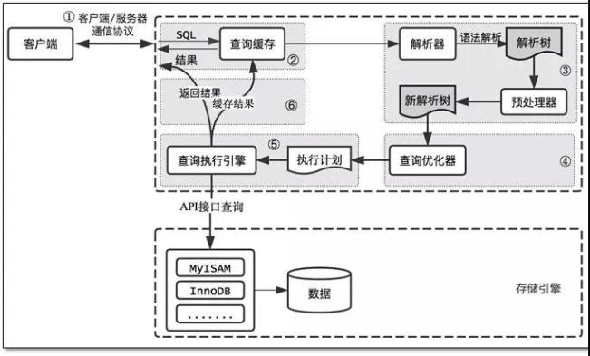
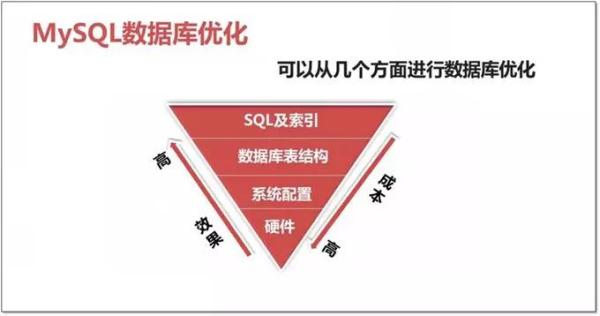

# MySQL 调优

**MySQL 查询过程**：



数据库的调优，总的来说分为三部分：**SQL 调优**、**架构调优**、**连接池调优**



### 优化工具

#### 数据库层面

**检查问题常用的 12 个工具**：

- MySQL
- mysqladmin：MySQL 客户端，可进行管理操作
- mysqlshow：功能强大的查看 shell 命令
- SHOW [SESSION | GLOBAL] variables：查看数据库参数信息
- SHOW [SESSION | GLOBAL] STATUS：查看数据库的状态信息
- information_schema：获取元数据的方法
- SHOW ENGINE INNODB STATUS：Innodb 引擎的所有状态
- SHOW PROCESSLIST：查看当前所有连接的 session 状态
- explain：获取查询语句的执行计划
- show index：查看表的索引信息
- slow-log：记录慢查询语句
- mysqldumpslow：分析 slowlog 文件的工具
- percona-toolkit 工具集：mysql 瑞士军刀

**不常用但好用的 7 个工具**：

- Zabbix：监控主机、系统、数据库(部署 Zabbix 监控平台)
- pt-query-digest：分析慢日志
- MySQL slap：分析慢日志
- sysbench：压力测试工具
- MySQL profiling：统计数据库整体状态工具
- Performance Schema：MySQL 性能状态统计的数据
- workbench：管理、备份、监控、分析、优化工具(比较费资源)

#### 系统层面

- CPU 方面：vmstat、sar top、htop、nmon、mpstat。
- 内存：free、ps-aux。
- IO 设备(磁盘、网络)：iostat、ss、netstat、iptraf、iftop、lsof。

### 表结构和索引优化

6 原则:

- 原则 1：设计表结构时要考虑数据库的水平与垂直拓展能力，提前规划未来 1 年的数据量和读写量的增长，做好分库分表方案。
- 原则 2：选择合适的字段类型，在保留扩展能力的前提下，优选选择较小的数据结构。比如年龄可以使用 TINYINT 而不是 INT。
- 原则 3：对大表进行拆分，将改变频率低的表字段，分离到另一张表中，必要时增加表的关联。
- 原则 4：在一些场景下，可适当增加字段冗余，即反范式设计，提高查询效率。
- 原则 5：擅用索引，考虑联合索引和前缀索引，不要滥用索引。
- 原则 6：Not NULL，NULL 需要额外的存储开销，还需要 MySQL 内部进行特殊处理，Null 会使索引、索引统计和值更加复杂

### SQL 调优

1. 选择适合的存储引擎
   1. 权衡 MyISAM 和 Innodb 以及其他存储引擎，选择合适的存储引擎
   2. 如果选择 Innodb，为每个表创建 Innodb File：`innodb_file_per_table=1`
2. 保证从内存读取数据，将数据保存在内存中
   1. 保证足够大 innodb_buffer_pool_size。确保服务器有足够的内存
   2. 数据预热，数据库刚启动时，将磁盘上的所有数据缓存到内存中，提高读取速度
   3. **不要让数据存到 SWAP 中**：MySQL 尽量避免使用 Swap。如果是专用 MYSQL 服务器，可以禁用 SWAP，如果是共享服务器，确定 innodb_buffer_pool_size 足够大。或者使用固定的内存空间做缓存，使用 memlock 指令。
3. 定期优化重建数据库
4. 减少磁盘写入操作
   1. 使用足够大的写入缓存 innodb_log_file_size，推荐 innodb_log_file_size 设置为 0.25 \* innodb_buffer_pool_size
   2. innodb_flush_log_at_trx_commit：innodb_flush_log_at_trx_commit = 1 则每次修改写入磁盘；innodb_flush_log_at_trx_commit = 0/2 每秒写入磁盘；如果你的应用不涉及很高的安全性 (金融系统)，或者基础架构足够安全，或者 事务都很小，都可以用 0 或者 2 来降低磁盘操作。
   3. 避免双写入缓冲：innodb_flush_method=O_DIRECT
5. 提高磁盘读写速度：RAID0 尤其是在使用 EC2 这种虚拟磁盘 (EBS) 的时候，使用软 RAID0 非常重要。
6. 充分使用索引
   1. 使用自动加索引的框架或者自动拆分表结构的框架
   2. 为必要字段添加索引
   3. 先应考虑 where 及 order by 涉及的列上建立索引
   4. 索引的最左前缀原则
   5. 避免过大的维护成本，一个表的索引数最好不要超过 7 个，若太多则应考虑一些不常使用到的列上建的索引是否有必要。
7. 分析查询日志(注意不要在生产环境用，否则会占满你的磁盘空间。)和慢查询日志
8. 激进的方法，使用内存磁盘
9. 用 NOSQL 的方式使用 MYSQL：用 HandlerSocket 跳过 MYSQL 的 SQL 解析层，MYSQL 就真正变成了 NOSQL。
10. 其他
    1. **避免全表扫描**：单条查询最后添加 LIMIT 1，停止全表扫描
    2. 尽量避免向客户端返回大数据量，若数据量过大，应考虑相应需求是否合理
    3. 尽量**避免大事务操作**，提高系统并发能力
    4. 使用基于游标的方法或临时表方法之前，应先寻找基于集的解决方案来解决问题，基于集的方法通常更有效。**尽量避免使用游标，因为游标的效率较差**。
    5. 将非”索引”数据分离，比如将大篇文章分离存储，不影响其他自动查询
    6. 不用 MYSQL 内置的函数，因为**内置函数不会建立查询缓存**
    7. PHP 的建立连接速度非常快，所有可以不用连接池，否则可能会造成超过连接数。当然不用连接池 PHP 程序也可能将
    8. 连接数占满比如用了 @ignore_user_abort(TRUE)
    9. 使用 IP 而不是域名做数据库路径，避免 DNS 解析问题
11. where 后的条件
    1. 尽量避免在 where 子句中使用!=或<>操作符，否则引擎将放弃使用索引而进行全表扫描
    2. 尽量避免在 where 子句中使用 or 来连接条件，可以考虑用 union 代替
    3. in 和 not in 也要慎用，对于连续的数值，能用 between 就不要用 in，exists 代替 in，
       1. 如果查询的两个表大小相当，那么用 in 和 exists 差别不大。 如果两个表中一个较小，一个是大表，则子查询表大的用 exists，子查询表小的用 in
    4. 尽量避免在 where 子句中对字段进行表达式操作和函数操作
12. 关于数据类型
    1. 尽量使用数字型字段，若只含数值信息的字段尽量不要设计为字符型，这会降低查询和连接的性能，并会增加存储开销。
    2. 尽可能的使用 varchar/nvarchar 代替 char/nchar ，因为**变长字段存储空间小，对于查询来说，在一个相对较小的字段内搜索效率显然要高些**
    3. 最好不要给数据库留 NULL，尽可能的使用 NOT NULL 填充数据库.备注、描述、评论之类的可以设置为 NULL，其他的，最好不要使用 NULL。
    4. 任何地方都`不要使用 select * from t` ，用具体的字段列表代替“\*”，不要返回用不到的任何字段。
13. 关于临时表
    1. 避免频繁创建和删除临时表，以减少系统表资源的消耗。对于一次性事件， 最好使用导出表。
    2. 在新建临时表时，如果一次性插入数据量很大，那么可以使用 select into 代替 create table，避免造成大量 log ，以提高速度；如果数据量不大，为了缓和系统表的资源，应先 create table，然后 insert。
    3. 如果使用到了临时表，在最后将所有的临时表显式删除时，先 truncate table ，然后 drop table ，这样可以避免系统表的较长时间锁定。

### 架构调优

1. 分区分表
2. 业务分库
3. 主从同步与读写分离
4. 数据缓存
5. 主从热备与 HA 双活

### 连接池调优

随着业务访问量或者数据量的增长，原有的连接池参数可能不能很好地满足需求，这个时候就需要结合当前使用连接池的原理、具体的连接池监控数据和当前的业务量作一个综合的判断，通过反复的几次调试得到最终的调优参数。

### 应用优化

- 业务应用和数据库应用独立
- 关闭其他无用服务

### 数据库参数优化

**实例整体调整(高级优化，扩展)**：

```text
thread_concurrency：# 并发线程数量个数
sort_buffer_size：# 排序缓存
read_buffer_size：# 顺序读取缓存
read_rnd_buffer_size：# 随机读取缓存
key_buffer_size：# 索引缓存
thread_cache_size：# (1G—>8, 2G—>16, 3G—>32, >3G—>64)
```

**连接层(基础优化)**：设置合理的连接客户和连接方式

```text
max_connections           # 最大连接数
max_connect_errors        # 最大错误连接数
connect_timeout           # 连接超时
max_user_connections      # 最大用户连接数
skip-name-resolve         # 跳过域名解析
wait_timeout              # 等待超时
back_log                  # 可以在堆栈中的连接数量
```

**SQL 层(基础优化)**：

query_cache_size： 查询缓存 >>> OLAP 类型数据库，需要重点加大此内存缓存，但是一般不会超过 GB。

对于经常被修改的数据，缓存会马上失效。我们可以使用内存数据库(redis、memecache)，替代它的功能。

### 存储引擎层优化

innodb 基础优化参数：

```text
default-storage-engine
innodb_buffer_pool_size       # 没有固定大小，50%测试值，看看情况再微调。但是尽量设置不要超过物理内存70%
innodb_file_per_table=(1,0)
innodb_flush_log_at_trx_commit=(0,1,2) # 1是最安全的，0是性能***，2折中
binlog_sync
Innodb_flush_method=(O_DIRECT, fdatasync)
innodb_log_buffer_size        # 100M以下
innodb_log_file_size          # 100M 以下
innodb_log_files_in_group     # 5个成员以下,一般2-3个够用（iblogfile0-N）
innodb_max_dirty_pages_pct   # 达到百分之75的时候刷写 内存脏页到磁盘。
log_bin
max_binlog_cache_size         # 可以不设置
max_binlog_size               # 可以不设置
innodb_additional_mem_pool_size    #小于2G内存的机器，推荐值是20M。32G内存以上100M
```

## 参考

> - [MySQL 性能调优的 10 个方法](http://www.codeceo.com/article/mysql-performance-10-tips.html)
> - [全栈必备——Mysql 性能调优](https://www.jianshu.com/p/c7f497f30d7a)
> - [一份超详细的 MySQL 高性能优化实战总结！](https://database.51cto.com/art/201901/590564.htm)
> - [10 分钟梳理 MySQL 核心知识点](https://zhuanlan.zhihu.com/p/60031703)
