# MySQL 面试题收集

- [MySQL 面试题收集](#mysql-%e9%9d%a2%e8%af%95%e9%a2%98%e6%94%b6%e9%9b%86)
  - [MySQL 慢查询](#mysql-%e6%85%a2%e6%9f%a5%e8%af%a2)
    - [相关参数](#%e7%9b%b8%e5%85%b3%e5%8f%82%e6%95%b0)
    - [日志分析工具 mysqldumpslow](#%e6%97%a5%e5%bf%97%e5%88%86%e6%9e%90%e5%b7%a5%e5%85%b7-mysqldumpslow)
  - [Explain](#explain)
    - [含义](#%e5%90%ab%e4%b9%89)
    - [Explain 输出](#explain-%e8%be%93%e5%87%ba)
  - [Profile](#profile)
  - [数据库分库分表和读写分离](#%e6%95%b0%e6%8d%ae%e5%ba%93%e5%88%86%e5%ba%93%e5%88%86%e8%a1%a8%e5%92%8c%e8%af%bb%e5%86%99%e5%88%86%e7%a6%bb)
  - [数据库分库分表](#%e6%95%b0%e6%8d%ae%e5%ba%93%e5%88%86%e5%ba%93%e5%88%86%e8%a1%a8)
    - [分库分表前的问题,为什么要分库分表](#%e5%88%86%e5%ba%93%e5%88%86%e8%a1%a8%e5%89%8d%e7%9a%84%e9%97%ae%e9%a2%98%e4%b8%ba%e4%bb%80%e4%b9%88%e8%a6%81%e5%88%86%e5%ba%93%e5%88%86%e8%a1%a8)
      - [为什么不分区](#%e4%b8%ba%e4%bb%80%e4%b9%88%e4%b8%8d%e5%88%86%e5%8c%ba)
        - [什么时候考虑使用分区](#%e4%bb%80%e4%b9%88%e6%97%b6%e5%80%99%e8%80%83%e8%99%91%e4%bd%bf%e7%94%a8%e5%88%86%e5%8c%ba)
        - [分区解决的问题](#%e5%88%86%e5%8c%ba%e8%a7%a3%e5%86%b3%e7%9a%84%e9%97%ae%e9%a2%98)
        - [分区的实现方式(简单)](#%e5%88%86%e5%8c%ba%e7%9a%84%e5%ae%9e%e7%8e%b0%e6%96%b9%e5%bc%8f%e7%ae%80%e5%8d%95)
    - [分库分表的方式方法](#%e5%88%86%e5%ba%93%e5%88%86%e8%a1%a8%e7%9a%84%e6%96%b9%e5%bc%8f%e6%96%b9%e6%b3%95)
      - [垂直拆分](#%e5%9e%82%e7%9b%b4%e6%8b%86%e5%88%86)
      - [水平拆分](#%e6%b0%b4%e5%b9%b3%e6%8b%86%e5%88%86)
    - [分库分表后面临的问题](#%e5%88%86%e5%ba%93%e5%88%86%e8%a1%a8%e5%90%8e%e9%9d%a2%e4%b8%b4%e7%9a%84%e9%97%ae%e9%a2%98)
      - [跨库事务（分布式事务）的问题](#%e8%b7%a8%e5%ba%93%e4%ba%8b%e5%8a%a1%e5%88%86%e5%b8%83%e5%bc%8f%e4%ba%8b%e5%8a%a1%e7%9a%84%e9%97%ae%e9%a2%98)
      - [路由问题](#%e8%b7%af%e7%94%b1%e9%97%ae%e9%a2%98)
      - [多库结果集合并（group by，order by）](#%e5%a4%9a%e5%ba%93%e7%bb%93%e6%9e%9c%e9%9b%86%e5%90%88%e5%b9%b6group-byorder-by)
      - [跨库 join 的问题](#%e8%b7%a8%e5%ba%93-join-%e7%9a%84%e9%97%ae%e9%a2%98)
        - [解决思路](#%e8%a7%a3%e5%86%b3%e6%80%9d%e8%b7%af)
    - [分库分表方案产品](#%e5%88%86%e5%ba%93%e5%88%86%e8%a1%a8%e6%96%b9%e6%a1%88%e4%ba%a7%e5%93%81)
  - [MySQL 高可用方案](#mysql-%e9%ab%98%e5%8f%af%e7%94%a8%e6%96%b9%e6%a1%88)
    - [MySQL 几种复制类型](#mysql-%e5%87%a0%e7%a7%8d%e5%a4%8d%e5%88%b6%e7%b1%bb%e5%9e%8b)
      - [异步复制(Asynchronous replication)](#%e5%bc%82%e6%ad%a5%e5%a4%8d%e5%88%b6asynchronous-replication)
      - [全同步复制(Fully synchronous replication)](#%e5%85%a8%e5%90%8c%e6%ad%a5%e5%a4%8d%e5%88%b6fully-synchronous-replication)
      - [半同步复制(Semisynchronous replication)](#%e5%8d%8a%e5%90%8c%e6%ad%a5%e5%a4%8d%e5%88%b6semisynchronous-replication)
    - [主从或主主半同步复制](#%e4%b8%bb%e4%bb%8e%e6%88%96%e4%b8%bb%e4%b8%bb%e5%8d%8a%e5%90%8c%e6%ad%a5%e5%a4%8d%e5%88%b6)
    - [半同步复制优化](#%e5%8d%8a%e5%90%8c%e6%ad%a5%e5%a4%8d%e5%88%b6%e4%bc%98%e5%8c%96)
    - [高可用架构优化](#%e9%ab%98%e5%8f%af%e7%94%a8%e6%9e%b6%e6%9e%84%e4%bc%98%e5%8c%96)
      - [MHA+多节点集群](#mha%e5%a4%9a%e8%8a%82%e7%82%b9%e9%9b%86%e7%be%a4)
      - [zookeeper+proxy](#zookeeperproxy)
    - [共享存储](#%e5%85%b1%e4%ba%ab%e5%ad%98%e5%82%a8)
      - [SAN 共享储存](#san-%e5%85%b1%e4%ba%ab%e5%82%a8%e5%ad%98)
      - [DRBD 磁盘复制](#drbd-%e7%a3%81%e7%9b%98%e5%a4%8d%e5%88%b6)
    - [分布式协议](#%e5%88%86%e5%b8%83%e5%bc%8f%e5%8d%8f%e8%ae%ae)
      - [MySQL cluster](#mysql-cluster)
      - [Galera](#galera)
      - [POAXS](#poaxs)
  - [参考](#%e5%8f%82%e8%80%83)

## MySQL 慢查询

MySQL 的慢查询日志是 MySQL 提供的一种日志记录，它用来记录在 MySQL 中响应时间超过阀值的语句，具体指运行时间超过`long_query_time`值的 SQL，则会被记录到慢查询日志中。`long_query_time`的默认值为`10`，意思是运行 10S 以上的语句。慢查询日志支持将日志记录写入文件，也支持将日志记录写入数据库表。

### 相关参数

| 参数                          | 描述                                                                                                                    | 值                                                                                                                                                                                                                                                                                                                                                                           |
| ----------------------------- | ----------------------------------------------------------------------------------------------------------------------- | ---------------------------------------------------------------------------------------------------------------------------------------------------------------------------------------------------------------------------------------------------------------------------------------------------------------------------------------------------------------------------- |
| slow_query_log                | 是否开启慢日志                                                                                                          | 1：开启；0：关闭                                                                                                                                                                                                                                                                                                                                                             |
| log-slow-queries              | 旧版（5.6 以下版本）MySQL 数据库慢查询日志存储路径。可以不设置该参数，系统则会默认给一个缺省的文件 host_name-slow.log   |                                                                                                                                                                                                                                                                                                                                                                              |
| slow-query-log-file           | 新版（5.6 及以上版本）MySQL 数据库慢查询日志存储路径。可以不设置该参数，系统则会默认给一个缺省的文件 host_name-slow.log |                                                                                                                                                                                                                                                                                                                                                                              |
| long_query_time               | 慢查询阈值，当查询时间多于设定的阈值时，记录日志。                                                                      | 默认 10s；最小值 0                                                                                                                                                                                                                                                                                                                                                           |
| log_queries_not_using_indexes | 未使用索引的查询也被记录到慢查询日志中（可选项）                                                                        |                                                                                                                                                                                                                                                                                                                                                                              |
| log_output                    | 日志存储方式                                                                                                            | 'FILE'：将日志存入文件，默认值是'FILE'；<br>'TABLE'：将日志存入数据库，这样日志信息就会被写入到 mysql.slow_log 表中。<br>MySQL 数据库支持同时两种日志存储方式，配置的时候以逗号隔开即可，如：log_output='FILE,TABLE'。<br>日志记录到系统的专用日志表中，要比记录到文件耗费更多的系统资源，因此对于需要启用慢查询日志，又需要能够获得更高的系统性能，那么建议优先记录到文件。 |

### 日志分析工具 mysqldumpslow

在生产环境中，如果要手工分析日志，查找、分析 SQL，显然是个体力活，MySQL 提供了日志分析工具 mysqldumpslow

- -s, 是表示按照何种方式排序:

  - c: 访问计数
  - l: 锁定时间
  - r: 返回记录
  - t: 查询时间
  - al:平均锁定时间
  - ar:平均返回记录数
  - at:平均查询时间

- -t, 是 top n 的意思，即为返回前面多少条的数据；
- -g, 后边可以写一个正则匹配模式，大小写不敏感的；

```sh
# 得到返回记录集最多的10个SQL。
mysqldumpslow -s r -t 10 /database/mysql/mysql06_slow.log
# 得到访问次数最多的10个SQL
mysqldumpslow -s c -t 10 /database/mysql/mysql06_slow.log
#得到按照时间排序的前10条里面含有左连接的查询语句。
mysqldumpslow -s t -t 10 -g “left join” /database/mysql/mysql06_slow.log
# 另外建议在使用这些命令时结合 | 和more 使用 ，否则有可能出现刷屏的情况。
mysqldumpslow -s r -t 20 /mysqldata/mysql/mysql06-slow.log | more
```

## Explain

### 含义

explain 显示了 mysql 如何使用索引来处理 select 语句以及连接表。可以帮助 选择更好的索引和写出更优化的查询语句。MySQL EXPLAIN 命令是查询性能优化不可缺少的一部分

### Explain 输出

| 列名          | 说明                                                                                                                                                                  |
| ------------- | --------------------------------------------------------------------------------------------------------------------------------------------------------------------- |
| id            | 执行编号，标识 select 所属的行。如果在语句中没子查询或关联查询，只有唯一的 select，每行都将显示 1。否则，内层的 select 语句一般会顺序编号，对应于其在原始语句中的位置 |
| select_type   | 显示本行是简单或复杂 select。如果查询有任何复杂的子查询，则最外层标记为                                                                                               | PRIMARY（DERIVED、UNION、UNION RESUlT） |
| table         | 访问引用哪个表（引用某个查询，如“derived3”）                                                                                                                          |
| type          | 数据访问/读取操作类型（ALL、index、range、ref、eq_ref、const/system、NULL）                                                                                           |
| possible_keys | 揭示哪一些索引可能有利于高效的查找                                                                                                                                    |
| key           | 显示 mysql 决定采用哪个索引来优化查询                                                                                                                                 |
| key_len       | 显示 mysql 在索引里使用的字节数                                                                                                                                       |
| ref           | 显示了之前的表在 key 列记录的索引中查找值所用的列或常量                                                                                                               |
| rows          | 为了找到所需的行而需要读取的行数，估算值，不精确。通过把所有 rows 列值相乘，可粗略估算整个查询会检查的行数                                                            |
| Extra         | 额外信息，如 using index、filesort 等                                                                                                                                 |

**id**：id 是用来顺序标识整个查询中 SELELCT 语句的，在嵌套查询中 id 越大的语句越先执行。如果这一行用来说明的是其他行的联合结果，该值可能为 NULL。

**select_type**：表示查询类型

| 类型               | 说明                                                                                                                  |
| ------------------ | --------------------------------------------------------------------------------------------------------------------- |
| simple             | 简单子查询，不包含子查询和 union                                                                                      |
| primary            | 包含 union 或者子查询，最外层的部分标记为 primary                                                                     |
| subquery           | 一般子查询中的子查询被标记为 subquery，也就是位于 select 列表中的查询                                                 |
| derived            | 派生表——该临时表是从子查询派生出来的，位于 form 中的子查询                                                            |
| union              | 位于 union 中第二个及其以后的子查询被标记为 union，第一个就被标记为 primary 如果是 union 位于 from 中则标记为 derived |
| union result       | 用来从匿名临时表里检索结果的 select 被标记为 union result                                                             |
| dependent union    | 顾名思义，首先需要满足 UNION 的条件，及 UNION 中第二个以及后面的 SELECT 语句，同时该语句依赖外部的查询                |
| subquery           | 子查询中第一个 SELECT 语句                                                                                            |
| dependent subquery | 和 DEPENDENT UNION 相对 UNION 一样                                                                                    |

**table**：对于行正在访问哪个表，表名或别名

- 关联优化器会为查询选择关联顺序，左侧深度优先
- 当 from 中有子查询的时候，表名是 derivedN 的形式，N 指向子查询，也就是 explain 结果中的下一列
- 当有 union result 的时候，表名是 union 1,2 等的形式，1,2 表示参与 union 的 query id

注意：MySQL 对待这些表和普通表一样，但是这些“临时表”是没有任何索引的。

**type**：type 显示的是访问类型，是较为重要的一个指标，结果值从好到坏依次是：
system > const > eq_ref > ref > fulltext > ref_or_null > index_merge > unique_subquery > index_subquery > range > index > ALL ，一般来说，得保证查询至少达到 range 级别，最好能达到 ref。

| 类型   | 说明                                                                                                                                                                                                                                                               |
| ------ | ------------------------------------------------------------------------------------------------------------------------------------------------------------------------------------------------------------------------------------------------------------------ |
| All    | 最坏的情况,全表扫描                                                                                                                                                                                                                                                |
| index  | 和全表扫描一样。只是扫描表的时候按照索引次序进行而不是行。主要优点就是避免了排序, 但是开销仍然非常大。如在 Extra 列看到 Using index，说明正在使用覆盖索引，只扫描索引的数据，它比按索引次序全表扫描的开销要小很多                                                  |
| range  | 范围扫描，一个有限制的索引扫描。key 列显示使用了哪个索引。当使用=、 <>、>、>=、<、<=、IS NULL、<=>、BETWEEN 或者 IN 操作符,用常量比较关键字列时,可以使用 range                                                                                                     |
| ref    | 一种索引访问，它返回所有匹配某个单个值的行。此类索引访问只有当使用非唯一性索引或唯一性索引非唯一性前缀时才会发生。这个类型跟 eq_ref 不同的是，它用在关联操作只使用了索引的最左前缀，或者索引不是 UNIQUE 和 PRIMARY KEY。ref 可以用于使用=或<=>操作符的带索引的列。 |
| eq_ref | 最多只返回一条符合条件的记录。使用唯一性索引或主键查找时会发生 （高效）                                                                                                                                                                                            |
| const  | 当确定最多只会有一行匹配的时候，MySQL 优化器会在查询前读取它而且只读取一次，因此非常快。当主键放入 where 子句时，mysql 把这个查询转为一个常量（高效）                                                                                                              |
| system | 这是 const 连接类型的一种特例，表仅有一行满足条件。                                                                                                                                                                                                                |
| Null   | 意味说 mysql 能在优化阶段分解查询语句，在执行阶段甚至用不到访问表或索引（高效）                                                                                                                                                                                    |

**possible_keys**：显示查询使用了哪些索引，表示该索引可以进行高效地查找，但是列出来的索引对于后续优化过程可能是没有用的

**key**：key 列显示 MySQL 实际决定使用的键（索引）。如果没有选择索引，键是 NULL。要想强制 MySQL 使用或忽视 possible_keys 列中的索引，在查询中使用 FORCE INDEX、USE INDEX 或者 IGNORE INDEX。

**key_len**：key_len 列显示 MySQL 决定使用的键长度。如果键是 NULL，则长度为 NULL。使用的索引的长度。在不损失精确性的情况下，长度越短越好 。

**ref**：ref 列显示使用哪个列或常数与 key 一起从表中选择行。

**rows**：rows 列显示 MySQL 认为它执行查询时必须检查的行数。注意这是一个预估值。

**Extra**：Extra 是 EXPLAIN 输出中另外一个很重要的列，该列显示 MySQL 在查询过程中的一些详细信息，MySQL 查询优化器执行查询的过程中对查询计划的重要补充信息。

| 类型                         | 说明                                                                                                                                                                                                                                                                                                                                                                                                                                     |
| ---------------------------- | ---------------------------------------------------------------------------------------------------------------------------------------------------------------------------------------------------------------------------------------------------------------------------------------------------------------------------------------------------------------------------------------------------------------------------------------- |
| Using filesort               | MySQL 有两种方式可以生成有序的结果，通过排序操作或者使用索引，当 Extra 中出现了 Using filesort 说明 MySQL 使用了后者，但注意虽然叫 filesort 但并不是说明就是用了文件来进行排序，只要可能排序都是在内存里完成的。大部分情况下利用索引排序更快，所以一般这时也要考虑优化查询了。使用文件完成排序操作，这是可能是 ordery by，group by 语句的结果，这可能是一个 CPU 密集型的过程，可以通过选择合适的索引来改进性能，用索引来为查询结果排序。 |
| Using temporary              | 用临时表保存中间结果，常用于 GROUP BY 和 ORDER BY 操作中，一般看到它说明查询需要优化了，就算避免不了临时表的使用也要尽量避免硬盘临时表的使用。                                                                                                                                                                                                                                                                                           |
| Not exists                   | MYSQL 优化了 LEFT JOIN，一旦它找到了匹配 LEFT JOIN 标准的行， 就不再搜索了。                                                                                                                                                                                                                                                                                                                                                             |
| Using index                  | 说明查询是覆盖了索引的，不需要读取数据文件，从索引树（索引文件）中即可获得信息。如果同时出现 using where，表明索引被用来执行索引键值的查找，没有 using where，表明索引用来读取数据而非执行查找动作。这是 MySQL 服务层完成的，但无需再回表查询记录。                                                                                                                                                                                      |
| Using index condition        | 这是 MySQL 5.6 出来的新特性，叫做“索引条件推送”。简单说一点就是 MySQL 原来在索引上是不能执行如 like 这样的操作的，但是现在可以了，这样减少了不必要的 IO 操作，但是只能用在二级索引上。                                                                                                                                                                                                                                                   |
| Using where                  | 使用了 WHERE 从句来限制哪些行将与下一张表匹配或者是返回给用户。注意：Extra 列出现 Using where 表示 MySQL 服务器将存储引擎返回服务层以后再应用 WHERE 条件过滤。                                                                                                                                                                                                                                                                           |
| Using join buffer            | 使用了连接缓存：Block Nested Loop，连接算法是块嵌套循环连接;Batched Key Access，连接算法是批量索引连接                                                                                                                                                                                                                                                                                                                                   |
| impossible where             | where 子句的值总是 false，不能用来获取任何元组                                                                                                                                                                                                                                                                                                                                                                                           |
| select tables optimized away | 在没有 GROUP BY 子句的情况下，基于索引优化 MIN/MAX 操作，或者对于 MyISAM 存储引擎优化 COUNT(\*)操作，不必等到执行阶段再进行计算，查询执行计划生成的阶段即完成优化。                                                                                                                                                                                                                                                                      |
| distinct                     | 优化 distinct 操作，在找到第一匹配的元组后即停止找同样值的动作                                                                                                                                                                                                                                                                                                                                                                           |

## Profile

Profile 用来分析 SQL 性能的消耗分布情况。当用 explain 无法解决慢 SQL 的时 候，需要用 profile 来对 SQL 进行更细致的分析，找出 SQL 所花的时间大部分消耗在 哪个部分，确认 SQL 的性能瓶颈。（5.7 已经过时）

```sql
SHOW PROFILE [type [, type] ... ]
    [FOR QUERY n]
    [LIMIT row_count [OFFSET offset]]

type: {
    ALL
  | BLOCK IO
  | CONTEXT SWITCHES
  | CPU
  | IPC
  | MEMORY
  | PAGE FAULTS
  | SOURCE
  | SWAPS
}
```

使用 performance_schema

## 数据库分库分表和读写分离

- 分库分表主要解决写的问题, 读写分离主要解决读的问题. 分库分表的策略有很多种: 平均分配, 按权重分配, 按业务分配, 一致性 hash...

- 读写分离的原理大致是一台主、多台从。主提供写操作，从提供读操作。

方案可以根据以下几个因素来综合考虑:

1. 数据实时性要求？
2. 查询复杂度是否比较高？
3. 读和写的比例即侧重点是哪一个？

## 数据库分库分表

### 分库分表前的问题,为什么要分库分表

- **用户请求量太大**：因为单服务器 TPS，内存，IO 都是有限的。 解决方法：分散请求到多个服务器上；
- **单库太大**：单个数据库处理能力有限；单库所在服务器上磁盘空间不足；单库上操作的 IO 瓶颈 解决方法：切分成更多更小的库
- **单表太大**：CRUD 都成问题；索引膨胀，查询超时 解决方法：切分成多个数据集更小的表。
- 事实上 MySQL 单表可以存储 10 亿级数据，只是这时候性能比较差，业界公认**MySQL 单表容量在 1KW 以下是最佳状态，因为这时它的 BTREE 索引树高在 3~5 之间**。

**普遍方案**：

1. **分区**
2. **分库分表**
3. **NoSQL/NewSQL**：NoSQL 代表性产品：MongoDB、ES；NewSQL 代表产品：TiDB；但一般公司以 RDBMS 存储为主(稳定,事务,生态)，NoSQL/NewSQL 存储为辅！

#### 为什么不分区

分区：就是把一张表的数据分成 N 个区块，在逻辑上看最终只是一张表，但底层是由 N 个物理区块组成的，分区实现比较简单，数据库 mysql、oracle 等很容易就可支持。

一旦分表，一个库中的表会越来越多。

> **分区表是由多个相关的底层表实现，这些底层表也是由句柄对象表示**，所以我们也可以直接访问各个分区，存储引擎管理分区的各个底层表和管理普通表一样（所有的底层表都必须使用相同的存储引擎），**分区表的索引只是在各个底层表上各自加上一个相同的索引**，从存储引擎的角度来看，底层表和一个普通表没有任何不同，存储引擎也无须知道这是一个普通表还是一个分区表的一部分。

##### 什么时候考虑使用分区

一张表的查询速度已经慢到影响使用的时候。

1. sql 经过优化
2. 数据量大
3. 表中的数据是分段的
4. 对数据的操作往往只涉及一部分数据，而不是所有的数据

##### 分区解决的问题

主要可以提升查询效率

##### 分区的实现方式(简单)

```sql
-- mysql5 开始支持分区功能

CREATE TABLE sales (

id INT AUTO_INCREMENT,

amount DOUBLE NOT NULL,

order_day DATETIME NOT NULL,

PRIMARY KEY(id, order_day)

) ENGINE=Innodb

PARTITION BY RANGE(YEAR(order_day)) (

PARTITION p_2010 VALUES LESS THAN (2010),

PARTITION p_2011 VALUES LESS THAN (2011),

PARTITION p_2012 VALUES LESS THAN (2012),

PARTITION p_catchall VALUES LESS THAN MAXVALUE);

```

- 事实上，这个方案也不错，它对用户屏蔽了 sharding 的细节，即使查询条件没有 sharding column，它也能正常工作（只是这时候性能一般）。
- 不过它的缺点很明显：很多的资源都受到单机的限制，例如连接数，网络吞吐等！虽然每个分区可以独立存储，但是分区表的总入口还是一个 MySQL 示例。从而导致它的**并发能力非常一般**，远远达不到互联网高并发的要求！

如果使用分区表，你的业应该具备如下**两个特点**：

- 数据不是海量（分区数有限，存储能力就有限）；
- 并发能力要求不高；

### 分库分表的方式方法

一般分为垂直切分和水平切分，这是一种结果集描述的切分方式，是物理空间上的切分。**分库分表的顺序应该是先垂直分，后水平分，**垂直分更简单。

#### 垂直拆分

1. **垂直分表**：也就是“大表拆小表”，基于列字段进行的。一般是表中的字段较多，将不常用的， 数据较大，长度较长（比如 text 类型字段）的拆分到“扩展表“。 一般是针对那种几百列的大表，也避免查询时，数据量太大造成的“跨页”问题。
2. **垂直分库**：
   1. **垂直分库针对的是一个系统中的不同业务进行拆分**，比如用户 User 一个库，商品 Producet 一个库，订单 Order 一个库。 **切分后，要放在多个服务器上，而不是一个服务器上。**为什么？ 我们想象一下，一个购物网站对外提供服务，会有用户，商品，订单等的 CRUD。没拆分之前， 全部都是落到单一的库上的，这会让数据库的单库处理能力成为瓶颈。按垂直分库后，如果还是放在一个数据库服务器上， 随着用户量增大，这会让单个数据库的处理能力成为瓶颈，还有单个服务器的磁盘空间，内存，tps 等非常吃紧。 所以我们要拆分到多个服务器上，这样上面的问题都解决了，以后也不会面对单机资源问题。
   2. **数据库业务层面的拆分，和服务的“治理”，“降级”机制类似，也能对不同业务的数据分别的进行管理，维护，监控，扩展等**。 数据库往往最容易成为应用系统的瓶颈，而数据库本身属于“有状态”的，相对于 Web 和应用服务器来讲，是比较难实现“横向扩展”的。 数据库的连接资源比较宝贵且单机处理能力也有限，在高并发场景下，垂直分库一定程度上能够突破 IO、连接数及单机硬件资源的瓶颈。

#### 水平拆分

1. **水平分表**：针对数据量巨大的单张表（比如订单表），按照某种规则（RANGE,HASH 取模等），切分到多张表里面去。 但是这些表还是在同一个库中，所以库级别的数据库操作还是有 IO 瓶颈。不建议采用。
2. **水平分库分表**：将单张表的数据切分到多个服务器上去，每个服务器具有相应的库与表，只是表中数据集合不同。 水平分库分表能够有效的缓解单机和单库的性能瓶颈和压力，突破 IO、连接数、硬件资源等的瓶颈。
3. 水平分库分表切分规则
   1. **RANGE**：从 0 到 10000 一个表，10001 到 20000 一个表；
   2. **HASH 取模**：一个商场系统，一般都是将用户，订单作为主表，然后将和它们相关的作为附表，这样不会造成跨库事务之类的问题。 取用户 id，然后 hash 取模，分配到不同的数据库上。
   3. **地理区域**：比如按照华东，华南，华北这样来区分业务，七牛云应该就是如此。
   4. **时间**：按照时间切分，就是将 6 个月前，甚至一年前的数据切出去放到另外的一张表，因为随着时间流逝，这些表的数据 被查询的概率变小，所以没必要和“热数据”放在一起，这个也是“冷热数据分离”。

### 分库分表后面临的问题

#### 跨库事务（分布式事务）的问题

分库分表后，就成了**分布式事务**了。如果依赖数据库本身的分布式事务管理功能去执行事务，将付出高昂的性能代价； 如果由应用程序去协助控制，形成程序逻辑上的事务，又会造成编程方面的负担。需要花很大的成本去保证一致性。

- [《分布式事务一致性解决方案》](http://www.infoq.com/cn/articles/solution-of-distributed-system-transaction-consistency)

#### 路由问题

- 垂直分表：增加表操作的次数
- 水平分表：路由问题

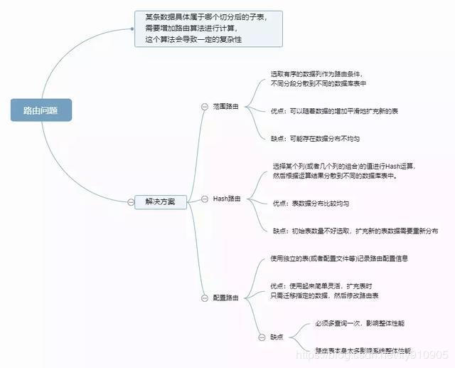

#### 多库结果集合并（group by，order by）

#### 跨库 join 的问题

分库分表后表之间的关联操作将受到限制，我们无法 join 位于不同分库的表，也无法 join 分表粒度不同的表， 结果原本一次查询能够完成的业务，可能需要多次查询才能完成。

##### 解决思路

**全局表**

所谓全局表，就是有可能系统中所有模块都可能会依赖到的一些表，类似“数据字典”。为避免跨库 join 查询，可以将这类表在其他每个数据库都保存一份，同时，这类数据通常也很少发生修改（甚至几乎不会），所以也不用太担心“一致性”问题。

**字段冗余**

这是一种典型的反范式设计，通常是为了性能来避免 join 查询。字段冗余能带来便利，是一种“空间换时间”的体现。但其适用场景也比较有限，**比较适合依赖字段较少的情况**。**最复杂的还是数据一致性问题**，这点很难保证，**可以借助数据库中的触发器或者在业务代码层面去保证**。当然，也需要结合实际业务场景来看一致性的要求。

**数据同步**

定时 A 库中的 tab_a 表和 B 库中 tbl_b 有关联，**可以定时将指定的表做同步**。当然，同步本来会对数据库带来一定的影响，**需要性能影响和数据时效性中取得一个平衡**。这样来避免复杂的跨库查询。

**系统层组装**

在系统层面，通过调用不同模块的组件或者服务，获取到数据并进行字段拼装。说起来很容易，但实践起来可真没有这么简单，尤其是数据库设计上存在问题但又无法轻易调整的时候。

### 分库分表方案产品

目前市面上的分库分表中间件相对较多，其中基于代理方式的有 MySQL Proxy 和 Amoeba， 基于 Hibernate 框架的是 Hibernate Shards，基于 jdbc 的有当当 sharding-jdbc， 基于 mybatis 的类似 maven 插件式的有蘑菇街的蘑菇街 TSharding， 通过重写 spring 的 ibatis template 类的 Cobar Client。

还有一些大公司的开源产品：


## MySQL 高可用方案

### MySQL 几种复制类型

#### 异步复制(Asynchronous replication)

MySQL 默认的复制即是异步的，主库在执行完客户端提交的事务后会立即将结果返给给客户端，并不关心从库是否已经接收并处理，这样就会有一个问题，主如果 crash 掉了，此时主上已经提交的事务可能并没有传到从上，如果此时，强行将从提升为主，可能导致新主上的数据不完整。

#### 全同步复制(Fully synchronous replication)

指当主库执行完一个事务，所有的从库都执行了该事务才返回给客户端。因为需要等待所有从库执行完该事务才能返回，所以全同步复制的性能必然会收到严重的影响。

#### 半同步复制(Semisynchronous replication)

介于异步复制和全同步复制之间，主库在执行完客户端提交的事务后不是立刻返回给客户端，而是等待至少一个从库接收到并写到 relay log 中才返回给客户端。相对于异步复制，半同步复制提高了数据的安全性，同时它也造成了一定程度的延迟，这个延迟最少是一个 TCP/IP 往返的时间。所以，半同步复制最好在低延时的网络中使用。

### 主从或主主半同步复制

使用双节点数据库，搭建单向或者双向的半同步复制。在 5.7 以后的版本中，由于 lossless replication、logical 多线程复制等一些列新特性的引入，使得 MySQL 原生半同步复制更加可靠。

常见架构如下：

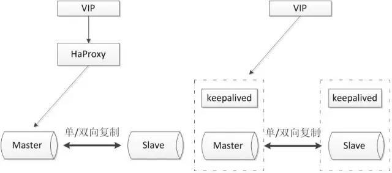

通常会和 proxy、keepalived 等第三方软件同时使用，即可以用来监控数据库的健康，又可以执行一系列管理命令。如果主库发生故障，切换到备库后仍然可以继续使用数据库。

**优点**：

1. 架构比较简单，使用原生半同步复制作为数据同步的依据；
2. 双节点，没有主机宕机后的选主问题，直接切换即可；
3. 双节点，需求资源少，部署简单；

**缺点**：

1. 完全依赖于半同步复制，如果半同步复制退化为异步复制，数据一致性无法得到保证；
2. 需要额外考虑 haproxy、keepalived 的高可用机制。

### 半同步复制优化

半同步复制机制是可靠的。如果半同步复制一直是生效的，那么便可以认为数据是一致的。但是由于网络波动等一些客观原因，导致半同步复制发生超时而切换为异步复制，那么这时便不能保证数据的一致性。所以尽可能的保证半同步复制，便可提高数据的一致性。

该方案同样使用双节点架构，但是在原有半同复制的基础上做了功能上的优化，使半同步复制的机制变得更加可靠。

可参考的优化方案如下：

**双通道复制**：

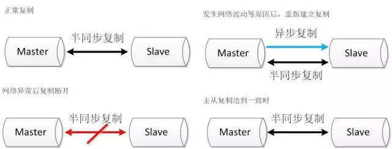

半同步复制由于发生超时后，复制断开，当再次建立起复制时，同时建立两条通道，其中一条半同步复制通道从当前位置开始复制，保证从机知道当前主机执行的进度。另外一条异步复制通道开始追补从机落后的数据。当异步复制通道追赶到半同步复制的起始位置时，恢复半同步复制。

**binlog 文件服务器**:

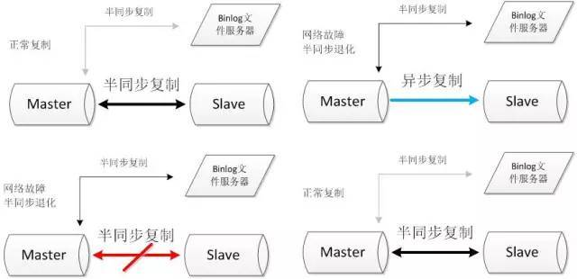

搭建两条半同步复制通道，其中连接文件服务器的半同步通道正常情况下不启用，当主从的半同步复制发生网络问题退化后，启动与文件服务器的半同步复制通道。当主从半同步复制恢复后，关闭与文件服务器的半同步复制通道。

**优点**：

1. 双节点，需求资源少，部署简单；
2. 架构简单，没有选主的问题，直接切换即可;
3. 相比于原生复制，**优化后的半同步复制更能保证数据的一致性**。

**缺点**：

1. 需要修改内核源码或者使用 mysql 通信协议。需要对源码有一定的了解，并能做一定程度的二次开发。
2. 依旧依赖于半同步复制，没有从根本上解决数据一致性问题。

### 高可用架构优化

将双节点数据库扩展到多节点数据库，或者多节点数据库集群。可以根据自己的需要选择一主两从、一主多从或者多主多从的集群。

由于半同步复制，存在接收到一个从机的成功应答即认为半同步复制成功的特性，所以多从半同步复制的可靠性要优于单从半同步复制的可靠性。并且多节点同时宕机的几率也要小于单节点宕机的几率，所以多节点架构在一定程度上可以认为高可用性是好于双节点架构。

但是由于数据库数量较多，所以需要数据库管理软件来保证数据库的可维护性。可以选择**MMM**、**MHA**或者**各个版本的 proxy**等等。常见方案如下：

#### MHA+多节点集群

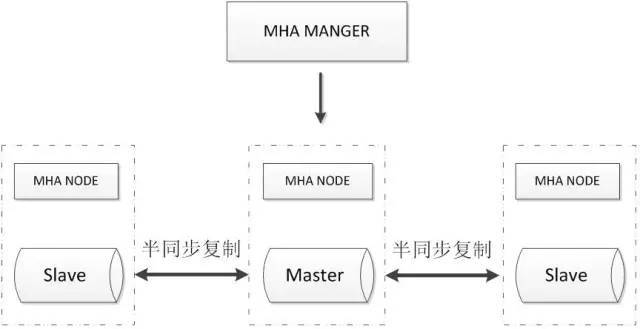

MHA Manager 会定时探测集群中的 master 节点，当 master 出现故障时，它可以自动将最新数据的 slave 提升为新的 master，然后将所有其他的 slave 重新指向新的 master，整个故障转移过程对应用程序完全透明。

MHA Node 运行在每台 MySQL 服务器上，主要作用是切换时处理二进制日志，确保切换尽量少丢数据。

MHA 也可以扩展到如下的多节点集群：

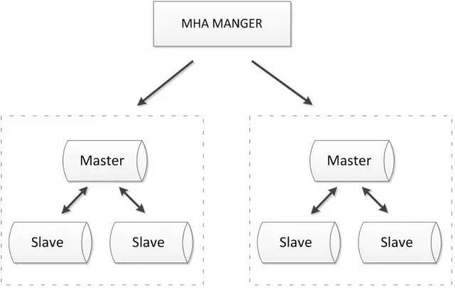

**优点**：

1. 可以进行故障的自动检测和转移;
2. 可扩展性较好，可以根据需要扩展 MySQL 的节点数量和结构;
3. 相比于双节点的 MySQL 复制，三节点/多节点的 MySQL 发生不可用的概率更低

**缺点**：

1. 至少需要三节点，相对于双节点需要更多的资源;
2. 逻辑较为复杂，发生故障后排查问题，定位问题更加困难;
3. 数据一致性仍然靠原生半同步复制保证，仍然存在数据不一致的风险;
4. 可能因为网络分区发生脑裂现象;

#### zookeeper+proxy

Zookeeper 使用分布式算法保证集群数据的一致性，使用 zookeeper 可以有效的保证 proxy 的高可用性，可以较好的避免网络分区现象(脑裂)的产生。

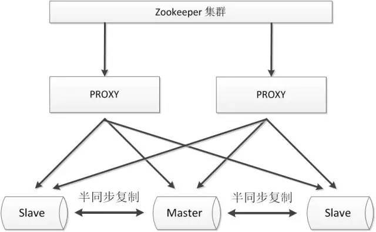

**优点**：

1. 较好的保证了整个系统的高可用性，包括 proxy、MySQL;
2. 扩展性较好，可以扩展为大规模集群;

**缺点**：

1. 数据一致性仍然依赖于原生的 mysql 半同步复制;
2. 引入 zk，整个系统的逻辑变得更加复杂;

### 共享存储

**共享存储实现了数据库服务器和存储设备的解耦**，不同数据库之间的数据同步不再依赖于 MySQL 的原生复制功能，而是通过磁盘数据同步的手段，来保证数据的一致性。

#### SAN 共享储存

SAN 的概念是允许存储设备和处理器（服务器）之间建立直接的高速网络（与 LAN 相比）连接，通过这种连接实现数据的集中式存储。常用架构如下：

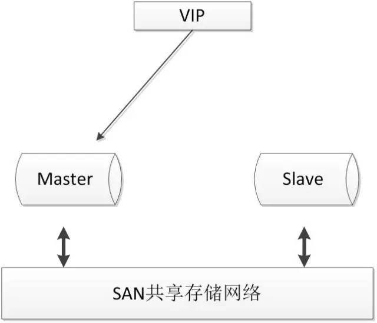

**优点**：

- 两节点即可，部署简单，切换逻辑简单；
- 很好的保证数据的强一致性；
- 不会因为 MySQL 的逻辑错误发生数据不一致的情况；

**缺点**：

- 需要考虑共享存储的高可用；
- 价格昂贵；

#### DRBD 磁盘复制

DRBD 是一种基于软件、基于网络的块复制存储解决方案，主要用于对服务器之间的磁盘、分区、逻辑卷等进行数据镜像，当用户将数据写入本地磁盘时，还会将数据发送到网络中另一台主机的磁盘上，这样的本地主机(主节点)与远程主机(备节点)的数据就可以保证实时同步。常用架构如下：

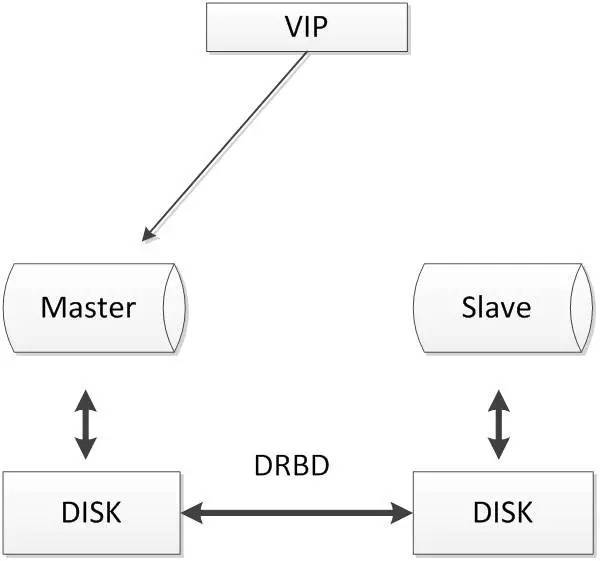

当本地主机出现问题，远程主机上还保留着一份相同的数据，可以继续使用，保证了数据的安全。

DRBD 是 linux 内核模块实现的块级别的同步复制技术，可以与 SAN 达到相同的共享存储效果。

**优点**：

1. 两节点即可，部署简单，切换逻辑简单；
2. 相比于 SAN 储存网络，价格低廉；
3. 保证数据的强一致性；

**缺点**：

1. 对 io 性能影响较大；
2. 从库不提供读操作；

### 分布式协议

分布式协议可以很好解决数据一致性问题。比较常见的方案如下：

#### MySQL cluster

MySQL cluster 是官方集群的部署方案，通过使用 NDB 存储引擎实时备份冗余数据，实现数据库的高可用性和数据一致性。

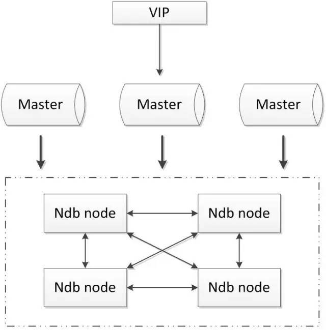

**优点**：

1. 全部使用官方组件，不依赖于第三方软件；
2. 可以实现数据的强一致性；

**缺点**：

1. 国内使用的较少；
2. 配置较复杂，需要使用 NDB 储存引擎，与 MySQL 常规引擎存在一定差异；
3. 至少三节点；

#### Galera

基于 Galera 的 MySQL 高可用集群， 是多主数据同步的 MySQL 集群解决方案，使用简单，没有单点故障，可用性高。常见架构如下：

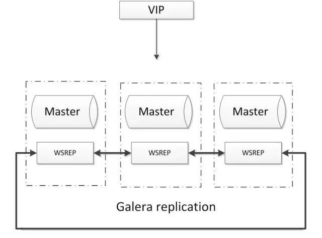

**优点**

1. 多主写入，无延迟复制，能保证数据强一致性；
2. 有成熟的社区，有互联网公司在大规模的使用；
3. 自动故障转移，自动添加、剔除节点；

**缺点**：

1. 需要为原生 MySQL 节点打 wsrep 补丁
2. 只支持 innodb 储存引擎
3. 至少三节点；

#### POAXS

Paxos 算法解决的问题是一个分布式系统如何就某个值（决议）达成一致。这个算法被认为是同类算法中最有效的。Paxos 与 MySQL 相结合可以实现在分布式的 MySQL 数据的强一致性。常见架构如下：

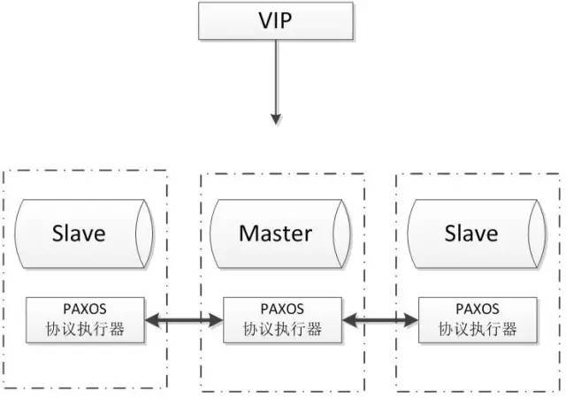

**优点**：

1. 多主写入，无延迟复制，能保证数据强一致性；
2. 有成熟理论基础；
3. 自动故障转移，自动添加、剔除节点；

**缺点**：

1. 只支持 innodb 储存引擎
2. 至少三节点；

## 参考

**参考**

> - [go 夜读-面试专题-数据库](https://reading.developerlearning.cn/interview/interview-database/)
> - [MySQL 慢查询日志总结](https://www.cnblogs.com/kerrycode/p/5593204.HTML)
> - [EXPLAIN Output Columns](https://dev.mysql.com/doc/refman/5.7/en/explain-output.html)
> - [MySQL EXPLAIN 详解](https://www.jianshu.com/p/ea3fc71fdc45)
> - [MySQL 5.7 新特性之 Generated Column（函数索引）](https://www.cnblogs.com/lyftest/p/8393932.html)
> - [数据库分库分表](https://www.cnblogs.com/405845829qq/p/7552736.html)
> - [分库分表的几种常见形式以及可能遇到的难题](https://www.infoq.cn/article/key-steps-and-likely-problems-of-split-table)
> - [分库分表：应用场景、方式方法、面临问题](https://blog.csdn.net/fly910905/article/details/87090092)
> - [MySQL 半同步复制](https://www.cnblogs.com/ivictor/p/5735580.html)
> - [五大常见的 MySQL 高可用方案](https://zhuanlan.zhihu.com/p/25960208)
