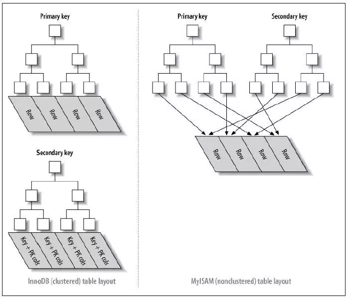
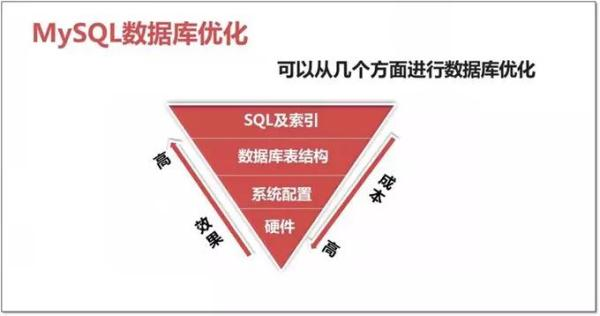

# MySQL 面试题收集

- [MySQL 面试题收集](#mysql-%e9%9d%a2%e8%af%95%e9%a2%98%e6%94%b6%e9%9b%86)
  - [MySQL 事务隔离级别](#mysql-%e4%ba%8b%e5%8a%a1%e9%9a%94%e7%a6%bb%e7%ba%a7%e5%88%ab)
  - [InnoDB 存储引擎的关键特性](#innodb-%e5%ad%98%e5%82%a8%e5%bc%95%e6%93%8e%e7%9a%84%e5%85%b3%e9%94%ae%e7%89%b9%e6%80%a7)
  - [Innodb 和 MyISAM 区别](#innodb-%e5%92%8c-myisam-%e5%8c%ba%e5%88%ab)
  - [MySQL 慢查询](#mysql-%e6%85%a2%e6%9f%a5%e8%af%a2)
    - [相关参数](#%e7%9b%b8%e5%85%b3%e5%8f%82%e6%95%b0)
    - [日志分析工具 mysqldumpslow](#%e6%97%a5%e5%bf%97%e5%88%86%e6%9e%90%e5%b7%a5%e5%85%b7-mysqldumpslow)
  - [Explain](#explain)
    - [含义](#%e5%90%ab%e4%b9%89)
    - [Explain 输出](#explain-%e8%be%93%e5%87%ba)
  - [Profile](#profile)
  - [数据库存储引擎](#%e6%95%b0%e6%8d%ae%e5%ba%93%e5%ad%98%e5%82%a8%e5%bc%95%e6%93%8e)
    - [InnoDB](#innodb)
    - [MyISAM](#myisam)
    - [MRG_MYISAM](#mrgmyisam)
    - [MEMORY](#memory)
    - [CSV](#csv)
    - [ARCHIVE(归档)](#archive%e5%bd%92%e6%a1%a3)
    - [BLACKHOLE](#blackhole)
    - [PERFORMANCE_SCHEMA](#performanceschema)
    - [FEDERATED](#federated)
    - [其他](#%e5%85%b6%e4%bb%96)
    - [常用引擎对比](#%e5%b8%b8%e7%94%a8%e5%bc%95%e6%93%8e%e5%af%b9%e6%af%94)
    - [查看存储引擎](#%e6%9f%a5%e7%9c%8b%e5%ad%98%e5%82%a8%e5%bc%95%e6%93%8e)
    - [设置存储引擎](#%e8%ae%be%e7%bd%ae%e5%ad%98%e5%82%a8%e5%bc%95%e6%93%8e)
    - [如何选择合适的存储引擎](#%e5%a6%82%e4%bd%95%e9%80%89%e6%8b%a9%e5%90%88%e9%80%82%e7%9a%84%e5%ad%98%e5%82%a8%e5%bc%95%e6%93%8e)
  - [MySQL 的锁](#mysql-%e7%9a%84%e9%94%81)
    - [锁等级](#%e9%94%81%e7%ad%89%e7%ba%a7)
    - [InnoDB 锁类型](#innodb-%e9%94%81%e7%b1%bb%e5%9e%8b)
    - [行锁的算法](#%e8%a1%8c%e9%94%81%e7%9a%84%e7%ae%97%e6%b3%95)
    - [死锁](#%e6%ad%bb%e9%94%81)
    - [锁的优化建议](#%e9%94%81%e7%9a%84%e4%bc%98%e5%8c%96%e5%bb%ba%e8%ae%ae)
  - [MySQL 索引](#mysql-%e7%b4%a2%e5%bc%95)
    - [本质](#%e6%9c%ac%e8%b4%a8)
    - [索引的存储分类](#%e7%b4%a2%e5%bc%95%e7%9a%84%e5%ad%98%e5%82%a8%e5%88%86%e7%b1%bb)
    - [MyISAM,InnoDB 引擎,Memory 三个常用引擎类型比较](#myisaminnodb-%e5%bc%95%e6%93%8ememory-%e4%b8%89%e4%b8%aa%e5%b8%b8%e7%94%a8%e5%bc%95%e6%93%8e%e7%b1%bb%e5%9e%8b%e6%af%94%e8%be%83)
    - [B-TREE 索引类型](#b-tree-%e7%b4%a2%e5%bc%95%e7%b1%bb%e5%9e%8b)
    - [索引相关操作](#%e7%b4%a2%e5%bc%95%e7%9b%b8%e5%85%b3%e6%93%8d%e4%bd%9c)
      - [设置索引](#%e8%ae%be%e7%bd%ae%e7%b4%a2%e5%bc%95)
      - [删除索引](#%e5%88%a0%e9%99%a4%e7%b4%a2%e5%bc%95)
      - [查看索引](#%e6%9f%a5%e7%9c%8b%e7%b4%a2%e5%bc%95)
    - [索引选择性](#%e7%b4%a2%e5%bc%95%e9%80%89%e6%8b%a9%e6%80%a7)
      - [选择原则](#%e9%80%89%e6%8b%a9%e5%8e%9f%e5%88%99)
      - [注意事项](#%e6%b3%a8%e6%84%8f%e4%ba%8b%e9%a1%b9)
      - [索引的弊端](#%e7%b4%a2%e5%bc%95%e7%9a%84%e5%bc%8a%e7%ab%af)
    - [b-tree 索引和 hash 索引](#b-tree-%e7%b4%a2%e5%bc%95%e5%92%8c-hash-%e7%b4%a2%e5%bc%95)
      - [b-tree 索引](#b-tree-%e7%b4%a2%e5%bc%95)
      - [hash 索引](#hash-%e7%b4%a2%e5%bc%95)
      - [区别](#%e5%8c%ba%e5%88%ab)
    - [非聚簇索引和聚簇索引](#%e9%9d%9e%e8%81%9a%e7%b0%87%e7%b4%a2%e5%bc%95%e5%92%8c%e8%81%9a%e7%b0%87%e7%b4%a2%e5%bc%95)
      - [聚簇索引优缺点](#%e8%81%9a%e7%b0%87%e7%b4%a2%e5%bc%95%e4%bc%98%e7%bc%ba%e7%82%b9)
  - [数据库调优](#%e6%95%b0%e6%8d%ae%e5%ba%93%e8%b0%83%e4%bc%98)
    - [优化工具](#%e4%bc%98%e5%8c%96%e5%b7%a5%e5%85%b7)
      - [数据库层面](#%e6%95%b0%e6%8d%ae%e5%ba%93%e5%b1%82%e9%9d%a2)
      - [系统层面](#%e7%b3%bb%e7%bb%9f%e5%b1%82%e9%9d%a2)
    - [SQL 调优](#sql-%e8%b0%83%e4%bc%98)
    - [架构调优](#%e6%9e%b6%e6%9e%84%e8%b0%83%e4%bc%98)
    - [连接池调优](#%e8%bf%9e%e6%8e%a5%e6%b1%a0%e8%b0%83%e4%bc%98)
    - [应用优化](#%e5%ba%94%e7%94%a8%e4%bc%98%e5%8c%96)
    - [数据库参数优化](#%e6%95%b0%e6%8d%ae%e5%ba%93%e5%8f%82%e6%95%b0%e4%bc%98%e5%8c%96)
    - [存储引擎层优化](#%e5%ad%98%e5%82%a8%e5%bc%95%e6%93%8e%e5%b1%82%e4%bc%98%e5%8c%96)
  - [数据库分库分表和读写分离](#%e6%95%b0%e6%8d%ae%e5%ba%93%e5%88%86%e5%ba%93%e5%88%86%e8%a1%a8%e5%92%8c%e8%af%bb%e5%86%99%e5%88%86%e7%a6%bb)
  - [数据库分库分表](#%e6%95%b0%e6%8d%ae%e5%ba%93%e5%88%86%e5%ba%93%e5%88%86%e8%a1%a8)
    - [分库分表前的问题,为什么要分库分表](#%e5%88%86%e5%ba%93%e5%88%86%e8%a1%a8%e5%89%8d%e7%9a%84%e9%97%ae%e9%a2%98%e4%b8%ba%e4%bb%80%e4%b9%88%e8%a6%81%e5%88%86%e5%ba%93%e5%88%86%e8%a1%a8)
      - [为什么不分区](#%e4%b8%ba%e4%bb%80%e4%b9%88%e4%b8%8d%e5%88%86%e5%8c%ba)
        - [什么时候考虑使用分区](#%e4%bb%80%e4%b9%88%e6%97%b6%e5%80%99%e8%80%83%e8%99%91%e4%bd%bf%e7%94%a8%e5%88%86%e5%8c%ba)
        - [分区解决的问题](#%e5%88%86%e5%8c%ba%e8%a7%a3%e5%86%b3%e7%9a%84%e9%97%ae%e9%a2%98)
        - [分区的实现方式(简单)](#%e5%88%86%e5%8c%ba%e7%9a%84%e5%ae%9e%e7%8e%b0%e6%96%b9%e5%bc%8f%e7%ae%80%e5%8d%95)
    - [分库分表的方式方法](#%e5%88%86%e5%ba%93%e5%88%86%e8%a1%a8%e7%9a%84%e6%96%b9%e5%bc%8f%e6%96%b9%e6%b3%95)
      - [垂直拆分](#%e5%9e%82%e7%9b%b4%e6%8b%86%e5%88%86)
      - [水平拆分](#%e6%b0%b4%e5%b9%b3%e6%8b%86%e5%88%86)
    - [分库分表后面临的问题](#%e5%88%86%e5%ba%93%e5%88%86%e8%a1%a8%e5%90%8e%e9%9d%a2%e4%b8%b4%e7%9a%84%e9%97%ae%e9%a2%98)
      - [跨库事务（分布式事务）的问题](#%e8%b7%a8%e5%ba%93%e4%ba%8b%e5%8a%a1%e5%88%86%e5%b8%83%e5%bc%8f%e4%ba%8b%e5%8a%a1%e7%9a%84%e9%97%ae%e9%a2%98)
      - [路由问题](#%e8%b7%af%e7%94%b1%e9%97%ae%e9%a2%98)
      - [多库结果集合并（group by，order by）](#%e5%a4%9a%e5%ba%93%e7%bb%93%e6%9e%9c%e9%9b%86%e5%90%88%e5%b9%b6group-byorder-by)
      - [跨库 join 的问题](#%e8%b7%a8%e5%ba%93-join-%e7%9a%84%e9%97%ae%e9%a2%98)
        - [解决思路](#%e8%a7%a3%e5%86%b3%e6%80%9d%e8%b7%af)
    - [分库分表方案产品](#%e5%88%86%e5%ba%93%e5%88%86%e8%a1%a8%e6%96%b9%e6%a1%88%e4%ba%a7%e5%93%81)
  - [MySQL 高可用方案](#mysql-%e9%ab%98%e5%8f%af%e7%94%a8%e6%96%b9%e6%a1%88)
    - [MySQL 几种复制类型](#mysql-%e5%87%a0%e7%a7%8d%e5%a4%8d%e5%88%b6%e7%b1%bb%e5%9e%8b)
      - [异步复制(Asynchronous replication)](#%e5%bc%82%e6%ad%a5%e5%a4%8d%e5%88%b6asynchronous-replication)
      - [全同步复制(Fully synchronous replication)](#%e5%85%a8%e5%90%8c%e6%ad%a5%e5%a4%8d%e5%88%b6fully-synchronous-replication)
      - [半同步复制(Semisynchronous replication)](#%e5%8d%8a%e5%90%8c%e6%ad%a5%e5%a4%8d%e5%88%b6semisynchronous-replication)
    - [主从或主主半同步复制](#%e4%b8%bb%e4%bb%8e%e6%88%96%e4%b8%bb%e4%b8%bb%e5%8d%8a%e5%90%8c%e6%ad%a5%e5%a4%8d%e5%88%b6)
    - [半同步复制优化](#%e5%8d%8a%e5%90%8c%e6%ad%a5%e5%a4%8d%e5%88%b6%e4%bc%98%e5%8c%96)
    - [高可用架构优化](#%e9%ab%98%e5%8f%af%e7%94%a8%e6%9e%b6%e6%9e%84%e4%bc%98%e5%8c%96)
      - [MHA+多节点集群](#mha%e5%a4%9a%e8%8a%82%e7%82%b9%e9%9b%86%e7%be%a4)
      - [zookeeper+proxy](#zookeeperproxy)
    - [共享存储](#%e5%85%b1%e4%ba%ab%e5%ad%98%e5%82%a8)
      - [SAN 共享储存](#san-%e5%85%b1%e4%ba%ab%e5%82%a8%e5%ad%98)
      - [DRBD 磁盘复制](#drbd-%e7%a3%81%e7%9b%98%e5%a4%8d%e5%88%b6)
    - [分布式协议](#%e5%88%86%e5%b8%83%e5%bc%8f%e5%8d%8f%e8%ae%ae)
      - [MySQL cluster](#mysql-cluster)
      - [Galera](#galera)
      - [POAXS](#poaxs)
  - [参考](#%e5%8f%82%e8%80%83)

## MySQL 事务隔离级别

| 事务隔离级别                | 脏读 | 不可重复读 | 幻读 |
| --------------------------- | ---- | ---------- | ---- |
| 读未提交(read-uncommitted)  | 是   | 是         | 是   |
| 读已提交（read-committed）  | 否   | 是         | 是   |
| 可重复读（repeatable-read） | 否   | 否         | 是   |
| 序列化（serializable）      | 否   | 否         | 否   |

**脏读**：该隔离级别的事务会读到其它未提交事务的数据，此现象也称之为脏读。

**不可重复读问题**：一个事务可以读取另一个已提交的事务，多次读取会造成不一样的结果，此现象称为不可重复读问题

**幻读**：是指当事务不是独立执行时发生的一种现象，例如第一个事务对一个表中的数据进行了修改，这种修改涉及到表中的全部数据行。 同时，第二个事务也修改这个表中的数据，这种修改是向表中插入一行新数据。那么，以后就会发生操作第一个事务的用户发现表中还有没有修改的数据行，就好象 发生了幻觉一样。

## InnoDB 存储引擎的关键特性

## Innodb 和 MyISAM 区别

- **存储结构**：

  - **MyISAM**：每个 MyISAM 在磁盘上存储成三个文件。分别为：**表定义文件、数据文件、索引文件**。第一个文件的名字以表的名字开始，扩展名指出文件类型。.frm 文件存储表定义。数据文件的扩展名为.MYD (MYData)。索引文件的扩展名是.MYI (MYIndex)。
  - **Innodb** 所有的表都保存在同一个数据文件中（也可能是多个文件，或者是独立的表空间文件），InnoDB 表的大小只受限于操作系统文件的大小，一般为 2GB。

- **存储空间**：

  - **MyISAM**： MyISAM 支持支持三种不同的存储格式：**静态表**(默认，但是注意数据末尾不能有空格，会被去掉)、**动态表**、**压缩表**。当表在创建之后并导入数据之后，不会再进行修改操作，可以使用压缩表，极大的减少磁盘的空间占用。
  - **Innodb**： 需要更多的内存和存储，它会在主内存中建立其专用的缓冲池用于高速缓冲数据和索引。

- **可移植、备份及恢复**：

  - **MyISAM**：数据是以文件的形式存储，所以在跨平台的数据转移中会很方便。`在备份和恢复时可单独针对某个表进行操作`。
  - **InnoDB**：免费的方案可以是拷贝数据文件、备份 binlog，或者用 mysqldump，在数据量达到几十 G 的时候就相对痛苦了。

- **AUTO_INCREMENT**：

  - **MyISAM**：可以和其他字段一起建立联合索引。引擎的自动增长列必须是索引，如果是组合索引，自动增长可以不是第一列，他可以根据前面几列进行排序后递增。
  - **InnoDB**：InnoDB 中必须包含只有该字段的索引。引擎的自动增长列必须是索引，如果是组合索引也必须是组合索引的第一列。

- **事务**：Innodb 支持事务，而 MyISAM 不支持事务
- **锁**：Innodb 支持行级锁，MyISAM 支持表级锁
- **外键**：Innodb 支持外键，MyISAM 不支持
- **全文索引**：Innodb 不支持全文索引(5.6.4 以后版本开始支持 FULLTEXT 类型的索引)，而 Myisam 支持
- **表**：Innodb 是索引组织表， Myisam 是堆表
- **表主键**：

  - **MyISAM**：允许没有任何索引和主键的表存在，索引都是保存行的地址。
  - **InnoDB**：如果没有设定主键或者非空唯一索引，就会自动生成一个 6 字节的主键(用户不可见)，数据是主索引的一部分，附加索引保存的是主索引的值。

- **表的具体行数**：

  - **MyISAM**： 保存有表的总行数，如果 select count() from table;会直接取出出该值。- **InnoDB**： 没有保存表的总行数，如果使用 select count(\*) from table；就会遍历整个表，消耗相当大，但是在加了 wehre 条件后，myisam 和 innodb 处理的方式都一样。

- **CRUD 操作**：

  - **MyISAM**：如果执行大量的 SELECT，MyISAM 是更好的选择。
  - **InnoDB**：如果你的数据执行大量的 INSERT 或 UPDATE，出于性能方面的考虑，应该使用 InnoDB 表。

## MySQL 慢查询

MySQL 的慢查询日志是 MySQL 提供的一种日志记录，它用来记录在 MySQL 中响应时间超过阀值的语句，具体指运行时间超过`long_query_time`值的 SQL，则会被记录到慢查询日志中。`long_query_time`的默认值为`10`，意思是运行 10S 以上的语句。慢查询日志支持将日志记录写入文件，也支持将日志记录写入数据库表。

### 相关参数

| 参数                          | 描述                                                                                                                    | 值                                                                                                                                                                                                                                                                                                                                                                           |
| ----------------------------- | ----------------------------------------------------------------------------------------------------------------------- | ---------------------------------------------------------------------------------------------------------------------------------------------------------------------------------------------------------------------------------------------------------------------------------------------------------------------------------------------------------------------------- |
| slow_query_log                | 是否开启慢日志                                                                                                          | 1：开启；0：关闭                                                                                                                                                                                                                                                                                                                                                             |
| log-slow-queries              | 旧版（5.6 以下版本）MySQL 数据库慢查询日志存储路径。可以不设置该参数，系统则会默认给一个缺省的文件 host_name-slow.log   |                                                                                                                                                                                                                                                                                                                                                                              |
| slow-query-log-file           | 新版（5.6 及以上版本）MySQL 数据库慢查询日志存储路径。可以不设置该参数，系统则会默认给一个缺省的文件 host_name-slow.log |                                                                                                                                                                                                                                                                                                                                                                              |
| long_query_time               | 慢查询阈值，当查询时间多于设定的阈值时，记录日志。                                                                      | 默认 10s；最小值 0                                                                                                                                                                                                                                                                                                                                                           |
| log_queries_not_using_indexes | 未使用索引的查询也被记录到慢查询日志中（可选项）                                                                        |                                                                                                                                                                                                                                                                                                                                                                              |
| log_output                    | 日志存储方式                                                                                                            | 'FILE'：将日志存入文件，默认值是'FILE'；<br>'TABLE'：将日志存入数据库，这样日志信息就会被写入到 mysql.slow_log 表中。<br>MySQL 数据库支持同时两种日志存储方式，配置的时候以逗号隔开即可，如：log_output='FILE,TABLE'。<br>日志记录到系统的专用日志表中，要比记录到文件耗费更多的系统资源，因此对于需要启用慢查询日志，又需要能够获得更高的系统性能，那么建议优先记录到文件。 |

### 日志分析工具 mysqldumpslow

在生产环境中，如果要手工分析日志，查找、分析 SQL，显然是个体力活，MySQL 提供了日志分析工具 mysqldumpslow

- -s, 是表示按照何种方式排序:

  - c: 访问计数
  - l: 锁定时间
  - r: 返回记录
  - t: 查询时间
  - al:平均锁定时间
  - ar:平均返回记录数
  - at:平均查询时间

- -t, 是 top n 的意思，即为返回前面多少条的数据；
- -g, 后边可以写一个正则匹配模式，大小写不敏感的；

```sh
# 得到返回记录集最多的10个SQL。
mysqldumpslow -s r -t 10 /database/mysql/mysql06_slow.log
# 得到访问次数最多的10个SQL
mysqldumpslow -s c -t 10 /database/mysql/mysql06_slow.log
#得到按照时间排序的前10条里面含有左连接的查询语句。
mysqldumpslow -s t -t 10 -g “left join” /database/mysql/mysql06_slow.log
# 另外建议在使用这些命令时结合 | 和more 使用 ，否则有可能出现刷屏的情况。
mysqldumpslow -s r -t 20 /mysqldata/mysql/mysql06-slow.log | more
```

## Explain

### 含义

explain 显示了 mysql 如何使用索引来处理 select 语句以及连接表。可以帮助 选择更好的索引和写出更优化的查询语句。MySQL EXPLAIN 命令是查询性能优化不可缺少的一部分

### Explain 输出

| 列名          | 说明                                                                                                                                                                  |
| ------------- | --------------------------------------------------------------------------------------------------------------------------------------------------------------------- |
| id            | 执行编号，标识 select 所属的行。如果在语句中没子查询或关联查询，只有唯一的 select，每行都将显示 1。否则，内层的 select 语句一般会顺序编号，对应于其在原始语句中的位置 |
| select_type   | 显示本行是简单或复杂 select。如果查询有任何复杂的子查询，则最外层标记为                                                                                               | PRIMARY（DERIVED、UNION、UNION RESUlT） |
| table         | 访问引用哪个表（引用某个查询，如“derived3”）                                                                                                                          |
| type          | 数据访问/读取操作类型（ALL、index、range、ref、eq_ref、const/system、NULL）                                                                                           |
| possible_keys | 揭示哪一些索引可能有利于高效的查找                                                                                                                                    |
| key           | 显示 mysql 决定采用哪个索引来优化查询                                                                                                                                 |
| key_len       | 显示 mysql 在索引里使用的字节数                                                                                                                                       |
| ref           | 显示了之前的表在 key 列记录的索引中查找值所用的列或常量                                                                                                               |
| rows          | 为了找到所需的行而需要读取的行数，估算值，不精确。通过把所有 rows 列值相乘，可粗略估算整个查询会检查的行数                                                            |
| Extra         | 额外信息，如 using index、filesort 等                                                                                                                                 |

**id**：id 是用来顺序标识整个查询中 SELELCT 语句的，在嵌套查询中 id 越大的语句越先执行。如果这一行用来说明的是其他行的联合结果，该值可能为 NULL。

**select_type**：表示查询类型

| 类型               | 说明                                                                                                                  |
| ------------------ | --------------------------------------------------------------------------------------------------------------------- |
| simple             | 简单子查询，不包含子查询和 union                                                                                      |
| primary            | 包含 union 或者子查询，最外层的部分标记为 primary                                                                     |
| subquery           | 一般子查询中的子查询被标记为 subquery，也就是位于 select 列表中的查询                                                 |
| derived            | 派生表——该临时表是从子查询派生出来的，位于 form 中的子查询                                                            |
| union              | 位于 union 中第二个及其以后的子查询被标记为 union，第一个就被标记为 primary 如果是 union 位于 from 中则标记为 derived |
| union result       | 用来从匿名临时表里检索结果的 select 被标记为 union result                                                             |
| dependent union    | 顾名思义，首先需要满足 UNION 的条件，及 UNION 中第二个以及后面的 SELECT 语句，同时该语句依赖外部的查询                |
| subquery           | 子查询中第一个 SELECT 语句                                                                                            |
| dependent subquery | 和 DEPENDENT UNION 相对 UNION 一样                                                                                    |

**table**：对于行正在访问哪个表，表名或别名

- 关联优化器会为查询选择关联顺序，左侧深度优先
- 当 from 中有子查询的时候，表名是 derivedN 的形式，N 指向子查询，也就是 explain 结果中的下一列
- 当有 union result 的时候，表名是 union 1,2 等的形式，1,2 表示参与 union 的 query id

注意：MySQL 对待这些表和普通表一样，但是这些“临时表”是没有任何索引的。

**type**：type 显示的是访问类型，是较为重要的一个指标，结果值从好到坏依次是：
system > const > eq_ref > ref > fulltext > ref_or_null > index_merge > unique_subquery > index_subquery > range > index > ALL ，一般来说，得保证查询至少达到 range 级别，最好能达到 ref。

| 类型   | 说明                                                                                                                                                                                                                                                               |
| ------ | ------------------------------------------------------------------------------------------------------------------------------------------------------------------------------------------------------------------------------------------------------------------ |
| All    | 最坏的情况,全表扫描                                                                                                                                                                                                                                                |
| index  | 和全表扫描一样。只是扫描表的时候按照索引次序进行而不是行。主要优点就是避免了排序, 但是开销仍然非常大。如在 Extra 列看到 Using index，说明正在使用覆盖索引，只扫描索引的数据，它比按索引次序全表扫描的开销要小很多                                                  |
| range  | 范围扫描，一个有限制的索引扫描。key 列显示使用了哪个索引。当使用=、 <>、>、>=、<、<=、IS NULL、<=>、BETWEEN 或者 IN 操作符,用常量比较关键字列时,可以使用 range                                                                                                     |
| ref    | 一种索引访问，它返回所有匹配某个单个值的行。此类索引访问只有当使用非唯一性索引或唯一性索引非唯一性前缀时才会发生。这个类型跟 eq_ref 不同的是，它用在关联操作只使用了索引的最左前缀，或者索引不是 UNIQUE 和 PRIMARY KEY。ref 可以用于使用=或<=>操作符的带索引的列。 |
| eq_ref | 最多只返回一条符合条件的记录。使用唯一性索引或主键查找时会发生 （高效）                                                                                                                                                                                            |
| const  | 当确定最多只会有一行匹配的时候，MySQL 优化器会在查询前读取它而且只读取一次，因此非常快。当主键放入 where 子句时，mysql 把这个查询转为一个常量（高效）                                                                                                              |
| system | 这是 const 连接类型的一种特例，表仅有一行满足条件。                                                                                                                                                                                                                |
| Null   | 意味说 mysql 能在优化阶段分解查询语句，在执行阶段甚至用不到访问表或索引（高效）                                                                                                                                                                                    |

**possible_keys**：显示查询使用了哪些索引，表示该索引可以进行高效地查找，但是列出来的索引对于后续优化过程可能是没有用的

**key**：key 列显示 MySQL 实际决定使用的键（索引）。如果没有选择索引，键是 NULL。要想强制 MySQL 使用或忽视 possible_keys 列中的索引，在查询中使用 FORCE INDEX、USE INDEX 或者 IGNORE INDEX。

**key_len**：key_len 列显示 MySQL 决定使用的键长度。如果键是 NULL，则长度为 NULL。使用的索引的长度。在不损失精确性的情况下，长度越短越好 。

**ref**：ref 列显示使用哪个列或常数与 key 一起从表中选择行。

**rows**：rows 列显示 MySQL 认为它执行查询时必须检查的行数。注意这是一个预估值。

**Extra**：Extra 是 EXPLAIN 输出中另外一个很重要的列，该列显示 MySQL 在查询过程中的一些详细信息，MySQL 查询优化器执行查询的过程中对查询计划的重要补充信息。

| 类型                         | 说明                                                                                                                                                                                                                                                                                                                                                                                                                                     |
| ---------------------------- | ---------------------------------------------------------------------------------------------------------------------------------------------------------------------------------------------------------------------------------------------------------------------------------------------------------------------------------------------------------------------------------------------------------------------------------------- |
| Using filesort               | MySQL 有两种方式可以生成有序的结果，通过排序操作或者使用索引，当 Extra 中出现了 Using filesort 说明 MySQL 使用了后者，但注意虽然叫 filesort 但并不是说明就是用了文件来进行排序，只要可能排序都是在内存里完成的。大部分情况下利用索引排序更快，所以一般这时也要考虑优化查询了。使用文件完成排序操作，这是可能是 ordery by，group by 语句的结果，这可能是一个 CPU 密集型的过程，可以通过选择合适的索引来改进性能，用索引来为查询结果排序。 |
| Using temporary              | 用临时表保存中间结果，常用于 GROUP BY 和 ORDER BY 操作中，一般看到它说明查询需要优化了，就算避免不了临时表的使用也要尽量避免硬盘临时表的使用。                                                                                                                                                                                                                                                                                           |
| Not exists                   | MYSQL 优化了 LEFT JOIN，一旦它找到了匹配 LEFT JOIN 标准的行， 就不再搜索了。                                                                                                                                                                                                                                                                                                                                                             |
| Using index                  | 说明查询是覆盖了索引的，不需要读取数据文件，从索引树（索引文件）中即可获得信息。如果同时出现 using where，表明索引被用来执行索引键值的查找，没有 using where，表明索引用来读取数据而非执行查找动作。这是 MySQL 服务层完成的，但无需再回表查询记录。                                                                                                                                                                                      |
| Using index condition        | 这是 MySQL 5.6 出来的新特性，叫做“索引条件推送”。简单说一点就是 MySQL 原来在索引上是不能执行如 like 这样的操作的，但是现在可以了，这样减少了不必要的 IO 操作，但是只能用在二级索引上。                                                                                                                                                                                                                                                   |
| Using where                  | 使用了 WHERE 从句来限制哪些行将与下一张表匹配或者是返回给用户。注意：Extra 列出现 Using where 表示 MySQL 服务器将存储引擎返回服务层以后再应用 WHERE 条件过滤。                                                                                                                                                                                                                                                                           |
| Using join buffer            | 使用了连接缓存：Block Nested Loop，连接算法是块嵌套循环连接;Batched Key Access，连接算法是批量索引连接                                                                                                                                                                                                                                                                                                                                   |
| impossible where             | where 子句的值总是 false，不能用来获取任何元组                                                                                                                                                                                                                                                                                                                                                                                           |
| select tables optimized away | 在没有 GROUP BY 子句的情况下，基于索引优化 MIN/MAX 操作，或者对于 MyISAM 存储引擎优化 COUNT(\*)操作，不必等到执行阶段再进行计算，查询执行计划生成的阶段即完成优化。                                                                                                                                                                                                                                                                      |
| distinct                     | 优化 distinct 操作，在找到第一匹配的元组后即停止找同样值的动作                                                                                                                                                                                                                                                                                                                                                                           |

## Profile

Profile 用来分析 SQL 性能的消耗分布情况。当用 explain 无法解决慢 SQL 的时 候，需要用 profile 来对 SQL 进行更细致的分析，找出 SQL 所花的时间大部分消耗在 哪个部分，确认 SQL 的性能瓶颈。（5.7 已经过时）

```sql
SHOW PROFILE [type [, type] ... ]
    [FOR QUERY n]
    [LIMIT row_count [OFFSET offset]]

type: {
    ALL
  | BLOCK IO
  | CONTEXT SWITCHES
  | CPU
  | IPC
  | MEMORY
  | PAGE FAULTS
  | SOURCE
  | SWAPS
}
```

使用 performance_schema

## 数据库存储引擎

### InnoDB

InnoDB 还引入了行级锁定和外键约束，在以下场合下，使用 InnoDB 是最理想的选择：

- 更新密集的表。InnoDB 存储引擎特别适合处理多重并发的更新请求。
- 事务。InnoDB 存储引擎是支持事务的标准 MySQL 存储引擎。
- 自动灾难恢复。与其它存储引擎不同，InnoDB 表能够自动从灾难中恢复。
- 外键约束。MySQL 支持外键的存储引擎只有 InnoDB。
- 支持自动增加列 AUTO_INCREMENT 属性。
- 从 5.7 开始 innodb 存储引擎成为默认的存储引擎。

一般来说，如果需要事务支持，并且有较高的并发读取频率，InnoDB 是不错的选择。

### MyISAM

MyISAM 表是**独立于操作系统**的，这说明可以轻松地将其从 Windows 服务器移植到 Linux 服务器；每当我们建立一个 MyISAM 引擎的表时，就会在本地磁盘上建立三个文件，文件名就是表名。例如，我建立了一个 MyISAM 引擎的 tb_Demo 表，那么就会生成以下三个文件：

- tb_demo.frm，存储表定义。
- tb_demo.MYD，存储数据。
- tb_demo.MYI，存储索引。

MyISAM 表无法处理事务，这就意味着有事务处理需求的表，不能使用 MyISAM 存储引擎。MyISAM 存储引擎特别适合在以下几种情况下使用：

- 选择密集型的表。MyISAM 存储引擎在筛选大量数据时非常迅速，这是它最突出的优点。
- 插入密集型的表。MyISAM 的并发插入特性允许同时选择和插入数据。例如：MyISAM 存储引擎很适合管理邮件或 Web 服务器日志数据。

### MRG_MYISAM

**MRG_MyISAM 存储引擎是一组 MyISAM 表的组合**，老版本叫 MERGE 其实是一回事儿，这些 MyISAM 表结构必须完全相同，尽管其使用不如其它引擎突出，但是在某些情况下非常有用。说白了，**Merge 表就是几个相同 MyISAM 表的聚合器**；**Merge 表中并没有数据，对 Merge 类型的表可以进行查询、更新、删除操作，这些操作实际上是对内部的 MyISAM 表进行操作**。

Merge 存储引擎的使用场景。**对于服务器日志这种信息，一般常用的存储策略是将数据分成很多表，每个名称与特定的时间端相关**。例如：可以用 12 个相同的表来存储服务器日志数据，每个表用对应各个月份的名字来命名。当有必要基于所有 12 个日志表的数据来生成报表，这意味着需要编写并更新多表查询，以反映这些表中的信息。与其编写这些可能出现错误的查询，不如将这些表合并起来使用一条查询，之后再删除 Merge 表，而不影响原来的数据，删除 Merge 表只是删除 Merge 表的定义，对内部的表没有任何影响。

- ENGINE=MERGE，指明使用 MERGE 引擎，其实是跟 MRG_MyISAM 一回事儿，也是对的，在 MySQL 5.7 已经看不到 MERGE 了。
- UNION=(t1, t2)，指明了 MERGE 表中挂接了些哪表，可以通过 alter table 的方式修改 UNION 的值，以实现增删 MERGE 表子表的功能。比如：

  ```sql
  alter table tb_merge engine=merge union(tb_log1) insert_method=last;
  ```

- INSERT_METHOD=LAST，INSERT_METHOD 指明插入方式，取值可以是：0 不允许插入；FIRST 插入到 UNION 中的第一个表； LAST 插入到 UNION 中的最后一个表。
- MERGE 表及构成 MERGE 数据表结构的各成员数据表必须具有完全一样的结构。每一个成员数据表的数据列必须按照同样的顺序定义同样的名字和类型，索引也必须按照同样的顺序和同样的方式定义。

### MEMORY

**使用 MySQL Memory 存储引擎的出发点是速度**。**为得到最快的响应时间，采用的逻辑存储介质是系统内存**。虽然在内存中存储表数据确实会提供很高的性能，但当 mysqld 守护进程崩溃时，所有的 Memory **数据都会丢失**。获得速度的同时也带来了一些缺陷。它要求存储在 Memory 数据表里的数据**使用的是长度不变的格式**，这意味着不能使用 BLOB 和 TEXT 这样的长度可变的数据类型，VARCHAR 是一种长度可变的类型，但因为它在 MySQL 内部当做长度固定不变的 CHAR 类型，所以可以使用。

一般在以下几种情况下使用 Memory 存储引擎：

- **目标数据较小，而且被非常频繁地访问**。在内存中存放数据，所以会造成内存的使用，可以通过参数 max_heap_table_size 控制 Memory 表的大小，设置此参数，就可以限制 Memory 表的最大大小。
- 如果数据是临时的，而且要求必须立即可用，那么就可以存放在内存表中。
- 存储在 Memory 表中的数据如果突然丢失，不会对应用服务产生实质的负面影响。
- Memory 同时支持 hash 索引和 B 树索引。B 树索引的优于 hash 索引的是，可以使用部分查询和通配查询，也可以使用<、>和>=等操作符方便数据挖掘。hash 索引进行“相等比较”非常快，但是对“范围比较”的速度就慢多了，因此 hash 索引值适合使用在=和<>的操作符中，不适合在<或>操作符中，也同样不适合用在 order by 子句中。

### CSV

CSV 存储引擎是基于 CSV 格式文件存储数据。

- CSV 存储引擎因为自身文件格式的原因，所有列必须强制指定 NOT NULL 。
- CSV 引擎也不支持索引，不支持分区。
- CSV 存储引擎也会包含一个存储表结构的 .frm 文件，还会创建一个 .csv 存储数据的文件，还会创建一个同名的元信息文件，该文件的扩展名为 .CSM ，用来保存表的状态及表中保存的数据量。
- 每个数据行占用一个文本行。

因为 csv 文件本身就可以被 Office 等软件直接编辑，保不齐就有不按规则出牌的情况，如果出现 csv 文件中的内容损坏了的情况，也可以使用 CHECK TABLE 或者 REPAIR TABLE 命令检查和修复

### ARCHIVE(归档)

Archive 是归档的意思，在归档之后很多的高级功能就不再支持了，仅仅支持最基本的插入和查询两种功能。在 MySQL 5.5 版以前，Archive 是不支持索引，但是在 MySQL 5.5 以后的版本中就开始支持索引了。Archive 拥有很好的压缩机制，它使用 zlib 压缩库，在记录被请求时会实时压缩，所以它经常被用来**当做仓库使用**。

### BLACKHOLE

黑洞存储引擎，所有插入的数据并不会保存，BLACKHOLE 引擎表永远保持为空，写入的任何数据都会消失，用于记录 binlog 做复制的中继存储！

### PERFORMANCE_SCHEMA

**主要用于收集数据库服务器性能参数**。**MySQL 用户是不能创建存储引擎为 PERFORMANCE_SCHEMA 的表**，**一般用于记录 binlog 做复制的中继**。在这里有官方的一些介绍[MySQL Performance Schema](https://dev.mysql.com/doc/refman/5.7/en/performance-schema.html)

### FEDERATED

**主要用于访问其它远程 MySQL 服务器一个代理**，它通过创建一个到远程 MySQL 服务器的客户端连接，并将查询传输到远程服务器执行，而后完成数据存取；在 MariaDB 的上实现是 FederatedX

### 其他

这里列举一些其它数据库提供的存储引擎，OQGraph、SphinxSE、TokuDB、Cassandra、CONNECT、SQUENCE。提供的名字仅供参考。

### 常用引擎对比

不同存储引起都有各自的特点，为适应不同的需求，需要选择不同的存储引擎，所以首先考虑这些存储引擎各自的功能和兼容。

| 特性                                                   | InnoDB | MyISAM | MEMORY | ARCHIVE |
| ------------------------------------------------------ | ------ | ------ | ------ | ------- |
| 存储限制(Storage limits)                               | 64TB   | No     | YES    | No      |
| 支持事物(Transactions)                                 | Yes    | No     | No     | No      |
| 锁机制(Locking granularity)                            | 行锁   | 表锁   | 表锁   | 行锁    |
| B 树索引(B-tree indexes)                               | Yes    | Yes    | Yes    | No      |
| T 树索引(T-tree indexes)                               | No     | No     | No     | No      |
| 哈希索引(Hash indexes)                                 | Yes    | No     | Yes    | No      |
| 全文索引(Full-text indexes)                            | Yes    | Yes    | No     | No      |
| 集群索引(Clustered indexes)                            | Yes    | No     | No     | No      |
| 数据缓存(Data caches)                                  | Yes    | No     | N/A    | No      |
| 索引缓存(Index caches)                                 | Yes    | Yes    | N/A    | No      |
| 数据可压缩(Compressed data)                            | Yes    | Yes    | No     | Yes     |
| 加密传输(Encrypted data[1])                            | Yes    | Yes    | Yes    | Yes     |
| 集群数据库支持(Cluster databases support)              | No     | No     | No     | No      |
| 复制支持(Replication support[2])                       | Yes    | No     | No     | Yes     |
| 外键支持(Foreign key support)                          | Yes    | No     | No     | No      |
| 存储空间消耗(Storage Cost)                             | 高     | 低     | N/A    | 非常低  |
| 内存消耗(Memory Cost)                                  | 高     | 低     | N/A    | 低      |
| 数据字典更新(Update statistics for data dictionary)    | Yes    | Yes    | Yes    | Yes     |
| 备份/时间点恢复(backup/point-in-time recovery[3])      | Yes    | Yes    | Yes    | Yes     |
| 多版本并发控制(Multi-Version Concurrency Control/MVCC) | Yes    | No     | No     | No      |
| 批量数据写入效率(Bulk insert speed)                    | 慢     | 快     | 快     | 非常快  |
| 地理信息数据类型(Geospatial datatype support)          | Yes    | Yes    | No     | Yes     |
| 地理信息索引(Geospatial indexing support[4])           | Yes    | Yes    | No     | Yes     |

备注：

1. 在服务器中实现（通过加密功能）。在其他表空间加密数据在 MySQL 5.7 或更高版本兼容。
2. 在服务中实现的，而不是在存储引擎中实现的。
3. 在服务中实现的，而不是在存储引擎中实现的。
4. 地理位置索引，InnoDB 支持可 mysql5.7.5 或更高版本兼容

### 查看存储引擎

使用“SHOW VARIABLES LIKE '%storage_engine%';” 命令在 mysql 系统变量搜索个人设置的存储引擎，输入语句如下：

```sql
mysql> SHOW VARIABLES LIKE '%storage_engine%';
+----------------------------------+---------+
| Variable_name                    | Value   |
|----------------------------------+---------|
| default_storage_engine           | InnoDB  |
| default_tmp_storage_engine       | InnoDB  |
| disabled_storage_engines         |         |
| internal_tmp_disk_storage_engine | TempTable  |
+----------------------------------+---------+
4 rows in set
Time: 0.005s
```

使用“SHOW ENGINES;”命令显示安装以后可用的所有的支持的存储引擎和默认引擎

```sql
mysql> SHOW ENGINES;
+--------------------+---------+--------------------------------------+-------------+--------+-----------+
| Engine             | Support | Comment                              | Transactions| XA     | Savepoints|
|--------------------+---------+--------------------------------------+-------------+--------+-----------|
| InnoDB             | DEFAULT | Supports transactions,               | YES         | YES    | YES       |
|                    |         | row-level locking, and foreign keys  |             |        |           |
| MRG_MYISAM         | YES     | Collection of identical MyISAM tables| NO          | NO     | NO        |
| MEMORY             | YES     | Hash based, stored in memory, useful | NO          | NO     | NO        |
|                    |         | for temporary tables                 |             |        |           |
| BLACKHOLE          | YES     | /dev/null storage engine (anything   | NO          | NO     | NO        |
|                    |         | you write to it disappears)          |             |        |           |
| MyISAM             | YES     | MyISAM storage engine                | NO          | NO     | NO        |
| CSV                | YES     | CSV storage engine                   | NO          | NO     | NO        |
| ARCHIVE            | YES     | Archive storage engine               | NO          | NO     | NO        |
| PERFORMANCE_SCHEMA | YES     | Performance Schema                   | NO          | NO     | NO        |
| FEDERATED          | NO      | Federated MySQL storage engine       | <null>      | <null> | <null>    |
+--------------------+---------+--------------------------------------+-------------+--------+-----------+
```

### 设置存储引擎

对上面数据库存储引擎有所了解之后，你可以在`my.cnf` 配置文件中设置你需要的存储引擎，这个参数放在 [mysqld] 这个字段下面的 default_storage_engine 参数值，例如下面配置的片段

```text
[mysqld]
default_storage_engine=CSV
```

在创建表的时候，对表设置存储引擎，例如：

```sql
CREATE TABLE `user` (
  `id`     int(100) unsigned NOT NULL AUTO_INCREMENT,
  `name`   varchar(32) NOT NULL DEFAULT '' COMMENT '姓名',
  `mobile` varchar(20) NOT NULL DEFAULT '' COMMENT '手机',
  PRIMARY KEY (`id`)
)ENGINE=InnoDB;
```

### 如何选择合适的存储引擎

使用哪种引擎需要根据需求灵活选择，一个数据库中多个表可以使用不同的引擎以满足各种性能和实际需求。使用合适的存储引擎，将会提高整个数据库的性能。

- 是否需要支持事务；
- 是否需要使用热备；
- 崩溃恢复，能否接受崩溃；
- 是否需要外键支持；
- 存储的限制；
- 对索引和缓存的支持；

## MySQL 的锁

锁是数据库管理系统区别文件系统的重要特征之一。锁机制使得在对数据库进行并发访问时，可以保障数据的完整性和一致性。

### 锁等级

- **表级锁**：开销小，加锁快；不会出现死锁；锁定粒度大，发生锁冲突的概率最高，并发度最低。
- **页面锁**：开销和加锁时间界于表锁和行锁之间；会出现死锁；锁定粒度界于表锁和行锁之间，并发度一般。
- **行级锁**：开销大，加锁慢；会出现死锁；锁定粒度最小，发生锁冲突的概率最低，并发度也最高。

### InnoDB 锁类型

**行级锁**

**InnoDB 行锁是通过给索引项加锁来实现的，即只有通过索引条件检索数据，InnoDB 才使用行级锁，否则将使用表锁！**

InnoDB 实现了两种类型的行级锁：

- 共享锁（也称为 S 锁）：允许事务读取一行数据。可以使用 SQL 语句 `select * from tableName where … lock in share mode;` 手动加 S 锁。
- 独占锁（也称为 X 锁,排他锁）：允许事务删除或更新一行数据。可以使用 SQL 语句 `select * from tableName where … for update;` 手动加 X 锁。

S 锁和 S 锁是**兼容**的，X 锁和其它锁都**不兼容**，举个例子，事务 T1 获取了一个行 r1 的 S 锁，另外事务 T2 可以立即获得行 r1 的 S 锁，此时 T1 和 T2 共同获得行 r1 的 S 锁，此种情况称为**锁兼容**，但是另外一个事务 T2 此时如果想获得行 r1 的 X 锁，则必须等待 T1 对行 r 锁的释放，此种情况也成为**锁冲突**。

**表级锁**

为了实现多粒度的锁机制，InnoDB 还有两种内部使用的**意向锁**，由 InnoDB 自动添加，且都是**表级别的锁**。

- **意向共享锁（IS）**：事务即将给表中的各个行设置共享锁，事务给数据行加 S 锁前必须获得该表的 IS 锁。
- **意向排他锁（IX）**：事务即将给表中的各个行设置排他锁，事务给数据行加 X 锁前必须获得该表 IX 锁。

意向锁的主要目的是为了使得**行锁**和**表锁**共存。下表列出了行级锁和表级意向锁的兼容性：

| 锁类型 | X    | IX   | S    | IS   |
| ------ | ---- | ---- | ---- | ---- |
| X      | 冲突 | 冲突 | 冲突 | 冲突 |
| IX     | 冲突 | 兼容 | 冲突 | 兼容 |
| S      | 冲突 | 冲突 | 兼容 | 兼容 |
| IS     | 冲突 | 兼容 | 兼容 | 兼容 |

### 行锁的算法

InnoDB 存储引擎使用三种行锁的算法用来满足相关事务隔离级别的要求。

- **Record Locks**：该锁为索引记录上的锁，如果表中没有定义索引，InnoDB 会默认为该表创建一个隐藏的聚簇索引，并使用该索引锁定记录。
- **Gap Locks**：该锁会锁定一个范围，但是不括记录本身。可以通过修改隔离级别为 READ COMMITTED 或者配置 innodb_locks_unsafe_for_binlog 参数为 ON。
- **Next-key Locks**：该锁就是 Record Locks 和 Gap Locks 的组合，即锁定一个范围并且锁定该记录本身。InnoDB 使用 Next-key Locks 解决幻读问题。需要注意的是，如果索引有唯一属性，则 InnnoDB 会自动将 Next-key Locks 降级为 Record Locks。举个例子，如果一个索引有 1, 3, 5 三个值，则该索引锁定的区间为 (-∞,1], (1,3], (3,5], (5,+ ∞)。

### 死锁

InnoDB 引擎采取的是 wait-for graph(等待图)的方法来自动检测死锁，如果发现死锁会自动回滚一个事务。

### 锁的优化建议

- **合理设计索引**，让 InnoDB 在索引键上面加锁的时候尽可能准确，尽可能的缩小锁定范围，避免造成不必要的锁定而影响其他 Query 的执行。
- **尽可能减少基于范围的数据检索过滤条件**，避免因为间隙锁带来的负面影响而锁定了不该锁定的记录。
- **尽量控制事务的大小**，减少锁定的资源量和锁定时间长度。
- **在业务环境允许的情况下，尽量使用较低级别的事务隔离**，以减少 MySQL 因为实现事务隔离级别所带来的附加成本。

## MySQL 索引

### 本质

索引(Index)是帮助 MySQL 高效获取数据的数据结构。

### 索引的存储分类

索引是在 MySQL 的存储引擎实现的，而不是服务层实现的。所以每种存储引擎的索引都不一定完全相同，也不是所有的存储引擎都支持所有的索引类型。MYSQL 目前提供了一下 4 种索引。

- **B-Tree 索引**：最常见的索引类型，大部分引擎都支持 B 树索引。
- **HASH 索引**：只有 Memory 引擎支持，使用场景简单。
- **R-Tree 索引(空间索引)**：空间索引是 MyISAM 的一种特殊索引类型，主要用于地理空间数据类型。
- **Full-text (全文索引)**：全文索引也是 MyISAM 的一种特殊索引类型，主要用于全文索引，InnoDB 从 MYSQL5.6 版本提供对全文索引的支持。
- **函数索引**：在 MySQL 5.7 中，支持两种 Generated Column

  - **Virtual Generated Column（虚拟生成的列）**：不存储该列值，即 MySQL 只是将这一列的元信息保存在数据字典中，并不会将这一列数据持久化到磁盘上，而是当读取该行时，触发触发器对该列进行计算显示。InnoDB 支持 Virtual Generated Column，具体参考“https://dev.mysql.com/doc/refman/5.7/en/create-table-secondary-indexes.html”
  - **Stored Generated Column（存储生成的列）**： 存储该列值，即该列值在插入或更新行时进行计算和存储。所以相对于 Virtual Column 列需要更多的磁盘空间，与 Virtual Column 相比并没有优势。因此，MySQL 5.7 中，不指定 Generated Column 的类型，默认是 Virtual Column
  - 在表中**允许 Virtual Column 和 Stored Column 的混合使用**
  - **提高效率**：由于 mysql 在普通索引上加函数会造成索引失效，造成查询性能下降，Generated Column（函数索引）刚好可以解决这个问题，可以在 Generated Column 加上索引来提高效率

  ```sql
  col_name data_type [GENERATED ALWAYS] AS (expr)
    [VIRTUAL | STORED] [NOT NULL | NULL]
    [UNIQUE [KEY]] [[PRIMARY] KEY]
    [COMMENT 'string']

  -- e.g.
    CREATE TABLE triangle (
    sidea DOUBLE,
    sideb DOUBLE,
    sidec DOUBLE AS (SQRT(sidea * sidea + sideb * sideb))
  );
  INSERT INTO triangle (sidea, sideb) VALUES(1,1),(3,4),(6,8);
  ```

### MyISAM,InnoDB 引擎,Memory 三个常用引擎类型比较

| 索引           | MyISAM 引擎 | InnoDB 引擎  | Memory 引擎 |
| -------------- | ----------- | ------------ | ----------- |
| B-Tree 索引    | 支持        | 支持         | 支持        |
| HASH 索引      | 不支持      | 不支持       | 支持        |
| R-Tree 索引    | 支持        | 不支持       | 不支持      |
| Full-text 索引 | 支持        | 支持(>5.6.4) | 不支持      |

### B-TREE 索引类型

**普通索引**

- 创建索引: CREATE INDEX 索引名 ON 表名(列名 1，列名 2,...);
- 修改表: ALTER TABLE 表名 ADD INDEX 索引名 (列名 1，列名 2,...);
- 创建表时指定索引：CREATE TABLE 表名 ( [...], INDEX 索引名 (列名 1，列名 2,...) );

**UNIQUE 索引**

- 创建索引：CREATE UNIQUE INDEX 索引名 ON 表名(列的列表);
- 修改表：ALTER TABLE 表名 ADD UNIQUE 索引名 (列的列表);
- 创建表时指定索引：CREATE TABLE 表名( [...], UNIQUE 索引名 (列的列表) );

**主键：PRIMARY KEY 索引**

- 主键一般在创建表的时候指定：“CREATE TABLE 表名( [...], PRIMARY KEY (列的列表) ); ”。
- 但是，我们也可以通过修改表的方式加入主键：“ALTER TABLE 表名 ADD PRIMARY KEY (列的列表); ”。
- 每个表只能有一个主键。 （主键相当于聚合索引，是查找最快的索引）

### 索引相关操作

#### 设置索引

- **ALTER TABLE**：ALTER TABLE 用来创建普通索引、UNIQUE 索引或 PRIMARY KEY 索引。

  - ALTER TABLE table_name ADD **INDEX** index_name (column_list)
  - ALTER TABLE table_name ADD **UNIQUE** (column_list)
  - ALTER TABLE table_name ADD **PRIMARY KEY** (column_list)

- **CREATE INDEX**：CREATE INDEX 可对表增加普通索引或 UNIQUE 索引。

  - CREATE INDEX index_name ON table_name (column_list)
  - CREATE UNIQUE INDEX index_name ON table_name (column_list)

#### 删除索引

可利用**ALTER TABLE**或**DROP INDEX**语句来删除索引。类似于 CREATE INDEX 语句，DROP INDEX 可以在 ALTER TABLE 内部作为一条语句处理，语法如下。

- DROP INDEX index_name ON talbe_name
- ALTER TABLE table_name DROP INDEX index_name
- ALTER TABLE table_name DROP PRIMARY KEY

其中，前两条语句是等价的，删除掉 table_name 中的索引 index_name。

第 3 条语句只在删除 PRIMARY KEY 索引时使用，因为一个表只可能有一个 PRIMARY KEY 索引，因此不需要指定索引名。如果没有创建 PRIMARY KEY 索引，但表具有一个或多个 UNIQUE 索引，则 MySQL 将删除第一个 UNIQUE 索引。

> 如果从表中删除了某列，则索引会受到影响。对于多列组合的索引，如果删除其中的某列，则该列也会从索引中删除。如果删除组成索引的所有列，则整个索引将被删除。

#### 查看索引

```sql
mysql> show index from tblname;
mysql> show keys from tblname;
```

- Table：表的名称
- Non_unique：如果索引不能包括重复词，则为 0。如果可以，则为 1
- Key_name：索引的名称
- Seq_in_index：索引中的列序列号，从 1 开始
- Column_name：列名称
- Collation：列以什么方式存储在索引中。在 MySQL 中，有值‘A’（升序）或 NULL（无分类）。
- Cardinality：索引中唯一值的数目的估计值。通过运行 ANALYZE TABLE 或 myisamchk -a 可以更新。基数根据被存储为整数的统计数据来计数，所以即使对于小型表，该值也没有必要是精确的。基数越大，当进行联合时，MySQL 使用该索引的机会就越大。
- Sub_part：如果列只是被部分地编入索引，则为被编入索引的字符的数目。如果整列被编入索引，则为 NULL。
- Packed：指示关键字如何被压缩。如果没有被压缩，则为 NULL。
- Null：如果列含有 NULL，则含有 YES。如果没有，则该列含有 NO。
- Index_type：用过的索引方法（BTREE, FULLTEXT, HASH, RTREE）。
- Comment：更多评注。

### 索引选择性

#### 选择原则

1. 表的某**字段值的离散度越高**，该字段**越适合选作索引关键字**。主键字段以及唯一性约束字段适合选作索引的关键字，原因就是这些字段的值非常离散。尤其是在主键字段创建索引时，cardinality（基数，集的势）的值就等于该表的行数。MySQL 在处理主键约束以及唯一性约束时，考虑周全。数据库用户创建主键约束的同时，MySQL 自动创建主索引（primary index），且索引名称为 Primary；数据库用户创建唯一性索引时，MySQL 自动创建唯一性索引（unique index），默认情况下，索引名为唯一性索引的字段名。
2. **占用存储空间少的字段更适合选作索引关键字**。例如，与字符串相比，整形字段占用存储空间较少，更适合选作索引关键字。
3. **存储空间固定的字段更适合选作索引的关键字**。与 text 类型的字段相比，char 类型的字段较为适合选作索引关键字。
4. **Where 子句经常使用的字段、分组字段(group by)、排序字段(order by)、两个表的连接字段(join)应该创建索引**。
5. **更新频繁的字段、不会出现在 where 子句的字段**不适合创建索引。
6. 索引创建要符合**最左前缀原则**。
7. 尽量使用前缀索引。
8. 使用**短索引**，如果对字符串列进行索引，应该指定一个前缀长度，可节省大量索引空间，提升查询速度；

如果数据库表的存储引擎是 MyISAM，那么创建主键的约束的同时，MySQL 会自动创建主键索引。如果数据库表的存储引擎是 InnoDB，那么创建主键约束的同时，MySQL 会自动创建聚簇索引。

MySQL 还支持**全文索引**（fulltext），当查询数据量大的字符串信息时，使用全文索引可以大幅提升**字符串的检索效率**。需要注意的是，全文索引只能创建在 char、varchar 或者 text 字符串类型的字段上，且**全文索引不支持前缀索引**。

#### 注意事项

索引虽然加快了查询速度，但索引也是有代价的：索引文件本身要消耗存储空间，同时索引会加重插入、删除和修改记录时的负担，另外，MySQL 在运行时也要消耗资源维护索引，因此索引并不是越多越好。一般两种情况下不建议建索引：

1. 表记录比较少，例如一两千条甚至只有几百条记录的表，没必要建索引，让查询做全表扫描就好了;
2. 索引的选择性较低。所谓索引的选择性（Selectivity），是指不重复的索引值（也叫基数，Cardinality）与表记录数（#T）的比值：`Index Selectivity = Cardinality / #T`。显然选择性的取值范围为(0, 1]，选择性越高的索引价值越大，这是由 B+Tree 的性质决定的。
3. MySQL 只对一下操作符才使用索引：**<,<=,=,>,>=,between,in**, 以及某些时候的**like(不以通配符%或\_开头的情形)**。
4. 不要过度索引，只保持所需的索引。每个额外的索引都要占用额外的磁盘空间，并降低写操作的性能。 在修改表的内容时，索引必须进行更新，有时可能需要重构，因此，索引越多，所花的时间越长。

#### 索引的弊端

索引能够极大地提高数据检索效率，也能够改善排序分组操作的性能，但有不能忽略的一个问题就是索引是完全独立于基础数据之外的一部分数据。假设在 Table ta 中的 Column ca 创建了索引 idx_ta_ca，那么任何更新 Column ca 的操作，MySQL 在更新表中 Column ca 的同时，都须要更新 Column ca 的索引数据，调整因为更新带来键值变化的索引信息。而如果没有对 Column ca 进行索引，MySQL 要做的仅仅是更新表中 Column ca 的信息。这样，最明显的资源消耗就是增加了更新所带来的 IO 量和调整索引所致的计算量。此外，Column ca 的索引 idx_ta_ca 须要占用存储空间，而且随着 Table ta 数据量的增加，idx_ta_ca 所占用的空间也会不断增加，所以索引还会带来存储空间资源消耗的增加。

### b-tree 索引和 hash 索引

#### b-tree 索引

创建 table 并未索引指定 BTREE 类型

```sql
CREATE TABLE t(
  aid int unsigned not null auto_increment,
  userid int unsigned not null default 0,
  username varchar(20) not null default ‘’,
  detail varchar(255) not null default ‘’,
  primary key(aid),
  unique key(uid) USING BTREE,
  key (username(12)) USING BTREE — 此处 uname 列只创建了最左12个字符长度的部分索引
)engine=InnoDB;
```

一个经典的 BTREE 索引数据结构见下图：


B-Tree 索引是 MySQL 数据库中使用最为频繁的索引类型，除了 Archive 存储引擎之外的其他所有的存储引擎都支持 B-Tree 索引。B-Tree 索引的存储结构在数据库的数据检索中有非常优异的表现，B+树索引被广泛应用于数据库、文件系统等场景。

在 Innodb 存储引擎中，存在两种不同形式的索引：

- 一种是 Cluster 形式的主键索引（ Primary Key ）；
- 另外一种则是和其他存储引擎（如 MyISAM 存储引擎）存放形式基本相同的普通 B-Tree 索引，这种索引在 Innodb 存储引擎中被称为 Secondary Index。

#### hash 索引

哈希索引的示意图：


Hash 索引结构的特殊性，其检索效率非常高，索引的检索可以一次定位，不像 B-Tree 索引需要从根节点到枝节点，最后才能访问到页节点这样多次的 IO 访问，所以 Hash 索引的查询效率要远高于 B-Tree 索引。

Hash 索引本身由于其特殊性也带来了很多限制和弊端：

1. **Hash 索引仅仅能满足"=","IN"和"<=>"查询，不能使用范围查询**。
2. **Hash 索引无法被用来避免数据的排序操作**。
3. **Hash 索引不能利用部分索引键查询**。组合索引和部分索引的 hash 值不相同。
4. **Hash 索引在任何时候都不能避免表扫描**。不同索引键可能存在相同 Hash 值。
5. **Hash 索引遇到大量 Hash 值相等的情况后性能并不一定就会比 B-Tree 索引高。**

#### 区别

1. 如果是等值查询，那么哈希索引明显有绝对优势，因为只需要经过一次算法即可找到相应的键值；当然了，这个前提是，键值都是唯一的。如果键值不是唯一的，就需要先找到该键所在位置，然后再根据链表往后扫描，直到找到相应的数据；
2. 如果是范围查询检索，这时候哈希索引就毫无用武之地了，因为原先是有序的键值，经过哈希算法后，有可能变成不连续的了，就没办法再利用索引完成范围查询检索；
3. 同理，哈希索引也没办法利用索引完成排序，以及 like ‘xxx%’ 这样的部分模糊查询（这种部分模糊查询，其实本质上也是范围查询）；
4. 哈希索引也不支持多列联合索引的最左匹配规则；
5. B+树索引的关键字检索效率比较平均，不像 B 树那样波动幅度大，在有大量重复键值情况下，哈希索引的效率也是极低的，因为存在所谓的哈希碰撞问题。

在 MySQL 中，只有 HEAP/MEMORY 引擎表才能显式支持哈希索引（NDB 也支持，但这个不常用），InnoDB 引擎的自适应哈希索引（adaptive hash index）不在此列，因为这不是创建索引时可指定的。还需要注意到：HEAP/MEMORY 引擎表在 mysql 实例重启后，数据会丢失。

通常，B+树索引结构适用于绝大多数场景，像下面这种场景用哈希索引才更有优势：在 HEAP 表中，如果存储的数据重复度很低（也就是说基数很大），对该列数据以等值查询为主，没有范围查询、没有排序的时候，特别适合采用哈希索引
例如这种 SQL：

```sql
SELECT … FROM t WHERE C1 = ?; -- 仅等值查询
```

在大多数场景下，都会有范围查询、排序、分组等查询特征，用 B+树索引就可以了。

### 非聚簇索引和聚簇索引



1. 对于非聚簇索引表来说（右图），**表数据和索引是分成两部分存储的**，主键索引和二级索引存储上没有任何区别。使用的是 B+树作为索引的存储结构，所有的节点都是索引，叶子节点存储的是索引+索引对应的记录的数据。
2. 对于聚簇索引表来说（左图），**表数据是和主键一起存储的**，主键索引的叶结点存储行数据(包含了主键值)，二级索引的叶结点存储行的主键值。使用的是 B+树作为索引的存储结构，非叶子节点都是索引关键字，但非叶子节点中的关键字中不存储对应记录的具体内容或内容地址。叶子节点上的数据是主键与具体记录(数据内容)。
3. 术语“聚簇”表示数据行和相邻的键值紧凑地存储在一起。因为无法同时把数据行存放在两个不同的地方，所以一个表只能有一个聚簇索引（覆盖索引可以模拟多个聚簇索引的情况）
4. 聚簇索引数据分布

   

#### 聚簇索引优缺点

**优点**：

- **可以把相关数据保存在一起**。例如实现电子邮箱时，可以根据用户 ID 来聚集数据，这样只需要从磁盘读取少数的数据页就能获取某个用户的全部邮件。如果没有聚簇索引，则每封邮件都可能导致一次磁盘 I/O。
- **数据访问更快**。聚簇索引将索引和数据保存在同一个 B-Tree 中，因此从聚簇索引中获取数据通常比在非聚簇索引中查找要快。
- **使用覆盖索引扫描的查询可以直接使用页节点中的主键值**。

**缺点**：

- **聚簇数据最大限度地提高了 I/O 密集型应用的性能**，但**如果数据全部都存放在内存中**，**则访问的顺序就没那么重要了**，聚簇索引也就没有什么优势。
- **插入速度严重依赖于插入顺序**。按照主键的顺序插入是加载数据到 InnoDB 表中速度最快的方式。但如果不是按照主键顺序加载数据，那么在加载完成后最好使用`optimize table`命令重新组织一下表。
- **更新聚簇索引列的代价很高**，因为会强制 InnoDB 将每个被更新的行移动到新的位置。
- 基于聚簇索引的表插入新行，或者主键被更新导致需要移动行的时候，可能面临”**页分裂**（page split)“的问题。当行的主键值要求必须将这一行插入到某个已满的页中时，存储引擎会将该页分裂成两个页面来容纳该行，这就是一次分裂操作。页分裂会导致表占用更多的磁盘空间。
- **聚簇索引可能导致全表扫描变慢**，尤其是行比较稀疏，或者由于页分裂导致数据存储不连续的时候。
- **二级索引（非聚簇索引）可能比想象的要更大**，因为在二级索引的叶子节点包含了引用行的主键列。
- **二级索引访问需要两次索引查找**，而不是一次。

**为什么二级索引需要两次索引查找？**

答案在于**二级索引中保存的”行指针“的实质**。要记住，二级索引叶子节点保存的不是指向行的物理位置的指针，而是行的主键值。

这意味着通过二级索引查找行，存储引擎需要找到二级索引的叶子节点获得对应的主键值，然后根据这个值去聚簇索引中查找到对应的行。这里做了重复的工作：两次 B-Tree 查找而不是一次。对于 InnoDB，自适应哈希索引能够减少这样的重复工作。

## 数据库调优

**MySQL 查询过程**：


数据库的调优，总的来说分为三部分：**SQL 调优**、**架构调优**、**连接池调优**



### 优化工具

#### 数据库层面

**检查问题常用的 12 个工具**：

- MySQL
- mysqladmin：MySQL 客户端，可进行管理操作
- mysqlshow：功能强大的查看 shell 命令
- SHOW [SESSION | GLOBAL] variables：查看数据库参数信息
- SHOW [SESSION | GLOBAL] STATUS：查看数据库的状态信息
- information_schema：获取元数据的方法
- SHOW ENGINE INNODB STATUS：Innodb 引擎的所有状态
- SHOW PROCESSLIST：查看当前所有连接的 session 状态
- explain：获取查询语句的执行计划
- show index：查看表的索引信息
- slow-log：记录慢查询语句
- mysqldumpslow：分析 slowlog 文件的工具
- percona-toolkit 工具集：mysql 瑞士军刀

**不常用但好用的 7 个工具**：

- Zabbix：监控主机、系统、数据库(部署 Zabbix 监控平台)
- pt-query-digest：分析慢日志
- MySQL slap：分析慢日志
- sysbench：压力测试工具
- MySQL profiling：统计数据库整体状态工具
- Performance Schema：MySQL 性能状态统计的数据
- workbench：管理、备份、监控、分析、优化工具(比较费资源)

#### 系统层面

- CPU 方面：vmstat、sar top、htop、nmon、mpstat。
- 内存：free、ps-aux。
- IO 设备(磁盘、网络)：iostat、ss、netstat、iptraf、iftop、lsof。

### SQL 调优

1. 选择适合的存储引擎
   1. 权衡 MyISAM 和 Innodb 以及其他存储引擎，选择合适的存储引擎
   2. 如果选择 Innodb，为每个表创建 Innodb File：`innodb_file_per_table=1`
2. 保证从内存读取数据，将数据保存在内存中
   1. 保证足够大 innodb_buffer_pool_size。确保服务器有足够的内存
   2. 数据预热，数据库刚启动时，将磁盘上的所有数据缓存到内存中，提高读取速度
   3. **不要让数据存到 SWAP 中**：MySQL 尽量避免使用 Swap。如果是专用 MYSQL 服务器，可以禁用 SWAP，如果是共享服务器，确定 innodb_buffer_pool_size 足够大。或者使用固定的内存空间做缓存，使用 memlock 指令。
3. 定期优化重建数据库
4. 减少磁盘写入操作
   1. 使用足够大的写入缓存 innodb_log_file_size，推荐 innodb_log_file_size 设置为 0.25 \* innodb_buffer_pool_size
   2. innodb_flush_log_at_trx_commit：innodb_flush_log_at_trx_commit = 1 则每次修改写入磁盘；innodb_flush_log_at_trx_commit = 0/2 每秒写入磁盘；如果你的应用不涉及很高的安全性 (金融系统)，或者基础架构足够安全，或者 事务都很小，都可以用 0 或者 2 来降低磁盘操作。
   3. 避免双写入缓冲：innodb_flush_method=O_DIRECT
5. 提高磁盘读写速度：RAID0 尤其是在使用 EC2 这种虚拟磁盘 (EBS) 的时候，使用软 RAID0 非常重要。
6. 充分使用索引
   1. 使用自动加索引的框架或者自动拆分表结构的框架
   2. 为必要字段添加索引
   3. 先应考虑 where 及 order by 涉及的列上建立索引
   4. 索引的最左前缀原则
   5. 避免过大的维护成本，一个表的索引数最好不要超过 7 个，若太多则应考虑一些不常使用到的列上建的索引是否有必要。
7. 分析查询日志(注意不要在生产环境用，否则会占满你的磁盘空间。)和慢查询日志
8. 激进的方法，使用内存磁盘
9. 用 NOSQL 的方式使用 MYSQL：用 HandlerSocket 跳过 MYSQL 的 SQL 解析层，MYSQL 就真正变成了 NOSQL。
10. 其他
    1. **避免全表扫描**：单条查询最后添加 LIMIT 1，停止全表扫描
    2. 尽量避免向客户端返回大数据量，若数据量过大，应考虑相应需求是否合理
    3. 尽量**避免大事务操作**，提高系统并发能力
    4. 使用基于游标的方法或临时表方法之前，应先寻找基于集的解决方案来解决问题，基于集的方法通常更有效。**尽量避免使用游标，因为游标的效率较差**。
    5. 将非”索引”数据分离，比如将大篇文章分离存储，不影响其他自动查询
    6. 不用 MYSQL 内置的函数，因为**内置函数不会建立查询缓存**
    7. PHP 的建立连接速度非常快，所有可以不用连接池，否则可能会造成超过连接数。当然不用连接池 PHP 程序也可能将
    8. 连接数占满比如用了 @ignore_user_abort(TRUE)
    9. 使用 IP 而不是域名做数据库路径，避免 DNS 解析问题
11. where 后的条件
    1. 尽量避免在 where 子句中使用!=或<>操作符，否则引擎将放弃使用索引而进行全表扫描
    2. 尽量避免在 where 子句中使用 or 来连接条件，可以考虑用 union 代替
    3. in 和 not in 也要慎用，对于连续的数值，能用 between 就不要用 in，exists 代替 in，
       1. 如果查询的两个表大小相当，那么用 in 和 exists 差别不大。 如果两个表中一个较小，一个是大表，则子查询表大的用 exists，子查询表小的用 in
    4. 尽量避免在 where 子句中对字段进行表达式操作和函数操作
12. 关于数据类型
    1. 尽量使用数字型字段，若只含数值信息的字段尽量不要设计为字符型，这会降低查询和连接的性能，并会增加存储开销。
    2. 尽可能的使用 varchar/nvarchar 代替 char/nchar ，因为**变长字段存储空间小，对于查询来说，在一个相对较小的字段内搜索效率显然要高些**
    3. 最好不要给数据库留 NULL，尽可能的使用 NOT NULL 填充数据库.备注、描述、评论之类的可以设置为 NULL，其他的，最好不要使用 NULL。
    4. 任何地方都`不要使用 select * from t` ，用具体的字段列表代替“\*”，不要返回用不到的任何字段。
13. 关于临时表
    1. 避免频繁创建和删除临时表，以减少系统表资源的消耗。对于一次性事件， 最好使用导出表。
    2. 在新建临时表时，如果一次性插入数据量很大，那么可以使用 select into 代替 create table，避免造成大量 log ，以提高速度；如果数据量不大，为了缓和系统表的资源，应先 create table，然后 insert。
    3. 如果使用到了临时表，在最后将所有的临时表显式删除时，先 truncate table ，然后 drop table ，这样可以避免系统表的较长时间锁定。

### 架构调优

1. 分区分表
2. 业务分库
3. 主从同步与读写分离
4. 数据缓存
5. 主从热备与 HA 双活

### 连接池调优

随着业务访问量或者数据量的增长，原有的连接池参数可能不能很好地满足需求，这个时候就需要结合当前使用连接池的原理、具体的连接池监控数据和当前的业务量作一个综合的判断，通过反复的几次调试得到最终的调优参数。

### 应用优化

- 业务应用和数据库应用独立
- 关闭其他无用服务

### 数据库参数优化

**实例整体调整(高级优化，扩展)**：

```text
thread_concurrency：# 并发线程数量个数
sort_buffer_size：# 排序缓存
read_buffer_size：# 顺序读取缓存
read_rnd_buffer_size：# 随机读取缓存
key_buffer_size：# 索引缓存
thread_cache_size：# (1G—>8, 2G—>16, 3G—>32, >3G—>64)
```

**连接层(基础优化)**：设置合理的连接客户和连接方式

```text
max_connections           # 最大连接数
max_connect_errors        # 最大错误连接数
connect_timeout           # 连接超时
max_user_connections      # 最大用户连接数
skip-name-resolve         # 跳过域名解析
wait_timeout              # 等待超时
back_log                  # 可以在堆栈中的连接数量
```

**SQL 层(基础优化)**：

query_cache_size： 查询缓存 >>> OLAP 类型数据库，需要重点加大此内存缓存，但是一般不会超过 GB。

对于经常被修改的数据，缓存会马上失效。我们可以使用内存数据库(redis、memecache)，替代它的功能。

### 存储引擎层优化

innodb 基础优化参数：

```text
default-storage-engine
innodb_buffer_pool_size       # 没有固定大小，50%测试值，看看情况再微调。但是尽量设置不要超过物理内存70%
innodb_file_per_table=(1,0)
innodb_flush_log_at_trx_commit=(0,1,2) # 1是最安全的，0是性能***，2折中
binlog_sync
Innodb_flush_method=(O_DIRECT, fdatasync)
innodb_log_buffer_size        # 100M以下
innodb_log_file_size          # 100M 以下
innodb_log_files_in_group     # 5个成员以下,一般2-3个够用（iblogfile0-N）
innodb_max_dirty_pages_pct   # 达到百分之75的时候刷写 内存脏页到磁盘。
log_bin
max_binlog_cache_size         # 可以不设置
max_binlog_size               # 可以不设置
innodb_additional_mem_pool_size    #小于2G内存的机器，推荐值是20M。32G内存以上100M
```

## 数据库分库分表和读写分离

- 分库分表主要解决写的问题, 读写分离主要解决读的问题. 分库分表的策略有很多种: 平均分配, 按权重分配, 按业务分配, 一致性 hash...

- 读写分离的原理大致是一台主、多台从。主提供写操作，从提供读操作。

方案可以根据以下几个因素来综合考虑:

1. 数据实时性要求？
2. 查询复杂度是否比较高？
3. 读和写的比例即侧重点是哪一个？

## 数据库分库分表

### 分库分表前的问题,为什么要分库分表

- **用户请求量太大**：因为单服务器 TPS，内存，IO 都是有限的。 解决方法：分散请求到多个服务器上；
- **单库太大**：单个数据库处理能力有限；单库所在服务器上磁盘空间不足；单库上操作的 IO 瓶颈 解决方法：切分成更多更小的库
- **单表太大**：CRUD 都成问题；索引膨胀，查询超时 解决方法：切分成多个数据集更小的表。
- 事实上 MySQL 单表可以存储 10 亿级数据，只是这时候性能比较差，业界公认**MySQL 单表容量在 1KW 以下是最佳状态，因为这时它的 BTREE 索引树高在 3~5 之间**。

**普遍方案**：

1. **分区**
2. **分库分表**
3. **NoSQL/NewSQL**：NoSQL 代表性产品：MongoDB、ES；NewSQL 代表产品：TiDB；但一般公司以 RDBMS 存储为主(稳定,事务,生态)，NoSQL/NewSQL 存储为辅！

#### 为什么不分区

分区：就是把一张表的数据分成 N 个区块，在逻辑上看最终只是一张表，但底层是由 N 个物理区块组成的，分区实现比较简单，数据库 mysql、oracle 等很容易就可支持。

一旦分表，一个库中的表会越来越多。

> **分区表是由多个相关的底层表实现，这些底层表也是由句柄对象表示**，所以我们也可以直接访问各个分区，存储引擎管理分区的各个底层表和管理普通表一样（所有的底层表都必须使用相同的存储引擎），**分区表的索引只是在各个底层表上各自加上一个相同的索引**，从存储引擎的角度来看，底层表和一个普通表没有任何不同，存储引擎也无须知道这是一个普通表还是一个分区表的一部分。

##### 什么时候考虑使用分区

一张表的查询速度已经慢到影响使用的时候。

1. sql 经过优化
2. 数据量大
3. 表中的数据是分段的
4. 对数据的操作往往只涉及一部分数据，而不是所有的数据

##### 分区解决的问题

主要可以提升查询效率

##### 分区的实现方式(简单)

```sql
-- mysql5 开始支持分区功能

CREATE TABLE sales (

id INT AUTO_INCREMENT,

amount DOUBLE NOT NULL,

order_day DATETIME NOT NULL,

PRIMARY KEY(id, order_day)

) ENGINE=Innodb

PARTITION BY RANGE(YEAR(order_day)) (

PARTITION p_2010 VALUES LESS THAN (2010),

PARTITION p_2011 VALUES LESS THAN (2011),

PARTITION p_2012 VALUES LESS THAN (2012),

PARTITION p_catchall VALUES LESS THAN MAXVALUE);

```

- 事实上，这个方案也不错，它对用户屏蔽了 sharding 的细节，即使查询条件没有 sharding column，它也能正常工作（只是这时候性能一般）。
- 不过它的缺点很明显：很多的资源都受到单机的限制，例如连接数，网络吞吐等！虽然每个分区可以独立存储，但是分区表的总入口还是一个 MySQL 示例。从而导致它的**并发能力非常一般**，远远达不到互联网高并发的要求！

如果使用分区表，你的业应该具备如下**两个特点**：

- 数据不是海量（分区数有限，存储能力就有限）；
- 并发能力要求不高；

### 分库分表的方式方法

一般分为垂直切分和水平切分，这是一种结果集描述的切分方式，是物理空间上的切分。**分库分表的顺序应该是先垂直分，后水平分，**垂直分更简单。

#### 垂直拆分

1. **垂直分表**：也就是“大表拆小表”，基于列字段进行的。一般是表中的字段较多，将不常用的， 数据较大，长度较长（比如 text 类型字段）的拆分到“扩展表“。 一般是针对那种几百列的大表，也避免查询时，数据量太大造成的“跨页”问题。
2. **垂直分库**：
   1. **垂直分库针对的是一个系统中的不同业务进行拆分**，比如用户 User 一个库，商品 Producet 一个库，订单 Order 一个库。 **切分后，要放在多个服务器上，而不是一个服务器上。**为什么？ 我们想象一下，一个购物网站对外提供服务，会有用户，商品，订单等的 CRUD。没拆分之前， 全部都是落到单一的库上的，这会让数据库的单库处理能力成为瓶颈。按垂直分库后，如果还是放在一个数据库服务器上， 随着用户量增大，这会让单个数据库的处理能力成为瓶颈，还有单个服务器的磁盘空间，内存，tps 等非常吃紧。 所以我们要拆分到多个服务器上，这样上面的问题都解决了，以后也不会面对单机资源问题。
   2. **数据库业务层面的拆分，和服务的“治理”，“降级”机制类似，也能对不同业务的数据分别的进行管理，维护，监控，扩展等**。 数据库往往最容易成为应用系统的瓶颈，而数据库本身属于“有状态”的，相对于 Web 和应用服务器来讲，是比较难实现“横向扩展”的。 数据库的连接资源比较宝贵且单机处理能力也有限，在高并发场景下，垂直分库一定程度上能够突破 IO、连接数及单机硬件资源的瓶颈。

#### 水平拆分

1. **水平分表**：针对数据量巨大的单张表（比如订单表），按照某种规则（RANGE,HASH 取模等），切分到多张表里面去。 但是这些表还是在同一个库中，所以库级别的数据库操作还是有 IO 瓶颈。不建议采用。
2. **水平分库分表**：将单张表的数据切分到多个服务器上去，每个服务器具有相应的库与表，只是表中数据集合不同。 水平分库分表能够有效的缓解单机和单库的性能瓶颈和压力，突破 IO、连接数、硬件资源等的瓶颈。
3. 水平分库分表切分规则
   1. **RANGE**：从 0 到 10000 一个表，10001 到 20000 一个表；
   2. **HASH 取模**：一个商场系统，一般都是将用户，订单作为主表，然后将和它们相关的作为附表，这样不会造成跨库事务之类的问题。 取用户 id，然后 hash 取模，分配到不同的数据库上。
   3. **地理区域**：比如按照华东，华南，华北这样来区分业务，七牛云应该就是如此。
   4. **时间**：按照时间切分，就是将 6 个月前，甚至一年前的数据切出去放到另外的一张表，因为随着时间流逝，这些表的数据 被查询的概率变小，所以没必要和“热数据”放在一起，这个也是“冷热数据分离”。

### 分库分表后面临的问题

#### 跨库事务（分布式事务）的问题

分库分表后，就成了**分布式事务**了。如果依赖数据库本身的分布式事务管理功能去执行事务，将付出高昂的性能代价； 如果由应用程序去协助控制，形成程序逻辑上的事务，又会造成编程方面的负担。需要花很大的成本去保证一致性。

- [《分布式事务一致性解决方案》](http://www.infoq.com/cn/articles/solution-of-distributed-system-transaction-consistency)

#### 路由问题

- 垂直分表：增加表操作的次数
- 水平分表：路由问题


#### 多库结果集合并（group by，order by）

#### 跨库 join 的问题

分库分表后表之间的关联操作将受到限制，我们无法 join 位于不同分库的表，也无法 join 分表粒度不同的表， 结果原本一次查询能够完成的业务，可能需要多次查询才能完成。

##### 解决思路

**全局表**

所谓全局表，就是有可能系统中所有模块都可能会依赖到的一些表，类似“数据字典”。为避免跨库 join 查询，可以将这类表在其他每个数据库都保存一份，同时，这类数据通常也很少发生修改（甚至几乎不会），所以也不用太担心“一致性”问题。

**字段冗余**

这是一种典型的反范式设计，通常是为了性能来避免 join 查询。字段冗余能带来便利，是一种“空间换时间”的体现。但其适用场景也比较有限，**比较适合依赖字段较少的情况**。**最复杂的还是数据一致性问题**，这点很难保证，**可以借助数据库中的触发器或者在业务代码层面去保证**。当然，也需要结合实际业务场景来看一致性的要求。

**数据同步**

定时 A 库中的 tab_a 表和 B 库中 tbl_b 有关联，**可以定时将指定的表做同步**。当然，同步本来会对数据库带来一定的影响，**需要性能影响和数据时效性中取得一个平衡**。这样来避免复杂的跨库查询。

**系统层组装**

在系统层面，通过调用不同模块的组件或者服务，获取到数据并进行字段拼装。说起来很容易，但实践起来可真没有这么简单，尤其是数据库设计上存在问题但又无法轻易调整的时候。

### 分库分表方案产品

目前市面上的分库分表中间件相对较多，其中基于代理方式的有 MySQL Proxy 和 Amoeba， 基于 Hibernate 框架的是 Hibernate Shards，基于 jdbc 的有当当 sharding-jdbc， 基于 mybatis 的类似 maven 插件式的有蘑菇街的蘑菇街 TSharding， 通过重写 spring 的 ibatis template 类的 Cobar Client。

还有一些大公司的开源产品：


## MySQL 高可用方案

### MySQL 几种复制类型

#### 异步复制(Asynchronous replication)

MySQL 默认的复制即是异步的，主库在执行完客户端提交的事务后会立即将结果返给给客户端，并不关心从库是否已经接收并处理，这样就会有一个问题，主如果 crash 掉了，此时主上已经提交的事务可能并没有传到从上，如果此时，强行将从提升为主，可能导致新主上的数据不完整。

#### 全同步复制(Fully synchronous replication)

指当主库执行完一个事务，所有的从库都执行了该事务才返回给客户端。因为需要等待所有从库执行完该事务才能返回，所以全同步复制的性能必然会收到严重的影响。

#### 半同步复制(Semisynchronous replication)

介于异步复制和全同步复制之间，主库在执行完客户端提交的事务后不是立刻返回给客户端，而是等待至少一个从库接收到并写到 relay log 中才返回给客户端。相对于异步复制，半同步复制提高了数据的安全性，同时它也造成了一定程度的延迟，这个延迟最少是一个 TCP/IP 往返的时间。所以，半同步复制最好在低延时的网络中使用。

### 主从或主主半同步复制

使用双节点数据库，搭建单向或者双向的半同步复制。在 5.7 以后的版本中，由于 lossless replication、logical 多线程复制等一些列新特性的引入，使得 MySQL 原生半同步复制更加可靠。

常见架构如下：


通常会和 proxy、keepalived 等第三方软件同时使用，即可以用来监控数据库的健康，又可以执行一系列管理命令。如果主库发生故障，切换到备库后仍然可以继续使用数据库。

**优点**：

1. 架构比较简单，使用原生半同步复制作为数据同步的依据；
2. 双节点，没有主机宕机后的选主问题，直接切换即可；
3. 双节点，需求资源少，部署简单；

**缺点**：

1. 完全依赖于半同步复制，如果半同步复制退化为异步复制，数据一致性无法得到保证；
2. 需要额外考虑 haproxy、keepalived 的高可用机制。

### 半同步复制优化

半同步复制机制是可靠的。如果半同步复制一直是生效的，那么便可以认为数据是一致的。但是由于网络波动等一些客观原因，导致半同步复制发生超时而切换为异步复制，那么这时便不能保证数据的一致性。所以尽可能的保证半同步复制，便可提高数据的一致性。

该方案同样使用双节点架构，但是在原有半同复制的基础上做了功能上的优化，使半同步复制的机制变得更加可靠。

可参考的优化方案如下：

**双通道复制**：


半同步复制由于发生超时后，复制断开，当再次建立起复制时，同时建立两条通道，其中一条半同步复制通道从当前位置开始复制，保证从机知道当前主机执行的进度。另外一条异步复制通道开始追补从机落后的数据。当异步复制通道追赶到半同步复制的起始位置时，恢复半同步复制。

**binlog 文件服务器**:


搭建两条半同步复制通道，其中连接文件服务器的半同步通道正常情况下不启用，当主从的半同步复制发生网络问题退化后，启动与文件服务器的半同步复制通道。当主从半同步复制恢复后，关闭与文件服务器的半同步复制通道。

**优点**：

1. 双节点，需求资源少，部署简单；
2. 架构简单，没有选主的问题，直接切换即可;
3. 相比于原生复制，**优化后的半同步复制更能保证数据的一致性**。

**缺点**：

1. 需要修改内核源码或者使用 mysql 通信协议。需要对源码有一定的了解，并能做一定程度的二次开发。
2. 依旧依赖于半同步复制，没有从根本上解决数据一致性问题。

### 高可用架构优化

将双节点数据库扩展到多节点数据库，或者多节点数据库集群。可以根据自己的需要选择一主两从、一主多从或者多主多从的集群。

由于半同步复制，存在接收到一个从机的成功应答即认为半同步复制成功的特性，所以多从半同步复制的可靠性要优于单从半同步复制的可靠性。并且多节点同时宕机的几率也要小于单节点宕机的几率，所以多节点架构在一定程度上可以认为高可用性是好于双节点架构。

但是由于数据库数量较多，所以需要数据库管理软件来保证数据库的可维护性。可以选择**MMM**、**MHA**或者**各个版本的 proxy**等等。常见方案如下：

#### MHA+多节点集群


MHA Manager 会定时探测集群中的 master 节点，当 master 出现故障时，它可以自动将最新数据的 slave 提升为新的 master，然后将所有其他的 slave 重新指向新的 master，整个故障转移过程对应用程序完全透明。

MHA Node 运行在每台 MySQL 服务器上，主要作用是切换时处理二进制日志，确保切换尽量少丢数据。

MHA 也可以扩展到如下的多节点集群：


**优点**：

1. 可以进行故障的自动检测和转移;
2. 可扩展性较好，可以根据需要扩展 MySQL 的节点数量和结构;
3. 相比于双节点的 MySQL 复制，三节点/多节点的 MySQL 发生不可用的概率更低

**缺点**：

1. 至少需要三节点，相对于双节点需要更多的资源;
2. 逻辑较为复杂，发生故障后排查问题，定位问题更加困难;
3. 数据一致性仍然靠原生半同步复制保证，仍然存在数据不一致的风险;
4. 可能因为网络分区发生脑裂现象;

#### zookeeper+proxy

Zookeeper 使用分布式算法保证集群数据的一致性，使用 zookeeper 可以有效的保证 proxy 的高可用性，可以较好的避免网络分区现象(脑裂)的产生。


**优点**：

1. 较好的保证了整个系统的高可用性，包括 proxy、MySQL;
2. 扩展性较好，可以扩展为大规模集群;

**缺点**：

1. 数据一致性仍然依赖于原生的 mysql 半同步复制;
2. 引入 zk，整个系统的逻辑变得更加复杂;

### 共享存储

**共享存储实现了数据库服务器和存储设备的解耦**，不同数据库之间的数据同步不再依赖于 MySQL 的原生复制功能，而是通过磁盘数据同步的手段，来保证数据的一致性。

#### SAN 共享储存

SAN 的概念是允许存储设备和处理器（服务器）之间建立直接的高速网络（与 LAN 相比）连接，通过这种连接实现数据的集中式存储。常用架构如下：


**优点**：

- 两节点即可，部署简单，切换逻辑简单；
- 很好的保证数据的强一致性；
- 不会因为 MySQL 的逻辑错误发生数据不一致的情况；

**缺点**：

- 需要考虑共享存储的高可用；
- 价格昂贵；

#### DRBD 磁盘复制

DRBD 是一种基于软件、基于网络的块复制存储解决方案，主要用于对服务器之间的磁盘、分区、逻辑卷等进行数据镜像，当用户将数据写入本地磁盘时，还会将数据发送到网络中另一台主机的磁盘上，这样的本地主机(主节点)与远程主机(备节点)的数据就可以保证实时同步。常用架构如下：


当本地主机出现问题，远程主机上还保留着一份相同的数据，可以继续使用，保证了数据的安全。

DRBD 是 linux 内核模块实现的块级别的同步复制技术，可以与 SAN 达到相同的共享存储效果。

**优点**：

1. 两节点即可，部署简单，切换逻辑简单；
2. 相比于 SAN 储存网络，价格低廉；
3. 保证数据的强一致性；

**缺点**：

1. 对 io 性能影响较大；
2. 从库不提供读操作；

### 分布式协议

分布式协议可以很好解决数据一致性问题。比较常见的方案如下：

#### MySQL cluster

MySQL cluster 是官方集群的部署方案，通过使用 NDB 存储引擎实时备份冗余数据，实现数据库的高可用性和数据一致性。


**优点**：

1. 全部使用官方组件，不依赖于第三方软件；
2. 可以实现数据的强一致性；

**缺点**：

1. 国内使用的较少；
2. 配置较复杂，需要使用 NDB 储存引擎，与 MySQL 常规引擎存在一定差异；
3. 至少三节点；

#### Galera

基于 Galera 的 MySQL 高可用集群， 是多主数据同步的 MySQL 集群解决方案，使用简单，没有单点故障，可用性高。常见架构如下：


**优点**

1. 多主写入，无延迟复制，能保证数据强一致性；
2. 有成熟的社区，有互联网公司在大规模的使用；
3. 自动故障转移，自动添加、剔除节点；

**缺点**：

1. 需要为原生 MySQL 节点打 wsrep 补丁
2. 只支持 innodb 储存引擎
3. 至少三节点；

#### POAXS

Paxos 算法解决的问题是一个分布式系统如何就某个值（决议）达成一致。这个算法被认为是同类算法中最有效的。Paxos 与 MySQL 相结合可以实现在分布式的 MySQL 数据的强一致性。常见架构如下：


**优点**：

1. 多主写入，无延迟复制，能保证数据强一致性；
2. 有成熟理论基础；
3. 自动故障转移，自动添加、剔除节点；

**缺点**：

1. 只支持 innodb 储存引擎
2. 至少三节点；

## 参考

**参考**

> - [go 夜读-面试专题-数据库](https://reading.developerlearning.cn/interview/interview-database/)
> - [什么是脏读，不可重复读，幻读](https://www.cnblogs.com/phoebus0501/archive/2011/02/28/1966709.html)
> - [MySQL 事务隔离级别和锁](https://www.ibm.com/developerworks/cn/opensource/os-mysql-transaction-isolation-levels-and-locks/index.html)
> - [Mysql 中 MyISAM 和 InnoDB 的区别有哪些？](https://www.zhihu.com/question/20596402)
> - [MySQL 慢查询日志总结](https://www.cnblogs.com/kerrycode/p/5593204.HTML)
> - [EXPLAIN Output Columns](https://dev.mysql.com/doc/refman/5.7/en/explain-output.html)
> - [MySQL EXPLAIN 详解](https://www.jianshu.com/p/ea3fc71fdc45)
> - [MySQL 5.7 新特性之 Generated Column（函数索引）](https://www.cnblogs.com/lyftest/p/8393932.html)
> - [索引关键字的选取原则](http://blog.itpub.net/29272216/viewspace-1243730/)
> - [MYSQL-索引](https://segmentfault.com/a/1190000003072424)
> - [MySQL 性能调优的 10 个方法](http://www.codeceo.com/article/mysql-performance-10-tips.html)
> - [全栈必备——Mysql 性能调优](https://www.jianshu.com/p/c7f497f30d7a)
> - [一份超详细的 MySQL 高性能优化实战总结！](https://database.51cto.com/art/201901/590564.htm)
> - [MySQL BTree 索引和 hash 索引的区别](https://blog.csdn.net/oChangWen/article/details/54024063)
> - [《高性能 MySQL》读后感——聚簇索引](https://www.jianshu.com/p/54c6d5db4fe6)
> - [《高性能 MySQL - 聚簇索引](pdf)
> - [MySQL 中的锁](https://www.ibm.com/developerworks/cn/opensource/os-mysql-transaction-isolation-levels-and-locks/index.html)
> - [全面了解 mysql 锁机制（InnoDB）与问题排查](https://juejin.im/post/5b82e0196fb9a019f47d1823)
> - [数据库存储引擎](https://github.com/jaywcjlove/mysql-tutorial/blob/master/chapter3/3.5.md#%E6%95%B0%E6%8D%AE%E5%BA%93%E5%AD%98%E5%82%A8%E5%BC%95%E6%93%8E)
> - [数据库分库分表](https://www.cnblogs.com/405845829qq/p/7552736.html)
> - [分库分表的几种常见形式以及可能遇到的难题](https://www.infoq.cn/article/key-steps-and-likely-problems-of-split-table)
> - [分库分表：应用场景、方式方法、面临问题](https://blog.csdn.net/fly910905/article/details/87090092)
> - [MySQL 半同步复制](https://www.cnblogs.com/ivictor/p/5735580.html)
> - [五大常见的 MySQL 高可用方案](https://zhuanlan.zhihu.com/p/25960208)
