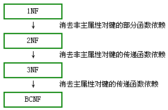

# MySQL 面试题收集 1

> 摘自[《史上最详细的一线大厂 Mysql 面试题详解》](https://juejin.im/post/5cb6c4ef51882532b70e6ff0#heading-0)

## MySQL 的复制原理以及流程

基本原理流程，3 个线程以及之间的关联：

- **主**：binlog 线程——记录下所有改变了数据库的语句，放进 master 上的 binlog 中；
- **从**：io 线程——在使用 start slave 之后，负责从 master 上拉取 binlog 内容，放进自己的 relay log 中
- **从**：sql 执行线程——执行 relay log 中的语句；

## MySQL 中 MyISAM 和 InnoDB 的区别

### 不同

- InnoDB 支持事务，MyISAM 不支持事务
- InnoDB 支持行级锁，MyISAM 支持表级锁
- InnoDB 支持 MVCC(多版本并发控制)，而 MyISAM 不支持
- InnoDB 支持外键，而 MyISAM 不支持
- InnoDB 即使没设计主键也会新建一个对用户不可见的主键，而 MyISAM 支持不存在主键和索引的表
- InnoDB 没有保存表的总行数，MyISAM 保存有表的总行数
- InnodB 是索引组织表，MyISAM 是堆表
- InnoDB 中必须包含只有该字段的索引，引擎的自动增长列必须是索引，如果是组合索引也必须是组合索引的第一列，MyISAM 可以和其他字段一起建立联合索引。引擎的自动增长列必须是索引，如果是组合索引，自动增长可以不是第一列，他可以根据前面几列进行排序后递增。

### InnoDB 特性(前四个重要特性)

- **插入缓冲（insert buffer)**：用于非聚集索引页的插入和更新操作，提高插入性能。
- **二次写(double write)**：为了确保在宕机时刷新脏页不会出现问题，先将原始页做一份备份到磁盘，再写脏页，出现问题可以通过备份进行恢复。
- **自适应哈希索引(ahi)**：为了提高辅助索引的查询效率，对于频繁查询的辅助索引会自动建立 hash 索引。
- **预读(read ahead)**：预读机制就是发起一个 i/o 请求，异步地在缓冲池中预先回迁若干页面，预计将会用到回迁的页面，这些请求在一个范围内引入所有页面。
- 脏页：缓存中的页面被修改后的页面，我们称之为脏页。
- 重做日志：用来记录用户对数据的修改过程，定时刷新到磁盘，用于断电重启时对缓存中的脏页进行恢复。
- checkPoint：将脏页数据刷新到磁盘的技术。
- LSN(Log Sequence Number): 每个缓存页/重做日志/checkPoint 都有 LSN，用来记录顺序节点位置。
- undo 页：记录未被提交的事务操作过程。
- pull merge：主要用来删除无用的 undo 页。
- 异步 IO：为了提高磁盘操作的性能， InnoDB 存储引擎采用异步 IO（AIO）的方式来处理磁盘操作。
- 刷新邻接页：在刷新脏页时，检查该页所在区的所有页是否存在脏页，存在则一起刷新。

### 两者 select count(\*)哪个更快,为什么

myisam 更快，因为 myisam 内部维护了一个计数器，可以直接调取。

## MySQL 中 varchar 与 char 的区别以及 varchar(50)中的 50 代表的涵义

### varchar 与 char 的区别

- char 是一种固定长度的类型；
- varchar 则是一种可变长度的类型

### varchar(50)中 50 的涵义

最多存放 50 个字符，varchar(50)和(200)存储 hello 所占空间一样，但后者在排序时会消耗更多内存，因为 order by col 采用 fixed_length 计算 col 长度(memory 引擎也一样)

### int(20)中 20 的涵义

是指显示字符的长度,20 表示最大显示宽度为 20，但仍占 4 字节存储，存储范围不变；比如它是记录行数的 id,插入 10 笔资料，它就显示 00000000001~~~00000000010，当字符的位数超过 11,它也只显示 11 位，如果你没有加那个让它未满 11 位就前面加 0 的参数，它不会在前面加 0

### mysql 为什么这么设计

对大多数应用没有意义，只是规定一些工具用来显示字符的个数；int(1)和 int(20)存储和计算均一样；

## InnoDB 的事务与日志的实现方式

### 有多少种日志

- **错误日志**：记录出错信息，也记录一些警告信息或者正确的信息。
- **查询日志**：记录所有对数据库请求的信息，不论这些请求是否得到了正确的执行。
- **慢查询日志**：设置一个阈值，将运行时间超过该值的所有 SQL 语句都记录到慢查询的日志文件中。
- **二进制日志(Binary log)**：记录对数据库执行更改的所有操作。
- **中继日志(relay log)**：中继日志也是二进制日志，用来给 slave 库恢复
- **事务日志**：重做日志 redo 和回滚日志 undo

### 事务的 4 种隔离级别

- 读未提交(RU)
- 读已提交(RC)
- 可重复读(RR)
- 串行(Serializable)

### 事务是如何通过日志来实现的

事务日志通过 redo 和 innodb 的存储引擎日志缓冲(innodb log buffer)来实现，

- 当开始一个事务时，会记录该事务的 lsn(log sequence number)号；
- 当开始事务执行时，会往 InnoDB 存储引擎的日志的日志缓冲插入事务日志；
- 当事务提交时，必须将存储引擎的日志缓冲写入磁盘(通过 innodb_flush_log_at_trx_commit 来控制)，也就是**写数据前，先写日志**。这种方式称为“预写日志方式”。

## MySQL binlog 的几种日志录入格式以及区别

### Statement

每一条会修改数据的 sql 都会记录在 binlog 中。

**优点**：**不需要记录每一行的变化，减少了 binlog 日志量，节约了 IO，提高性能**。(相比 row 能节约多少性能 与日志量，这个取决于应用的 SQL 情况，正常同一条记录修改或者插入 row 格式所产生的日志量还小于 Statement 产生的日志量，但是考虑到如果带条 件的 update 操作，以及整表删除，alter 表等操作，ROW 格式会产生大量日志，因此在考虑是否使用 ROW 格式日志时应该跟据应用的实际情况，其所 产生的日志量会增加多少，以及带来的 IO 性能问题。)

**缺点**：由于记录的只是执行语句，为了这些语句能在 slave 上正确运行，因此还必须记录每条语句在执行的时候的 一些相关信息，以保证所有语句能在 slave 得到和在 master 端执行时候相同 的结果。另外 mysql 的复制,像一些特定函数功能，slave 可与 master 上要保持一致会有很多相关问题(如 sleep()函数， last_insert_id()，以及 user-defined functions(udf)会出现问题)。

**使用以下函数的语句也无法被复制**：

- LOAD_FILE()
- UUID()
- USER()
- FOUND_ROWS()
- SYSDATE() (除非启动时启用了 --sysdate-is-now 选项)

同时在 INSERT …SELECT 会产生比 RBR 更多的行级锁

### Row

不记录 sql 语句上下文相关信息，仅保存哪条记录被修改

**优点**： binlog 中可以不记录执行的 sql 语句的上下文相关的信息，仅需要记录那一条记录被修改成什么了。所以 rowlevel 的日志内容会非常清楚的记录下 每一行数据修改的细节。而且不会出现某些特定情况下的存储过程，或 function，以及 trigger 的调用和触发无法被正确复制的问题。

**缺点**：所有的执行的语句当记录到日志中的时候，都将以每行记录的修改来记录，这样可能会产生大量的日志内容,比 如一条 update 语句，修改多条记录，则 binlog 中每一条修改都会有记录，这样造成 binlog 日志量会很大，特别是当执行 alter table 之类的语句的时候，由于表结构修改，每条记录都发生改变，那么该表每一条记录都会记录到日志中。

### Mixedlevel

以上两种 level 的混合使用，一般的语句修改使用 statment 格式保存 binlog，如一些函数，statement 无法完成主从复制的操作，则 采用 row 格式保存 binlog,MySQL 会根据执行的每一条具体的 sql 语句来区分对待记录的日志形式，也就是在 Statement 和 Row 之间选择 一种.新版本的 MySQL 中队 row level 模式也被做了优化，并不是所有的修改都会以 row level 来记录，像遇到表结构变更的时候就会以 statement 模式来记录。至于 update 或者 delete 等修改数据的语句，还是会记录所有行的变更。

## MySQL 数据库 cpu 飙升到 500%的话他怎么处理?

- 列出所有进程 `show processlist`,观察所有进程 ,多秒没有状态变化的(干掉)
- 查看超时日志或者错误日志 (做了几年开发,一般会是查询以及大批量的插入会导致 cpu 与 i/o 上涨,当然不排除网络状态突然断了,导致一个请求服务器只接受到一半，比如 where 子句或分页子句没有发送,,当然的一次被坑经历)

## sql 优化各种方法

### explain 出来的各种 item 意义

- select_type：表示查询中每个 select 子句的类型
- type：表示 MySQL 在表中找到所需行的方式，又称“访问类型”
- possible_keys：指出 MySQL 能使用哪个索引在表中找到行，查询涉及到的字段上若存在索引，则该索引将被列出，但不一定被查询使用
- key：显示 MySQL 在查询中实际用到的索引，若没有使用索引，显示为 NULL
- key_len：表示索引中使用的字节数，可以通过该列计算查询中使用的索引长度
- ref：表示上述表的连接匹配条件，即哪些或常量被用于查询索引列上的值
- Extra：包含不适合在其他列中显示但十分重要的额外信息

### profile 的意义以及使用场景

查询到 SQL 会执行多少时间, 并看出 CPU/Memory 使用量, 执行过程中 Systemlock, Table lock 花多少时间等等

### MySQL5.7 之后 profile 为过时命令,使用 performance_schema 来替代

## 备份计划,mysqldump 以及 xtranbackup 的实现原理

### 备份计划

按业务实际情况备份

### 备份恢复时间

这里跟机器，尤其是硬盘的速率有关系，以下列举几个仅供参考

- 20G 的 2 分钟（mysqldump）
- 80G 的 30 分钟(mysqldump)
- 111G 的 30 分钟（mysqldump)
- 288G 的 3 小时（xtra)
- 3T 的 4 小时（xtra)

逻辑导入时间一般是备份时间的 5 倍以上

### xtrabackup 实现原理

在 InnoDB 内部会维护一个 redo 日志文件，我们也可以叫做事务日志文件。事务日志会存储每一个 InnoDB 表数据的记录修改。当 InnoDB 启动时，InnoDB 会检查数据文件和事务日志，并执行两个步骤：它应用（前滚）已经提交的事务日志到数据文件，并将修改过但没有提交的数据进行回滚操作。

## mysqldump 中备份出来的 sql,如果我想 sql 文件中,一行只有一个 insert...value()的话,怎么办?如果备份需要带上 master 的复制点信息怎么办?

```sql
--skip-extended-insert

[root@helei-zhuanshu ~]# mysqldump -uroot -p helei --skip-extended-insert

Enter password:

KEY `idx_c1` (`c1`),

KEY `idx_c2` (`c2`)

) ENGINE=InnoDB AUTO_INCREMENT=51 DEFAULT CHARSET=latin1;

/*!40101 SET character_set_client = @saved_cs_client */;

--

-- Dumping data for table `helei`

--

LOCK TABLES `helei` WRITE;

/*!40000 ALTER TABLE `helei` DISABLE KEYS */;

INSERT INTO `helei` VALUES (1,32,37,38,'2016-10-18 06:19:24','susususususususususususu');

INSERT INTO `helei` VALUES (2,37,46,21,'2016-10-18 06:19:24','susususususu');

INSERT INTO `helei` VALUES (3,21,5,14,'2016-10-18 06:19:24','susu');
```

## 500 台 db,在最快时间之内重启

可以使用批量 ssh 工具 pssh 来对需要重启的机器执行重启命令。 也可以使用 salt（前提是客户端有安装 salt）或者 ansible（ ansible 只需要 ssh 免登通了就行）等多线程工具同时操作多台服务器

## innodb 的读写参数优化

### 读取参数

global buffer 以及 local buffer；

```text
# Global buffer：
Innodb_buffer_pool_size //理论上越大越好，建议服务器50%~80%，实际为数据大小80%~90%即可；
innodb_log_buffer_size
innodb_additional_mem_pool_size

# local buffer(下面的都是 server 层的 session 变量，不是 innodb 的)：
Read_buffer_size
Join_buffer_size
Sort_buffer_size
Key_buffer_size
Binlog_cache_size
```

### 写入参数

```text
innodb_flush_log_at_trx_commit
innodb_buffer_pool_size
insert_buffer_size
innodb_double_write
innodb_write_io_thread
innodb_flush_method
```

### 与 IO 相关的参数

```text
innodb_write_io_threads = 8
innodb_read_io_threads = 8 //根据处理器内核数决定；
innodb_thread_concurrency = 0
Sync_binlog
Innodb_flush_log_at_trx_commit
Innodb_lru_scan_depth
Innodb_io_capacity
Innodb_io_capacity_max
innodb_log_buffer_size
innodb_max_dirty_pages_pct
```

### 缓存参数以及缓存的适用场景

```text
query cache/query_cache_type
```

并不是所有表都适合使用 query cache。造成 query cache 失效的原因主要是相应的 table 发生了变更

- 第一个：读操作多的话看看比例，简单来说，如果是用户清单表，或者说是数据比例比较固定，比如说商品列表，是可以打开的，前提是这些库比较集中，数据库中的实务比较小。

- 第二个：我们“行骗”的时候，比如说我们竞标的时候压测，把 query cache 打开，还是能收到 qps 激增的效果，当然前提示前端的连接池什么的都配置一样。大部分情况下如果写入的居多，访问量并不多，那么就不要打开，例如社交网站的，10%的人产生内容，其余的 90%都在消费，打开还是效果很好的，但是你如果是 qq 消息，或者聊天，那就很要命。

- 第三个：小网站或者没有高并发的无所谓，高并发下，会看到 很多 qcache 锁 等待，所以一般高并发下，不建议打开 query cache

## 你是如何监控你们的数据库的?你们的慢日志都是怎么查询的?

监控的工具有很多，例如 zabbix，lepus，我这里用的是 lepus

## 你是否做过主从一致性校验,如果有,怎么做的,如果没有,你打算怎么做？

主从一致性校验有多种工具 例如 checksum、mysqldiff、pt-table-checksum 等

## 你们数据库是否支持 emoji 表情,如果不支持,如何操作?

如果是 utf8 字符集的话，需要升级至 utf8_mb4 方可支持(四字节)

一个汉字 utf8 占 3 字节

## 你是如何维护数据库的数据字典的?

这个大家维护的方法都不同，我一般是直接在生产库进行注释，利用工具导出成 excel 方便流通。

## 表中有大字段 X(例如:text 类型),且字段 X 不会经常更新,以读为为主,请问是否应该拆分

拆带来的问题：连接消耗 + 存储拆分空间；不拆可能带来的问题：查询性能；

1. 如果能容忍拆分带来的空间问题,拆的话最好和经常要查询的表的主键在物理结构上放置在一起(分区) 顺序 IO,减少连接消耗,最后这是一个文本列再加上一个全文索引来尽量抵消连接消耗
2. 如果能容忍不拆分带来的查询性能损失的话:上面的方案在某个极致条件下肯定会出现问题,那么不拆就是最好的选择

## MySQL 中 InnoDB 引擎的行锁是通过加在什么上完成(或称实现)的?为什么是这样子的?

**InnoDB 是基于索引来完成行锁**

例: `select * from tab_with_index where id = 1 for update; for update` 可以根据条件来完成行锁锁定,并且 id 是有索引键的列,如果 id 不是索引键那么 InnoDB 将完成表锁,,并发将无从谈起

innodb 是将 primary key index 和相关的行数据共同放在 B+树的叶节点；innodb 一定会有一个 primary key，secondary index 查找的时候，也是通过找到对应的 primary，再找对应的数据行；

## 开放性问题:据说是腾讯的

一个 6 亿的表 a，一个 3 亿的表 b，通过外间 tid 关联，你如何最快的查询出满足条件的第 50000 到第 50200 中的这 200 条数据记录。

- 如果 A 表 TID 是自增长,并且是连续的,B 表的 ID 为索引

```sql
select * from a,b where a.tid = b.id and a.tid>50000 limit 200;
```

- 如果 A 表的 TID 不是连续的,那么就需要使用覆盖索引。TID 要么是主键,要么是辅助索引,B 表 ID 也需要有索引。

```sql
select * from b , (select tid from a limit 50000,200) where b.id = a .tid;
```

## 什么是存储过程?有哪些优缺点?

存储过程是一些预编译的 SQL 语句。

1. 更加直白的理解：存储过程可以说是一个记录集，它是由一些 T-SQL 语句组成的代码块，这些 T-SQL 语句代码像一个方法一样实现一些功能（对单表或多表的增删改查），然后再给这个代码块取一个名字，在用到这个功能的时候调用他就行了。
2. 存储过程是一个预编译的代码块，执行效率比较高,一个存储过程替代大量 T_SQL 语句 ，可以降低网络通信量，提高通信速率,可以一定程度上确保数据安全

## 索引是什么?有什么作用以及优缺点?

1. 索引是对数据库表中一列或多列的值进行排序的结构，是帮助 MySQL 高效获取数据的数据结构
2. 索引是加快检索表中数据的方法。数据库索引类似于书籍的索引目录，在书籍中，索引允许用户不必翻阅完整个书就能迅速地找到所需要的信息。在数据库中，索引也允许数据库程序迅速地找到表中的数据，而不必扫描整个数据库。

**MySQL 基本索引类型**：普通索引，唯一索引，主键索引，全文索引

**优缺点**：

1. 索引加快数据库的检索速度，但降低插入、删除、修改等维护任务的速度
2. 唯一索引可以确保每一行数据的唯一性
3. 通过使用索引，可以在查询的过程中使用优化隐藏器，提高系统性能
4. 索引需要占用物理和数据空间

## 什么是事务?

事务(Transaction)是并发控制的基本单位。所谓事务，它是一个操作序列，这些操作要么都执行，要么都不执行，它是一个不可分割的工作单位。事务是数据库维护数据一致性的单位，在每个事务结束时，都能保持数据的一致性。

## 使用索引一定能提高查询的性能吗?为什么

通常，通过索引查询数据比全表扫描要快，但是也必须注意它的代价：

1. 索引需要空间来存储，也需要定期维护，每当有记录在表中增减或索引列被修改时，索引本身也会被修改。这意味着每条记录的 INSERT,DELETE,UPDATE 将为此多付出 4，5 次的磁盘 I/O。因为索引需要额外的存储空间和处理，那些不必要的索引反而会使查询反应时间变慢。使用索引查询不一定能提高查询性能，索引范围查询(INDEX RANGE SCAN)适用于两种情况：
   1. 基于一个范围的检索，一般查询返回的结果集小于表中记录数的 30%
   2. 基于非唯一索引的检索

## 简单说一下 drop,delete,truncate 的区别

1. delete 和 truncate 只删除表数据而不删除表结构
2. 速度一般来说：drop>truncate>delete
3. delete 语句是 dml，这个操作会放到 rollback segement 中，事务提交之后才生效
4. 如果有相应的 trigger，执行的时候将被触发。truncate，drop 是 ddl，操作立即生效，原数据不放到 rollback segement 中，不能回滚，操作不触发 trigger。

- **DDL**：Data Definition Language，数据定义语言，这些语句定义了不同的数据段、数据库、表、列、索引等数据库对象的定义。常用的语句关键字主要包括 create、drop、alter 等。
- **DML**：Data Manipulation Language，数据操纵语言，用于添加、删除、更新和查询数据库记录，并检查数据完整性，常用的语句关键字主要包括 insert、delete、udpate 和 select 等。(增添改查）
- **DCL**：Data Control Language，数据控制语言，用于控制不同数据段直接的许可和访问级别的语句。这些语句定义了数据库、表、字段、用户的访问权限和安全级别。主要的语句关键字包括 grant、revoke 等。

## drop,delete,truncate 分别在什么场景下使用?

1. 不需要表时，用 drop
2. 想删除部分数据时，用 delete，并带上 where 子句
3. 保留表而删除所有数据的时候用 truncate

## 超键,候选键,主键,外键分别是什么?

1. **超键**：在关系中能唯一标识元组的属性称为关系模式的超键。一个属性可以为作为一个超键，多个属性组合在一起也可以作为一个超键。超键包含候选键和主键。
2. **候选键**：是最小的超键，即没有冗余元素的超键
3. **主键**：数据库表中对存储数据对象予以唯一和完整标识的数据列或属性的组合，一个数据列只能有一个主键，且主键的取值不能缺失，即不能为空值（Null）。
4. **外键**：在一个表中存在的另一个表的主键称为此表的外键

## 什么是视图?以及视图的使用场景有哪些?

1. 视图是一种虚拟的表，具有和物理表相同的功能。可以对视图进行增、删、改、查操作，视图通常是有一个表或者多个表的行或列的子集。**对视图的修改不影响基本表**(测试发现可以修改表数据)。相比多表查询，它使得我们获取数据更容易。
2. 只暴露部分字段给访问者，所以就建一个虚表，就是视图。
3. 查询的数据来源于不同的表，而查询者希望以统一的方式查询，这样也可以建立一个视图，把多个表查询结果联合起来，查询者只需要直接从视图中获取数据，不必考虑数据来源于不同表所带来的差异。

## 三范式和 BCNF

### 第一范式(1NF)

数据库表中的字段都是单一属性的，不可再分。这个单一属性由基本类型构成，包括整形、实数、字符型、逻辑型、日期型等

**实体中的某个属性不能有多个值或者不能有重复的属性**

符合第一范式：

| 字段 1 | 字段 2 | 字段 3 | 字段 4 |
| ------ | ------ | ------ | ------ |


不符合第一范式：

| 字段 1 | 字段 2 | 字段 3   | 字段 4   |
| ------ | ------ | -------- | -------- |
|        |        | 字段 3,1 | 字段 3,2 |

### 第二范式(2NF)

数据库表中不存在非关键字段对任一候选关键字段的部分函数依赖（部分函数依赖指的是存在组合关键字中的某些字段决定非关键字段的情况），也即所有非关键字段都完全依赖于任意一组候选关键字。

简而言之，第二范式（2NF）就是**非主属性完全依赖于主关键字**。

(学号, 课程名称) → (姓名, 年龄, 成绩, 学分)

这个数据库表不满足第二范式，因为存在如下决定关系：

(课程名称) → (学分)

(学号) → (姓名, 年龄)

由于不符合 2NF，这个选课关系表会存在如下问题：

1. 数据冗余：同一门课程由 n 个学生选修，"学分"就重复 n-1 次；同一个学生选修了 m 门课程，姓名和年龄就重复了 m-1 次。
2. 更新异常：若调整了某门课程的学分，数据表中所有行的"学分"值都要更新，否则会出现同一门课程学分不同的情况。
3. 插入异常：假设要开设一门新的课程，暂时还没有人选修。这样，由于还没有"学号"关键字，课程名称和学分也无法记录入数据库。
4. 删除异常：假设一批学生已经完成课程的选修，这些选修记录就应该从数据库表中删除。但是，与此同时，课程名称和学分信息也被删除了。很显然，这也会导致插入异常。

把选课关系表 SelectCourse 改为如下三个表：

- 学生：Student(学号, 姓名, 年龄)；
- 课程：Course(课程名称, 学分)；
- 选课关系：SelectCourse(学号, 课程名称, 成绩)。

这样的数据库表是符合第二范式的， 消除了数据冗余、更新异常、插入异常和删除异常。

另外，**所有单关键字的数据库表都符合第二范式，因为不可能存在组合关键字**。

### 第三范式（3NF)

在第二范式的基础上，数据表中如果不存在非关键字段对任一候选关键字段的传递函数依赖则符合第三范式。所谓传递函数依赖，指的是如果存在"A → B → C"的决定关系，则 C 传递函数依赖于 A。因此，满足第三范式的数据库表应该不存在如下依赖关系： `关键字段 → 非关键字段 x → 非关键字段 y`

满足第三范式（3NF）必须先满足第二范式（2NF）。**第三范式（3NF）要求一个数据库表中不包含已在其它表中已包含的非主关键字信息。**

假定学生关系表为 Student(学号, 姓名, 年龄, 所在学院, 学院地点, 学院电话)，关键字为单一关键字"学号"，因为存在如下决定关系：

(学号) → (姓名, 年龄, 所在学院, 学院地点, 学院电话)

这个数据库是符合 2NF 的，但是不符合 3NF，因为存在如下决定关系：

(学号) → (所在学院) → (学院地点, 学院电话)

即存在非关键字段"学院地点"、"学院电话"对关键字段"学号"的传递函数依赖。它也会存在数据冗余、更新异常、插入异常和删除异常的情况。

把学生关系表分为如下两个表：

- 学生：(学号, 姓名, 年龄, 所在学院)；
- 学院：(学院, 地点, 电话)。

**外键**

### BCNF

若关系模式 R 是第一范式，且每个属性都不传递依赖于 R 的候选键。这种关系模式就是 BCNF 模式。即在第三范式的基础上，数据库表中如果不存在任何字段对任一候选关键字段的传递函数依赖则符合 BCNF 范式。

假设仓库管理关系表为 StorehouseManage(仓库 ID, 存储物品 ID, 管理员 ID, 数量)，且有一个管理员只在一个仓库工作；一个仓库可以存储多种物品。这个数据库表中存在如下决定关系：

(仓库 ID, 存储物品 ID) →(管理员 ID, 数量)

(管理员 ID, 存储物品 ID) → (仓库 ID, 数量)

所以，(仓库 ID, 存储物品 ID)和(管理员 ID, 存储物品 ID)都是 StorehouseManage 的候选关键字，表中的唯一非关键字段为数量，它是符合第三范式的。但是，由于存在如下决定关系：

(仓库 ID) → (管理员 ID)\*\*\*\*

(管理员 ID) → (仓库 ID)

即**存在关键字段决定关键字段的情况，所以其不符合 BCNF 范式**。它会出现如下异常情况：

1. 删除异常：当仓库被清空后，所有"存储物品 ID"和"数量"信息被删除的同时，"仓库 ID"和"管理员 ID"信息也被删除了。
2. 插入异常：当仓库没有存储任何物品时，无法给仓库分配管理员。
3. 更新异常：如果仓库换了管理员，则表中所有行的管理员 ID 都要修改。

把仓库管理关系表分解为二个关系表：

- 仓库管理：StorehouseManage(仓库 ID, 管理员 ID)；
- 仓库：Storehouse(仓库 ID, 存储物品 ID, 数量)。

这样的数据库表是符合 BCNF 范式的，消除了删除异常、插入异常和更新异常。

### 四种范式之间的关系



### 范式的优缺点

- 范式化的更新操作通常比反范式快，当数据较好地范式化时，就只有很少或没有重复数据，所以只需要修改更少的数据
- 范式化的表通常更小，可以更好的放在内存里，所以执行操作更快。
- 很少有多余的数据意味着检索数据表数据时更少需要distinct或者group by。
- 范式化设计的shema缺点是通常需要关联。

## 数据库的乐观锁和悲观锁是什么?

数据库管理系统（DBMS）中的并发控制的任务是确保在多个事务同时存取数据库中同一数据时不破坏事务的隔离性和统一性以及数据库的统一性。乐观并发控制(乐观锁)和悲观并发控制（悲观锁）是并发控制主要采用的技术手段。

- **悲观锁**：假定会发生并发冲突，屏蔽一切可能违反数据完整性的操作;共享资源每次只给一个线程使用，其它线程阻塞，用完后再把资源转让给其它线程。一般**多写的场景**下用悲观锁就比较合适。

- **乐观锁**：假设不会发生并发冲突，只在提交操作时检查是否违反数据完整性。乐观锁**适用于多读的应用类型**，这样可以提高吞吐量，CAS(compare and swap)算法和 MVCC 版本控制。CAS 一般情况下是一个自旋操作，即不断的重试；
  - CAS 缺点：
    - ABA 问题
    - 循环时间长开销大：自旋 CAS（也就是不成功就一直循环执行直到成功）如果长时间不成功，会给 CPU 带来非常大的执行开销。
    - 只能保证一个共享变量的原子操作

## 参考

**参考**

> - [MySQL innodb 的读写参数优化](http://www.jishuchi.com/read/mysql-interview/2821)
> - [数据库范式（1NF 2NF 3NF BCNF）详解](https://blog.csdn.net/ljp812184246/article/details/50706596)
> - [面试必备之乐观锁与悲观锁](https://juejin.im/post/5b4977ae5188251b146b2fc8)
