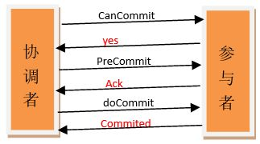
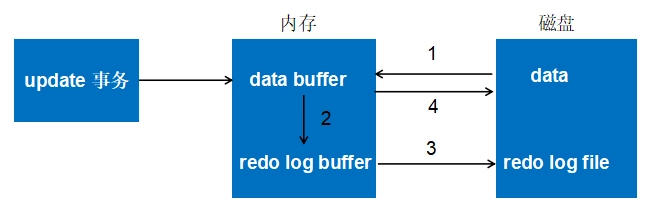

# 数据库事务

数据库事务是数据库管理系统执行过程中的一个逻辑单位，由一个**有限的数据库操作序列构成**，是数据库并发控制的基本单位

## 数据库事务特性

- 原子性(A)：事务由原子操作序列组成，所有操作要么全部成功，要么全部失败回滚
- 一致性(C)：`事务的执行不能破坏数据库数据的完整性和一致性`，一个事务在执行之前和执行之后，数据库必须处于一致性状态，比如在做多表操作时，多个表要么都是事务后新的值，要么都是事务前旧的值
- 隔离性(I)：多个事务并发执行，一个事务的执行不影响其他事务的执行。
- 持久性(D)：已被提交的事务对数据库的修改应该永久保存在数据库中。

## MySQL 事务隔离级别

| 事务隔离级别                | 脏读 | 不可重复读 | 幻读 |
| --------------------------- | ---- | ---------- | ---- |
| 读未提交(read-uncommitted)  | 是   | 是         | 是   |
| 读已提交（read-committed）  | 否   | 是         | 是   |
| 可重复读（repeatable-read） | 否   | 否         | 是   |
| 序列化（serializable）      | 否   | 否         | 否   |

**脏读**：该隔离级别的事务会读到其它未提交事务的数据，此现象也称之为脏读。

**不可重复读**：对于数据库中的某个数据，一个事务内多次查询返回不一样的结果，这是由于多次查询之间，有其他事务修改了数据并进行了提交。

**幻读**：一个事务中执行两次完全相同的查询，第二次返回的`结果集`跟第一次查询不相同。与不可重复读的区别在于，不可重复读是对同一条记录，两次读取的值不同，而幻读是记录的增删，导致两次相同条件获取得结果记录数不同。（一个是针对一条记录的变化，一个是针对一个结果集的变化）

### 隔离级别介绍

- **读取未提交**：即可以读取到其他事务未提交的内容，最低的隔离级别
- **读取已提交**：及只能读取到其他事务以提交的数据，该隔离级别可以避免脏读
- **可重复读**：保证整个事务过程中，对同数据的多次读取结果是相同的。这个级别可以解决脏读和不可重复读的问题。MySQL 默认的隔离级别就是可重复读。（简单描述：`我可以重复读取该条记录，而不会出现不同数据的情况`）
- **串行化**：级别最高，所有事务按顺序执行，该隔离记录并发度下降，性能最低。

## 事务分类

- **扁平化事务**：平常使用最多，事务的所有操作都在同一层次，主要用于限制不能提交或回滚事务中的一部分操作，要么都成功，要么都回滚(原子性)
- **带保存点的扁平事务**：允许事务在执行中回滚到较早的状态而不是全部回滚。通过在事务中插入保存点，当操作失败时，可以选择回滚到最近的保存点。（游戏存档）
- **链事务**：可看做是第二种事务的变种。在事务提交时，将必要的上下文隐式传递给下一个事务，当事务失败时可以回滚到最近的事务。注：链事务只能回滚到最近的保存点，而带保存点的扁平事务可以回滚到任意保存点。
- **嵌套事务**：由顶层事务和子事务组成，类似于树的结构。顶层事务一般负责逻辑管理，子事务负责具体的工作，子事务可以提交，但真正提交要等父事务提交，如果上次事务回滚，那么所有子事务都要回滚。
- **分布式事务**：指分布式环境中的扁平化事务。

## 常见分布式事务解决方案

### XA 协议

保证强一致性的刚性事务。实现方式：两段式提交和三段式提交。

#### 两段式提交(Two-phaseCommit;2PC)

使用一个`事务协调者`组件来协调分布式事务

- 第一阶段：voting phase 投票阶段
- 第二阶段：commit phase 提交阶段

投票阶段：

1. 协调者节点向所有参与者节点询问是否可以执行提交操作(vote)，并开始等待各参与者节点的响应。
2. 参与者节点检查事务权限，执行询问发起为止的所有事务操作，并将 Undo 信息和 Redo 信息写入日志。
3. 各参与者节点响应协调者节点发起的询问。如果参与者节点的事务操作实际执行成功，则它返回一个”同意”消息；如果参与者节点的事务操作实际执行失败，则它返回一个”中止”消息。

提交阶段：

情况 1

1. 协调者节点向所有参与者节点发出”正式提交(commit)”的请求。
2. 参与者节点正式完成操作，并释放在整个事务期间内占用的资源。
3. 参与者节点向协调者节点发送”完成”消息。
4. 协调者节点受到所有参与者节点反馈的”完成”消息后，完成事务。

情况 2

1. 协调者节点向所有参与者节点发出”回滚操作(rollback)”的请求。
2. 参与者节点利用之前写入的 Undo 信息执行回滚，并释放在整个事务期间内占用的资源。
3. 参与者节点向协调者节点发送”回滚完成”消息。
4. 协调者节点受到所有参与者节点反馈的”回滚完成”消息后，取消事务。

二阶段提交的缺点：

- **同步阻塞问题**：执行过程中，所有参与节点都是事务阻塞型的。当参与者占有公共资源时，其他第三方节点访问公共资源不得不处于阻塞状态。也就是说从投票阶段到提交阶段完成这段时间，资源是被锁住的。
- **单点故障**：**一旦协调者发生故障。参与者会一直阻塞下去**。尤其在第二阶段，协调者发生故障，那么所有的参与者还都处于锁定事务资源的状态中，而无法继续完成事务操作。
  - 【协调者发出 Commmit 消息之前宕机的情况】:如果是协调者挂掉，可以重新选举一个协调者，但是无法解决因为协调者宕机导致的参与者处于阻塞状态的问题
- **数据不一致**：在二阶段提交的阶段二中，当协调者向参与者发送 commit 请求之后，发生了局部网络异常或者在发送 commit 请求过程中协调者发生了故障，这回导致只有一部分参与者接受到了 commit 请求。而在这部分参与者接到 commit 请求之后就会执行 commit 操作。但是其他部分未接到 commit 请求的机器则无法执行事务提交。于是整个分布式系统便出现了数据不一致性的现象。
- **二阶段无法解决的问题：------ 极限情况下,对某一事务的不确定性！**：
  - 【协调者发出 Commmit 消息之后宕机的情况】:协调者在发出 commit 消息之后宕机，而唯一接收到这条消息的参与者同时也宕机了。那么即使协调者通过选举协议产生了新的协调者，这条事务的状态也是不确定的，没人知道事务是否被已经提交。

由于二阶段提交存在着诸如**同步阻塞、单点问题、脑裂**等缺陷，所以，研究者们在二阶段提交的基础上做了改进，提出了三阶段提交。

#### 三段式提交(Three-phase commit;3PC)



改动点：

1. 引入**超时机制**，同时在协调者和参与者中都引入超时机制
2. 在 1，2 节点中插入**准备阶段**，保证在最后提交阶段前个参与节点状态的一致。

3PC 除了引入超时机制，还把**2PC 的投票阶段再次一分为二**，样三阶段提交就有`CanCommit、PreCommit、DoCommit`三个阶段。

**为什么要把投票阶段一分为二？**

**假设有 1 个协调者，9 个参与者。其中有一个参与者不具备执行该事务的能力**。协调者发出 prepare 消息之后，其余参与者都将资源锁住，执行事务，写入 undo 和 redo 日志。协调者收到相应之后，发现有一个参与者不能参与。所以，又出一个 roolback 消息。其余 8 个参与者，又对消息进行回滚。这样子，是不是做了很多无用功？

所以，引入 can-Commit 阶段，主要是**为了在预执行之前，保证所有参与者都具备可执行条件，从而减少资源浪费**。(保证参与者可执行事务，减少不必要的资源浪费)

- CanCommit 阶段：

  1. **事务询问**：协调者询问参与者是否可以执行事务操作。
  2. **响应反馈**：参与者根据自身服务器的情况，应答当前可执行状态 YES 并进入预备状态 或者返回 NO

- PreCommit 阶段：

情况 1，如果返回都是 YES

1. **发送预提交请求**：协调者向参与者发送 PreCommit 请求，并进入 Prepared 阶段。
2. **事务预提交**：参与者接收到 PreCommit 请求后，会执行事务操作，并将 undo 和 redo 信息记录到事务日志中。
3. **响应反馈**：如果参与者成功的执行了事务操作，则返回 ACK 响应，同时开始等待最终指令。

情况 2，如果返回的响应存在 NO

1. **发送中断请求**：协调者向所有参与者发送 abort 请求。
2. **中断事务**：参与者收到来自协调者的 abort 请求之后（或超时之后，仍未收到协调者的请求），执行事务的中断。

- doCommit 阶段：

情况 1-执行提交

1. 协调者向所有参与者发送事务 commit 通知
2. 所有参与者在收到通知之后执行 commit 操作，并释放占有的资源
3. 参与者向协调者反馈事务提交结果

情况 2-中断事务

协调者没有接收到参与者发送的 ACK 响应（可能是接受者发送的不是 ACK 响应，也可能响应超时），那么就会执行中断事务。具体步骤如下：

1. 发送中断请求 协调者向所有参与者发送事务 rollback 通知。
2. 事务回滚 所有参与者在收到通知之后执行 rollback 操作，并释放占有的资源。
3. 反馈结果 参与者向协调者反馈事务提交结果。
4. 中断事务 协调者接收到参与者反馈的 ACK 消息之后，执行事务的中断。

#### 2PC 与 3PC 的区别

3PC 主要解决的单点故障问题，并减少阻塞。

在 doCommit 阶段，如果参与者无法及时接收到来自协调者的 doCommit 或者 rebort 请求时，**会在等待超时之后，会继续进行事务的提交**。

其实这个应该是基于概率来决定的，当进入第三阶段时，说明参与者在第二阶段已经收到了 PreCommit 请求，那么 Coordinator 产生 PreCommit 请求的前提条件是他在第二阶段开始之前，收到所有参与者的 CanCommit 响应都是 Yes。一旦参与者收到了 PreCommit，意味他知道大家其实都同意修改了。

所以，一句话概括就是，**当进入第三阶段时，由于网络超时等原因，虽然参与者没有收到 commit 或者 abort 响应，但是他有理由相信：成功提交的几率很大**。

但是这种机制也会导致数据一致性问题，因为，由于网络原因，协调者发送的 abort 响应没有及时被参与者接收到，那么参与者在等待超时之后执行了 commit 操作。这样就和其他接到 abort 命令并执行回滚的参与者之间存在数据不一致的情况。

如果进入 PreCommit 后，协调者发出的是 abort 请求，如果只有一个参与者收到并进行了 abort 操作，而其他对于系统状态未知的参与者会根据 3PC 选择继续 Commit，那么系统的不一致性就存在了。所以无论是 2PC 还是 3PC 都存在问题。

### TCC

是满足最终一致性的柔性事务方案。TCC 采用补偿机制，核心思想是对每个操作，都要注册对应的确认和补偿操作。它分为三个阶段：Try 阶段主要对业务系统进行检测及资源预留；Confirm 阶段对业务系统做确认提交。Cancel 阶段是在业务执行错误，执行回滚，释放预留的资源。

### 消息事务

第三种方案是消息一致性方案。基本思路是将本地操作和发送消息放在一个事务中，保证本地操作和消息发送要么都成功要么都失败。下游应用订阅消息，收到消息后执行对应操作。

### GTS/Fescar

阿里云中的全局事务服务 GTS，对应的开源版本是 Fescar。Fescar 基于两段式提交进行改良，剥离了分布式事务方案对数据库在协议支持上的要求。使用 Fescar 的前提是分支事务中涉及的资源，必须是支持 ACID 事务的关系型数据库。分支的提交和回滚机制，都依赖于本地事务来保障。 Fescar 的实现目前还存在一些局限，比如事务隔离级别最高支持到读已提交级别。

## InnoDB 的事务与日志的实现方式

### 有多少种日志

- **错误日志**：记录出错信息，也记录一些警告信息或者正确的信息。
- **查询日志**：记录所有对数据库请求的信息，不论这些请求是否得到了正确的执行。
- **慢查询日志**：设置一个阈值，将运行时间超过该值的所有 SQL 语句都记录到慢查询的日志文件中。
- **二进制日志(Binary log)**：记录对数据库执行更改的所有操作。
- **中继日志(relay log)**：中继日志也是二进制日志，用来给 slave 库恢复
- **事务日志**：重做日志 redo 和回滚日志 undo

### 事务的 redo 和 undo

undo 日志用于记录事务开始时的状态，用于事务失败回滚；redo 日志记录事务执行后的状态，用于恢复未写入 data file 的已成功事务更新的数据。
例如某一事务的事务序号为 T1，其对数据 X 进行修改，设 X 的原值是 5，修改后的值为 15，那么 Undo 日志为<T1, X, 5>，Redo 日志为<T1, X, 15>。

**事务执行的各个阶段：**

1. 写undo日志到log buffer；
2. 执行事务，并写redo日志到log buffer；
3. 如果innodb_flush_log_at_trx_commit=1，则将redo日志写到log file，并刷新落盘。
4. 提交事务。

**为什么没有写data file，事务就提交了?**

`在数据库的世界里，数据从来都不重要，日志才是最重要的，有了日志就有了一切。`

因为data buffer中的数据会在合适的时间 由存储引擎写入到data file，如果在写入之前，数据库宕机了，根据落盘的redo日志，完全可以将事务更改的数据恢复。好了，看出日志的重要性了吧。先持久化日志的策略叫做Write Ahead Log，即预写日志。

#### redo log

重做日志(redo log)用来保证事务的持久性，即事务 ACID 中的 D。实际上它可以分为以下两种类型：

- 物理 Redo 日志
- 逻辑 Redo 日志

在 InnoDB 存储引擎中，**大部分情况下 Redo 是物理日志，记录的是数据页的物理变化**。

Redo log 的主要作用是**用于数据库的崩溃恢复**

Redo log 可以简单分为以下两个部分：

- 一是内存中重做日志缓冲 (redo log buffer),是易失的，在内存中
- 二是重做日志文件 (redo log file)，是持久的，保存在磁盘中

什么时候写 Redo?

- 在数据页修改完成之后，在脏页刷出磁盘之前，写入 redo 日志。注意的是先修改数据，后写日志
- redo 日志比数据页先写回磁盘
- 聚集索引、二级索引、undo 页面的修改，均需要记录 Redo 日志。

Redo 的整体流程：



- 第一步：先将原始数据从磁盘中读入内存中来，修改数据的内存拷贝
- 第二步：生成一条重做日志并写入 redo log buffer，记录的是数据被修改后的值
- 第三步：当事务 commit 时，将 redo log buffer 中的内容刷新到 redo log file，对 redo log file 采用追加写的方式
- 第四步：定期将内存中修改的数据刷新到磁盘中

#### undo log

undo log 主要记录的是数据的逻辑变化，为了在发生错误时回滚之前的操作，需要将之前的操作都记录下来，然后在发生错误时才可以回滚。

undo 是一种逻辑日志，有两个作用：

- 用于事务的回滚
- MVCC

undo log 的写入时机

- DML 操作修改聚簇索引前，记录 undo 日志
- 二级索引记录的修改，不记录 undo 日志

在 InnoDB 存储引擎中，undo log 分为：

- insert undo log
- update undo log

下面是 redo log + undo log 的简化过程，便于理解两种日志的过程：

```text
假设有A、B两个数据，值分别为1,2.
1. 事务开始
2. 记录A=1到undo log
3. 修改A=3
4. 记录A=3到 redo log
5. 记录B=2到 undo log
6. 修改B=4
7. 记录B=4到redo log
8. 将redo log写入磁盘
9. 事务提交
```

实际上，在 insert/update/delete 操作中，redo 和 undo 分别记录的内容都不一样，量也不一样。在 InnoDB 内存中，一般的顺序如下：

- 写 undo 的 redo
- 写 undo
- 修改数据页
- 写 Redo

因为事务在修改页时，要先记 undo，在记 undo 之前要记 undo 的 redo， 然后修改数据页，再记数据页修改的 redo。 Redo（里面包括 undo 的修改） 一定要比数据页先持久化到磁盘。 当事务需要回滚时，因为有 undo，可以把数据页回滚到前镜像的 状态，崩溃恢复时，如果 redo log 中事务没有对应的 commit 记录，那么需要用 undo 把该事务的修改回滚到事务开始之前。 如果有 commit 记录，就用 redo 前滚到该事务完成时并提交掉。

### 事务的 4 种隔离级别

- 读未提交(RU)
- 读已提交(RC)
- 可重复读(RR)
- 串行(Serializable)

### 事务是如何通过日志来实现的

事务日志通过 redo 和 innodb 的存储引擎日志缓冲(innodb log buffer)来实现，

- 当开始一个事务时，会记录该事务的 lsn(log sequence number)号；
- 当开始事务执行时，会往 InnoDB 存储引擎的日志的日志缓冲插入事务日志；
- 当事务提交时，必须将存储引擎的日志缓冲写入磁盘(通过 innodb_flush_log_at_trx_commit 来控制)，也就是**写数据前，先写日志**。这种方式称为“预写日志方式”。

### checkpoint

用于定期将db buffer的内容刷新到data file。当遇到内存不足、db buffer已满等情况时，需要将db buffer中的内容/部分内容（特别是脏数据）转储到data file中。在转储时，会记录checkpoint发生的”时刻“。在故障回复时候，只需要redo/undo最近的一次checkpoint之后的操作。

## 参考

> - [10 分钟梳理 MySQL 核心知识点](https://zhuanlan.zhihu.com/p/60031703)
> - [分布式一致性之两阶段提交协议、三阶提交协议](https://zhuanlan.zhihu.com/p/35616810)
> - [什么是脏读，不可重复读，幻读](https://www.cnblogs.com/phoebus0501/archive/2011/02/28/1966709.html)
> - [MySQL 事务隔离级别和锁](https://www.ibm.com/developerworks/cn/opensource/os-mysql-transaction-isolation-levels-and-locks/index.html)
