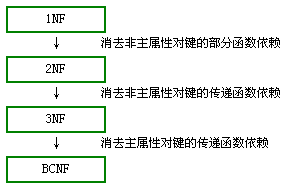

# 三范式和 BCNF

## 第一范式(1NF)

数据库表中的字段都是单一属性的，不可再分。这个单一属性由基本类型构成，包括整形、实数、字符型、逻辑型、日期型等

**实体中的某个属性不能有多个值或者不能有重复的属性**

符合第一范式：

| 字段 1 | 字段 2 | 字段 3 | 字段 4 |
| ------ | ------ | ------ | ------ |

不符合第一范式：

| 字段 1 | 字段 2 | 字段 3   | 字段 4   |
| ------ | ------ | -------- | -------- |
|        |        | 字段 3,1 | 字段 3,2 |

## 第二范式(2NF)

数据库表中不存在非关键字段对任一候选关键字段的部分函数依赖（部分函数依赖指的是存在组合关键字中的某些字段决定非关键字段的情况），也即所有非关键字段都完全依赖于任意一组候选关键字。

简而言之，第二范式（2NF）就是**非主属性完全依赖于主关键字**。

(学号, 课程名称) → (姓名, 年龄, 成绩, 学分)

这个数据库表不满足第二范式，因为存在如下决定关系：

(课程名称) → (学分)

(学号) → (姓名, 年龄)

由于不符合 2NF，这个选课关系表会存在如下问题：

1. 数据冗余：同一门课程由 n 个学生选修，"学分"就重复 n-1 次；同一个学生选修了 m 门课程，姓名和年龄就重复了 m-1 次。
2. 更新异常：若调整了某门课程的学分，数据表中所有行的"学分"值都要更新，否则会出现同一门课程学分不同的情况。
3. 插入异常：假设要开设一门新的课程，暂时还没有人选修。这样，由于还没有"学号"关键字，课程名称和学分也无法记录入数据库。
4. 删除异常：假设一批学生已经完成课程的选修，这些选修记录就应该从数据库表中删除。但是，与此同时，课程名称和学分信息也被删除了。很显然，这也会导致插入异常。

把选课关系表 SelectCourse 改为如下三个表：

- 学生：Student(学号, 姓名, 年龄)；
- 课程：Course(课程名称, 学分)；
- 选课关系：SelectCourse(学号, 课程名称, 成绩)。

这样的数据库表是符合第二范式的， 消除了数据冗余、更新异常、插入异常和删除异常。

另外，**所有单关键字的数据库表都符合第二范式，因为不可能存在组合关键字**。

## 第三范式（3NF)

在第二范式的基础上，数据表中如果不存在非关键字段对任一候选关键字段的传递函数依赖则符合第三范式。所谓传递函数依赖，指的是如果存在"A → B → C"的决定关系，则 C 传递函数依赖于 A。因此，满足第三范式的数据库表应该不存在如下依赖关系： `关键字段 → 非关键字段 x → 非关键字段 y`

满足第三范式（3NF）必须先满足第二范式（2NF）。**第三范式（3NF）要求一个数据库表中不包含已在其它表中已包含的非主关键字信息。**

假定学生关系表为 Student(学号, 姓名, 年龄, 所在学院, 学院地点, 学院电话)，关键字为单一关键字"学号"，因为存在如下决定关系：

(学号) → (姓名, 年龄, 所在学院, 学院地点, 学院电话)

这个数据库是符合 2NF 的，但是不符合 3NF，因为存在如下决定关系：

(学号) → (所在学院) → (学院地点, 学院电话)

即存在非关键字段"学院地点"、"学院电话"对关键字段"学号"的传递函数依赖。它也会存在数据冗余、更新异常、插入异常和删除异常的情况。

把学生关系表分为如下两个表：

- 学生：(学号, 姓名, 年龄, 所在学院)；
- 学院：(学院, 地点, 电话)。

**外键**

## BCNF

若关系模式 R 是第一范式，且每个属性都不传递依赖于 R 的候选键。这种关系模式就是 BCNF 模式。即在第三范式的基础上，数据库表中如果不存在任何字段对任一候选关键字段的传递函数依赖则符合 BCNF 范式。

假设仓库管理关系表为 StorehouseManage(仓库 ID, 存储物品 ID, 管理员 ID, 数量)，且有一个管理员只在一个仓库工作；一个仓库可以存储多种物品。这个数据库表中存在如下决定关系：

(仓库 ID, 存储物品 ID) →(管理员 ID, 数量)

(管理员 ID, 存储物品 ID) → (仓库 ID, 数量)

所以，(仓库 ID, 存储物品 ID)和(管理员 ID, 存储物品 ID)都是 StorehouseManage 的候选关键字，表中的唯一非关键字段为数量，它是符合第三范式的。但是，由于存在如下决定关系：

(仓库 ID) → (管理员 ID)\*\*\*\*

(管理员 ID) → (仓库 ID)

即**存在关键字段决定关键字段的情况，所以其不符合 BCNF 范式**。它会出现如下异常情况：

1. 删除异常：当仓库被清空后，所有"存储物品 ID"和"数量"信息被删除的同时，"仓库 ID"和"管理员 ID"信息也被删除了。
2. 插入异常：当仓库没有存储任何物品时，无法给仓库分配管理员。
3. 更新异常：如果仓库换了管理员，则表中所有行的管理员 ID 都要修改。

把仓库管理关系表分解为二个关系表：

- 仓库管理：StorehouseManage(仓库 ID, 管理员 ID)；
- 仓库：Storehouse(仓库 ID, 存储物品 ID, 数量)。

这样的数据库表是符合 BCNF 范式的，消除了删除异常、插入异常和更新异常。

## 四种范式之间的关系

## 范式的优缺点

- 范式化的更新操作通常比反范式快，当数据较好地范式化时，就只有很少或没有重复数据，所以只需要修改更少的数据
- 范式化的表通常更小，可以更好的放在内存里，所以执行操作更快。
- 很少有多余的数据意味着检索数据表数据时更少需要 distinct 或者 group by。
- 范式化设计的 shema 缺点是通常需要关联。

## 参考

> - [数据库范式（1NF 2NF 3NF BCNF）详解](https://blog.csdn.net/ljp812184246/article/details/50706596)
