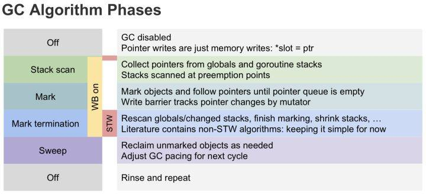
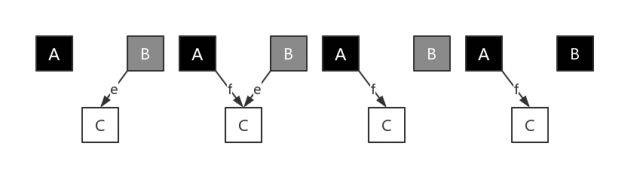
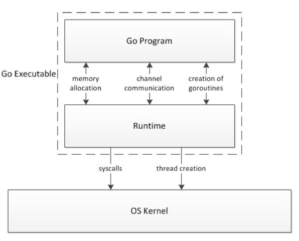
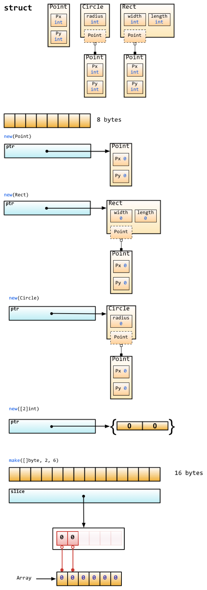

# GoLang 面试题收集

- [GoLang 面试题收集](#golang-%e9%9d%a2%e8%af%95%e9%a2%98%e6%94%b6%e9%9b%86)
	- [协程](#%e5%8d%8f%e7%a8%8b)
		- [select 是随机的还是顺序的?](#select-%e6%98%af%e9%9a%8f%e6%9c%ba%e7%9a%84%e8%bf%98%e6%98%af%e9%a1%ba%e5%ba%8f%e7%9a%84)
		- [简述一下 golang 的协程调度原理?](#%e7%ae%80%e8%bf%b0%e4%b8%80%e4%b8%8b-golang-%e7%9a%84%e5%8d%8f%e7%a8%8b%e8%b0%83%e5%ba%a6%e5%8e%9f%e7%90%86)
			- [M(machine)](#mmachine)
			- [P(processor)](#pprocessor)
			- [G(goroutine)](#ggoroutine)
	- [GC](#gc)
		- [Golang GC 发展](#golang-gc-%e5%8f%91%e5%b1%95)
		- [经典的 GC 算法](#%e7%bb%8f%e5%85%b8%e7%9a%84-gc-%e7%ae%97%e6%b3%95)
			- [引用计数(reference counting)](#%e5%bc%95%e7%94%a8%e8%ae%a1%e6%95%b0reference-counting)
				- [描述](#%e6%8f%8f%e8%bf%b0)
				- [优点](#%e4%bc%98%e7%82%b9)
				- [缺点](#%e7%bc%ba%e7%82%b9)
			- [标记-清扫(mark & sweep)](#%e6%a0%87%e8%ae%b0-%e6%b8%85%e6%89%abmark--sweep)
				- [描述](#%e6%8f%8f%e8%bf%b0-1)
				- [优点](#%e4%bc%98%e7%82%b9-1)
				- [缺点](#%e7%bc%ba%e7%82%b9-1)
			- [节点复制(Copying Garbage Collection)](#%e8%8a%82%e7%82%b9%e5%a4%8d%e5%88%b6copying-garbage-collection)
				- [描述](#%e6%8f%8f%e8%bf%b0-2)
				- [优点](#%e4%bc%98%e7%82%b9-2)
			- [分代收集(Generational Garbage Collection)](#%e5%88%86%e4%bb%a3%e6%94%b6%e9%9b%86generational-garbage-collection)
				- [优点](#%e4%bc%98%e7%82%b9-3)
				- [缺点](#%e7%bc%ba%e7%82%b9-2)
		- [三色标记算法](#%e4%b8%89%e8%89%b2%e6%a0%87%e8%ae%b0%e7%ae%97%e6%b3%95)
			- [屏障技术](#%e5%b1%8f%e9%9a%9c%e6%8a%80%e6%9c%af)
			- [插入屏障](#%e6%8f%92%e5%85%a5%e5%b1%8f%e9%9a%9c)
			- [删除屏障](#%e5%88%a0%e9%99%a4%e5%b1%8f%e9%9a%9c)
			- [混合写屏障](#%e6%b7%b7%e5%90%88%e5%86%99%e5%b1%8f%e9%9a%9c)
	- [runtime](#runtime)
		- [介绍](#%e4%bb%8b%e7%bb%8d)
		- [如何获取 go 程序运行时的协程数量, gc 时间, 对象数, 堆栈信息?](#%e5%a6%82%e4%bd%95%e8%8e%b7%e5%8f%96-go-%e7%a8%8b%e5%ba%8f%e8%bf%90%e8%a1%8c%e6%97%b6%e7%9a%84%e5%8d%8f%e7%a8%8b%e6%95%b0%e9%87%8f-gc-%e6%97%b6%e9%97%b4-%e5%af%b9%e8%b1%a1%e6%95%b0-%e5%a0%86%e6%a0%88%e4%bf%a1%e6%81%af)
	- [调试 golang 的 bug 以及性能问题](#%e8%b0%83%e8%af%95-golang-%e7%9a%84-bug-%e4%bb%a5%e5%8f%8a%e6%80%a7%e8%83%bd%e9%97%ae%e9%a2%98)
	- [make 和 new](#make-%e5%92%8c-new)
		- [new](#new)
		- [make](#make)
		- [例图](#%e4%be%8b%e5%9b%be)
	- [面试题参考](#%e9%9d%a2%e8%af%95%e9%a2%98%e5%8f%82%e8%80%83)
		- [defer 与 recover](#defer-%e4%b8%8e-recover)
		- [range](#range)
			- [range 的坑](#range-%e7%9a%84%e5%9d%91)
		- [go 执行的随机性和闭包](#go-%e6%89%a7%e8%a1%8c%e7%9a%84%e9%9a%8f%e6%9c%ba%e6%80%a7%e5%92%8c%e9%97%ad%e5%8c%85)
		- [组合继承](#%e7%bb%84%e5%90%88%e7%bb%a7%e6%89%bf)
		- [select 随机性](#select-%e9%9a%8f%e6%9c%ba%e6%80%a7)
		- [make 默认值和 append](#make-%e9%bb%98%e8%ae%a4%e5%80%bc%e5%92%8c-append)
		- [线程安全](#%e7%ba%bf%e7%a8%8b%e5%ae%89%e5%85%a8)
		- [chan 缓存池](#chan-%e7%bc%93%e5%ad%98%e6%b1%a0)
		- [Go 方法集](#go-%e6%96%b9%e6%b3%95%e9%9b%86)
		- [interface](#interface)
			- [interface 内部结构](#interface-%e5%86%85%e9%83%a8%e7%bb%93%e6%9e%84)
			- [interface 引用与指针](#interface-%e5%bc%95%e7%94%a8%e4%b8%8e%e6%8c%87%e9%92%88)
		- [type](#type)
		- [函数返回值命名](#%e5%87%bd%e6%95%b0%e8%bf%94%e5%9b%9e%e5%80%bc%e5%91%bd%e5%90%8d)
		- [函数返回值和 defer](#%e5%87%bd%e6%95%b0%e8%bf%94%e5%9b%9e%e5%80%bc%e5%92%8c-defer)
		- [new](#new-1)
		- [append](#append)
		- [结构体比较](#%e7%bb%93%e6%9e%84%e4%bd%93%e6%af%94%e8%be%83)
		- [函数返回值类型](#%e5%87%bd%e6%95%b0%e8%bf%94%e5%9b%9e%e5%80%bc%e7%b1%bb%e5%9e%8b)
		- [iota](#iota)
		- [变量简短模式](#%e5%8f%98%e9%87%8f%e7%ae%80%e7%9f%ad%e6%a8%a1%e5%bc%8f)
		- [常量](#%e5%b8%b8%e9%87%8f)
		- [goto](#goto)
		- [Go 1.9 新特性 Type Alias](#go-19-%e6%96%b0%e7%89%b9%e6%80%a7-type-alias)
		- [变量作用域](#%e5%8f%98%e9%87%8f%e4%bd%9c%e7%94%a8%e5%9f%9f)
		- [闭包延迟求值](#%e9%97%ad%e5%8c%85%e5%bb%b6%e8%bf%9f%e6%b1%82%e5%80%bc)
		- [闭包引用相同变量](#%e9%97%ad%e5%8c%85%e5%bc%95%e7%94%a8%e7%9b%b8%e5%90%8c%e5%8f%98%e9%87%8f)
		- [算法实例](#%e7%ae%97%e6%b3%95%e5%ae%9e%e4%be%8b)
		- [channel](#channel)
		- [fmt.Sprintf](#fmtsprintf)
		- [编码长度](#%e7%bc%96%e7%a0%81%e9%95%bf%e5%ba%a6)
		- [map](#map)
		- [WaitGroup](#waitgroup)

## 协程

### select 是随机的还是顺序的?

select 会**随机**选择一个可用通道做收发操作

### 简述一下 golang 的协程调度原理?

M、P、G

#### M(machine)

代表着真正的执行计算资源，可以认为它就是 **os thread**（**系统线程**）。

M 可以运行两种代码:

- go 代码, 即 goroutine, **M 运行 go 代码需要一个 P**
- 原生代码, 例如阻塞的 syscall, **M 运行原生代码不需要 P**

M 会从运行队列中取出 G, 然后运行 G, 如果 G 运行完毕或者进入休眠状态, 则从运行队列中取出下一个 G 运行, 周而复始。

有时候 G 需要调用一些无法避免阻塞的原生代码, 这时 M 会释放持有的 P 并进入阻塞状态, 其他 M 会取得这个 P 并继续运行队列中的 G。

go 需要保证有足够的 M 可以运行 G, 不让 CPU 闲着, 也需要保证 M 的数量不能过多.

**M 的状态**：

M 并没有像 G 和 P 一样的状态标记, 但可以认为一个 M 有以下的状态:

- **自旋中(spinning)**: M 正在从运行队列获取 G, 这时候 M 会拥有一个 P
- **执行 go 代码中**: M 正在执行 go 代码, 这时候 M 会拥有一个 P
- **执行原生代码中**: M 正在执行原生代码或者阻塞的 syscall, 这时 M 并不拥有 P
- **休眠中**: M 发现无待运行的 G 时会进入休眠, 并添加到空闲 M 链表中, 这时 M 并不拥有 P

自旋中(spinning)这个状态非常重要, 是否需要唤醒或者创建新的 M 取决于当前自旋中的 M 的数量.

#### P(processor)

表示逻辑 processor，是线程 M 的执行的上下文，**代表 M 运行 G 所需要的资源**。

一些讲解协程的文章把 P 理解为 cpu 核心, 其实这是错误的。

虽然 P 的数量默认等于 cpu 核心数, 但可以通过环境变量 GOMAXPROC 修改, 在实际运行时 P 跟 cpu 核心并无任何关联.

P 也可以理解为控制 go 代码的并行度的机制,如果 P 的数量等于 1, 代表当前最多只能有一个线程(M)执行 go 代码,如果 P 的数量等于 2, 代表当前最多只能有两个线程(M)执行 go 代码。

执行原生代码的线程数量不受 P 控制。

因为同一时间只有一个线程(M)可以拥有 P, P 中的数据都是锁自由(lock free)的, 读写这些数据的效率会非常的高.

**P 的状态**：

- **空闲中(\_Pidle)**: 当 M 发现无待运行的 G 时会进入休眠, 这时 M 拥有的 P 会变为空闲并加到空闲 P 链表中
- **运行中(\_Prunning)**: 当 M 拥有了一个 P 后, 这个 P 的状态就会变为运行中, M 运行 G 会使用这个 P 中的资源
- **系统调用中(\_Psyscall)**: 当 go 调用原生代码, 原生代码又反过来调用 go 代码时, 使用的 P 会变为此状态
- **GC 停止中(\_Pgcstop)**: 当 gc STW 时, P 会变为此状态
- **已中止(\_Pdead)**: 当 P 的数量在运行时改变, 且数量减少时多余的 P 会变为此状态

#### G(goroutine)

调度系统的最基本单位 goroutine，goroutine 可以解释为受管理的轻量线程, 存储了 goroutine 的执行 stack 信息、goroutine 状态以及 goroutine 的任务函数等。 goroutine 使用 go 关键词创建。

**G 的状态**：

- **空闲中(\_Gidle)**: 表示 G 刚刚新建, 仍未初始化
- **待运行(\_Grunnable)**: 表示 G 在运行队列中, 等待 M 取出并运行
- **运行中(\_Grunning)**: 表示 M 正在运行这个 G, 这时候 M 会拥有一个 P
- **系统调用中(\_Gsyscall)**: 表示 M 正在运行这个 G 发起的系统调用, 这时候 M 并不拥有 P
- **等待中(\_Gwaiting)**: 表示 G 在等待某些条件完成, 这时候 G 不在运行也不在运行队列中(可能在 channel 的等待队列中)
- **已中止(\_Gdead)**: 表示 G 未被使用, 可能已执行完毕(并在 freelist 中等待下次复用)
- **栈复制中(\_Gcopystack)**: 表示 G 正在获取一个新的栈空间并把原来的内容复制过去(用于防止 GC 扫描)

---

## GC

### Golang GC 发展

Golang 中的垃圾回收主要应用三色标记法，GC 过程和其他用户 goroutine 可并发运行，但需要一定时间的 STW(stop the world)，STW 的过程中，CPU 不执行用户代码，全部用于垃圾回收，这个过程的影响很大，Golang 进行了多次的迭代优化来解决这个问题。

- v1.1 STW
- v1.3 Mark STW, Sweep 并行
- v1.5 三色标记法。回收过程主要有四个阶段，其中，标记和清扫都并发执行的，但标记阶段的前后需要 STW 一定时间来做 GC 的准备工作和栈的 re-scan。
  1. Sweep Termination: 收集根对象，清扫上一轮未清扫完的 span，启用写屏障和辅助 GC，辅助 GC 是将一定量的标记和清扫工作交给用户 goroutine 来执行。
  2. Mark: 扫描所有根对象和根对象可以到达的对象，并标记它们
  3. Mark Termination: 完成标记工作，重新扫描部分根对象(要求 STW)，关闭写屏障和辅助 GC
  4. Sweep: 按标记结果清扫对象



- v1.8 hybrid write barrier(混合写屏障：优化 STW)，避免了对栈 re-scan 的过程，极大的减少了 STW 的时间

### 经典的 GC 算法

#### 引用计数(reference counting)

##### 描述

引用计数的思想非常简单：每个单元维护一个域，保存其它单元指向它的引用数量（类似有向图的入度）。当引用数量为 0 时，将其回收。引用计数是渐进式的，能够将内存管理的开销分布到整个程序之中。

引用计数算法实现一般是把所有的单元放在一个单元池里，比如类似 free list。

##### 优点

1. **渐进式**。内存管理与用户程序的执行交织在一起，将 GC 的代价分散到整个程序。不像标记-清扫算法需要 STW (Stop The World，GC 的时候挂起用户程序)。
2. 算法**易于实现**。
3. 内存单元能够**很快被回收**。相比于其他垃圾回收算法，堆被耗尽或者达到某个阈值才会进行垃圾回收。

##### 缺点

1. **原始的引用计数不能处理循环引用**。大概这是被诟病最多的缺点了。不过针对这个问题，也除了很多解决方案，比如强引用等。
2. **维护引用计数降低运行效率**。内存单元的更新删除等都需要维护相关的内存单元的引用计数，相比于一些追踪式的垃圾回收算法并不需要这些代价。
3. **单元池 free list 实现的话不是 cache-friendly 的**，这样会导致频繁的 cache miss，**降低程序运行效率**。

#### 标记-清扫(mark & sweep)

##### 描述

标记-清扫算法是第一种**自动内存管理**，**基于追踪**的垃圾收集算法。

内存单元并不会在变成垃圾立刻回收，而是保持不可达状态，直到到达某个阈值或者固定时间长度。这个时候系统会挂起用户程序，也就是 STW，转而执行垃圾回收程序。垃圾回收程序对所有的存活单元进行一次全局遍历确定哪些单元可以回收。算法分两个部分：标记（mark）和清扫（sweep）。标记阶段表明所有的存活单元，清扫阶段将垃圾单元回收。可视化可以参考下图。


##### 优点

标记-清扫算法的优点也就是基于追踪的垃圾回收算法具有的优点：**避免了引用计数算法的缺点（不能处理循环引用，需要维护指针）**。

##### 缺点

缺点也很明显，**需要 STW**。

#### 节点复制(Copying Garbage Collection)

##### 描述

节点复制也是**基于追踪的算法**。其将整个堆等分为两个半区（semi-space），一个包含现有数据，另一个包含已被废弃的数据。节点复制式垃圾收集从切换（flip）两个半区的角色开始，然后收集器在老的半区，也就是 Fromspace 中遍历存活的数据结构，在第一次访问某个单元时把它复制到新半区，也就是 Tospace 中去。在 Fromspace 中所有存活单元都被访问过之后，收集器在 Tospace 中建立一个存活数据结构的副本，用户程序可以重新开始运行了。

##### 优点

1. 所有存活的数据结构都缩并地排列在 Tospace 的底部，这样就**不会存在内存碎片**的问题。
2. **获取新内存可以简单地通过递增自由空间指针来实现**。

缺点

1. 内存得不到充分利用，总有一半的内存空间处于浪费状态。

#### 分代收集(Generational Garbage Collection)

**基于追踪的垃圾回收算法（标记-清扫、节点复制）一个主要问题是在生命周期较长的对象上浪费时间（长生命周期的对象是不需要频繁扫描的）**。同时，内存分配存在这么一个事实 “most object die young”。基于这两点，**分代垃圾回收算法将对象按生命周期长短存放到堆上的两个（或者更多）区域**，这些区域就是分代（generation）。对于新生代的区域的垃圾回收频率要明显高于老年代区域。

分配对象的时候从新生代里面分配，如果后面发现对象的生命周期较长，则将其移到老年代，这个过程叫做 promote。随着不断 promote，最后新生代的大小在整个堆的占用比例不会特别大。收集的时候集中主要精力在新生代就会相对来说效率更高，STW 时间也会更短。

##### 优点

性能更优。

##### 缺点

实现复杂

### 三色标记算法

三色标记算法是对标记阶段的改进，原理如下：

1. 起初所有对象都是白色。
2. 从根出发扫描所有**可达对象，标记为灰色**，放入待处理队列。
3. 从队列取出灰色对象，将其引用对象标记为灰色放入队列，自身标记为黑色。
4. 重复 3，直到灰色对象队列为空。此时白色对象即为垃圾，进行回收。


三色标记的一个明显好处是能够让用户程序和 mark 并发的进行。具体可以参考论文：《On-the-fly garbage collection: an exercise in cooperation.》。Golang 的 GC 实现也是基于这篇论文。

三色标记中，标记过程需的要 STW，因为对象引用关系如果在标记阶段做了修改，会影响标记结果的正确性。例如下图，灰色对象 B 中包含指向白色对象 C 的指针 e，对象 C 尚未被扫描，此时，如有其他程序，将 e 指针从 B 对象中删除，并将指向对象 C 的新指针 f 插入到黑色对象 A 中，由于对象 A 早已完成扫描，对象 C 就会一直保持白色状态直到被回收。



可以看出，一个白色对象被黑色对象引用，是注定无法通过这个黑色对象来保证自身存活的，与此同时，如果所有能到达它的灰色对象与它之间的可达关系全部遭到破坏，那么这个白色对象必然会被视为垃圾清除掉。故当上述两个条件同时满足时，就会出现对象丢失的问题。

如果这个白色对象下游还引用了其他对象，并且这条路径是指向下游对象的唯一路径，那么他们也是必死无疑的。

为了防止这种现象的发生，最简单的方式就是 STW，直接禁止掉其他用户程序对对象引用关系的干扰，但是 STW 的过程有明显的资源浪费，对所有的用户程序都有很大影响，如何能在保证对象不丢失的情况下合理的尽可能的提高 GC 效率，减少 STW 时间呢？

在 Golang 中使用并发的垃圾回收，也就是多个赋值器与回收器并发执行，与此同时，应用屏障技术来保证回收器的正确性。其原理主要就是破坏上述两个条件之一。

#### 屏障技术

当回收器满足下面两种情况之一时，即可保证不会出现对象丢失问题。

- **弱三色不变式**：所有被黑色对象引用的白色对象都处于灰色保护状态（直接或间接从灰色对象可达）。
- **强三色不变式**：不存在黑色对象到白色对象的指针。

强三色不变式很好理解，强制性的不允许黑色对象引用白色对象即可。而弱三色不变式中，黑色对象可以引用白色对象，但是这个白色对象仍然存在其他灰色对象对它的引用，或者可达它的链路上游存在灰色对象。

三色抽象除了可以用于描述对象的状态的，还可用来描述赋值器的状态，如果一个赋值器已经被回收器扫描完成，则认为它是黑色的赋值器，如果尚未扫描过或者还需要重新扫描，则认为它是灰色的赋值器。在强三色不变式中，黑色赋值器只存在到黑色对象或灰色对象的指针，因为此时所有黑色对象到白色对象的引用都是被禁止的。 在弱三色不变式中，黑色赋值器允许存在到白色对象的指针，但这个白色对象是被保护的。上述这些可以通过屏障技术来保证。

#### 插入屏障

**插入屏障拦截将白色指针插入黑色对象的操作，标记其对应对象为灰色状态**，这样就不存在黑色对象引用白色对象的情况了，满足强三色不变式，如上图例中，在插入指针 f 时将 C 对象标记为灰色。Go1.5 版本使用的 Dijkstra 写屏障就是这个原理，伪代码如下：

```text
writePointer(slot, ptr):
    shade(ptr)
    *slot = ptr
```

在 Golang 中，对栈上指针的写入添加写屏障的成本很高，所以 Go 选择仅对堆上的指针插入增加写屏障，这样就会出现在扫描结束后，栈上仍存在引用白色对象的情况，这时的栈是灰色的，不满足三色不变式，所以**需要对栈进行重新扫描使其变黑，完成剩余对象的标记，这个过程需要 STW**。这期间会将所有 goroutine 挂起，当有大量应用程序时，时间可能会达到 10 ～ 100ms。

#### 删除屏障

**删除屏障也是拦截写操作的，但是是通过保护灰色对象到白色对象的路径不会断来实现的**。如上图例中，在删除指针 e 时将对象 C 标记为灰色，这样 C 下游的所有白色对象，即使会被黑色对象引用，最终也还是会被扫描标记的，满足了弱三色不变式。这种方式的回收精度低，一个对象即使被删除了最后一个指向它的指针也依旧可以活过这一轮，在下一轮 GC 中被清理掉。Yuasa 屏障伪代码如下：

```text
writePointer(slot, ptr):
    if (isGery(slot) || isWhite(slot))
        shade(*slot)
    *slot = ptr
```

在这种实现方式中，回收器悲观的认为所有被删除的对象都可能会被黑色对象引用。

#### 混合写屏障

插入屏障和删除屏障各有优缺点，Dijkstra 的插入写屏障在标记开始时无需 STW，可直接开始，并发进行，但结束时需要 STW 来重新扫描栈，标记栈上引用的白色对象的存活；Yuasa 的删除写屏障则需要在 GC 开始时 STW 扫描堆栈来记录初始快照，这个过程会保护开始时刻的所有存活对象，但结束时无需 STW。Go1.8 版本引入的混合写屏障结合了 Yuasa 的删除写屏障和 Dijkstra 的插入写屏障，结合了两者的优点，伪代码如下：

```text
writePointer(slot, ptr):
    shade(*slot)
    if current stack is grey:
        shade(ptr)
    *slot = ptr
```

这里使用了两个 shade 操作，shade(\*slot)是删除写屏障的变形，例如，一个堆上的灰色对象 B，引用白色对象 C，在 GC 并发运行的过程中，如果栈已扫描置黑，而赋值器将指向 C 的唯一指针从 B 中删除，并让栈上其他对象引用它，这时，写屏障会在删除指向白色对象 C 的指针的时候就将 C 对象置灰，就可以保护下来了，且它下游的所有对象都处于被保护状态。 如果对象 B 在栈上，引用堆上的白色对象 C，将其引用关系删除，且新增一个黑色对象到对象 C 的引用，那么就需要通过 shade(ptr)来保护了，在指针插入黑色对象时会触发对对象 C 的置灰操作。如果栈已经被扫描过了，那么栈上引用的对象都是灰色或受灰色保护的白色对象了，所以就没有必要再进行这步操作。

Golang 中的混合写屏障满足的是变形的弱三色不变式，同样允许黑色对象引用白色对象，白色对象处于灰色保护状态，但是只由堆上的灰色对象保护。由于结合了 Yuasa 的删除写屏障和 Dijkstra 的插入写屏障的优点，只需要在开始时并发扫描各个 goroutine 的栈，使其变黑并一直保持，这个过程不需要 STW，而标记结束后，因为栈在扫描后始终是黑色的，也无需再进行 re-scan 操作了，减少了 STW 的时间。

---

## runtime

### 介绍

**Runtime 负责管理任务调度，垃圾收集及运行环境**。同时，Go 提供了一些高级的功能，如 goroutine, channel, 以及 Garbage collection。这些高级功能需要一个 runtime 的支持. runtime 和用户编译后的代码被 linker 静态链接起来，形成一个可执行文件。这个文件从操作系统角度来说是一个 user space 的独立的可执行文件。 **从运行的角度来说，这个文件由 2 部分组成，一部分是用户的代码，另一部分就是 runtime**。runtime 通过接口函数调用来管理 goroutine, channel 及其他一些高级的功能。从用户代码发起的调用操作系统 API 的调用都会被 runtime 拦截并处理。

Go runtime 的一个重要的组成部分是 goroutine scheduler。他负责追踪，调度每个 goroutine 运行，实际上是从应用程序的 process 所属的 thread pool 中分配一个 thread 来执行这个 goroutine。因此，和 java 虚拟机中的 Java thread 和 OS thread 映射概念类似，每个 goroutine 只有分配到一个 OS thread 才能运行。



### 如何获取 go 程序运行时的协程数量, gc 时间, 对象数, 堆栈信息?

调用接口 **runtime.ReadMemStats** 可以获取以上所有信息, 注意: 调用此接口会触发 STW(Stop The World)

如果需要打入到日志系统, 可以使用 go 封装好的包, 输出 json 格式. 参考:

1. https://golang.org/pkg/expvar/
2. http://blog.studygolang.com/2017/06/expvar-in-action/

更深入的用法就是将得到的运行时数据导入到 ES 内部, 然后使用 Kibana 做 golang 的运行时监控, 可以实时获取到运行的信息(堆栈, 对象数, gc 时间, goroutine, 总内存使用等等), [具体信息可以看 ReadMemStats 的那个结构体](https://golang.org/pkg/runtime/#MemStats)

---

## 调试 golang 的 bug 以及性能问题

1. panic 调用栈
2. pprof
3. 火焰图(配合压测)
4. 使用 go run -race 或者 go build -race 来进行竞争检测
5. 查看系统 磁盘 IO/网络 IO/内存占用/CPU 占用(配合压测)

---

## make 和 new

### new

new(T) 是为一个 T 类型的新值**分配空间**, 并将此空间**初始化**为 T 的**零值**, 并**返回**这块内存空间的**地址**, 也就是 T 类型的指针 \*T, 该指针指向 T 类型值占用的那块内存。(**new 返回指针**)

### make

make(T) **返回的是初始化之后的 T**, 且**只能用于 slice, map, channel** 三种类型. make(T, args) 返回初始化之后 T 类型的值, 且此新值并不是 T 类型的零值, 也不是 T 类型的指针 \*T, 而是 T 类型值经过**初始化之后**的**引用**。（**make 返回初始化后的（非零）值。**）

make 是 **引用类型** 初始化的方法。

### 例图



---

## 面试题参考

### defer 与 recover

- 多个 defer 执行顺序：**后进先出**

- defer、return、返回值三者的执行逻辑应该是：return 最先执行，return 负责将结果写入返回值中；接着 defer 开始执行一些收尾工作；最后函数携带当前返回值退出。

defer 函数的变量的值不受后边值修改的影响，如下边的例子：`defer fmt.Println(c)` 输出为 3

```go
func calc(index string, a, b int) int {
    ret := a + b
    fmt.Println(index, a, b, ret)
    return ret
}

func main() {
    a := 1
    b := 2
    c := 3
    defer fmt.Println(c)
    defer calc("1", a, calc("10", a, b))
    a = 0
    defer calc("2", a, calc("20", a, b))
    b = 1
    c = 4
}

//output
//10 1 2 3
//20 0 2 2
//2 0 2 2
//1 1 3 4
//3
```

- [code 参考 1](./code/exp_defer.go)
- [code 参考 2](./code/exp_defer1.go)

---

编译执行下面代码会出现什么?

```go
package main

import (
    "fmt"
)

func main()  {
    defer func() {
       if err:=recover();err!=nil{
           fmt.Println(err)
       }else {
           fmt.Println("fatal")
       }
    }()

    defer func() {
        panic("defer panic")
    }()
    panic("panic")
}

// output
// defer panic
```

**解析**：

触发 panic("panic")后顺序执行 defer，但是 defer 中还有一个 panic，所以覆盖了之前的 panic("panic")

### range

go 中的 range 关键字可用来遍历某个 slice 或 map，并通过两个参数(index 和 value)，分别获取到 slice 或 map 中某个元素所在的 index 以及值：

```go
for index, value := range mySlice {
    fmt.Println("index: " + index)
    fmt.Println("value: " + value)
}
```

#### range 的坑

如下述代码：

```go
type Foo struct {
    bar string
}

func main() {
    list := []Foo{
        {"A"},
        {"B"},
        {"C"},
    }

    list2 := make([]*Foo, len(list))
    for i, value := range list {
        list2[i] = &value
    }

    fmt.Println(list[0], list[1], list[2])
    fmt.Println(list2[0], list2[1], list2[2])
}

// 预期输出:
// {A} {B} {C}
// &{A} &{B} &{C}

// 实际输出
// {A} {B} {C}
// &{C} &{C} &{C}
```

**解释**：

- 在 for...range 循环中，Go 使用**值拷贝**的方式代替遍历元素本身，简单来说，就是 for…range 中那个**value，是一个值拷贝，而不是元素本身**。
- 当我们用&符号取元素地址时，实际上只是取到了 value 这个**临时变量的地址**，而非 list 真正的元素地址。
- 而在 range 的循环中，value 这个临时变量会被重用，所有，上面的例子中，list2 被填充了三个相同的地址，其实都是 value 的地址。而在最后一次循环中，value 被赋值为{c}。因此，list2 输出的时候显示出了三个&{c}。

正确替换如下：

```go
for i, _ := range list {
    list2[i] = &list[i]
}
//or
for i := 0; i < len(list); i++ {
    list2[i] = &list[i]
}
```

### go 执行的随机性和闭包

```go
func main() {
    runtime.GOMAXPROCS(1)
    wg := sync.WaitGroup{}
    wg.Add(20)
    for i := 0; i < 10; i++ {
        go func() {
            fmt.Print(" A:", i)
            wg.Done()
        }()
    }

    for i := 0; i < 10; i++ {
        go func(i int) {
            fmt.Print(" B:", i)
            wg.Done()
        }(i)
    }
    wg.Wait()
}

// output
// B:  9
// A:  10
// A:  10
// A:  10
// A:  10
// A:  10
// A:  10
// A:  10
// A:  10
// A:  10
// A:  10
// B:  0
// B:  1
// B:  2
// B:  3
// B:  4
// B:  5
// B:  6
// B:  7
// B:  8
```

**解释**：

- A:输出完全随机，取决于 goroutine 执行时 i 的值是多少；
- B:一定输出为 0~9，但顺序不定。

第一个 go func 中 i 是 for 的变量，地址不变，但是值在变化，第二个 go func 中 i 是函数参数，与外部 for 中的 i 是两个变量。尾部(i)将发生值拷贝，go func 内部指向值拷贝地址。

### 组合继承

```go
type People struct{}

func (p *People) ShowA() {
    fmt.Println("showA")
    p.ShowB()
}
func (p *People) ShowB() {
    fmt.Println("showB")
}

type Teacher struct {
    People
}

func (t *Teacher) ShowB() {
    fmt.Println("teacher showB")
}

func main() {
    t := Teacher{}
    t.ShowA()
}

// output：
// showA
// showB
```

**解释**：

OOP 继承相关内容，不重写父类函数，则直接使用父类的函数逻辑。

### select 随机性

```go
func main() {
    runtime.GOMAXPROCS(1)
    int_chan := make(chan int, 1)
    string_chan := make(chan string, 1)
    int_chan <- 1
    string_chan <- "hello"
    select {
    case value := <-int_chan:
        fmt.Println(value)
    case value := <-string_chan:
        panic(value)
    }
}
```

select 会随机选择一个可用通用做收发操作。

### make 默认值和 append

```go
func main() {
    s := make([]int, 5)
    s = append(s, 1, 2, 3)
    fmt.Println(s)
    str := make([]string, 5)
    str = append(str, "a", "b", "c")
    fmt.Println(str)
}

// output:
// [0 0 0 0 0 1 2 3]
// [     a b c]
```

make 会为变量填充默认数据

### 线程安全

下面的代码有什么问题?

```go
type UserAges struct {
	ages map[string]int
	sync.Mutex
}

func (ua *UserAges) Add(name string, age int) {
	ua.Lock()
  defer ua.Unlock()
  ua.ages = make(map[string]int)
	ua.ages[name] = age
}

func (ua *UserAges) Get(name string) int {
	if age, ok := ua.ages[name]; ok {
		return age
	}
	return -1
}
```

可能会出现`fatal error: concurrent map read and map write`. 修改一下看看效果

```go
func (ua *UserAges) Get(name string) int {
    ua.Lock()
    defer ua.Unlock()
    if age, ok := ua.ages[name]; ok {
        return age
    }
    return -1
}
```

### chan 缓存池

下面的迭代会有什么问题？

```go
func (set *threadSafeSet) Iter() <-chan interface{} {
	ch := make(chan interface{})
	go func() {
		set.RLock()

		for elem := range set.s {
			ch <- elem
		}

		close(ch)
		set.RUnlock()

	}()
	return ch
}
```

### Go 方法集

以下代码能编译过去吗？为什么？

```go
package main

import (
	"fmt"
)

type People interface {
	Speak(string) string
}

type Student struct{}

func (stu *Student) Speak(think string) (talk string) {
	if think == "bitch" {
		talk = "You are a good boy"
	} else {
		talk = "hi"
	}
	return
}

func main() {
	var peo People = Student{}
	think := "bitch"
	fmt.Println(peo.Speak(think))
}

/* output
cannot use Student literal (type Student) as type People1 in assignment:
  Student does not implement People1 (Speak method has pointer receiver) */
```

可做更改：

```go
// 去掉*
func (stu Student) Speak(think string) (talk string) {
	if think == "bitch" {
		talk = "You are a good boy"
	} else {
		talk = "hi"
	}
	return
}

// 或者
func main() {
	var peo People1 = new(Student)
	think := "bitch"
	fmt.Println(peo.Speak(think))
}
```

### interface

#### interface 内部结构

以下代码打印出来什么内容，说出为什么。

```go
package main

import (
	"fmt"
)

type People interface {
	Show()
}

type Student struct{}

func (stu *Student) Show() {

}

func live() People {
	var stu *Student
	return stu
}

func main() {
	if live() == nil {
		fmt.Println("AAAAAAA")
	} else {
		fmt.Println("BBBBBBB")
  }
  var test interface{}
	if test == nil {
		fmt.Println("CCCC")
	}
}
```

**考点**：

go 中的接口分为两种一种是空的接口类似这样：

```go
var in interface{}
```

另一种：

```
type People interface {
    Show()
}
```

它们的底层结构：

```go
type eface struct {      //空接口
    _type *_type         //类型信息
    data  unsafe.Pointer //指向数据的指针(go语言中特殊的指针类型unsafe.Pointer类似于c语言中的void*)
}
type iface struct {      //带有方法的接口
    tab  *itab           //存储type信息还有结构实现方法的集合
    data unsafe.Pointer  //指向数据的指针(go语言中特殊的指针类型unsafe.Pointer类似于c语言中的void*)
}
type _type struct {
    size       uintptr  //类型大小
    ptrdata    uintptr  //前缀持有所有指针的内存大小
    hash       uint32   //数据hash值
    tflag      tflag
    align      uint8    //对齐
    fieldalign uint8    //嵌入结构体时的对齐
    kind       uint8    //kind 有些枚举值kind等于0是无效的
    alg        *typeAlg //函数指针数组，类型实现的所有方法
    gcdata    *byte
    str       nameOff
    ptrToThis typeOff
}
type itab struct {
    inter  *interfacetype  //接口类型
    _type  *_type          //结构类型
    link   *itab
    bad    int32
    inhash int32
    fun    [1]uintptr      //可变大小 方法集合
}
```

可以看出 iface 比 eface 中间多了一层 itab 结构。 itab 存储\_type 信息和[]fun 方法集，从上面的结构我们就可得出，因为 data 指向了 nil 并不代表 interface 是 nil， 所以返回值并不为空，这里的 fun(方法集)定义了接口的接收规则，在编译的过程中需要验证是否实现接口 结果：

```text
BBBBBBB
CCCC
```

#### interface 引用与指针

ABCD 中哪一行存在错误？

```go
type S struct {
}

func f(x interface{}) {
}

func g(x *interface{}) {
}

func main() {
	s := S{}
	p := &s
	f(s) //A
	g(s) //B
	f(p) //C
	g(p) //D

}

// output：B,D都不行
// cannot use s (type S) as type *interface {} in argument to g: *interface {} is pointer to interface, not interface
// cannot use p (type *S) as type *interface {} in argument to g: *interface {} is pointer to interface, not interface
```

**解析**：

看到这道题需要第一时间想到的是 Golang 是强类型语言，interface 是所有 golang 类型的父类，类似 Java 的 Object。 函数中`func f(x interface{})`的 **interface{}可以支持传入 golang 的任何类型，包括指针**，但是函数`func g(x *interface{})`只能接受\*interface{}.

### type

是否可以编译通过？如果通过，输出什么？

```go
func main() {
	i := GetValue()

	switch i.(type) {
	case int:
    println("int")
    i1, err := i.(int) //转int
		fmt.Println(i1+2, err)
	case string:
		println("string")
	case interface{}:
		println("interface")
	default:
		println("unknown")
	}

}

func GetValue() int {
	return 1
}

// output：
// cannot type switch on non-interface value i (type int)
```

编译失败，type 只能使用在 interface

修改如下：

```go
func GetValue() interface{} {
	return 1
}
```

### 函数返回值命名

下面函数有什么问题？

```go
func funcMui(x,y int)(sum int,error){
    return x+y,nil
}
```

**解析**：

- 在函数有**多个返回值**时，只要**有一个返回值有指定命名**，**其他的也必须有命名**；
- 如果返回值**有多个返回值**必须**加上括号**；
- 如果只有**一个返回值**并且**有命名**也需要**加上括号**。

### 函数返回值和 defer

是否可以编译通过？如果通过，输出什么？

```go
package main

import "fmt"

func main() {

	println(DeferFunc1(1))
	println(DeferFunc2(1))
	println(DeferFunc3(1))
	println(DeferFunc4())
	println(DeferFunc5())
	println(DeferFunc6())
}

func DeferFunc1(i int) (t int) {
	t = i
	defer func() {
		t += 3
	}()
	return t
}

//t = 1
//return t ==> return 1
//t+3=4
func DeferFunc2(i int) int {
	t := i
	defer func() {
		t += 3
	}()
	return t
}

func DeferFunc3(i int) (t int) {
	defer func() {
		t += i
	}()
	return 2
}

func DeferFunc4() (r int) {
	t := 5
	defer func() {
		t = t + 5
	}()
	return t
}

// 此处闭包是r的传值
// 返回值的r与defer的r不相同
//地址分别为：0xc00000a0c8，0xc00000a100
func DeferFunc5() (r int) {
	fmt.Println(&r)
	defer func(r int) {
		r = r + 5
		fmt.Println(&r)
	}(r)
	return 1
}

// 此处闭包是r的引用
//此处两个r地址相同
func DeferFunc6() (r int) {
	fmt.Println(&r)
	defer func() {
		r = r + 5
		fmt.Println(&r)
	}()
	return 1
}

// output：
// 4
// 1
// 3
// 5
// 1
// 6
// 0xc00000a0c8
// 0xc00000a100
// 0xc00000a108
// 0xc00000a108

```

**解析**：

**return xxx 这一条语句并不是一条原子指令!**

**上述函数执行步骤**：

```go
defer func
return value

// 上述形式可转换为：
value = xxxx
defer func
return

```

### new

是否可以编译通过？如果通过，输出什么？

```go
func main() {
	list := new([]int)
	list = append(list, 1)
	fmt.Println(list)
}
```

**解析**：**slice，map，channel 使用 make**

改为：

```go
func main() {
	list:=make([]int,0)
	list = append(list, 1)
	fmt.Println(list)
}
```

or：

```go
package main

import "fmt"

func main() {
	s1 := new([]int)
	s2 := []int{1}
	s1 = &s2
	fmt.Println(*s1)
}
```

### append

是否可以编译通过？如果通过，输出什么？

```go
package main

import "fmt"

func main() {
	s1 := []int{1, 2, 3}
	s2 := []int{4, 5}
	s1 = append(s1, s2)
	fmt.Println(s1)
}
```

**解析**：`func append(slice []Type, elems ...Type) []Type`

改为可变长参数：

```go
package main

import "fmt"

func main() {
	s1 := []int{1, 2, 3}
	s2 := []int{4, 5}
	s1 = append(s1, s2...)
	fmt.Println(s1)
}
```

### 结构体比较

是否可以编译通过？如果通过，输出什么？

```go
func main() {
	sn1 := struct {
		age  int
		name string
	}{age: 11, name: "qq"}
	sn2 := struct {
		age  int
		name string
	}{age: 11, name: "qq"}
	sn3 := struct {
		name string
		age  int
	}{name: "qq", age: 11}

	if sn1 == sn2 {
		fmt.Println("sn1 == sn2")
	}
	if sn1 == sn3 {
		fmt.Println("sn1 == sn3")
	}
	sm1 := struct {
		age int
		m   map[string]string
	}{age: 11, m: map[string]string{"a": "1"}}
	sm2 := struct {
		age int
		m   map[string]string
	}{age: 11, m: map[string]string{"a": "1"}}

	if sm1 == sm2 {
		fmt.Println("sm1 == sm2")
	}
}

// output：
// invalid operation: sn1 == sn3 (mismatched types struct { age int; name string } and struct { name string; age int })
// invalid operation: sm1 == sm2 (struct containing map[string]string cannot be compared)
```

**解析**：

- 结构体存在**不可比较类型**，如**map**，**slice**，无法编译通过，chan 可以
- 只有相同类型的结构体(完全一致)才可以比较，结构体是否相同与**属性名称**，**类型个数**，**属性顺序**等相关。

可以使用 reflect.DeepEqual 进行比较

```go
if reflect.DeepEqual(sn1, sm) {
    fmt.Println("sn1 ==sm")
}else {
    fmt.Println("sn1 !=sm")
}
```

### 函数返回值类型

是否可以编译通过？如果通过，输出什么？

```go
func GetValue(m map[int]string, id int) (string, bool) {
	if _, exist := m[id]; exist {
		return "存在数据", true
	}
	return nil, false
}
func main()  {
	intmap:=map[int]string{
		1:"a",
		2:"bb",
		3:"ccc",
	}

	v,err:=GetValue(intmap,3)
	fmt.Println(v,err)
}

/* output：
cannot use nil as type string in return argument */
```

**解析**：

nil 可用作 interface，function，pointer，map，slice 和 channel 的“空值”。

### iota

是否可以编译通过？如果通过，输出什么？

```go
const (
	x = iota
	y
	z = "zz"
	k
	p = iota
)

func main()  {
	fmt.Println(x,y,z,k,p)
}

/* output:
0 1 zz zz 4 */
```

**解析**：

1. iota 是 golang 语言的常量计数器,只能在**常量的表达式中使用**；
2. iota**在 const 关键字出现时将被重置为 0**(const 内部的第一行之前)；
3. const 中每新增一行常量声明将使 iota 计数一次(iota 可理解为 const 语句块中的行索引)。
4. 中间插队

```go
const (
    i = iota
    j = 3.14
    k = iota
    l
)

// 那么打印出来的结果是
// i=0,j=3.14,k=2,l=3

const (
    i = iota
    j = 3.14
    k
    l
)

// 那么打印出来的结果是
// i=0,j=3.14,k=3.14,l=3.14

const (
	i1 = iota
	j1
	_
	_
	k2
	l1
)

// 那么打印出来的结果是
// i1=0 j1=1 k2=4 l1=5

```

5. 定义在一行的情况

```go
const (
    Apple, Banana = iota + 1, iota + 2
    Cherimoya, Durian
    Elderberry, Fig
)

/* output:
1 2
2 3
3 4 */
```

### 变量简短模式

编译执行下面代码会出现什么?

```go
package main
var(
    size :=1024
    max_size = size*2
)
func main()  {
    println(size,max_size)
}

// output：
// syntax error: unexpected :=, expecting =
```

**解析**：

- **定义变量同时显式初始化**
- **不能提供数据类型**
- 只能在**函数内部使用**

修改为：

```go
package main

var (
	size = 1024
	max_size = size * 2
)

func main() {
	println(size, max_size)
}
```

### 常量

下面函数有什么问题？

```go
package main
const cl  = 100

var bl    = 123

func main()  {
    println(&bl,bl)
    println(&cl,cl)
}

// output:
// cannot take the address of cl
```

**解析**：

常量不同于变量在运行期分配内存，常量通常会被编译器在预处理阶段直接展开，作为指令数据使用。

### goto

编译执行下面代码会出现什么?

```go
package main

func main()  {

    for i:=0;i<10 ;i++  {
    loop:
        println(i)
    }
    goto loop
}

// output
// goto loop jumps into block starting at .\exp_goto.go:5:22
```

**解析**：

**goto 不能跳转到其他函数或内层代码**

改为：

```go
func main() {
	var i int
loop:
	println(i)
	if i < 10 {
		i++
		goto loop
	}

}
```

### Go 1.9 新特性 Type Alias

编译执行下面代码会出现什么?

```go
package main
import "fmt"

func main()  {
    type MyInt1 int
    type MyInt2 = int
    var i int =9
    var i1 MyInt1 = i
    var i2 MyInt2 = i
    fmt.Println(i1,i2)
}

// output
// cannot use i (type int) as type MyInt1 in assignment
```

**解析**：

- 基于一个类型创建一个新类型，称之为 defintion；
- 基于一个类型创建一个别名，称之为 alias；
- MyInt1 为称之为 defintion，虽然底层类型为 int 类型，但是不能直接赋值，需要强转； MyInt2 称之为 alias，可以直接赋值。

改为：

```go
func main()  {
    type MyInt1 int
    type MyInt2 = int
    var i int =9
    var i1 MyInt1 = MyInt1(i)
    var i2 MyInt2 = i
    fmt.Println(i1,i2)
}
```

---

另一个例子：

编译执行下面代码会出现什么?

```go
package main
import "fmt"

type User struct {
}
type MyUser1 User
type MyUser2 = User
func (i MyUser1) m1(){
    fmt.Println("MyUser1.m1")
}
func (i User) m2(){
    fmt.Println("User.m2")
}

func main() {
    var i1 MyUser1
    var i2 MyUser2
    i1.m1()
    i1.m2()
    i2.m2()
}

// output：
// i1.m2 undefined (type MyUser1 has no field or method m2)
```

**解析**：

因为 MyUser2 完全等价于 User，所以具有其所有的方法，并且其中一个新增了方法，另外一个也会有。

但是 `i1.m2()` 是不能执行，MyUser1 是一个新类型，并没有定义 m2 方法

---

例子：

```go
package main

import "fmt"

type T1 struct {
}
func (t T1) m1(){
    fmt.Println("T1.m1")
}
type T2 = T1
type MyStruct struct {
    T1
    T2
}
func main() {
    my:=MyStruct{}
    my.m1()
}

// output
// ambiguous selector my.m1
```

**解析**：

结果不限于方法，字段也也一样；也不限于 type alias，type defintion 也是一样的，只要有重复的方法、字段，就会有这种提示，因为不知道该选择哪个。

改为：

```go
my.T1.m1()
my.T2.m1()
```

type alias 的定义，本质上是一样的类型，只是起了一个别名，源类型怎么用，别名类型也怎么用，保留源类型的所有方法、字段等。

### 变量作用域

编译执行下面代码会出现什么?

```go
package main

import (
    "errors"
    "fmt"
)

var ErrDidNotWork = errors.New("did not work")

func DoTheThing(reallyDoIt bool) (err error) {
    if reallyDoIt {
        result, err := tryTheThing()
        if err != nil || result != "it worked" {
            err = ErrDidNotWork
        }
    }
    return err
}

func tryTheThing() (string,error)  {
    return "",ErrDidNotWork
}

func main() {
    fmt.Println(DoTheThing(true))
    fmt.Println(DoTheThing(false))
}

// output：
// <nil>
// <nil>
```

**解析**：
因为 if 语句块内的 err 变量会遮罩函数作用域内的 err 变量

改为：

```go
func DoTheThing(reallyDoIt bool) (err error) {
    var result string
    if reallyDoIt {
        result, err = tryTheThing()
        if err != nil || result != "it worked" {
            err = ErrDidNotWork
        }
    }
    return err
}
```

### 闭包延迟求值

编译执行下面代码会出现什么?

```go
package main

func test() []func()  {
    var funs []func()
    for i:=0;i<2 ;i++  {
        funs = append(funs, func() {
            println(&i,i)
        })
    }
    return funs
}

func main(){
    funs:=test()
    for _,f:=range funs{
        f()
    }
}

// output：
// 0xc00000a038 2
// 0xc00000a038 2
```

**解析**：

for 循环复用局部变量 i，每一次放入匿名函数的应用都是同一个变量。

可改为：

```go
func test() []func()  {
    var funs []func()
    for i:=0;i<2 ;i++  {
        x:=i
        funs = append(funs, func() {
            println(&x,x)
        })
    }
    return funs
}
```

### 闭包引用相同变量

编译执行下面代码会出现什么?

```go
package main

func test(x int) (func(),func())  {
    return func() {
        println(x)
        x+=10
    }, func() {
        println(x)
    }
}

func main()  {
    a,b:=test(100)
    a()
    b()
}

// output：
// 100
// 110
```

### 算法实例

在 utf8 字符串判断是否包含指定字符串，并返回下标。 “北京天安门最美丽” , “天安门” 结果：2

```go
import (
	"fmt"
	"strings"
)

func main(){
	fmt.Println(Utf8Index("北京天安门最美丽", "天安门"))
	fmt.Println(strings.Index("北京天安门最美丽", "男"))
	fmt.Println(strings.Index("", "男"))
	fmt.Println(Utf8Index("12ws北京天安门最美丽", "天安门"))
}

func Utf8Index(str, substr string) int {
	asciiPos := strings.Index(str, substr)
	if asciiPos == -1 || asciiPos == 0 {
		return asciiPos
	}
	pos := 0
	totalSize := 0
	reader := strings.NewReader(str)
	for _, size, err := reader.ReadRune(); err == nil; _, size, err = reader.ReadRune() {
		totalSize += size
		pos++
		// 匹配到
		if totalSize == asciiPos {
			return pos
		}
	}
	return pos
}
```

---

实现一个单例

```go
package main

import "sync"

// 实现一个单例

type singleton struct{}

var ins *singleton
var mu sync.Mutex

//懒汉加锁:虽然解决并发的问题，但每次加锁是要付出代价的
func GetIns() *singleton {
	mu.Lock()
	defer mu.Unlock()

	if ins == nil {
		ins = &singleton{}
	}
	return ins
}

//双重锁:避免了每次加锁，提高代码效率
func GetIns1() *singleton {
	if ins == nil {
		mu.Lock()
		defer mu.Unlock()
		if ins == nil {
			ins = &singleton{}
		}
	}
	return ins
}

//sync.Once实现
var once sync.Once

func GetIns2() *singleton {
	once.Do(func() {
		ins = &singleton{}
	})
	return ins
}
```

---

反转一个整数，例如：

例子 1: x = 123, return 321

例子 2: x = -123, return -321

输入的整数要求是一个 32bit 有符号数，如果反转后溢出，则输出 0

```go
package main

import (
	"fmt"
	"math"
)

func main() {
	fmt.Println(reverse(1234567899))
	fmt.Println(reverse(12345))
	fmt.Println(reverse(-123))
}

func reverse(x int32) int32 {
	var num int64
	x64 := int64(x)
	for x64 != 0 {
		num = num*10 + x64%10
		x64 = x64 / 10
	}
	// 使用math包中的最大最小值
	if num > math.MaxInt32 || num < math.MinInt32 {
		return 0
	}
	return int32(num)
}

// output：
// 0
// 54321
// -321
```

---

合并重叠区间 给定一组 区间，合并所有重叠的 区间。

例如： 给定：[1,3],[2,6],[8,10],[15,18] 返回：[1,6],[8,10],[15,18]

```go
type Interval struct {
	Start int
	End   int
}

func merge(intervals []Interval) []Interval {
	if len(intervals) <= 1 {
		return intervals
	}

	sort.Slice(intervals, func(i, j int) bool {
		return intervals[i].Start < intervals[j].Start
	})

	res := make([]Interval, 0)
	swap := Interval{}
	for k, v := range intervals {
		if k == 0 {
			swap = v
			continue
		}
		if v.Start <= swap.End {
			swap.End = v.End
		} else {
			res = append(res, swap)
			swap = v
		}
	}
	res = append(res, swap)
	return res
}
```

### channel

执行下面的代码发生什么？

```go
package main

import (
	"fmt"
	"time"
)

func main() {
	ch := make(chan int, 1000)
	go func() {
		for i := 0; i < 10; i++ {
			ch <- i
		}
	}()
	go func() {
		for {
			a, ok := <-ch
			if !ok {
				fmt.Println("close")
				return
			}
			fmt.Println("a: ", a)
		}
	}()
	close(ch)
	fmt.Println("ok")
	time.Sleep(time.Second * 100)
}

// output:
// ok
// panic: send on closed channel
```

**解析**：

往已经关闭的 channel 写入数据会 panic 的。

### fmt.Sprintf

执行下面的代码发生什么？

```go
import "fmt"

type ConfigOne struct {
	Daemon string
}

func (c *ConfigOne) String() string {
	return fmt.Sprintf("print: %v", c)
}

func main() {
	c := &ConfigOne{}
	c.String()
}

// output
// runtime: goroutine stack exceeds 1000000000-byte limit
// fatal error: stack overflow
```

**解析**：

如果类型实现 String()，％v 和％+v 格式将使用 String()的值。因此，对该类型的 String()函数内的类型使用％v 会导致无限递归。编译报错：

```text
runtime: goroutine stack exceeds 1000000000-byte limit
fatal error: stack overflow
```

### 编码长度

输出什么？

```go
package main

import (
	"fmt"
)

func main() {
	fmt.Println(len("你好bj!"))
}

// output：
// 9
```

### map

编译并运行如下代码会发生什么？

```go
package main

import "fmt"

type Test struct {
	Name string
}

var list map[string]Test

func main() {

	list = make(map[string]Test)
	name := Test{"xiaoming"}
	list["name"] = name
	list["name"].Name = "Hello"
	fmt.Println(list["name"])
}

// output：
// cannot assign to struct field list["name"].Name in map
```

**解析**：

因为 list[“name”]不是一个普通的指针值，**map 的 value 本身是不可寻址的，因为 map 中的值会在内存中移动，并且旧的指针地址在 map 改变时会变得无效**。 定义的是 var list map[string]Test，注意哦 Test 不是指针，而且 map 我们都知道是可以自动扩容的，那么原来的存储 name 的 Test 可能在地址 A，但是如果 map 扩容了地址 A 就不是原来的 Test 了，所以 go 就不允许我们写数据。你改为 var list map[string]\*Test 试试看。

改为：

```go
var list map[string] *Test

func main() {

	list = make(map[string]*Test)
	name := Test{"xiaoming"}
	list["name"] = &name
	list["name"].Name = "Hello"
	fmt.Println(list["name"])
}
```

### WaitGroup

编译并运行如下代码会发生什么？

```go
package main

import (
	"sync"
	//"time"
)

const N = 10

var wg = &sync.WaitGroup{}

func main() {

	for i := 0; i < N; i++ {
		go func(i int) {
			wg.Add(1)
			println(i)
			defer wg.Done()
		}(i)
	}
	wg.Wait()
}
```

**解析**：

这是使用 WaitGroup 经常犯下的错误！多次运行就会发现输出都会不同甚至又出现报错的问题。 这是因为 go 执行太快了，导致 wg.Add(1)还没有执行 main 函数就执行完毕了。

改为：

```go
for i := 0; i < N; i++ {
        wg.Add(1)
		go func(i int) {
			println(i)
			defer wg.Done()
		}(i)
	}
	wg.Wait()
```

**参考**

> - [Go 夜读-Golang 语言](https://reading.developerlearning.cn/interview/interview-golang-language/)
> - [Golang 垃圾回收剖析](http://legendtkl.com/2017/04/28/golang-gc/)
> - [Golang 垃圾回收 屏障技术](https://juejin.im/post/5d383e65f265da1bc23fba82)
> - [Golang 源码探索(二) 协程的实现原理](https://www.cnblogs.com/zkweb/p/7815600.html)
> - [GoPkg - Package runtime](https://golang.org/pkg/runtime/#ReadMemStats)
> - [Go 中的 make 和 new 的区别](https://www.cnblogs.com/ghj1976/archive/2013/02/12/2910384.html)
> - [golang 使用 iota](https://studygolang.com/articles/2192)
