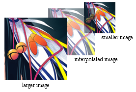
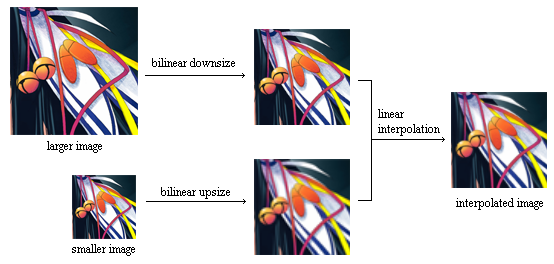
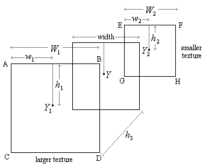

# 三线性插值图像缩放(Trilinear Interpolation Image Scaling)

## 原理介绍

三线性插值图像缩放是双线性插值图像缩放的扩展，与Mip mapping
 结合使用。使用此方法缩放图像需要两个大小不同的参考图像，其中一个仅为另一个的一半。三线性插值的目的是对不大于第一个图像且不小于另一个参考图像一半尺寸进行插值。
 

 
 简而言之，三线性插值图像缩放的工作原理是：**首先对较大图像进行双线性缩小，然后对较小图像进行双线性放大，最后对两个乘积进行线性插值以形成最终的插值图像。将其视为合并两个不同大小的图像**。
 

 
## 插值公式

三线性插值流程图，寻找插值像素Y：
 


参考上图，存在两中纹理，其中第一个由大的参考图像的像素ABCD决定，第二个由小的参考图像的像素EFGH界定。
要获得插值图像，需要执行三个步骤。首先，双线性缩小较大的图像；其次，双线性放大较小的参考图像，最后对两个图像进行线性插值。

第1步：


第2步：


第3步：


其次：


方程1和2代入3：


## 代码实现

```go
func trilinearImageScaling(larger, smaller image.Image, width,
	height int) image.Image {
	tmp := image.NewRGBA(image.Rect(0, 0, width, height))
	lw, lh := larger.Bounds().Dx(), larger.Bounds().Dy()
	sw, sh := smaller.Bounds().Dx(), smaller.Bounds().Dy()
	lw_ratio := float64(lw-1) / float64(width)
	lh_ratio := float64(lh-1) / float64(height)
	sw_ratio := float64(sw-1) / float64(width)
	sh_ratio := float64(sh-1) / float64(height)
	// 估算h3的距离
	h3_diff := float64(lw-width) / float64(lw-sw)

	for i := 0; i < height; i++ {
		for j := 0; j < width; j++ {
			// larger
			lx := int(lw_ratio * float64(j))
			ly := int(lh_ratio * float64(i))
			lw_diff := lw_ratio*float64(j) - float64(lx)
			lh_diff := lh_ratio*float64(i) - float64(ly)
			lr, lg, lb, la := larger.At(lx, ly).RGBA()
			lr1, lg1, lb1, la1 := larger.At(lx, ly+1).RGBA()
			lr2, lg2, lb2, la2 := larger.At(lx+1, ly).RGBA()
			lr3, lg3, lb3, la3 := larger.At(lx+1, ly+1).RGBA()

			// smaller
			sx := int(sw_ratio * float64(j))
			sy := int(sh_ratio * float64(i))
			sw_diff := sw_ratio*float64(j) - float64(sx)
			sh_diff := sh_ratio*float64(i) - float64(sy)
			sr, sg, sb, sa := larger.At(sx, sy).RGBA()
			sr1, sg1, sb1, sa1 := larger.At(sx, sy+1).RGBA()
			sr2, sg2, sb2, sa2 := larger.At(sx+1, sy).RGBA()
			sr3, sg3, sb3, sa3 := larger.At(sx+1, sy+1).RGBA()

			blue := float64(lb>>8)*(1-lw_diff)*(1-lh_diff)*(1-h3_diff) +
				float64(lb1>>8)*lw_diff*(1-lh_diff)*(1-h3_diff) +
				float64(lb2>>8)*(1-lw_diff)*lh_diff*(1-h3_diff) +
				float64(lb3>>8)*lw_diff*lh_diff*(1-h3_diff) +
				float64(sb>>8)*(1-sw_diff)*(1-sh_diff)*h3_diff +
				float64(sb1>>8)*sw_diff*(1-sh_diff)*h3_diff +
				float64(sb2>>8)*(1-lw_diff)*sh_diff*h3_diff +
				float64(sb3>>8)*lw_diff*sh_diff*h3_diff

			green := float64(lg>>8)*(1-lw_diff)*(1-lh_diff)*(1-h3_diff) +
				float64(lg1>>8)*lw_diff*(1-lh_diff)*(1-h3_diff) +
				float64(lg2>>8)*(1-lw_diff)*lh_diff*(1-h3_diff) +
				float64(lg3>>8)*lw_diff*lh_diff*(1-h3_diff) +
				float64(sg>>8)*(1-sw_diff)*(1-sh_diff)*h3_diff +
				float64(sg1>>8)*sw_diff*(1-sh_diff)*h3_diff +
				float64(sg2>>8)*(1-lw_diff)*sh_diff*h3_diff +
				float64(sg3>>8)*lw_diff*sh_diff*h3_diff

			red := float64(lr>>8)*(1-lw_diff)*(1-lh_diff)*(1-h3_diff) +
				float64(lr1>>8)*lw_diff*(1-lh_diff)*(1-h3_diff) +
				float64(lr2>>8)*(1-lw_diff)*lh_diff*(1-h3_diff) +
				float64(lr3>>8)*lw_diff*lh_diff*(1-h3_diff) +
				float64(sr>>8)*(1-sw_diff)*(1-sh_diff)*h3_diff +
				float64(sr1>>8)*sw_diff*(1-sh_diff)*h3_diff +
				float64(sr2>>8)*(1-lw_diff)*sh_diff*h3_diff +
				float64(sr3>>8)*lw_diff*sh_diff*h3_diff

			alpha := float64(la>>8)*(1-lw_diff)*(1-lh_diff)*(1-h3_diff) +
				float64(la1>>8)*lw_diff*(1-lh_diff)*(1-h3_diff) +
				float64(la2>>8)*(1-lw_diff)*lh_diff*(1-h3_diff) +
				float64(la3>>8)*lw_diff*lh_diff*(1-h3_diff) +
				float64(sa>>8)*(1-sw_diff)*(1-sh_diff)*h3_diff +
				float64(sa1>>8)*sw_diff*(1-sh_diff)*h3_diff +
				float64(sa2>>8)*(1-lw_diff)*sh_diff*h3_diff +
				float64(sa3>>8)*lw_diff*sh_diff*h3_diff

			col := color.RGBA{
				R: uint8(red),
				G: uint8(green),
				B: uint8(blue),
				A: uint8(alpha),
			}
			tmp.Set(j,i, col)
		}
	}
	return tmp
}
```


