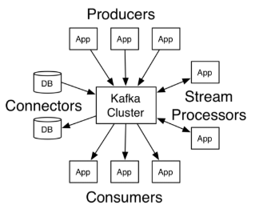
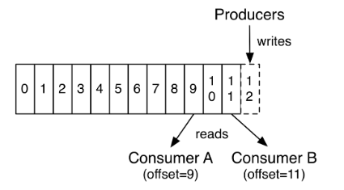
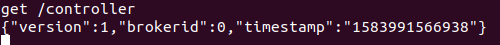
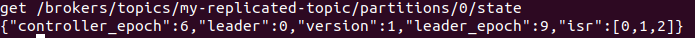
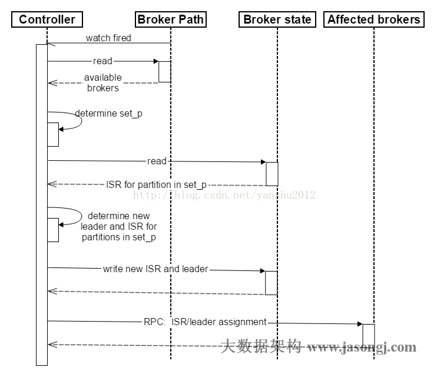

# Kafka 入门总结

## 介绍

Kafka 是一个分布式流平台(streaming platform)。

流平台具有三个关键功能：

- 发布和订阅：发布和订阅记录流(`streams of records`)，类似于消息队列或企业消息传统系统。
- 容错持久存储：以容错和持久的方式存储记录流
- 记录处理：产生记录流时，能处理它们

Kafka 常用于两大类应用：

- 创建实时流数据管道，用于可靠的在系统和应用间获取数据
- 创建实时流应用程序，用于对数据流进行转换或做出响应

几个概念：

- Kafka 可在一个或多个或跨越多个数据中心的服务器上作为集群运行。
- Kafka 集群将记录流记录在`topics`中。
- 每一个记录由一个 key、value 和时间戳组成。

Kafka 四个核心 APIs：

- Producer API：允许应用推送记录流到一个或多个 topics。
- Consumer API：允许应用订阅一个或多个 topics 并处理为其产生的记录流。
- Streams API: 允许应用程序作为流处理器，使用一个或多个 topics 的输入流，并生成一个或多个 topics 的输出流，从而有效地将输入流转换为输出流。
- Connector API：允许构建和运行将 topics 连接到现有应用程序或数据系统的可重复使用的生产者或消费者。例如一个用于捕获 RDBMS 对表的所有修改的 connector



Kafka 的客户端和服务器通信是基于 TCP

## Topics 和 Logs

`topics`是发布记录的类别或订阅源名称。一个`topic`可以有零个，一个或多个消费者来订阅写入该`topic`的数据。

对于每个`topic`，Kafka 集群都会维护一个`partitions log`：


每个`partition`都是有序的、不可变的记录序列，这些记录连续地追加到结构化的提交 logs(commit log)中。在`partitions`中的记录都会被指定一个称为`offset`顺序 ID 号，该 ID 号是`partition`中每个记录的唯一标识。

Kafka 持久存储所有发布的记录，而不管它们是否被消费，且可设置记录的保留期限。例如，如果将保留策略设置为两天，则在发布记录后的两天内，该记录可被使用，过期后将被丢弃以释放空间。Kafka 的性能相对于数据大小实际上是恒定的，因此常时间存储数据不是问题。



实际上，每个消息者保留的元数据是该消费者在 logs 中的偏移量或位置。此偏移量由消费者控制：通常，消费者在读取记录时会线性地推进其偏移量，但是，消费者可以自定义顺序使用记录。例如，消费者可以重置到较旧的偏移量以重新处理过去的数据，或者跳到最近的记录并从“now”开始使用。

这些功能的组合意味着消费者可以自行来去的获取记录，而不会对集群或其他消费者带来太大的影响。

logs 中的`partition`有多种用途：

- 允许 logs 扩展到超出单个服务器所能容纳的大小。每个单独的`partition`受限于托管该分区的服务器大小，但是一`topic`可以有多个`partitions`，因此可以处理任意数量的数据。
- 其次，它们充当并行性的单元。

## 分配

`logs` 的`partition`分布在 kafka 集群服务器上，且每台服务器处理数据并要求共享`partition`。每个分区可以配置一定数量的复本以用于容错。

每个`partition`都有一个充当`leader`的服务器和零个或多个充当`followers`的服务器。`leader`处理对`partition`的所有读写请求，而`followers`则用于从`leader`复制数据。如果`leader`出现故障，则`followers`中的一个将自动选为新的`leader`。每个服务器可能同时充当一些`partitions`的`leader`和其他`partitions`的`follower`，因此集群的负载得到了很好的平衡。

## Geo-复制

Kafka MirrorMaker 可为集群提供地理复制支持。使用 MirrorMaker，可以在多个数据中心或云区域中复制消息。可以使用它进行备份和恢复。或将数据放置在离用户更近的位置，或支持数据位置要求。

## Producers

生产者将数据发布到选择的`topic`。 生产者负责选择将哪个记录分配给`topic`中的哪个`partition`。 可以以循环方式完成此操作，仅是为了平衡负载，也可以根据某些语义分区功能（例如基于记录中的某些键）进行此操作。

## Consumers

消费者使用`consumer group`标记自己，并且发布到`topics`的每条记录都会传递到订阅`consumer group`的每个消费者中。消费者实例可以在单独的进程中或机器上。

如果所有的消息者都在同一个`consumer group`中，那么记录能在这些消费者中进行负载均衡(一个记录只能有一个消费者消费)。

如果所有消费者在不同的`consumer group`，那么每个记录将被广播给所有的消费者。

上述可为：**一个记录只能被同一个`consumer group`中的一个消费者使用，不同`consumer group`可以使用同一个记录**，多个`partitions`可以增强`consumer group`的消费能力。


比上图更常见的是，`topics`有少量的`consumer groups`，每一个作为逻辑上的订阅者，每个组由许多消费者组成，以实现可伸缩性和容错能力。这就是常规的发布-订阅语义，只是订阅者是一个消费者集群而不是一个单实例。

在 Kafka 实现消费的方式是通过在消费者实例上划分`log`的`partitions`，以便每个实例在任何时间点都是`partitions`“fair share” 的一个”独家“消费者。在`group`中维护组成员身份的过程由 Kafka 协议动态维护。如果新的实例加入该组，将接管该组其他成员的某些`partitions`；如果实例终止，它的`partitions`将分区给其余实例。

Kafka 只提供在一个`partition`中记录排序，而不是在一个`topic`中不同`partition`中提供排序。对大多数应用程序，每个`partition`的排序组合上按`key`对数据分区就足够了。但是如果需要记录的总排序，则可以使用只有一个`partition`的`topics`来实现，但这意味着每个消费者组只有一个消费者进程。

## 多租户(Multi-tenancy)

您可以将 Kafka 部署为多租户解决方案。通过配置哪些`topics`可以产生或使用数据来启用多租户。配额也有运营支持(There is also operations support for quotas.)。管理员可以在请求上定义和实施配额，以控制客户端使用的代理资源。有关更多信息，请参阅[安全性文档](https://kafka.apache.org/documentation/#security)。

## Guarantees(担保)

在较高级别上，Kafka 提供以下保证：

- 生产者发送到特定`topic`的`partition`的消息将按照发送顺序追加。
- 消费者按照记录在`log`中的存储顺序查看记录
- 对于复制因子为 N 的`topic`，我们最多可以容忍 N-1 个服务器故障，而不会丢失提交给`log`的任何记录。

## kafka 用途

- 消息队列：订阅-推送，队列
- Kafka 作为存储系统
- Kafka 用于流处理

## 用例

### 消息传递(Messaging)

Kafka 可以很好代替传统的消息代理。消息代理的使用有多种原因（应用解耦，缓存未处理的消息等）。与大多数消息系统相比，Kafka 具有更高的吞吐量，内置分区、副本、容错功能，使其成为大规模消息处理应用的解决方案。

### 网络活动跟踪(Website Activity Tracking)

Kafka 的原始用例是能够将用户活动跟踪作为一组实时的发布-订阅`feeds`。这意味着网站活动（页面浏览，搜索或用户可能采取的其他动作）被发送到中心`topics`，每个`topic`有一个活动类型。这些`feeds`可以用于一系列用例的订阅，包括实时处理，实时监控，以及加载到 Hadoop 或脱机数据仓库系统中用于脱机处理和报告。

活动跟踪通常量很大，因为每个用户页面视图都会生成许多活动消息。

### 指标(Metrics)

Kafka 通常用于操作监控数据。这涉及汇总来自分布式应用程序的统计信息，以生成集中的运行数据提要。

### 日志聚合(Log Aggregation)

许多人使用 Kafka 替代日志聚合解决方案。日志聚合通常从服务器收集物理日志文件，并将它们集中在中央位置（文件服务器或 HDFS）以进行处理。Kafka 提取文件的详细信息，并以消息流的形式更清晰地抽象日志或事件数据。这允许较低延迟的处理，并且更容易支持多个数据源和分布式数据消息和分布式数据消费。与 Scribe 或 Flume 等以日志为中心的系统相比，Kafka 提供同样出色的性能，由于复制功能而提供更强的耐用性保证以及更低的端到端延迟。

### 流处理(Stream Processing)

Kafka 的许多用户在由多个阶段组成的处理管道中处理数据，其中从 Kafka 的`topics`中获取原始输入数据，然后聚合，丰富数据，或以其他方式转换为新的`topics`，以供进一步使用或后续处理。

例如：

- 用于推荐新闻文章的处理管道可能会从 RSS 的`feeds`中检索文章内容，并将其发布到`articles`的`topic`中；
- 进一步的处理可能会是，使该内容规范化或删除重复数据，并将清洗后的文章内容发布到新的`topic`；
- 最后处理阶段阶段可能会尝试向用户推荐此内容。

这样的处理管道是基于各个`topic`创建的实时数据流图。从版本 0.10.0.0 开始，`Kafka`中提供了一个轻量但功能强大的流处理库，称为`Kafka Streams`，可以执行上述数据处理。除了`Kafka Streams`，其他开源流处理工具还包括`Apache Storm`和`Apache Samza`。

### 事件溯源(Event Sourcing)

事件溯源是一种应用程序设计，其中状态的更改以时间顺序记录下来。Kafka 对大量存储的日志数据的支持使其成为使用这种模式构建应用程序的绝佳后端。

### 提交日志(Commit Log)

Kafka 可以用作分布式系统的一种外部提交日志。该日志有助于在节点之间复制数据，并充当故障节点恢复其数据的重新同步机制。Kafka 中的`日志压缩`功能有助于支持此用法。在这种用法中，Kafka 与 Apache BookKeeper 项目相似。

## 快速开始

### 配置参考

```txt
broker.id=0                            #当前机器在集群中的唯一标识，和zookeeper的myid性质一样
port=19092                             #当前kafka对外提供服务的端口默认是9092
host.name=192.168.7.100                #这个参数默认是关闭的，在0.8.1有个bug，DNS解析问题，失败率的问题。
num.network.threads=3                  #这个是borker进行网络处理的线程数
num.io.threads=8                       #这个是borker进行I/O处理的线程数
log.dirs=/opt/kafka/kafkalogs/         #消息存放的目录，这个目录可以配置为“，”逗号分割的表达式，上面的num.io.threads要大于这个目录的个数这个目录
                                        如果配置多个目录，新创建的topic他把消息持久化的地方是，当前以逗号分割的目录中，那个分区数最少就放那一个

socket.send.buffer.bytes=102400         #发送缓冲区buffer大小，数据不是一下子就发送的，先回存储到缓冲区了到达一定的大小后在发送，能提高性能
socket.receive.buffer.bytes=102400      #kafka接收缓冲区大小，当数据到达一定大小后在序列化到磁盘
socket.request.max.bytes=104857600      #这个参数是向kafka请求消息或者向kafka发送消息的请请求的最大数，这个值不能超过java的堆栈大小
num.partitions=1                        #默认的分区数，一个topic默认1个分区数
log.retention.hours=168                 #默认消息的最大持久化时间，168小时，7天
message.max.byte=5242880                #消息保存的最大值5M
default.replication.factor=2            #kafka保存消息的副本数，如果一个副本失效了，另一个还可以继续提供服务
replica.fetch.max.bytes=5242880         #取消息的最大直接数
log.segment.bytes=1073741824            #这个参数是：因为kafka的消息是以追加的形式落地到文件，当超过这个值的时候，kafka会新起一个文件
log.retention.check.interval.ms=300000  #每隔300000毫秒去检查上面配置的log失效时间（log.retention.hours=168 ），到目录查看是否有过期的消息如果有，删除
log.cleaner.enable=false                #是否启用log压缩，一般不用启用，启用的话可以提高性能
zookeeper.connect=192.168.7.100:2181,192.168.7.101:2181,192.168.7.107:2181   #设置zookeeper的连接端口
```

### 简单开始

参考[官方文档](http://kafka.apache.org/documentation/#quickstart_startserver)

### 多 broker

```sh
> bin/kafka-topics.sh --describe --bootstrap-server localhost:9092 --topic my-replicated-topic
Topic:my-replicated-topic   PartitionCount:1    ReplicationFactor:3 Configs:
    Topic: my-replicated-topic  Partition: 0    Leader: 1   Replicas: 1,2,0 Isr: 1,2,0
```

- "leader"是负责给定`partition`的所有读写的节点。每个节点都是`partition`中随机选择的一部分的 leader
- "replicas"是复制这个`partition`的`log`的节点列表，不管它们是主节点还是活动节点。
- "isr"是"in-sync"副本的集合。这是`replicas`列表的子集，当前仍处于活动状态并追随 leader。

### 集群的容错

当 kill 掉上图的 leader 节点 1 时，将出现下边的节点变动。

```sh
> bin/kafka-topics.sh --describe --bootstrap-server localhost:9092 --topic my-replicated-topic
Topic:my-replicated-topic   PartitionCount:1    ReplicationFactor:3 Configs:
    Topic: my-replicated-topic  Partition: 0    Leader: 2   Replicas: 1,2,0 Isr: 2,0
```

## kafka leader 选举机制原理

### broker 的 leader 选举(controller 选举)

controller 选举是 Kafka 集群中哪一个 broker 能够成功在 zookeeper 上创建`/controller`临时节点即可成为 leader（先到先得），并在该节点写入当前 broker 的信息。



同时所有`partition`的`leader`选举都由`controller`决定。`controller`会将`leader`的改变直接通过`RPC`的方式（比 Zookeeper Queue 的方式更高效）通知需为此作出响应的 Broker。同时 controller 也负责增删 Topic 以及 Replica 的重新分配。

当 leader 和 zookeeper 失去连接，临时节点会删除，而其他 broker 会监听该节点的变化，当节点删除时，其他 broker 会收到事件通知，重新发起 leader 选举。

### partition 的 leader 选举

kafka 为了保证高可用性，每个分区会有一定数量的副本（replica），这样如果部分服务器，副本所在的服务器就会接替上来保证应用的持续可用。

但是，为了保证较高的处理速率，消息的读写一般都在固定的副本上进行，这个副本就是所谓的 leader，而其他副本就是 follower，follower 会定期的从 leader 同步数据。

当某个分区的服务器出现故障时，controller 的处理过程如下：

1. 每一个 controller 在 zookeeper 中注册有 watcher，一旦 broker 宕机（这是用宕机代表任何让系统认为其 die 的情景，包括但不限于机器断电，网络不可用，GC 导致的 Stop The World，进程 crash 等），其在 zookeeper 对应的 znode 会自动被删除，zookeeper 会移除 controller 注册的 watcher，controller 读取最新的幸存的 broker。
2. controller 决定`set_p`，该集合包含了宕机的所有 Broker 上的所有`Partition`。
3. 对`set_p`中的每一个`Partition`
   1. 从`/brokers/topics/[topic]/partitions/[partition]/state`读取该 Partition 当前的 ISR
   2. 决定该 Partition 的新 Leader。如果当前 ISR 中有至少一个 Replica 还幸存，则选择其中一个作为新 Leader，新的 ISR 则包含当前 ISR 中所有幸存的 Replica（`选举算法的实现类似于微软的 PacificA`）。否则选择该 Partition 中任意一个幸存的 Replica 作为新的 Leader 以及 ISR（该场景下可能会有潜在的数据丢失）。如果该 Partition 的所有 Replica 都宕机了，则将新的 Leader 设置为-1。
   3. 将新的 Leader，ISR 和新的 leader_epoch 及 controller_epoch 写入`/brokers/topics/[topic]/partitions/[partition]/state`。注意，该操作只有其 version 在 3.1 至 3.3 的过程中
4. 直接通过 RPC 向 set_p 相关的 Broker 发送 LeaderAndISRRequest 命令。Controller 可以在一个 RPC 操作中发送多个命令从而提高效率。





#### 为什么不用少数服从多数的方法

这种算法需要较高的冗余度。譬如只允许一台机器失败，需要有三个副本；而如果只容忍两台机器失败，则需要五个副本。而 kafka 的 ISR 集合方法，分别只需要两个和三个副本

#### 如果所有的 ISR 副本都失败了怎么办?

- 第一种是`等待ISR集合中的副本复活`；
  - 可以保证一致性，但可能需要很长的时间
- 第二种是`选择任何一个立即可用的副本`，而这个副本不一定是在 ISR 集合中。
  - 可能会导致该副本不一致

## 参考

> - [kafka 官方文档](http://kafka.apache.org/documentation/)
> - [kafka2.3.0 安装部署](https://blog.csdn.net/weixin_43824520/article/details/100585611)
> - [kafka leader 选举机制原理](https://blog.csdn.net/yanshu2012/article/details/54894629)
> - [kafka：leader 选举（broker /分区）](https://www.maiyewang.com/archives/30873)
