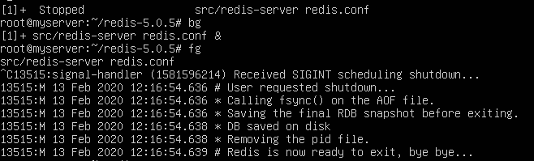

# Linux 面试题收集

- [Linux 面试题收集](#linux-%e9%9d%a2%e8%af%95%e9%a2%98%e6%94%b6%e9%9b%86)
  - [如何看当前 Linux 系统有几颗物理 CPU 和每颗 CPU 的核数?](#%e5%a6%82%e4%bd%95%e7%9c%8b%e5%bd%93%e5%89%8d-linux-%e7%b3%bb%e7%bb%9f%e6%9c%89%e5%87%a0%e9%a2%97%e7%89%a9%e7%90%86-cpu-%e5%92%8c%e6%af%8f%e9%a2%97-cpu-%e7%9a%84%e6%a0%b8%e6%95%b0)
  - [查看系统负载有两个常用的命令,是哪两个?这三个数值表示什么含义呢?](#%e6%9f%a5%e7%9c%8b%e7%b3%bb%e7%bb%9f%e8%b4%9f%e8%bd%bd%e6%9c%89%e4%b8%a4%e4%b8%aa%e5%b8%b8%e7%94%a8%e7%9a%84%e5%91%bd%e4%bb%a4%e6%98%af%e5%93%aa%e4%b8%a4%e4%b8%aa%e8%bf%99%e4%b8%89%e4%b8%aa%e6%95%b0%e5%80%bc%e8%a1%a8%e7%a4%ba%e4%bb%80%e4%b9%88%e5%90%ab%e4%b9%89%e5%91%a2)
  - [vmstat 的 r,b, si, so, bi, bo 这几列表示什么含义呢?](#vmstat-%e7%9a%84-rb-si-so-bi-bo-%e8%bf%99%e5%87%a0%e5%88%97%e8%a1%a8%e7%a4%ba%e4%bb%80%e4%b9%88%e5%90%ab%e4%b9%89%e5%91%a2)
  - [Linux 系统中,buffer 和 cache 如何区分?](#linux-%e7%b3%bb%e7%bb%9f%e4%b8%adbuffer-%e5%92%8c-cache-%e5%a6%82%e4%bd%95%e5%8c%ba%e5%88%86)
  - [top 命令](#top-%e5%91%bd%e4%bb%a4)
  - [如何查看当前系统都有哪些进程?(ps 命令)](#%e5%a6%82%e4%bd%95%e6%9f%a5%e7%9c%8b%e5%bd%93%e5%89%8d%e7%b3%bb%e7%bb%9f%e9%83%bd%e6%9c%89%e5%93%aa%e4%ba%9b%e8%bf%9b%e7%a8%8bps-%e5%91%bd%e4%bb%a4)
  - [ps 查看系统进程时,有一列为 STAT,如果当前进程的 stat 为 Ss 表示什么含义?如果为 Z 表示什么含义?](#ps-%e6%9f%a5%e7%9c%8b%e7%b3%bb%e7%bb%9f%e8%bf%9b%e7%a8%8b%e6%97%b6%e6%9c%89%e4%b8%80%e5%88%97%e4%b8%ba-stat%e5%a6%82%e6%9e%9c%e5%bd%93%e5%89%8d%e8%bf%9b%e7%a8%8b%e7%9a%84-stat-%e4%b8%ba-ss-%e8%a1%a8%e7%a4%ba%e4%bb%80%e4%b9%88%e5%90%ab%e4%b9%89%e5%a6%82%e6%9e%9c%e4%b8%ba-z-%e8%a1%a8%e7%a4%ba%e4%bb%80%e4%b9%88%e5%90%ab%e4%b9%89)
  - [如何查看系统都开启了哪些端口?](#%e5%a6%82%e4%bd%95%e6%9f%a5%e7%9c%8b%e7%b3%bb%e7%bb%9f%e9%83%bd%e5%bc%80%e5%90%af%e4%ba%86%e5%93%aa%e4%ba%9b%e7%ab%af%e5%8f%a3)
  - [如何查看网络连接状况?](#%e5%a6%82%e4%bd%95%e6%9f%a5%e7%9c%8b%e7%bd%91%e7%bb%9c%e8%bf%9e%e6%8e%a5%e7%8a%b6%e5%86%b5)
  - [想修改 ip,需要编辑哪个配置文件,修改完配置文件后,如何重启网卡,使配置生效?(centOS)](#%e6%83%b3%e4%bf%ae%e6%94%b9-ip%e9%9c%80%e8%a6%81%e7%bc%96%e8%be%91%e5%93%aa%e4%b8%aa%e9%85%8d%e7%bd%ae%e6%96%87%e4%bb%b6%e4%bf%ae%e6%94%b9%e5%ae%8c%e9%85%8d%e7%bd%ae%e6%96%87%e4%bb%b6%e5%90%8e%e5%a6%82%e4%bd%95%e9%87%8d%e5%90%af%e7%bd%91%e5%8d%a1%e4%bd%bf%e9%85%8d%e7%bd%ae%e7%94%9f%e6%95%88centos)
  - [如何查看某个网卡是否连接着交换机?](#%e5%a6%82%e4%bd%95%e6%9f%a5%e7%9c%8b%e6%9f%90%e4%b8%aa%e7%bd%91%e5%8d%a1%e6%98%af%e5%90%a6%e8%bf%9e%e6%8e%a5%e7%9d%80%e4%ba%a4%e6%8d%a2%e6%9c%ba)
  - [如何查看当前主机的主机名?如何修改主机名?要想重启后依旧生效,需要修改哪个配置文件呢?](#%e5%a6%82%e4%bd%95%e6%9f%a5%e7%9c%8b%e5%bd%93%e5%89%8d%e4%b8%bb%e6%9c%ba%e7%9a%84%e4%b8%bb%e6%9c%ba%e5%90%8d%e5%a6%82%e4%bd%95%e4%bf%ae%e6%94%b9%e4%b8%bb%e6%9c%ba%e5%90%8d%e8%a6%81%e6%83%b3%e9%87%8d%e5%90%af%e5%90%8e%e4%be%9d%e6%97%a7%e7%94%9f%e6%95%88%e9%9c%80%e8%a6%81%e4%bf%ae%e6%94%b9%e5%93%aa%e4%b8%aa%e9%85%8d%e7%bd%ae%e6%96%87%e4%bb%b6%e5%91%a2)
  - [设置 DNS 需要修改哪个配置文件?](#%e8%ae%be%e7%bd%ae-dns-%e9%9c%80%e8%a6%81%e4%bf%ae%e6%94%b9%e5%93%aa%e4%b8%aa%e9%85%8d%e7%bd%ae%e6%96%87%e4%bb%b6)
  - [使用 iptables 写一条规则:把来源 IP 为 192.168.1.101 访问本机 80 端口的包直接拒绝](#%e4%bd%bf%e7%94%a8-iptables-%e5%86%99%e4%b8%80%e6%9d%a1%e8%a7%84%e5%88%99%e6%8a%8a%e6%9d%a5%e6%ba%90-ip-%e4%b8%ba-1921681101-%e8%ae%bf%e9%97%ae%e6%9c%ac%e6%9c%ba-80-%e7%ab%af%e5%8f%a3%e7%9a%84%e5%8c%85%e7%9b%b4%e6%8e%a5%e6%8b%92%e7%bb%9d)
  - [要想把 iptable 的规则保存到一个文件中如何做?如何恢复?](#%e8%a6%81%e6%83%b3%e6%8a%8a-iptable-%e7%9a%84%e8%a7%84%e5%88%99%e4%bf%9d%e5%ad%98%e5%88%b0%e4%b8%80%e4%b8%aa%e6%96%87%e4%bb%b6%e4%b8%ad%e5%a6%82%e4%bd%95%e5%81%9a%e5%a6%82%e4%bd%95%e6%81%a2%e5%a4%8d)
  - [如何备份某个用户的任务计划?](#%e5%a6%82%e4%bd%95%e5%a4%87%e4%bb%bd%e6%9f%90%e4%b8%aa%e7%94%a8%e6%88%b7%e7%9a%84%e4%bb%bb%e5%8a%a1%e8%ae%a1%e5%88%92)
  - [任务计划格式中,前面 5 个数字分表表示什么含义?](#%e4%bb%bb%e5%8a%a1%e8%ae%a1%e5%88%92%e6%a0%bc%e5%bc%8f%e4%b8%ad%e5%89%8d%e9%9d%a2-5-%e4%b8%aa%e6%95%b0%e5%ad%97%e5%88%86%e8%a1%a8%e8%a1%a8%e7%a4%ba%e4%bb%80%e4%b9%88%e5%90%ab%e4%b9%89)
  - [如何可以把系统中不用的服务关掉?](#%e5%a6%82%e4%bd%95%e5%8f%af%e4%bb%a5%e6%8a%8a%e7%b3%bb%e7%bb%9f%e4%b8%ad%e4%b8%8d%e7%94%a8%e7%9a%84%e6%9c%8d%e5%8a%a1%e5%85%b3%e6%8e%89)
  - [如何让某个服务(假如服务名为 nginx)只在 3,5 两个运行级别开启,其他级别关闭?](#%e5%a6%82%e4%bd%95%e8%ae%a9%e6%9f%90%e4%b8%aa%e6%9c%8d%e5%8a%a1%e5%81%87%e5%a6%82%e6%9c%8d%e5%8a%a1%e5%90%8d%e4%b8%ba-nginx%e5%8f%aa%e5%9c%a8-35-%e4%b8%a4%e4%b8%aa%e8%bf%90%e8%a1%8c%e7%ba%a7%e5%88%ab%e5%bc%80%e5%90%af%e5%85%b6%e4%bb%96%e7%ba%a7%e5%88%ab%e5%85%b3%e9%97%ad)
  - [rsync 同步命令中,下面两种方式有什么不同呢?](#rsync-%e5%90%8c%e6%ad%a5%e5%91%bd%e4%bb%a4%e4%b8%ad%e4%b8%8b%e9%9d%a2%e4%b8%a4%e7%a7%8d%e6%96%b9%e5%bc%8f%e6%9c%89%e4%bb%80%e4%b9%88%e4%b8%8d%e5%90%8c%e5%91%a2)
  - [rsync 同步时,如果要同步的源中有软连接,如何把软连接的目标文件或者目录同步?](#rsync-%e5%90%8c%e6%ad%a5%e6%97%b6%e5%a6%82%e6%9e%9c%e8%a6%81%e5%90%8c%e6%ad%a5%e7%9a%84%e6%ba%90%e4%b8%ad%e6%9c%89%e8%bd%af%e8%bf%9e%e6%8e%a5%e5%a6%82%e4%bd%95%e6%8a%8a%e8%bd%af%e8%bf%9e%e6%8e%a5%e7%9a%84%e7%9b%ae%e6%a0%87%e6%96%87%e4%bb%b6%e6%88%96%e8%80%85%e7%9b%ae%e5%bd%95%e5%90%8c%e6%ad%a5)
  - [rsync 同步数据时,如何过滤出所有.txt 的文件不同步?](#rsync-%e5%90%8c%e6%ad%a5%e6%95%b0%e6%8d%ae%e6%97%b6%e5%a6%82%e4%bd%95%e8%bf%87%e6%bb%a4%e5%87%ba%e6%89%80%e6%9c%89txt-%e7%9a%84%e6%96%87%e4%bb%b6%e4%b8%8d%e5%90%8c%e6%ad%a5)
  - [rsync 同步数据时,如果目标文件比源文件还新,则忽略该文件,如何做?](#rsync-%e5%90%8c%e6%ad%a5%e6%95%b0%e6%8d%ae%e6%97%b6%e5%a6%82%e6%9e%9c%e7%9b%ae%e6%a0%87%e6%96%87%e4%bb%b6%e6%af%94%e6%ba%90%e6%96%87%e4%bb%b6%e8%bf%98%e6%96%b0%e5%88%99%e5%bf%bd%e7%95%a5%e8%af%a5%e6%96%87%e4%bb%b6%e5%a6%82%e4%bd%95%e5%81%9a)
  - [使用 rsync 同步数据时,假如我们采用的是 ssh 方式,并且目标机器的 sshd 端口并不是默认的 22 端口,那我们如何做？](#%e4%bd%bf%e7%94%a8-rsync-%e5%90%8c%e6%ad%a5%e6%95%b0%e6%8d%ae%e6%97%b6%e5%81%87%e5%a6%82%e6%88%91%e4%bb%ac%e9%87%87%e7%94%a8%e7%9a%84%e6%98%af-ssh-%e6%96%b9%e5%bc%8f%e5%b9%b6%e4%b8%94%e7%9b%ae%e6%a0%87%e6%9c%ba%e5%99%a8%e7%9a%84-sshd-%e7%ab%af%e5%8f%a3%e5%b9%b6%e4%b8%8d%e6%98%af%e9%bb%98%e8%ae%a4%e7%9a%84-22-%e7%ab%af%e5%8f%a3%e9%82%a3%e6%88%91%e4%bb%ac%e5%a6%82%e4%bd%95%e5%81%9a)
  - [rsync 同步时,如何删除目标数据多出来的数据,即源上不存在,但目标却存在的文件或者目录?](#rsync-%e5%90%8c%e6%ad%a5%e6%97%b6%e5%a6%82%e4%bd%95%e5%88%a0%e9%99%a4%e7%9b%ae%e6%a0%87%e6%95%b0%e6%8d%ae%e5%a4%9a%e5%87%ba%e6%9d%a5%e7%9a%84%e6%95%b0%e6%8d%ae%e5%8d%b3%e6%ba%90%e4%b8%8a%e4%b8%8d%e5%ad%98%e5%9c%a8%e4%bd%86%e7%9b%ae%e6%a0%87%e5%8d%b4%e5%ad%98%e5%9c%a8%e7%9a%84%e6%96%87%e4%bb%b6%e6%88%96%e8%80%85%e7%9b%ae%e5%bd%95)
  - [rsync 使用服务模式时,如果我们指定了一个密码文件,那么这个密码文件的权限应该设置成多少才可以?](#rsync-%e4%bd%bf%e7%94%a8%e6%9c%8d%e5%8a%a1%e6%a8%a1%e5%bc%8f%e6%97%b6%e5%a6%82%e6%9e%9c%e6%88%91%e4%bb%ac%e6%8c%87%e5%ae%9a%e4%ba%86%e4%b8%80%e4%b8%aa%e5%af%86%e7%a0%81%e6%96%87%e4%bb%b6%e9%82%a3%e4%b9%88%e8%bf%99%e4%b8%aa%e5%af%86%e7%a0%81%e6%96%87%e4%bb%b6%e7%9a%84%e6%9d%83%e9%99%90%e5%ba%94%e8%af%a5%e8%ae%be%e7%bd%ae%e6%88%90%e5%a4%9a%e5%b0%91%e6%89%8d%e5%8f%af%e4%bb%a5)
  - [某个账号登陆 linux 后,系统会在哪些日志文件中记录相关信息?](#%e6%9f%90%e4%b8%aa%e8%b4%a6%e5%8f%b7%e7%99%bb%e9%99%86-linux-%e5%90%8e%e7%b3%bb%e7%bb%9f%e4%bc%9a%e5%9c%a8%e5%93%aa%e4%ba%9b%e6%97%a5%e5%bf%97%e6%96%87%e4%bb%b6%e4%b8%ad%e8%ae%b0%e5%bd%95%e7%9b%b8%e5%85%b3%e4%bf%a1%e6%81%af)
  - [网卡或者硬盘有问题时,我们可以通过使用哪个命令查看相关信息?](#%e7%bd%91%e5%8d%a1%e6%88%96%e8%80%85%e7%a1%ac%e7%9b%98%e6%9c%89%e9%97%ae%e9%a2%98%e6%97%b6%e6%88%91%e4%bb%ac%e5%8f%af%e4%bb%a5%e9%80%9a%e8%bf%87%e4%bd%bf%e7%94%a8%e5%93%aa%e4%b8%aa%e5%91%bd%e4%bb%a4%e6%9f%a5%e7%9c%8b%e7%9b%b8%e5%85%b3%e4%bf%a1%e6%81%af)
  - [分别使用 xargs 和 exec 实现这样的需求,把当前目录下所有后缀名为.txt 的文件的权限修改为 777](#%e5%88%86%e5%88%ab%e4%bd%bf%e7%94%a8-xargs-%e5%92%8c-exec-%e5%ae%9e%e7%8e%b0%e8%bf%99%e6%a0%b7%e7%9a%84%e9%9c%80%e6%b1%82%e6%8a%8a%e5%bd%93%e5%89%8d%e7%9b%ae%e5%bd%95%e4%b8%8b%e6%89%80%e6%9c%89%e5%90%8e%e7%bc%80%e5%90%8d%e4%b8%batxt-%e7%9a%84%e6%96%87%e4%bb%b6%e7%9a%84%e6%9d%83%e9%99%90%e4%bf%ae%e6%94%b9%e4%b8%ba-777)
  - [有一个脚本运行时间可能超过 2 天,如何做才能使其不间断的运行,而且还可以随时观察脚本运行时的输出信息?](#%e6%9c%89%e4%b8%80%e4%b8%aa%e8%84%9a%e6%9c%ac%e8%bf%90%e8%a1%8c%e6%97%b6%e9%97%b4%e5%8f%af%e8%83%bd%e8%b6%85%e8%bf%87-2-%e5%a4%a9%e5%a6%82%e4%bd%95%e5%81%9a%e6%89%8d%e8%83%bd%e4%bd%bf%e5%85%b6%e4%b8%8d%e9%97%b4%e6%96%ad%e7%9a%84%e8%bf%90%e8%a1%8c%e8%80%8c%e4%b8%94%e8%bf%98%e5%8f%af%e4%bb%a5%e9%9a%8f%e6%97%b6%e8%a7%82%e5%af%9f%e8%84%9a%e6%9c%ac%e8%bf%90%e8%a1%8c%e6%97%b6%e7%9a%84%e8%be%93%e5%87%ba%e4%bf%a1%e6%81%af)
  - [在 Linux 系统下如何按照下面要求抓包:只过滤出访问 http 服务的,目标 ip 为 192.168.0.111,一共抓 1000 个包,并且保存到 1.cap 文件中?](#%e5%9c%a8-linux-%e7%b3%bb%e7%bb%9f%e4%b8%8b%e5%a6%82%e4%bd%95%e6%8c%89%e7%85%a7%e4%b8%8b%e9%9d%a2%e8%a6%81%e6%b1%82%e6%8a%93%e5%8c%85%e5%8f%aa%e8%bf%87%e6%bb%a4%e5%87%ba%e8%ae%bf%e9%97%ae-http-%e6%9c%8d%e5%8a%a1%e7%9a%84%e7%9b%ae%e6%a0%87-ip-%e4%b8%ba-1921680111%e4%b8%80%e5%85%b1%e6%8a%93-1000-%e4%b8%aa%e5%8c%85%e5%b9%b6%e4%b8%94%e4%bf%9d%e5%ad%98%e5%88%b0-1cap-%e6%96%87%e4%bb%b6%e4%b8%ad)
  - [想在 Linux 命令行下访问某个网站,并且该网站域名还没有解析,如何做?](#%e6%83%b3%e5%9c%a8-linux-%e5%91%bd%e4%bb%a4%e8%a1%8c%e4%b8%8b%e8%ae%bf%e9%97%ae%e6%9f%90%e4%b8%aa%e7%bd%91%e7%ab%99%e5%b9%b6%e4%b8%94%e8%af%a5%e7%bd%91%e7%ab%99%e5%9f%9f%e5%90%8d%e8%bf%98%e6%b2%a1%e6%9c%89%e8%a7%a3%e6%9e%90%e5%a6%82%e4%bd%95%e5%81%9a)
  - [自定义解析域名的时候，我们可以编辑哪个文件?是否可以一个 ip 对应多个域名?是否一个域名对应多个 ip?](#%e8%87%aa%e5%ae%9a%e4%b9%89%e8%a7%a3%e6%9e%90%e5%9f%9f%e5%90%8d%e7%9a%84%e6%97%b6%e5%80%99%e6%88%91%e4%bb%ac%e5%8f%af%e4%bb%a5%e7%bc%96%e8%be%91%e5%93%aa%e4%b8%aa%e6%96%87%e4%bb%b6%e6%98%af%e5%90%a6%e5%8f%af%e4%bb%a5%e4%b8%80%e4%b8%aa-ip-%e5%af%b9%e5%ba%94%e5%a4%9a%e4%b8%aa%e5%9f%9f%e5%90%8d%e6%98%af%e5%90%a6%e4%b8%80%e4%b8%aa%e5%9f%9f%e5%90%8d%e5%af%b9%e5%ba%94%e5%a4%9a%e4%b8%aa-ip)
  - [在 Linux 下如何指定 dns 服务器,来解析某个域名?](#%e5%9c%a8-linux-%e4%b8%8b%e5%a6%82%e4%bd%95%e6%8c%87%e5%ae%9a-dns-%e6%9c%8d%e5%8a%a1%e5%99%a8%e6%9d%a5%e8%a7%a3%e6%9e%90%e6%9f%90%e4%b8%aa%e5%9f%9f%e5%90%8d)
  - [我们可以使用哪个命令查看系统的历史负载(比如说两天前的)?](#%e6%88%91%e4%bb%ac%e5%8f%af%e4%bb%a5%e4%bd%bf%e7%94%a8%e5%93%aa%e4%b8%aa%e5%91%bd%e4%bb%a4%e6%9f%a5%e7%9c%8b%e7%b3%bb%e7%bb%9f%e7%9a%84%e5%8e%86%e5%8f%b2%e8%b4%9f%e8%bd%bd%e6%af%94%e5%a6%82%e8%af%b4%e4%b8%a4%e5%a4%a9%e5%89%8d%e7%9a%84)
  - [使用 free 查看内存使用情况时,哪个数值表示真正可用的内存量?](#%e4%bd%bf%e7%94%a8-free-%e6%9f%a5%e7%9c%8b%e5%86%85%e5%ad%98%e4%bd%bf%e7%94%a8%e6%83%85%e5%86%b5%e6%97%b6%e5%93%aa%e4%b8%aa%e6%95%b0%e5%80%bc%e8%a1%a8%e7%a4%ba%e7%9c%9f%e6%ad%a3%e5%8f%af%e7%94%a8%e7%9a%84%e5%86%85%e5%ad%98%e9%87%8f)
  - [有一天你突然发现公司网站访问速度变的很慢很慢,你该怎么办呢？](#%e6%9c%89%e4%b8%80%e5%a4%a9%e4%bd%a0%e7%aa%81%e7%84%b6%e5%8f%91%e7%8e%b0%e5%85%ac%e5%8f%b8%e7%bd%91%e7%ab%99%e8%ae%bf%e9%97%ae%e9%80%9f%e5%ba%a6%e5%8f%98%e7%9a%84%e5%be%88%e6%85%a2%e5%be%88%e6%85%a2%e4%bd%a0%e8%af%a5%e6%80%8e%e4%b9%88%e5%8a%9e%e5%91%a2)
  - [lsof](#lsof)
  - [如何暂停一个正在运行的进程,把其放在后台(不运行)](#%e5%a6%82%e4%bd%95%e6%9a%82%e5%81%9c%e4%b8%80%e4%b8%aa%e6%ad%a3%e5%9c%a8%e8%bf%90%e8%a1%8c%e7%9a%84%e8%bf%9b%e7%a8%8b%e6%8a%8a%e5%85%b6%e6%94%be%e5%9c%a8%e5%90%8e%e5%8f%b0%e4%b8%8d%e8%bf%90%e8%a1%8c)
  - [什么是安装 Linux 所需的最小分区数量,以及如何查看系统启动信息?](#%e4%bb%80%e4%b9%88%e6%98%af%e5%ae%89%e8%a3%85-linux-%e6%89%80%e9%9c%80%e7%9a%84%e6%9c%80%e5%b0%8f%e5%88%86%e5%8c%ba%e6%95%b0%e9%87%8f%e4%bb%a5%e5%8f%8a%e5%a6%82%e4%bd%95%e6%9f%a5%e7%9c%8b%e7%b3%bb%e7%bb%9f%e5%90%af%e5%8a%a8%e4%bf%a1%e6%81%af)
  - [在你的 Linux 机器上跟踪系统事件的守护进程名是什么?](#%e5%9c%a8%e4%bd%a0%e7%9a%84-linux-%e6%9c%ba%e5%99%a8%e4%b8%8a%e8%b7%9f%e8%b8%aa%e7%b3%bb%e7%bb%9f%e4%ba%8b%e4%bb%b6%e7%9a%84%e5%ae%88%e6%8a%a4%e8%bf%9b%e7%a8%8b%e5%90%8d%e6%98%af%e4%bb%80%e4%b9%88)
  - [在/root 分区运行'fsck'命令的最低要求是什么?](#%e5%9c%a8root-%e5%88%86%e5%8c%ba%e8%bf%90%e8%a1%8cfsck%e5%91%bd%e4%bb%a4%e7%9a%84%e6%9c%80%e4%bd%8e%e8%a6%81%e6%b1%82%e6%98%af%e4%bb%80%e4%b9%88)
  - [如何分层复制/home 目录到另一个目录](#%e5%a6%82%e4%bd%95%e5%88%86%e5%b1%82%e5%a4%8d%e5%88%b6home-%e7%9b%ae%e5%bd%95%e5%88%b0%e5%8f%a6%e4%b8%80%e4%b8%aa%e7%9b%ae%e5%bd%95)
  - [在 Linux 中,怎样实现日志文件的自动替换?](#%e5%9c%a8-linux-%e4%b8%ad%e6%80%8e%e6%a0%b7%e5%ae%9e%e7%8e%b0%e6%97%a5%e5%bf%97%e6%96%87%e4%bb%b6%e7%9a%84%e8%87%aa%e5%8a%a8%e6%9b%bf%e6%8d%a2)
  - [怎样知道 Linux 中是谁在安排工作?](#%e6%80%8e%e6%a0%b7%e7%9f%a5%e9%81%93-linux-%e4%b8%ad%e6%98%af%e8%b0%81%e5%9c%a8%e5%ae%89%e6%8e%92%e5%b7%a5%e4%bd%9c)
  - [如何在不解压 tar 包的前提下,查看包里的内容?](#%e5%a6%82%e4%bd%95%e5%9c%a8%e4%b8%8d%e8%a7%a3%e5%8e%8b-tar-%e5%8c%85%e7%9a%84%e5%89%8d%e6%8f%90%e4%b8%8b%e6%9f%a5%e7%9c%8b%e5%8c%85%e9%87%8c%e7%9a%84%e5%86%85%e5%ae%b9)
  - [什么是页面错误,它是怎么发生的?](#%e4%bb%80%e4%b9%88%e6%98%af%e9%a1%b5%e9%9d%a2%e9%94%99%e8%af%af%e5%ae%83%e6%98%af%e6%80%8e%e4%b9%88%e5%8f%91%e7%94%9f%e7%9a%84)
  - [什么是在程序中返回代码?](#%e4%bb%80%e4%b9%88%e6%98%af%e5%9c%a8%e7%a8%8b%e5%ba%8f%e4%b8%ad%e8%bf%94%e5%9b%9e%e4%bb%a3%e7%a0%81)
  - [参考](#%e5%8f%82%e8%80%83)

## 如何看当前 Linux 系统有几颗物理 CPU 和每颗 CPU 的核数?

```sh
cat /proc/cpuinfo|grep -c 'physical id'
cat /proc/cpuinfo|grep -c 'processor'
```

## 查看系统负载有两个常用的命令,是哪两个?这三个数值表示什么含义呢?

```sh
[root@centos6 ~ 10:56 #37]# w
10:57:38 up 14 min,  1 user,  load average: 0.00, 0.00, 0.00
USER     TTY      FROM              LOGIN@   IDLE   JCPU   PCPU WHAT
root     pts/0    192.168.147.1    18:44    0.00s  0.10s  0.00s w
[root@centos6 ~ 10:57 #38]# uptime
10:57:47 up 14 min,  1 user,  load average: 0.00, 0.00, 0.00
```

其中 load average 即系统负载，三个数值分别表示一分钟、五分钟、十五分钟内系统的平均负载，即平均任务数。

## vmstat 的 r,b, si, so, bi, bo 这几列表示什么含义呢?

vmstat 命令的含义为显示虚拟内存状态（“Virtual Memory Statistics”），但是它可以报告关于进程、内存、I/O 等系统整体运行状态。

```sh
[root@centos6 ~ 10:57 #39]# vmstat
procs -----------memory---------- ---swap-- -----io---- --system-- -----cpu-----
r  b   swpd   free   buff  cache   si   so    bi    bo   in   cs us sy id wa st
0  0      0 1783964  13172 106056    0    0    29     7   15   11  0  0 99  0  0
```

**Procs（进程）**：

- r: 运行队列中进程数量，这个值也可以判断是否需要增加 CPU。（长期大于 1）
- b: 等待 IO 的进程数量。

**Memory（内存）**：

- swpd: 使用虚拟内存大小，如果 swpd 的值不为 0，但是 SI，SO 的值长期为 0，这种情况不会影响系统性能。
- free: 空闲物理内存大小。
- buff: 用作缓冲的内存大小。
- cache: 用作缓存的内存大小，如果 cache 的值大的时候，说明 cache 处的文件数多，如果频繁访问到的文件都能被 cache 处，那么磁盘的读 IO bi 会非常小。

**Swap**：

- si: 每秒从交换区写到内存的大小，由磁盘调入内存。
- so: 每秒写入交换区的内存大小，由内存调入磁盘。

注意：内存够用的时候，这 2 个值都是 0，如果这 2 个值长期大于 0 时，系统性能会受到影响，磁盘 IO 和 CPU 资源都会被消耗。有些朋友看到空闲内存（free）很少的或接近于 0 时，就认为内存不够用了，不能光看这一点，还要结合 si 和 so，如果 free 很少，但是 si 和 so 也很少（大多时候是 0），那么不用担心，系统性能这时不会受到影响的。

**IO（现在的 Linux 版本块的大小为 1kb）**：

- bi: 每秒读取的块数
- bo: 每秒写入的块数

注意：随机磁盘读写的时候，这 2 个值越大（如超出 1024k)，能看到 CPU 在 IO 等待的值也会越大。

**system（系统）**：

- in: 每秒中断数，包括时钟中断。
- cs: 每秒上下文切换数。

注意：上面 2 个值越大，会看到由内核消耗的 CPU 时间会越大。

**CPU（以百分比表示）**：

- us: 用户进程执行时间百分比(user time)；us 的值比较高时，说明用户进程消耗的 CPU 时间多，但是如果长期超 50%的使用，那么我们就该考虑优化程序算法或者进行加速。

- sy: 内核系统进程执行时间百分比(system time)；sy 的值高时，说明系统内核消耗的 CPU 资源多，这并不是良性表现，我们应该检查原因。

- wa: IO 等待时间百分比；wa 的值高时，说明 IO 等待比较严重，这可能由于磁盘大量作随机访问造成，也有可能磁盘出现瓶颈（块操作）。

- id: 空闲时间百分比

**简记**：

- i --input，进入内存
- o --output，从内存出去
- s --swap，交换分区
- b --block，块设备，磁盘

单位都是 KB

## Linux 系统中,buffer 和 cache 如何区分?

- buffer 和 cache 都是内存中的一块区域，当 CPU 需要写数据到磁盘时，由于磁盘速度比较慢，所以 CPU 先把数据存进 buffer，然后 CPU 去执行其他任务，buffer 中的数据会定期写入磁盘；
- 当 CPU 需要从磁盘读入数据时，由于磁盘速度比较慢，可以把即将用到的数据提前存入 cache，CPU 直接从 Cache 中拿数据要快的多。

## top 命令

top 命令可以实时动态地查看系统的整体运行情况，是一个综合了多方信息监测系统性能和运行信息的实用工具。通过 top 命令所提供的互动式界面，用热键可以管理。

```text
-b：以批处理模式操作；
-c：显示完整的治命令；
-d：屏幕刷新间隔时间；
-I：忽略失效过程；
-s：保密模式；
-S：累积模式；
-i<时间>：设置间隔时间；
-u<用户名>：指定用户名；
-p<进程号>：指定进程；
-n<次数>：循环显示的次数。
```

**top 交互命令**

在 top 命令执行过程中可以使用的一些交互命令。这些命令都是单字母的，如果在命令行中使用了-s 选项， 其中一些命令可能会被屏蔽。

```text
h：显示帮助画面，给出一些简短的命令总结说明；
k：终止一个进程；
i：忽略闲置和僵死进程，这是一个开关式命令；
q：退出程序；
r：重新安排一个进程的优先级别；
S：切换到累计模式；
s：改变两次刷新之间的延迟时间（单位为s），如果有小数，就换算成ms。输入0值则系统将不断刷新，默认值是5s；
f或者F：从当前显示中添加或者删除项目；
o或者O：改变显示项目的顺序；
l：切换显示平均负载和启动时间信息；
m：切换显示内存信息；
t：切换显示进程和CPU状态信息；
c：切换显示命令名称和完整命令行；
M：根据驻留内存大小进行排序；
P：根据CPU使用百分比大小进行排序；
T：根据时间/累计时间进行排序；
w：将当前设置写入~/.toprc文件中。
```

```sh
top - 09:44:56 up 16 days, 21:23,  1 user,  load average: 9.59, 4.75, 1.92
Tasks: 145 total,   2 running, 143 sleeping,   0 stopped,   0 zombie
Cpu(s): 99.8%us,  0.1%sy,  0.0%ni,  0.2%id,  0.0%wa,  0.0%hi,  0.0%si,  0.0%st
Mem:   4147888k total,  2493092k used,  1654796k free,   158188k buffers
Swap:  5144568k total,       56k used,  5144512k free,  2013180k cached

PID USER      PR  NI    VIRT    RES    SHR S  %CPU %MEM     TIME+ COMMAND
  1 root      20   0    8892    312    272 S   0.0  0.0   0:00.09 init
  6 root      20   0    8912    232    180 S   0.0  0.0   0:00.00 init
  7 user+     20   0   16796   3428   3336 S   0.0  0.0   0:00.07 bash
 19 user+     20   0   17648   2080   1504 R   0.0  0.0   0:00.00 top
```

**解释**：

```text
top - 09:44:56[当前系统时间],
16 days[系统已经运行了16天],
1 user[个用户当前登录],
load average: 9.59, 4.75, 1.92[系统负载，即任务队列的平均长度]

Tasks: 145 total[总进程数],
2 running[正在运行的进程数],
143 sleeping[睡眠的进程数],
0 stopped[停止的进程数],
0 zombie[冻结进程数],

Cpu(s):
99.8%us[用户空间占用CPU百分比],
0.1%sy[内核空间占用CPU百分比],
0.0%ni[用户进程空间内改变过优先级的进程占用CPU百分比],
0.2%id[空闲CPU百分比], 0.0%wa[等待输入输出的CPU时间百分比],
0.0%hi[],
0.0%st[],

Mem: 4147888k total[物理内存总量],
2493092k used[使用的物理内存总量],
1654796k free[空闲内存总量],
158188k buffers[用作内核缓存的内存量]

Swap:  5144568k total[交换区总量],
56k used[使用的交换区总量],
5144512k free[空闲交换区总量],
2013180k cached[缓冲的交换区总量],

VIRT虚拟内存用量
RES物理内存用量
SHR共享内存用量
%MEM内存用量
```

## 如何查看当前系统都有哪些进程?(ps 命令)

```sh
ps -aux
# or
ps -elf
```

ps 命令用于报告当前系统的进程状态。可以搭配 kill 指令随时中断、删除不必要的程序。ps 命令是最基本同时也是非常强大的进程查看命令，使用该命令可以确定有哪些进程正在运行和运行的状态、进程是否结束、进程有没有僵死、哪些进程占用了过多的资源等等，总之大部分信息都是可以通过执行该命令得到的。

**选项（常用）**：

```text
-A 显示所有进程（等价于-e）(utility)
-a 显示一个终端的所有进程，除了会话引线
-N 忽略选择。
-d 显示所有进程，但省略所有的会话引线(utility)
-x 显示没有控制终端的进程，同时显示各个命令的具体路径。dx不可合用。（utility）
-p pid 进程使用cpu的时间
-u uid or username 选择有效的用户id或者是用户名
-g gid or groupname 显示组的所有进程。
U username 显示该用户下的所有进程，且显示各个命令的详细路径。如:ps U zhang;(utility)
-f 全部列出，通常和其他选项联用。如：ps -fa or ps -fx and so on.
-l 长格式（有F,wchan,C 等字段）
-j 作业格式
-o 用户自定义格式。
v 以虚拟存储器格式显示
s 以信号格式显示
-m 显示所有的线程
-H 显示进程的层次(和其它的命令合用，如：ps -Ha)（utility）
e 命令之后显示环境（如：ps -d e; ps -a e）(utility)
h 不显示第一行
```

## ps 查看系统进程时,有一列为 STAT,如果当前进程的 stat 为 Ss 表示什么含义?如果为 Z 表示什么含义?

**ps 输出解释**：

```text
USER 用户名
UID 用户 ID（User ID）
PID 进程 ID（Process ID）
PPID 父进程的进程 ID（Parent Process id）
SID 会话 ID（Session id）
%CPU 进程的 cpu 占用率
%MEM 进程的内存占用率
VSZ 进程所使用的虚存的大小（Virtual Size）
RSS 进程使用的驻留集大小或者是实际内存的大小，Kbytes 字节。
TTY 与进程关联的终端（tty）
STAT 进程的状态：进程状态使用字符表示的（STAT 的状态码）
    R 运行 Runnable (on run queue) 正在运行或在运行队列中等待。
    S 睡眠 Sleeping 休眠中, 受阻, 在等待某个条件的形成或接受到信号。
    I 空闲 Idle
    Z 僵死 Zombie（a defunct process) 进程已终止, 但进程描述符存在, 直到父进程调用 wait4()系统调用后释放。
    D 不可中断 Uninterruptible sleep (ususally IO) 收到信号不唤醒和不可运行, 进程必须等待直到有中断发生。
    T 终止 Terminate 进程收到 SIGSTOP, SIGSTP, SIGTIN, SIGTOU 信号后停止运行运行。
    P 等待交换页
    W 无驻留页 has no resident pages 没有足够的记忆体分页可分配。
    X 死掉的进程
    < 高优先级进程 高优先序的进程
    N 低优先 级进程 低优先序的进程
    L 内存锁页 Lock 有记忆体分页分配并缩在记忆体内
    s 进程的领导者（在它之下有子进程）；
    l 多进程的（使用 CLONE_THREAD, 类似 NPTL pthreads）
    + 位于后台的进程组
START 进程启动时间和日期
TIME 进程使用的总 cpu 时间
COMMAND 正在执行的命令行命令
NI 优先级(Nice)
PRI 进程优先级编号(Priority)
WCHAN 进程正在睡眠的内核函数名称；该函数的名称是从/root/system.map 文件中获得的。
FLAGS 与进程相关的数字标识
```

## 如何查看系统都开启了哪些端口?

```sh
[root@centos6 ~ 13:20 #55]# netstat -lnp
Active Internet connections (only servers)
Proto Recv-Q Send-Q Local Address               Foreign Address             State       PID/Program name
tcp        0      0 0.0.0.0:22                  0.0.0.0:*                   LISTEN      1035/sshd
tcp        0      0 :::22                       :::*                        LISTEN      1035/sshd
udp        0      0 0.0.0.0:68                  0.0.0.0:*                               931/dhclient
Active UNIX domain sockets (only servers)
Proto RefCnt Flags       Type       State         I-Node PID/Program name    Path
unix  2      [ ACC ]     STREAM     LISTENING     6825   1/init              @/com/ubuntu/upstart
unix  2      [ ACC ]     STREAM     LISTENING     8429   1003/dbus-daemon    /var/run/dbus/system_bus_socket
```

## 如何查看网络连接状况?

```sh
[root@centos6 ~ 13:22 #58]# netstat -an
Active Internet connections (servers and established)
Proto Recv-Q Send-Q Local Address               Foreign Address             State
tcp        0      0 0.0.0.0:22                  0.0.0.0:*                   LISTEN
tcp        0      0 192.168.147.130:22          192.168.147.1:23893         ESTABLISHED
tcp        0      0 :::22                       :::*                        LISTEN
udp        0      0 0.0.0.0:68                  0.0.0.0:*
……
```

## 想修改 ip,需要编辑哪个配置文件,修改完配置文件后,如何重启网卡,使配置生效?(centOS)

使用 vi 或者 vim 编辑器编辑网卡配置文件/etc/sysconfig/network-scripts/ifcft-eth0（如果是 eth1 文件名为 ifcft-eth1），内容如下：

```text
DEVICE=eth0
HWADDR=00:0C:29:06:37:BA
TYPE=Ethernet
UUID=0eea1820-1fe8-4a80-a6f0-39b3d314f8da
ONBOOT=yes
NM_CONTROLLED=yes
BOOTPROTO=static
IPADDR=192.168.147.130
NETMASK=255.255.255.0
GATEWAY=192.168.147.2
DNS1=192.168.147.2
DNS2=8.8.8.8
```

修改网卡后，可以使用命令重启网卡：

```sh
ifdown eth0
ifup eth0
```

也可以重启网络服务：

```sh
service network restart
```

## 如何查看某个网卡是否连接着交换机?

```sh
mii-tool eth0
# or
mii-tool eth1
```

## 如何查看当前主机的主机名?如何修改主机名?要想重启后依旧生效,需要修改哪个配置文件呢?

**查看主机名**：

```sh
hostname
server
```

**修改主机名**：

```sh
hostname server1
```

**永久修改**：

如果是 CentOS/RedHat：

- 修改/etc/hosts,将其中出现的 server 改为 server1
- 修改/etc/sysconfig/network

  ```sh
  vim /etc/sysconfig/network
  NETWORKING=yes
  HOSTNAME=server1
  ```

- 重启

如果是 Ubuntu/Debian：

- 修改/etc/hosts,将其中出现的 server 改为 server1
- 修改/etc/hostname，将文件的 server 改为 server1
- 重启

## 设置 DNS 需要修改哪个配置文件?

1. 在文件 /etc/resolv.conf 中设置 DNS (debian/centos)
2. 在文件 /etc/sysconfig/network-scripts/ifcfg-eth0 中设置 DNS（CentOS）

## 使用 iptables 写一条规则:把来源 IP 为 192.168.1.101 访问本机 80 端口的包直接拒绝

```sh
iptables -I INPUT -s 192.168.1.101 -p tcp --dport 80 -j REJECT
```

**iptables 使用**

```sh
iptables -t 表名 <-A/I/D/R> 规则链名 [规则号] <-i/o 网卡名> -p 协议名 <-s 源IP/源子网> --sport 源端口 <-d 目标IP/目标子网> --dport 目标端口 -j 动作
```

| 参数        | 作用                                              |
| ----------- | ------------------------------------------------- |
| -P          | 设置默认策略:iptables -P INPUT (DROP              |
| -F          | 清空规则链                                        |
| -L          | 查看规则链                                        |
| -A          | 在规则链的末尾加入新规则                          |
| -I          | num 在规则链的头部加入新规则                      |
| -D          | num 删除某一条规则                                |
| -s          | 匹配来源地址 IP/MASK，加叹号"!"表示除这个 IP 外。 |
| -d          | 匹配目标地址                                      |
| -i          | 网卡名称 匹配从这块网卡流入的数据                 |
| -o          | 网卡名称 匹配从这块网卡流出的数据                 |
| -p          | 匹配协议,如 tcp,udp,icmp                          |
| --dport num | 匹配目标端口号                                    |
| --sport num | 匹配来源端口号                                    |

## 要想把 iptable 的规则保存到一个文件中如何做?如何恢复?

- **使用 iptables-save 重定向到文件中**：`iptables-save > rules.ipt`
- **使用 iptables-restore 导入规则**：`iptables-restore < rules.ipt`

## 如何备份某个用户的任务计划?

寻找服务器上定时任务，主要是通过下方三个方法：

- **crontab -e**直接进入 vi 模式添加。此任务保存在/var/spool/cron 里面对应的用户名文件
- **/etc/crontab** 此计划任务所有人可用，但是 \* \* \* \* \* 用户名 commend (多了个用户名添加)
- **查看调度任务**：`crontab -l` //列出当前的所有调度任务

将/var/spool/cron/目录下指定用户的任务计划拷贝到备份目录 cron_bak/下即可

```sh
cp /var/spool/cron/rachy /tmp/bak/cron_bak/
```

## 任务计划格式中,前面 5 个数字分表表示什么含义?

依次表示：分、时、日、月、周

## 如何可以把系统中不用的服务关掉?

```sh
chkconfig servicename off
```

chkconfig 命令检查、设置系统的各种服务。这是 Red Hat 公司遵循 GPL 规则所开发的程序，它可查询操作系统在每一个执行等级中会执行哪些系统服务，其中包括各类常驻服务。谨记 chkconfig 不是立即自动禁止或激活一个服务，它只是简单的改变了符号连接。

**选项**：

```text
--add：增加所指定的系统服务，让chkconfig指令得以管理它，并同时在系统启动的叙述文件内增加相关数据；
--del：删除所指定的系统服务，不再由chkconfig指令管理，并同时在系统启动的叙述文件内删除相关数据；
--level<等级代号>：指定读系统服务要在哪一个执行等级中开启或关毕。

level等级如下：
等级0表示：表示关机
等级1表示：单用户模式
等级2表示：无网络连接的多用户命令行模式
等级3表示：有网络连接的多用户命令行模式
等级4表示：不可用
等级5表示：带图形界面的多用户模式
等级6表示：重新启动
```

**systemctl**：systemctl 命令是系统服务管理器指令，它实际上将 **service** 和 **chkconfig** 这两个命令组合到一起。

## 如何让某个服务(假如服务名为 nginx)只在 3,5 两个运行级别开启,其他级别关闭?

先关闭所有运行级别

```sh
chkconfig nginx off
```

然后打开 3，5 运行级别：

```sh
chkconfig --level 35 nginx on
```

## rsync 同步命令中,下面两种方式有什么不同呢?

```sh
rsync -av  /dira/  ip:/dirb/
rsync -av  /dira/  ip::dirb
```

前者是通过 ssh 方式同步的,后者是通过 rsync 服务的方式同步的

rsync 命令是一个远程数据同步工具，可通过 LAN/WAN 快速同步多台主机间的文件。rsync 使用所谓的“rsync 算法”来使本地和远程两个主机之间的文件达到同步，这个算法只传送两个文件的不同部分，而不是每次都整份传送，因此速度相当快。 rsync 是一个功能非常强大的工具，其命令也有很多功能特色选项，我们下面就对它的选项一一进行分析说明。

## rsync 同步时,如果要同步的源中有软连接,如何把软连接的目标文件或者目录同步?

同步源文件需要加-L 选项

## rsync 同步数据时,如何过滤出所有.txt 的文件不同步?

加上--exclude 选项：

```text
--exclude="*.txt"
```

## rsync 同步数据时,如果目标文件比源文件还新,则忽略该文件,如何做?

保留更新使用-u 或者--update 选项

## 使用 rsync 同步数据时,假如我们采用的是 ssh 方式,并且目标机器的 sshd 端口并不是默认的 22 端口,那我们如何做？

```sh
rsync "--rsh=ssh -p 10022"或者rsync -e "ssh -p 10022"
```

## rsync 同步时,如何删除目标数据多出来的数据,即源上不存在,但目标却存在的文件或者目录?

加上--delete 选项

## rsync 使用服务模式时,如果我们指定了一个密码文件,那么这个密码文件的权限应该设置成多少才可以?

600 或 400

## 某个账号登陆 linux 后,系统会在哪些日志文件中记录相关信息?

用户身份验证过程记录在/var/log/secure 中，登录成功的信息记录在/var/log/wtmp。

## 网卡或者硬盘有问题时,我们可以通过使用哪个命令查看相关信息?

使用命令 dmesg

## 分别使用 xargs 和 exec 实现这样的需求,把当前目录下所有后缀名为.txt 的文件的权限修改为 777

```sh
find ./ -type f -name "*.txt" | xargs chmod 777
find ./ -type f -name "*.txt" -exec chmod 777 {} \;
```

## 有一个脚本运行时间可能超过 2 天,如何做才能使其不间断的运行,而且还可以随时观察脚本运行时的输出信息?

使用 screen 工具

## 在 Linux 系统下如何按照下面要求抓包:只过滤出访问 http 服务的,目标 ip 为 192.168.0.111,一共抓 1000 个包,并且保存到 1.cap 文件中?

```sh
tcpdump -nn -s0 host 192.168.0.111 and port 80 -c 1000 -w 1.cap
```

## 想在 Linux 命令行下访问某个网站,并且该网站域名还没有解析,如何做?

在/etc/hosts 文件中增加一条从该网站域名到其 IP 的解析记录即可，或者使用 curl -x

## 自定义解析域名的时候，我们可以编辑哪个文件?是否可以一个 ip 对应多个域名?是否一个域名对应多个 ip?

编辑 /etc/hosts ,可以一个 ip 对应多个域名，不可以一个域名对多个 ip

## 在 Linux 下如何指定 dns 服务器,来解析某个域名?

使用 dig 命令：dig @DNSip http://domain.com

```sh
dig @8.8.8.8 www.baidu.com#使用谷歌DNS解析百度
```

## 我们可以使用哪个命令查看系统的历史负载(比如说两天前的)?

```sh
sar -q -f /var/log/sa/sa22  #查看22号的系统负载
```

## 使用 free 查看内存使用情况时,哪个数值表示真正可用的内存量?

free 列第二行的值

## 有一天你突然发现公司网站访问速度变的很慢很慢,你该怎么办呢？

可以从两个方面入手分析：分析系统负载，使用 w 命令或者 uptime 命令查看系统负载，如果负载很高，则使用 top 命令查看 CPU，MEM 等占用情况，要么是 CPU 繁忙，要么是内存不够，如果这二者都正常，再去使用 sar 命令分析网卡流量，分析是不是遭到了攻击。一旦分析出问题的原因，采取对应的措施解决，如决定要不要杀死一些进程，或者禁止一些访问等。

## lsof

lsof 命令用于查看你进程开打的文件，打开文件的进程，进程打开的端口(TCP、UDP)。找回/恢复删除的文件。是十分方便的系统监视工具，因为 lsof 命令需要访问核心内存和各种文件，所以需要 root 用户执行。

选项：

```text
-a：列出打开文件存在的进程；
-c<进程名>：列出指定进程所打开的文件；
-g：列出GID号进程详情；
-d<文件号>：列出占用该文件号的进程；
+d<目录>：列出目录下被打开的文件；
+D<目录>：递归列出目录下被打开的文件；
-n<目录>：列出使用NFS的文件；
-i<条件>：列出符合条件的进程。（4、6、协议、:端口、 @ip ）
-p<进程号>：列出指定进程号所打开的文件；
-u：列出UID号进程详情；
-h：显示帮助信息；
-v：显示版本信息。
```

## 如何暂停一个正在运行的进程,把其放在后台(不运行)

为了停止正在运行的进程，让其在后台运行，我们可以使用组合键 Ctrl+Z。

如果此时输入`bg`，将继续在后台运行进程，`fg`将继续在前台运行进程



## 什么是安装 Linux 所需的最小分区数量,以及如何查看系统启动信息?

单独一个/root 分区足以执行所有的系统任务，但是强烈建议安装 Linux 时，需要至少三个分区：/root,/boot,/swap。一个 IDE 硬盘驱动器支持高达 63 个分区，SCSI 硬盘驱动器支持超过 15 个分区。

为了检查启动信息，我们可以使用 cat 或者 dmesg 命令，如下所示：

```sh
cat /var/log/messages
# or
dmesg
```

## 在你的 Linux 机器上跟踪系统事件的守护进程名是什么?

’syslogd’，它负责跟踪系统信息，并将跟踪日志存储在特定的日志文件里。

## 在/root 分区运行'fsck'命令的最低要求是什么?

/root 分区必须挂载为只读模式，而不是读写模式

## 如何分层复制/home 目录到另一个目录

Linux 的'cpio'命令起到了效果，'cpio'可以分层地复制文件和目录层次结构到另一个位置。

## 在 Linux 中,怎样实现日志文件的自动替换?

’logrotate’提供日志自动替换功能。

## 怎样知道 Linux 中是谁在安排工作?

使用’at’命令加上’-l’选项，就可以查出。

**at**: 在指定时间执行一个任务

```text
-f：指定包含具体指令的任务文件；
-q：指定新任务的队列名称；
-l：显示待执行任务的列表；
-d：删除指定的待执行任务；
-m：任务执行完成后向用户发送E-mail。
```

## 如何在不解压 tar 包的前提下,查看包里的内容?

使用’tar -tvf’。选项‘t’(显示内容)，‘v’（详细报告 tar 处理的文件信息），‘f’（使用档案文件或者设备）

## 什么是页面错误,它是怎么发生的?

当一个程序请求内存中不存在的数据时，就会产生页面错误，导致的结果就是程序停止。

## 什么是在程序中返回代码?

返回代码是 shell 的特性。返回代码显示了程序的状态，一个成功的程序执行后返回‘0’，&&可以用来决定那个应用程序先执行。

## 参考

- [39 条常见的 Linux 系统简单面试题](https://zhuanlan.zhihu.com/p/32250942)
- [面试常见的 Linux 命令及问题整理](https://blog.csdn.net/zlx312/article/details/79398557)
