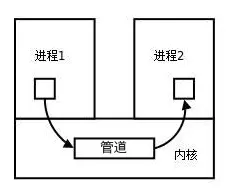
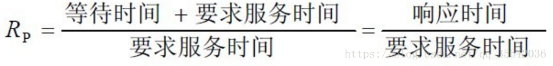

# os 面试题收集

- [os 面试题收集](#os-%e9%9d%a2%e8%af%95%e9%a2%98%e6%94%b6%e9%9b%86)
  - [select,poll,epoll 的区别](#selectpollepoll-%e7%9a%84%e5%8c%ba%e5%88%ab)
    - [IO 多路复用](#io-%e5%a4%9a%e8%b7%af%e5%a4%8d%e7%94%a8)
    - [select,poll,epoll 简介](#selectpollepoll-%e7%ae%80%e4%bb%8b)
      - [select](#select)
        - [编程接口](#%e7%bc%96%e7%a8%8b%e6%8e%a5%e5%8f%a3)
        - [实现原理](#%e5%ae%9e%e7%8e%b0%e5%8e%9f%e7%90%86)
        - [不足](#%e4%b8%8d%e8%b6%b3)
      - [poll](#poll)
        - [编程接口](#%e7%bc%96%e7%a8%8b%e6%8e%a5%e5%8f%a3-1)
        - [实现原理](#%e5%ae%9e%e7%8e%b0%e5%8e%9f%e7%90%86-1)
        - [不足](#%e4%b8%8d%e8%b6%b3-1)
      - [epoll](#epoll)
        - [编程接口](#%e7%bc%96%e7%a8%8b%e6%8e%a5%e5%8f%a3-2)
        - [实现原理](#%e5%ae%9e%e7%8e%b0%e5%8e%9f%e7%90%86-2)
        - [优点](#%e4%bc%98%e7%82%b9)
        - [操作模式](#%e6%93%8d%e4%bd%9c%e6%a8%a1%e5%bc%8f)
    - [select,poll,epoll 区别](#selectpollepoll-%e5%8c%ba%e5%88%ab)
  - [虚拟内存](#%e8%99%9a%e6%8b%9f%e5%86%85%e5%ad%98)
    - [内存发展历程](#%e5%86%85%e5%ad%98%e5%8f%91%e5%b1%95%e5%8e%86%e7%a8%8b)
    - [概念](#%e6%a6%82%e5%bf%b5)
    - [页面置换算法](#%e9%a1%b5%e9%9d%a2%e7%bd%ae%e6%8d%a2%e7%ae%97%e6%b3%95)
    - [虚拟内存的应用和优点](#%e8%99%9a%e6%8b%9f%e5%86%85%e5%ad%98%e7%9a%84%e5%ba%94%e7%94%a8%e5%92%8c%e4%bc%98%e7%82%b9)
  - [内存颠簸(thrashing)](#%e5%86%85%e5%ad%98%e9%a2%a0%e7%b0%b8thrashing)
    - [概念](#%e6%a6%82%e5%bf%b5-1)
    - [解决办法](#%e8%a7%a3%e5%86%b3%e5%8a%9e%e6%b3%95)
  - [程序的局部性原理](#%e7%a8%8b%e5%ba%8f%e7%9a%84%e5%b1%80%e9%83%a8%e6%80%a7%e5%8e%9f%e7%90%86)
  - [桥接(Bridging)](#%e6%a1%a5%e6%8e%a5bridging)
  - [Linux 查看 CPU,内存,每个核的 cpu](#linux-%e6%9f%a5%e7%9c%8b-cpu%e5%86%85%e5%ad%98%e6%af%8f%e4%b8%aa%e6%a0%b8%e7%9a%84-cpu)
  - [查看一个端口的 TCP 连接情况](#%e6%9f%a5%e7%9c%8b%e4%b8%80%e4%b8%aa%e7%ab%af%e5%8f%a3%e7%9a%84-tcp-%e8%bf%9e%e6%8e%a5%e6%83%85%e5%86%b5)
  - [Docker 的网络模式](#docker-%e7%9a%84%e7%bd%91%e7%bb%9c%e6%a8%a1%e5%bc%8f)
  - [Tcpdump](#tcpdump)
  - [大端和小端](#%e5%a4%a7%e7%ab%af%e5%92%8c%e5%b0%8f%e7%ab%af)
  - [docker 底层原理](#docker-%e5%ba%95%e5%b1%82%e5%8e%9f%e7%90%86)
  - [僵尸进程和孤儿进程的区别,怎么产生,怎么避免](#%e5%83%b5%e5%b0%b8%e8%bf%9b%e7%a8%8b%e5%92%8c%e5%ad%a4%e5%84%bf%e8%bf%9b%e7%a8%8b%e7%9a%84%e5%8c%ba%e5%88%ab%e6%80%8e%e4%b9%88%e4%ba%a7%e7%94%9f%e6%80%8e%e4%b9%88%e9%81%bf%e5%85%8d)
    - [介绍](#%e4%bb%8b%e7%bb%8d)
    - [问题及危害](#%e9%97%ae%e9%a2%98%e5%8f%8a%e5%8d%b1%e5%ae%b3)
    - [僵尸进程解决办法](#%e5%83%b5%e5%b0%b8%e8%bf%9b%e7%a8%8b%e8%a7%a3%e5%86%b3%e5%8a%9e%e6%b3%95)
  - [CPU 使用率和 CPU 负载](#cpu-%e4%bd%bf%e7%94%a8%e7%8e%87%e5%92%8c-cpu-%e8%b4%9f%e8%bd%bd)
  - [进程和线程以及它们的区别](#%e8%bf%9b%e7%a8%8b%e5%92%8c%e7%ba%bf%e7%a8%8b%e4%bb%a5%e5%8f%8a%e5%ae%83%e4%bb%ac%e7%9a%84%e5%8c%ba%e5%88%ab)
    - [进程和线程](#%e8%bf%9b%e7%a8%8b%e5%92%8c%e7%ba%bf%e7%a8%8b)
    - [区别](#%e5%8c%ba%e5%88%ab)
  - [进程间通信(IPC[InterProcess Communication])](#%e8%bf%9b%e7%a8%8b%e9%97%b4%e9%80%9a%e4%bf%a1ipcinterprocess-communication)
    - [概念](#%e6%a6%82%e5%bf%b5-2)
    - [IPC 的 7 种方式](#ipc-%e7%9a%84-7-%e7%a7%8d%e6%96%b9%e5%bc%8f)
      - [第一类:传统的 Unix 通信机制](#%e7%ac%ac%e4%b8%80%e7%b1%bb%e4%bc%a0%e7%bb%9f%e7%9a%84-unix-%e9%80%9a%e4%bf%a1%e6%9c%ba%e5%88%b6)
        - [管道/匿名管道(pipe)](#%e7%ae%a1%e9%81%93%e5%8c%bf%e5%90%8d%e7%ae%a1%e9%81%93pipe)
        - [命名管道(FIFO)](#%e5%91%bd%e5%90%8d%e7%ae%a1%e9%81%93fifo)
        - [匿名管道和命名管道总结](#%e5%8c%bf%e5%90%8d%e7%ae%a1%e9%81%93%e5%92%8c%e5%91%bd%e5%90%8d%e7%ae%a1%e9%81%93%e6%80%bb%e7%bb%93)
        - [信号(Signal)](#%e4%bf%a1%e5%8f%b7signal)
        - [消息队列(message queue)](#%e6%b6%88%e6%81%af%e9%98%9f%e5%88%97message-queue)
        - [共享内存(share memory)](#%e5%85%b1%e4%ba%ab%e5%86%85%e5%ad%98share-memory)
        - [信号量(semaphore)](#%e4%bf%a1%e5%8f%b7%e9%87%8fsemaphore)
        - [套接字(socket)](#%e5%a5%97%e6%8e%a5%e5%ad%97socket)
  - [线程同步方式](#%e7%ba%bf%e7%a8%8b%e5%90%8c%e6%ad%a5%e6%96%b9%e5%bc%8f)
  - [死锁](#%e6%ad%bb%e9%94%81)
    - [概念](#%e6%a6%82%e5%bf%b5-3)
    - [必要条件](#%e5%bf%85%e8%a6%81%e6%9d%a1%e4%bb%b6)
    - [死锁的处理基本策略和常用方法](#%e6%ad%bb%e9%94%81%e7%9a%84%e5%a4%84%e7%90%86%e5%9f%ba%e6%9c%ac%e7%ad%96%e7%95%a5%e5%92%8c%e5%b8%b8%e7%94%a8%e6%96%b9%e6%b3%95)
  - [进程状态](#%e8%bf%9b%e7%a8%8b%e7%8a%b6%e6%80%81)
    - [3 种基本态](#3-%e7%a7%8d%e5%9f%ba%e6%9c%ac%e6%80%81)
    - [五态模型](#%e4%ba%94%e6%80%81%e6%a8%a1%e5%9e%8b)
    - [细分进程状态及其转换](#%e7%bb%86%e5%88%86%e8%bf%9b%e7%a8%8b%e7%8a%b6%e6%80%81%e5%8f%8a%e5%85%b6%e8%bd%ac%e6%8d%a2)
  - [线程状态](#%e7%ba%bf%e7%a8%8b%e7%8a%b6%e6%80%81)
  - [内存管理-分页和分段](#%e5%86%85%e5%ad%98%e7%ae%a1%e7%90%86-%e5%88%86%e9%a1%b5%e5%92%8c%e5%88%86%e6%ae%b5)
    - [进程如何使用内存](#%e8%bf%9b%e7%a8%8b%e5%a6%82%e4%bd%95%e4%bd%bf%e7%94%a8%e5%86%85%e5%ad%98)
    - [逻辑地址,相对地址与物理地址](#%e9%80%bb%e8%be%91%e5%9c%b0%e5%9d%80%e7%9b%b8%e5%af%b9%e5%9c%b0%e5%9d%80%e4%b8%8e%e7%89%a9%e7%90%86%e5%9c%b0%e5%9d%80)
    - [内存管理技术](#%e5%86%85%e5%ad%98%e7%ae%a1%e7%90%86%e6%8a%80%e6%9c%af)
    - [分页](#%e5%88%86%e9%a1%b5)
    - [分段](#%e5%88%86%e6%ae%b5)
    - [分页,分段的特点](#%e5%88%86%e9%a1%b5%e5%88%86%e6%ae%b5%e7%9a%84%e7%89%b9%e7%82%b9)
    - [段页式结合](#%e6%ae%b5%e9%a1%b5%e5%bc%8f%e7%bb%93%e5%90%88)
    - [分段,分页区别](#%e5%88%86%e6%ae%b5%e5%88%86%e9%a1%b5%e5%8c%ba%e5%88%ab)
  - [进程调度策略](#%e8%bf%9b%e7%a8%8b%e8%b0%83%e5%ba%a6%e7%ad%96%e7%95%a5)
  - [进程同步机制](#%e8%bf%9b%e7%a8%8b%e5%90%8c%e6%ad%a5%e6%9c%ba%e5%88%b6)
  - [参考](#%e5%8f%82%e8%80%83)

## select,poll,epoll 的区别

### IO 多路复用

在网络通信中，select、poll、epoll 主要用于提供 IO 多路复用的解决方案。

**IO 多路复用**：指内核一旦发现进程指定的一个或多个 IO 条件准备读取，它就通知该进程。

**适用场景**：

1. 当客户处理多个描述符时(一般是交互式输入和网络套接口)，必须使用 I/O 复用。
2. 当一个客户同时处理多个套接口时，而这种情况是可能的，但很少出现。
3. 如果一个 TCP 服务器既要处理监听套接字，又要处理已连接套接口，一般也要用到 I/O 复用。
4. 如果一个服务器既要处理 TCP，又要处理 UDP，一般要使用 I/O 复用。
5. 如果一个服务器要处理多个服务或多个协议，一般要使用 I/O 复用。

与多进程和多线程技术相比，`I/O多路复用技术的最大优势是系统开销小，系统不必创建进程/线程`，也不必维护这些进程/线程，从而大大减小了系统的开销。

目前支持 I/O 多路复用的系统调用有 `select，pselect，poll，epoll`，I/O 多路复用就是`通过一种机制，一个进程可以监视多个描述符，一旦某个描述符就绪（一般是读就绪或者写就绪），能够通知程序进行相应的读写操作`。`但select，pselect，poll，epoll本质上都是同步I/O`，因为他们都需要在读写事件就绪后自己负责进行读写，也就是说这个读写过程是阻塞的，而异步 I/O 则无需自己负责进行读写，异步 I/O 的实现会负责把数据从内核拷贝到用户空间。

对于 IO 多路复用机制，可以参考[《聊聊 Linux 五种 IO 模型》](https://www.jianshu.com/p/486b0965c296)

- 同步阻塞 IO(blocking IO)
- 同步非阻塞 IO(nonblocking IO)
- IO 多路复用(IO multiplexing)
- 信号驱动式 IO(signal-driven IO)
- 异步非阻塞 IO(asynchronous IO)

### select,poll,epoll 简介

epoll 跟 select 都能提供多路 I/O 复用的解决方案。在现在的 Linux 内核里有都能够支持，**其中 epoll 是 Linux 所特有，而 select 则应该是 POSIX 所规定**，一般操作系统均有实现。

#### select

##### 编程接口

```c
#include <sys/select.h>
#include <sys/time.h>

int select(int nfds, fd_set *readfds, fd_set *writefds, fd_set *exceptfds, struct timeval *timeout);

//返回值：就绪描述符的数目，超时返回0，出错返回-1
```

- select 模型仅有一个函数 select();
- **nfds**：要监听的文件描述符的范围，通常使用 select 监听的所有描述符的最大值加 1；
- **readfds**：要监听是否有可读事件的文件描述符集
- **writefds**：要监听是否有可写事件的文件描述符集
- **exceptfds**：要监听是否有异常事件的文件描述符集
- **timeout**：超时时间

##### 实现原理

select 函数监视的文件描述符分 3 类，分别是 writefds、readfds、和 exceptfds。调用后 select 函数会阻塞，直到有描述符就绪（有数据 可读、可写、或者有 except），或者超时（timeout 指定等待时间，如果立即返回设为 null 即可），函数返回。当 select 函数返回后，可以通过遍历 fdset，来找到就绪的描述符。

理解 select I/O 复用模型的关键点在于 **fd_set**，这是一个整形数组，数组的每个成员的每一位都表示一个文件描述符。

在调用 select 的时候，用户空间将要检测的各种事件的文件描述符以 fd_set 整型数组的形式传递给内核空间。

内核空间通过轮询监听的描述符集判断是否有监听事件发生。如果某个描述符上有对应的监听事件发生，则该描述符对应的位置置 1， 跳出阻塞，执行 select 函数之后的代码； 否则，select 继续阻塞，CPU 资源让出给其他进程。

**流程图示**：


##### 不足

select 目前几乎在所有的平台上支持，`其良好跨平台支持也是它的一个优点`。`select的一个缺点在于单个进程能够监视的文件描述符的数量存在最大限制`。在 Linux 上一般是 1024，**可以通过修改宏定义甚至重新编译内核的方式提升这一限制**，但这样也会造成效率的降低。

`select本质上是通过设置或者检查存放fd标志位的数据结构来进行下一步处理`。这样所带来的缺点：

- select **最大的缺陷**就是单个进程所打开的 **FD 是有一定限制**的，它由 FD_SETSIZE 设置，默认值 **1024**。

> 一般来说这个数目和系统内存关系很大，具体数目可以 cat /proc/sys/fs/file-max 察看。32 位机默认是 1024 个。64 位机默认是 2048.

- 对 socket 进行扫描时是线性扫描，即采用**轮询**的方法，效率较低。

> 当套接字比较多的时候，每次 select()都要通过遍历 FD_SETSIZE 个 Socket 来完成调度，不管哪个 Socket 是活跃的，都遍历一遍。这会浪费很多 CPU 时间。如果能给套接字注册某个回调函数，当他们活跃时，自动完成相关操作，那就避免了轮询，这正是 epoll 与 kqueue 做的。

- select 模型中，向内核传递监听的描述符集合轮询检测监听事件都使用一个函数 select 实现，每一次执行 select 函数都要重新向内核空间传递表示监听描述符集的整型数组,需要**维护**一个用来**存放大量 fd 的数据结构**，这样会使得**用户空间和内核空间在传递该结构时复制开销大**。

#### poll

##### 编程接口

```c
#include <poll.h>
int poll(struct pollfd *fds, nfds_t nfds, int timeout);
```

##### 实现原理

`poll本质上和select没有区别，它将用户传入的数组拷贝到内核空间`，然后查询每个 fd 对于的设备状态，如果设备就绪则在设备等待队列中加入一项并继续遍历，如果遍历完所有 fd 后没有发现就绪设备，则挂起当前进程，直到设备就绪或主动超时，被唤醒后它又要再次遍历 fd。这个过程经历了多次无谓的遍历。

poll 模型使用**struct pollfd**结构体描述要监听的描述符集。

从性能或者是系统开销上看，poll 和 select 的差别不大，目前使用 select 模型的服务器较多，相比之下 poll 的使用并不广泛。

##### 不足

它没有最大连接数限制，`原因是它是基于链表存储的`，但同样有个缺点：

> 1. `大量的fd的数组被整体复制于用户态和内核地址空间之间`，而不管这样的复制是不是有意义。
> 2. `poll还有一个特点是“水平触发”`，如果报告了 fd 后，没有被处理，那么下次 poll 时会再次报告该 fd。

**注意**：

> 从上面看，select 和 poll 都需要在返回后，`通过遍历文件描述符来获取已经就绪的socket`。事实上，`同时连接的大量客户端在一时刻可能只有很少的处于就绪状态`，因此随着监视的描述符数量的增长，其效率也会线性下降。

#### epoll

##### 编程接口

与 select、poll 模型都只使用一个函数不同，epoll 模型用到了一组（三个）函数来实现 I/O 复用：

```c
#include <sys/epoll.h>
int epoll_create(int size); //
int epoll_ctl(int epfd, int op, int fd, struct epoll_event *event);
int epoll_wait(int epfd, struct epoll_event *events, int maxevents, int timeout);
```

这组函数的作用如下：

**epoll_create**：用于创建一个额外的文件描述符，该描述符用语标识服务器要监听的事件在内核中对应的事件表。

**epoll_ctl**： 用于操作参数 epfd（由之前的 epoll_create 函数生成）对应的内核事件表，如向事件表中注册、修改、删除事件。

**epoll_wait**：是 epoll 模型的主要函数，它用于（在超时时间 timeout 内）阻塞监听是否有我们关注（注册）的事件发生。

##### 实现原理

epoll 是在 2.6 内核中提出的，是之前的 select 和 poll 的增强版本。相对于 select 和 poll 来说，**epoll 更加灵活，没有描述符限制**。**epoll 使用一个文件描述符管理多个描述符，将用户关系的文件描述符的事件存放到内核的一个事件表中，这样在用户空间和内核空间的 copy 只需一次**。

> **epoll 支持水平触发和边缘触发，最大的特点在于边缘触发，它只告诉进程哪些 fd 刚刚变为就绪态，并且只会通知一次**。还有一个特点是，**epoll 使用“事件”的就绪通知方式**，通过 epoll_ctl 注册 fd，**一旦该 fd 就绪，内核就会采用类似 callback 的回调机制来激活该 fd**，epoll_wait 便可以收到通知。

首先，用户空间通过**epoll_ctl**函数将要监听的的各个描述符的事件传递给内核空间。另外，**epoll_ctl**会为每个描述符指定回调函数，当该描述符上有事件发生时，会调用回调函数，将文件描述符添加到一个就绪队列中去。

**epoll_wait**用于阻塞监听各个文件描述符是否有监听的事件发生，因为在**epoll_ctl**中我们为每个要监听的描述符指定了回调函数，因此**epoll_wait**不需要轮询检测各个文件描述符了，只需要判断就绪队列是否为空即可。

##### 优点

1. `没有最大并发连接的限制`，能打开的 FD 上限远大于 1024(1G 内存能监听约 10 万个端口)。
2. `效率提升，不是轮询的方式，不会随着FD数目的增加效率下降`。只有活跃可用的 FD 才会调用 callback 函数；`即Epoll最大的优点就在于它只管你“活跃”的连接，而跟连接总数无关`，因此在实际的网络环境中，Epoll 的效率就会远远高于 select 和 poll。
3. `内存拷贝`，利用 mmap()文件映射内存加速与内核空间的消息传递`；即epoll使用mmap减少复制开销`。

##### 操作模式

**epoll 对文件描述符的操作有两种模式：LT（level trigger）和 ET（edge trigger）。LT 模式是默认模式，LT 模式与 ET 模式的区别如下**：

1. LT 模式：当 epoll_wait 检测到描述符事件发生并将此事件通知应用程序，应用程序可以不立即处理该事件。下次调用 epoll_wait 时，会再次响应应用程序并通知此事件。
2. ET 模式：当 epoll_wait 检测到描述符事件发生并将此事件通知应用程序，应用程序必须立即处理该事件。如果不处理，下次调用 epoll_wait 时，不会再次响应应用程序并通知此事件。

**LT 模式**

`LT(level triggered)是缺省的工作方式，并且同时支持block和no-block socket`。在这种做法中，内核告诉你一个文件描述符是否就绪了，然后你可以对这个就绪的 fd 进行 IO 操作。`如果你不作任何操作，内核还是会继续通知你的`。

**ET 模式**

`ET(edge-triggered)是高速工作方式，只支持no-block socket`。在这种模式下，当描述符从未就绪变为就绪时，内核通过 epoll 告诉你。然后它会假设你知道文件描述符已经就绪，并且不会再为那个文件描述符发送更多的就绪通知，直到你做了某些操作导致那个文件描述符不再为就绪状态了(比如，你在发送，接收或者接收请求，或者发送接收的数据少于一定量时导致了一个 EWOULDBLOCK 错误）。`但是请注意，如果一直不对这个fd作IO操作(从而导致它再次变成未就绪)，内核不会发送更多的通知(only once)`。

`ET 模式在很大程度上减少了 epoll 事件被重复触发的次数，因此效率要比 LT 模式高`。epoll 工作在 ET 模式的时候，必须使用`非阻塞套接口`，以避免由于一个文件句柄的阻塞读/阻塞写操作把处理多个文件描述符的任务饿死。

在 select/poll 中，`进程只有在调用一定的方法后，内核才对所有监视的文件描述符进行扫描`，而 epoll 事先通过 epoll_ctl()来注册一个文件描述符，`一旦基于某个文件描述符就绪时，内核会采用类似callback的回调机制`，迅速激活这个文件描述符，当进程调用 epoll_wait()时便得到通知。(`此处去掉了遍历文件描述符，而是通过监听回调的的机制。这正是epoll的魅力所在。`)

**注意**：

> 如果没有大量的 idle-connection 或者 dead-connection，epoll 的效率并不会比 select/poll 高很多，但是当遇到大量的 idle-connection，就会发现 epoll 的效率大大高于 select/poll。

### select,poll,epoll 区别

- **支持一个进程所能打开的最大连接数**


- **FD 剧增后带来的 IO 效率问题**


- **消息传递方式**


综上，在选择 select，poll，epoll 时要根据具体的使用场合以及这三种方式的自身特点：

1. 表面上看 epoll 的性能最好，`但是在连接数少并且连接都十分活跃的情况下，select和poll的性能可能比epoll好`，毕竟 epoll 的通知机制需要很多函数回调。
2. `select低效是因为每次它都需要轮询`。但低效也是相对的，视情况而定，也可通过良好的设计改善。

## 虚拟内存

### 内存发展历程

**没有内存抽象**(单进程，除去操作系统所用的内存之外，全部给用户程序使用) —> **有内存抽象**（多进程，进程独立的地址空间，交换技术(内存大小不可能容纳下所有并发执行的进程)
）—> **连续内存分配**(固定大小分区(多道程序的程度受限)，可变分区(首次适应，最佳适应，最差适应)，碎片) —> **不连续内存分配**（分段，分页，段页式，虚拟内存）

### 概念

**虚拟内存**是计算机系统内存管理的一种技术。它使得应用程序认为它拥有连续的可用内存（一个连续完整的地址空间），而实际上，它通常是被分隔成多个物理内存碎片，还有部分暂时存储在外部磁盘存储器上，在需要时进行数据交换。

虚拟内存允许执行进程不必完全在内存中。虚拟内存的**基本思想**是：`每个进程拥有独立的地址空间，这个空间被分为大小相等的多个块，称为页(Page)`，`每个页都是一段连续的地址。这些页被映射到物理内存，但并不是所有的页都必须在内存中才能运行程序`。当程序引用到一部分在物理内存中的地址空间时，由硬件立刻进行必要的映射；当程序引用到一部分不在物理内存中的地址空间时，由操作系统负责将缺失的部分装入物理内存并重新执行失败的命令。这样，**对于进程而言，逻辑上似乎有很大的内存空间，实际上其中一部分对应物理内存上的一块(称为帧，通常页和帧大小相等)，还有一些没加载在内存中的对应在硬盘上。**注意，请求分页系统、请求分段系统和请求段页式系统都是针对虚拟内存的，通过请求实现内存与外存的信息置换。


虚拟内存实际上可以比物理内存大。当访问虚拟内存时，会访问 MMU（内存管理单元）去匹配对应的物理地址（比如图中的 0，1，2）。如果虚拟内存的页并不存在于物理内存中（如图中的 3,4），会产生缺页中断，从磁盘中取得缺的页放入内存，如果内存已满，还会根据某种算法将磁盘中的页换出。

### 页面置换算法

- **FIFO(先进先出)算法**：在操作系统中经常被用到，比如作业调度；
- **LRU（Least recently use）最近最少使用算法**：根据使用时间到现在的长短来判断；
- **LFU（Least frequently use）最少使用次数算法**：根据使用次数来判断；
- **OPT（Optimal replacement）最优置换算法**：理论的最优，理论(实际上是不可能实现的)；就是要保证置换出去的是不再被使用的页，或者是在实际内存中最晚使用的算法。

### 虚拟内存的应用和优点

虚拟内存很**适合在多道程序设计系统**中使用，许多程序的片段同时保存在内存中。当一个程序等待它的一部分读入内存时，可以把 CPU 交给另一个进程使用。虚拟内存的使用可以带来以下好处：

- 在内存中可以保留多个进程，系统并发度提高
- 解除了用户与内存之间的紧密约束，进程可以比内存的全部空间还大

## 内存颠簸(thrashing)

### 概念

颠簸本质上是指`频繁的页调度行为`，具体来讲，进程发生缺页中断，这时，必须置换某一页。然而，其他所有的页都在使用，它置换一个页，但又立刻再次需要这个页。因此，会不断产生缺页中断，导致整个系统的效率急剧下降，这种现象称为颠簸（抖动）。

### 解决办法

内存颠簸的解决策略包括：

- 如果是因为页面替换**策略失误**，**可以修改替换算法**来解决这个问题；
- 如果是因为**运行的程序太多**，造成程序无法同时将所有频繁访问的页面调入内存，则要**降低多道程序的数量**；
- 否则，还剩下两个办法：终止该进程或增加物理内存容量。

## 程序的局部性原理

**程序的局部性原理**：指程序在执行时呈现出局部性规律，即在一段时间内，整个程序的执行仅限于程序中的某一部分。相应地，执行所访问的存储空间也局限于某个内存区域。

- **时间局部性**：最近被访问的页在不久的将来还会被访问；如果某数据被访问，则不久之后该数据可能再次被访问；程序中的某条指令一旦执行，则不久之后该指令可能再次被执行。
- **空间局部性**：内存中被访问的页周围的页也很可能被访问；一旦程序访问了某个存储单元，则不久之后。其附近的存储单元也将被访问；

## 桥接(Bridging)

**桥接**是指依据 OSI 网络模型的链路层的地址，对网络数据包进行转发的过程，工作 在 OSI 的第二层；一般的交换机，网桥就有桥接作用。

## Linux 查看 CPU,内存,每个核的 cpu

top 命令

在 top 查看界面按数字 1 即可查看每个核的数据

## 查看一个端口的 TCP 连接情况

netstat

## Docker 的网络模式

docker run 创建 Docker 容器时，可以用–net 选项指定容器的网络模式

- bridge 网络
- host 网络
- none 网络
- container 模式

## Tcpdump

tcpdump 网络数据包截获分析工具。支持针对网络层、协议、主机、网络或端口 的过滤。并提供 and、or、not 等逻辑语句帮助去除无用的信息。

- [Linux 基础：用 tcpdump 抓包](https://www.cnblogs.com/chyingp/p/linux-command-tcpdump.html)
- [Manpage of TCPDUMP](https://www.tcpdump.org/manpages/tcpdump.1.html)
- [A tcpdump Tutorial with Examples — 50 Ways to Isolate Traffic](https://danielmiessler.com/study/tcpdump/)

## 大端和小端

1. Little-Endian（小端）就是低位字节排放在内存的低地址端，高位字节排放在内存的高地址端
2. Big-Endian（大端）就是高位字节排放在内存的低地址端，低位字节排放在内存的高地址端。

一般**操作系统**都是小端的，而**通信协议**是大端的

## docker 底层原理

- [查看资料](https://draveness.me/docker)
- [左耳朵耗子 Docker 基础技术介绍(有例程)](https://coolshell.cn/tag/docker)

## 僵尸进程和孤儿进程的区别,怎么产生,怎么避免

### 介绍

- [孤儿进程、僵尸进程和守护进程](https://www.cnblogs.com/lxmhhy/p/6212405.html)

在 unix/linux 中，正常情况下，子进程是通过父进程创建的，子进程在创建新的进程。子进程的结束和父进程的运行是一个异步过程,即父进程永远无法预测子进程 到底什么时候结束。 当一个 进程完成它的工作终止之后，它的父进程需要调用 `wait()`或者 `waitpid()`系统调用取得子进程的终止状态。

**孤儿进程**：指其父进程执行完成或被终止后仍然继续运行的一类进程。孤儿进程将被**init 进程(PID=1)**所收养，并由 init 进程对它们完成状态收集工作。
**僵尸进程**：一个进程使用 fork 创建子进程，如果子进程退出，而父进程并没有调用 wait 或 waitpid 获取子进程的状态信息，那么**子进程的进程描述符仍然保存在系统中**。这种进程称之为僵死进程。
**守护进程(daemon)**：一种在后台运行的程序。此类程序会被以进程的形式初始化。 守护进程程序的名称通常以字母“d”结尾：例如，syslogd 就是指管理系统日志的守护进程。

### 问题及危害

unix 提供了一种机制可以保证只要父进程想知道子进程结束时的状态信息， 就可以得到。这种机制就是: `在每个进程退出的时候,内核释放该进程所有的资源,包括打开的文件,占用的内存等`。但是仍然为其保留一定的信息(包括进程号 the process ID,退出状态 the termination status of the process,运行时间 the amount of CPU time taken by the process 等)。直到父进程通过 wait / waitpid 来取时才释放。 但这样就导致了问题，`如果进程不调用 wait / waitpid 的话， 那么保留的那段信息就不会释放，其进程号就会一直被占用，但是系统所能使用的进程号是有限的，如果大量的产生僵死进程，将因为没有可用的进程号而导致系统不能产生新的进程. 此即为僵尸进程的危害，应当避免`。

`孤儿进程是没有父进程的进程，孤儿进程的善后工作就落到了init进程身上`，每当出现一个孤儿进程的时候，内核就把孤 儿进程的父进程设置为 init，而 init 进程会循环地 wait()它的已经退出的子进程。`因此孤儿进程并不会有什么危害`。

`任何一个子进程(init 除外)在 exit()之后，并非马上就消失掉，而是留下一个称为僵尸进程(Zombie)的数据结构，等待父进程处理`。这是每个子进程在结束时都要经过的阶段。如果子进程在 exit()之后，父进程没有来得及处理，这时用 ps 命令就能看到子进程的状态是“Z”。如果父进程能及时处理，可能用 ps 命令就来不及看到子进程的僵尸状态，但这并不等于子进程不经过僵尸状态。 如果父进程在子进程结束之前退出，则子进程将由 init 接管。init 将会以父进程的身份对僵尸状态的子进程进行处理。

### 僵尸进程解决办法

- **通过信号机制**：子进程退出时向父进程发送 SIGCHILD 信号，父进程处理 SIGCHILD 信号。在信号处理函数中调用 wait 进行处理僵尸进程。
- **fork 两次**：原理是将子进程成为孤儿进程，从而其的父进程变为 init 进程，通过 init 进程可以处理僵尸进程。

## CPU 使用率和 CPU 负载

- [查看资料](https://www.cnblogs.com/muahao/p/6492665.html)

**CPU 使用率**：反映当前 cpu 的繁忙程度。忽高忽低的原因在于占用 cpu 处理时间的进程可能处于 io 等待状态但却还未释放进入 wait。

**平均负载（load average）**：指某段时间内占用 cpu 时间的进程和等待 cpu 时间的进程数，这里等待 cpu 时间的进程是指等待被唤醒的进程，不包括处于 wait 状态进程。

## 进程和线程以及它们的区别

### 进程和线程

- **进程**：是对**运行时程序**的封装，是系统进行资源调度和分配的基本单位，实现操作系统的并发
- **线程**：线程是进程的一个实体，是 CPU 调度和分派的基本单位，实现了进程内部的并发；线程可与同属一个进程的其他的线程共享进程所拥有的全部资源；一个线程可以创建和撤销另一个线程; 同一个进程中的多个线程之间可以并发执行.

简而言之：一个程序至少有一个进程，一个进程至少有一个线程。进程拥有独立的内存单元，多个线程共享进程的内存。

### 区别

进程和线程的主要差别在于它们是不同的操作系统资源管理方式。进程有独立的地址空间，一个进程崩溃后，在保护模式下不会对其它进程产生影响，而线程只是一个进程中的不同执行路径。线程有自己的堆栈和局部变量，但线程之间没有单独的地址空间，一个线程死掉就等于整个进程死掉，所以多进程的程序要比多线程的程序健壮，但在进程切换时，耗费资源较大，效率要差一些。但对于一些要求同时进行并且又要共享某些变量的并发操作，只能用线程，不能用进程。

## 进程间通信(IPC[InterProcess Communication])

### 概念

每个进程有独立的用户地址空间，任何进程的全局变量在另一个进程中都看不见，使所以**进程间要交换数据必须通过内核**，在**内核中开辟一块缓存区**，进程 1 把数据从用户空间拷贝到内核缓冲区，进程 2 再从内核缓冲区把数据读走，内核提供的这种机制称为进程间通信(IPC)。


### IPC 的 7 种方式

#### 第一类:传统的 Unix 通信机制

##### 管道/匿名管道(pipe)

- 管道时半双工，数据只能向一个方向流动；需要双方通信时，需要建立两个管道；
- 只用于父子进程或兄弟进程之间(有亲缘关系的进程)；
- 单独构成一种独立的文件系统：管道对于管道两端的进程而言，就是一个文件，但不是普通的文件，它不属于某种文件系统，而是自立门户，单独构成一种文件系统，并且只存在于内存中。
- 数据读入和读出：一个进程向管道中写的内容被管道另一端的进程读出。写入的内容每次都添加在管道缓冲区的末尾，并且每次都是从缓冲区的头部读出数据。



**实质**：

管道的`实质是一个内核缓冲区`，进程以先进先出的方式从缓冲区存取数据，管道一端的进程顺序的将数据写入缓冲区，另一端的进程则顺序的读出数据。
该缓冲区可以看做是一个循环队列，读和写的位置都是自动增长的，不能随意改变，一个数据只能被读一次，读出来以后在缓冲区就不复存在了。
当缓冲区读空或者写满时，有一定的规则控制相应的读进程或者写进程进入等待队列，当空的缓冲区有新数据写入或者满的缓冲区有数据读出来时，就唤醒等待队列中的进程继续读写。

**管道局限性**：

管道的主要局限性正体现在它的特点上：

- 只支持**单向**数据流；
- 只能用于具有**亲缘**关系的**进程**之间；
- 没有名字(**匿名**)；
- 管道的缓冲区是**有限**的（管道制存在于内存中，在管道创建时，为缓冲区分配一个页面大小）；
- 管道所传送的是**无格式字节流**，这就要求管道的读出方和写入方必须事先约定好数据的格式，比如多少字节算作一个消息（或命令、或记录）等等；

##### 命名管道(FIFO)

命名管道不同于匿名管道之处在于它`提供一个路径名与之关联`，**以命名管道的文件形式存在于文件系统中**，**即使与命名管道的创建进程不存在亲缘关系的进程，只要可以访问该路径，就能够彼此通过命名管道相互通信**，值的注意的是，命名管道严格遵循**先进先出(first in first out)**,对匿名管道及有名管道的读总是从开始处返回数据，对它们的写则把数据添加到末尾。它们不支持诸如 lseek()等文件定位操作。**命名管道的名字存在于文件系统中，内容存放在内存中**。

##### 匿名管道和命名管道总结

1. 管道是**特殊类型的文件**，在满足**先入先出**的原则条件下可以进行读写，但**不能进行定位读写**。
2. 匿名管道是单向的，只能在有亲缘关系的进程间通信；命名管道以磁盘文件的方式存在，可以实现本机任意两个进程通信。
3. 匿名管道阻塞问题：匿名管道无需显示打开，创建时直接返回文件描述符，在**读写时需要确定对方的存在，否则将退出**。如果当前进程向匿名管道的一端写数据，必须确定另一端有某一进程。如果写入匿名管道的**数据超过其最大值，写操作将阻塞，如果管道中没有数据，读操作将阻塞**，如果**管道发现另一端断开，将自动退出**。
4. 命名管道阻塞问题：命名管道在打开时**需要确任对方的存在，否则将阻塞**。即以读方式打开某管道，在此之前必须一个进程以写方式打开管道，否则阻塞。此外，**可以以读写（O_RDWR）模式打开命名管道**，即当前进程读，当前进程写，不会阻塞。

##### 信号(Signal)

- 信号是 Linux 系统中用于进程间相互通信或者操作的一种机制，信号可以在任何时候发给某一进程，二无需知道该进程的状态。
- 如果该进程当前并未处于执行状态，则该信号就由内核保存起来，直到该进程恢复执行并传递给它为止。
- 如果一个信号被进程设置为阻塞，则该信号的传递被延迟，直到其阻塞被取消时才被传递给进程。

> Linux 系统常用信号：
>
> 1. **SIGHUP**：`用户从终端注销`，所有已启动进程都将收到该信号。系统缺省状态下对该信号的处理是终止进程。
> 2. **SIGINT**：程序终止信号。程序运行过程中，按`Ctrl+C`键将产生该信号。
> 3. **SIGQUIT**：程序退出信号。程序运行过程中，按`Ctrl+\\`键将产生该信号。
> 4. **SIGBUS 和 SIGSEGV**：进程访问非法地址。
> 5. **SIGFPE**：运算中出现致命错误，如除零操作、数据溢出等。
> 6. **SIGKILL**：用户终止进程执行信号。shell 下执行 kill -9 发送该信号。
> 7. **SIGTERM**：结束进程信号。shell 下执行 kill 进程 pid 发送该信号。
> 8. **SIGALRM**：定时器信号。
> 9. **SIGCLD**：子进程退出信号。如果其父进程没有忽略该信号也没有处理该信号，则子进程退出后将形成僵尸进程。

**信号来源**：

信号是软件层次上对中断机制的一种模拟，是一种异步通信方式，信号可以在用户空间进程和内核之间直接交互，内核可以利用信号来通知用户空间的进程发生了哪些系统事件，信号事件主要有两个来源：

- **硬件来源**：用户按键输入 Ctrl+C 退出、硬件异常如无效的存储访问等。
- **软件终止**：终止进程信号、其他进程调用 kill 函数、软件异常产生信号。

**信号生命周期和处理流程**

1. 信号被某个进程产生，并设置此信号传递的对象（一般为对应进程的 pid），然后传递给操作系统；
2. 操作系统根据接收进程的设置（是否阻塞）而选择性的发送给接收者，如果接收者阻塞该信号（且该信号是可以阻塞的），操作系统将暂时保留该信号，而不传递，直到该进程解除了对此信号的阻塞（如果对应进程已经退出，则丢弃此信号），如果对应进程没有阻塞，操作系统将传递此信号。
3. 目的进程接收到此信号后，将根据当前进程对此信号设置的预处理方式，暂时终止当前代码的执行，保护上下文（主要包括临时寄存器数据，当前程序位置以及当前 CPU 的状态）、转而执行中断服务程序，执行完成后在回复到中断的位置。当然，对于抢占式内核，在中断返回时还将引发新的调度。


##### 消息队列(message queue)

- 消息队列是存放在内核中的消息链表，每个消息队列由消息队列标识符表示。
- 与管道（匿名管道：只存在于内存中的文件；命名管道：存在于实际的磁盘介质或者文件系统）不同的是消息队列存放在内核中，只有在内核重启(即，操作系统重启)或者显示地删除一个消息队列时，该消息队列才会被真正的删除。
- 另外与管道不同的是，消息队列在某个进程往一个队列写入消息之前，并不需要另外某个进程在该队列上等待消息的到达。

> **消息队列特点终结**：
>
> 1. 消息队列是消息的链表,具有特定的格式,存放在内存中并由消息队列标识符标识.
> 2. 消息队列允许一个或多个进程向它写入与读取消息.
> 3. 管道和消息队列的通信数据都是先进先出的原则。
> 4. 消息队列可以实现消息的随机查询,消息不一定要以先进先出的次序读取,也可以按消息的类型读取.比 FIFO 更有优势。
> 5. 消息队列克服了信号承载信息量少，管道只能承载无格式字节流以及缓冲区大小受限等缺。
> 6. 目前主要有两种类型的消息队列：POSIX 消息队列以及 System V 消息队列，System V 消息队列目前被大量使用。System V 消息队列是随内核持续的，只有在内核重起或者人工删除时，该消息队列才会被删除。

##### 共享内存(share memory)

- 使得多个进程可以可以直接读写同一块内存空间，是最快的可用 IPC 形式。是针对其他通信机制运行效率较低而设计的。
- 为了在多个进程间交换信息，内核专门留出了一块内存区，可以由需要访问的进程将其映射到自己的私有地址空间。进程就可以直接读写这一块内存而不需要进行数据的拷贝，从而大大提高效率。
- 由于多个进程共享一段内存，因此需要依靠某种同步机制（如信号量）来达到进程间的同步及互斥。


##### 信号量(semaphore)

信号量是一个计数器，用于多进程对共享数据的访问，信号量的意图在于**进程间同步**。

为了获得共享资源，进程需要执行下列操作：

1. **创建一个信号量**：这要求调用者指定初始值，对于二值信号量来说，它通常是 1，也可是 0。
2. **等待一个信号量**：该操作会测试这个信号量的值，如果小于 0，就阻塞。也称为 P 操作。
3. **挂出一个信号量**：该操作将信号量的值加 1，也称为 V 操作。

为了正确地实现信号量，信号量值的测试及减 1 操作应当是原子操作。为此，信号量通常是在内核中实现的。Linux 环境中，有三种类型：**Posix（可移植性操作系统接口）命名信号量（使用 Posix IPC 名字标识）、Posix 基于内存的信号量（存放在共享内存区中）、System V 信号量（在内核中维护）**。这三种信号量都可用于进程间或线程间的同步。

- 两个进程使用一个二值信号量


- 两个进程使用一个 Posix 命名信号量


- 一个进程两个线程共享基于内存的信号量


> **信号量与普通整型变量的区别**：
>
> 1. 信号量是非负整型变量，除了初始化之外，它只能通过两个标准原子操作：wait(semap) , signal(semap) ; 来进行访问；
> 2. 操作也被成为 PV 原语（P 来源于荷兰语 proberen"测试"，V 来源于荷兰语 verhogen"增加"，P 表示通过的意思，V 表示释放的意思），而普通整型变量则可以在任何语句块中被访问；

> **信号量与互斥量之间的区别**:
>
> 1. 互斥量用于线程的互斥，信号量用于线程的同步。这是互斥量和信号量的根本区别，也就是互斥和同步之间的区别。
>
>    **互斥**：是指某一资源同时只允许一个访问者对其进行访问，具有唯一性和排它性。但互斥无法限制访问者对资源的访问顺序，即访问是无序的。
>
>    **同步**：是指在互斥的基础上（大多数情况），通过其它机制实现访问者对资源的有序访问。
>    在大多数情况下，同步已经实现了互斥，特别是所有写入资源的情况必定是互斥的。少数情况是指可以允许多个访问者同时访问资源
>
> 2. 互斥量值只能为 0/1，信号量值可以为非负整数。
>    也就是说，一个互斥量只能用于一个资源的互斥访问，它不能实现多个资源的多线程互斥问题。信号量可以实现多个同类资源的多线程互斥和同步。当信号量为单值信号量是，也可以完成一个资源的互斥访问。
> 3. 互斥量的加锁和解锁必须由同一线程分别对应使用，信号量可以由一个线程释放，另一个线程得到。

##### 套接字(socket)

套接字是一种**通信机制**，凭借这种机制，客户/服务器（即要进行通信的进程）系统的开发工作既可以**在本地单机上进行，也可以跨网络进行**。也就是说它可以让不在同一台计算机但通过网络连接计算机上的进程进行通信。


套接字是支持 TCP/IP 的网络通信的基本操作单元，可以看做是不同主机之间的进程进行双向通信的端点，简单的说就是通信的两方的一种约定，用套接字中的相关函数来完成通信过程。

**套接字特性**：

套接字的特性由 3 个属性确定，它们分别是：**域**、**端口号**、**协议类型**。

**套接字的域**：

它指定套接字通信中使用的网络介质，最常见的套接字域有两种：

- **AF_INET**：它指的是 Internet 网络。当客户使用套接字进行跨网络的连接时，它就需要用到服务器计算机的 IP 地址和端口来指定一台联网机器上的某个特定服务，所以在使用 socket 作为通信的终点，服务器应用程序必须在开始通信之前绑定一个端口，服务器在指定的端口等待客户的连接。
- **AF_UNIX**：表示 UNIX 文件系统。它就是文件 I/O，而它的地址就是文件名。

**套接字的端口号**：

每一个基于 TCP/IP 网络通讯的程序(进程)都被赋予了唯一的端口和端口号，端口是一个信息缓冲区，用于保留 Socket 中的 I/O 信息，端口号是一个 16 位无符号整数，范围是 0-65535，以区别主机上的每一个程序（端口号就像房屋中的房间号），低于 256 的端口号保留给标准应用程序，比如 pop3 的端口号就是 110，每一个套接字都组合进了 IP 地址、端口，这样形成的整体就可以区别每一个套接字。

**套接字协议类型**：

因特网提供三种通信机制

- **流套接字**：流套接字在域中通过**TCP/IP**连接实现，同时也是 AF_UNIX 中常用的套接字类型。流套接字提供的是一个有序、可靠、双向字节流的连接，因此发送的数据可以确保不会丢失、重复或乱序到达，而且它还有一定的出错后重新发送的机制。
- **数据报套接字**：它`不需要建立连接和维持一个连接`，它们在域中通常是通过**UDP/IP**协议实现的。它对可以发送的数据的长度有限制，数据报作为一个单独的网络消息被传输,它可能会丢失、复制或错乱到达，UDP 不是一个可靠的协议，但是它的速度比较高，因为它并一需要总是要建立和维持一个连接。
- **原始套接字**：原始套接字`允许对较低层次的协议直接访问`，比如 IP、 ICMP 协议，它常用于检验新的协议实现，或者访问现有服务中配置的新设备，因为 RAW SOCKET 可以自如地控制 Windows 下的多种协议，能够对网络底层的传输机制进行控制，所以可以应用原始套接字来操纵网络层和传输层应用。比如，我们可以通过 RAW SOCKET 来接收发向本机的 ICMP、IGMP 协议包，或者接收 TCP/IP 栈不能够处理的 IP 包，也可以用来发送一些自定包头或自定协议的 IP 包。网络监听技术很大程度上依赖于 SOCKET_RAW。

> **原始套接字与标准套接字的区别在于**：
> 原始套接字可以读写内核没有处理的 IP 数据包，而流套接字只能读取 TCP 协议的数据，数据报套接字只能读取 UDP 协议的数据。因此，如果要访问其他协议发送数据必须使用原始套接字。

**套接字通信的建立**：


**服务器端**：

1. 首先服务器应用程序用系统调用 socket 来创建一个套接字，它是系统分配给该服务器进程的类似文件描述符的资源，它不能与其他的进程共享。
2. 然后，服务器进程会给套接字起个名字，我们使用系统调用 bind 来给套接字命名。然后服务器进程就开始等待客户连接到这个套接字。
3. 接下来，系统调用 listen 来创建一个队列并将其用于存放来自客户的进入连接。
4. 最后，服务器通过系统调用 accept 来接受客户的连接。它会创建一个与原有的命名套接不同的新套接字，这个套接字只用于与这个特定客户端进行通信，而命名套接字（即原先的套接字）则被保留下来继续处理来自其他客户的连接（建立客户端和服务端的用于通信的流，进行通信）。

**客户端**：

1. 客户应用程序首先调用 socket 来创建一个未命名的套接字，然后将服务器的命名套接字作为一个地址来调用 connect 与服务器建立连接。
2. 一旦连接建立，我们就可以像使用底层的文件描述符那样用套接字来实现双向数据的通信（通过流进行数据传输）。

## 线程同步方式

- **线程同步**：就是协同步调，按预定的先后次序进行运行。
- **线程互斥**：是指对于共享的进程系统资源，在各单个线程访问时的排它性。

**临界区（Critical Section）、互斥对象（Mutex）**：主要用于互斥控制；都具有拥有权的控制方法，只有拥有该对象的线程才能执行任务，所以拥有，执行完任务后一定要释放该对象。
**信号量（Semaphore）、事件对象（Event）**：事件对象是以通知的方式进行控制，主要用于同步控制！

- **临界区**：通过对多线程的串行化来访问公共资源或一段代码，速度快，适合控制数据访问。在任意时刻只允许一个线程对共享资源进行访问，其他线程此时将被挂起。**它并不是内核对象，不属于操作系统维护的，而是属于进程维护的。**
- **互斥对象 Mutex**：互斥对象和临界区很像，采用互斥对象机制，只有拥有互斥对象的线程才有访问公共资源的权限。因为互斥对象只有一个，所以能保证公共资源不会同时被多个线程同时访问。它是内核对象，与临时区都有“线程所有权”，所以不能用于线程同步。
- **信号量 Semphare**：信号量也是内核对象，它允许同一时刻多个线程访问同一资源，但是需要控制同一时刻访问此资源的最大线程数量
- **事件(信号)，Wait/Notify**：它也是内核对象，通过通知操作的方式来保持多线程同步，还可以方便的实现多线程优先级的比较操作

## 死锁

### 概念

在两个或多个并发进程中，如果每个进程持有某种资源而又等待其它进程释放它或它们现在保持着的资源，在未改变这种状态之前都不能向前推进，称这一组进程产生了死锁。通俗的讲，就是两个或多个进程无限期的阻塞、相互等待的一种状态。

### 必要条件

1. **互斥**：至少有一个资源必须属于非共享模式，即一次只能被一个进程使用；若其他申请使用该资源，那么申请进程必须等到该资源被释放为止；
2. **请求与保持**：一个进程必须占有至少一个资源，并等待另一个资源，而该资源为其他进程所占有；
3. **不可剥夺**：进程不能被抢占，即资源只能被进程在完成任务后自愿释放；
4. **循环等待**：若干进程之间形成一种头尾相接的环形等待资源关系。

### 死锁的处理基本策略和常用方法

解决死锁的基本方法主要有 预防死锁、避免死锁、检测死锁、解除死锁 、鸵鸟策略 等。

- **预防死锁**

死锁预防的基本思想是 `只要确保死锁发生的四个必要条件中至少有一个不成立，就能预防死锁的发生`，具体方法包括：

1. 破坏请求和保持条件：资源一次性分配；
2. 破坏不可剥夺条件：当某进程新的资源未满足时，释放已占有的资源；
3. 破坏环路等待条件：资源有序分配法：系统给每类资源赋予一个编号，每一个进程按编号递增的顺序请求资源，释放则相反；

- **避免死锁**

预防死锁的几种策略，会严重地损害系统性能。因此在避免死锁时，要施加较弱的限制，从而获得 较满意的系统性能。

由于在避免死锁的策略中，允许进程动态地申请资源。因而，系统在进行资源分配之前`预先计算资源分配的安全性`。若此次分配不会导致系统进入不安全状态，则将资源分配给进程；否则，进程等待。其中最具有代表性的避免死锁算法是银行家算法。

- **检测死锁**

首先为每个进程和每个资源指定一个唯一的号码，然后建立资源分配表和进程等待表。

- **解除死锁**

死锁解除的常用两种方法为**进程终止**和**资源抢占**。所谓进程终止是指简单地终止一个或多个进程以打破循环等待，包括两种方式：**终止所有死锁进程和一次只终止一个进程直到取消死锁循环为止**；**所谓资源抢占是指从一个或多个死锁进程那里抢占一个或多个资源**，此时必须考虑三个问题：

- 选择一个牺牲品
- 回滚：回滚到安全状态
- 饥饿（在**代价因素中加上回滚次数**，回滚的越多则越不可能继续被作为牺牲品，避免一个进程总是被回滚）

## 进程状态

### 3 种基本态

进程一般有 3 种基本状态：**运行**、**就绪**和**阻塞**。

- **就绪状态**：进程已获得除处理机以外的所需资源。就绪进程可以`按多个优先级来划分队列`。例如，当一个进程由于时间片用完而进入就绪状态时，排入低优先级队列；当进程由 I／O 操作完成而进入就绪状态时，排入高优先级队列。
- **运行状态**：占用处理机资源运行，处于此状态的进程数小于等于 CPU 数；
- **阻塞状态**：也称为等待或睡眠状态，进程等待某种条件(例如请求 I/O 而等待 I/O 完成等)，在条件满足之前无法执行，这时即使把处理机分配给进程也无法运行；


### 五态模型

**五态模型**：对于一个实际的系统，进程的状态及其转换更为复杂。引入**新建态**和**终止态**构成了进程的五态模型。

- **新建态**：对应于进程刚刚被创建时没有被提交的状态，并等待系统完成创建进程的所有必要信息。进程正在创建过程中，还不能运行。操作系统在创建状态要进行的工作包括分配和建立进程控制块表项、建立资源表格（如打开文件表）并分配资源、加载程序并建立地址空间表等。创建进程时分为两个阶段：

  - 第一个阶段为一个新进程创建必要的管理信息；
  - 第二个阶段让该进程进入就绪状态。

  由于有了新建态，操作系统往往可以根据系统的性能和主存容量的限制推迟新建态进程的提交。

- **终止态**：进程已结束运行，**回收除进程控制块之外的其他资源**，并让其他进程从进程控制块中收集有关信息（如记帐和将退出代码传递给父进程）。类似的，进程的终止也可分为两个阶段：
  - 第一个阶段等待操作系统进行善后处理；
  - 第二个阶段释放主存。


### 细分进程状态及其转换

由于进程的不断创建，系统资源特别是主存资源已不能满足所有进程运行的要求。这时，**就必须将某些进程挂起，放到磁盘对换区**，暂时不参加调度，以平衡系统负载；进程挂起的原因可能是系统故障，或者是用户调试程序，也可能是需要检查问题。

简之，进程是否挂起到磁盘对换区

- **活跃就绪**：是指进程在主存并且可被调度的状态。

- **静止就绪（挂起就绪**）：是指进程被对换到辅存时的就绪状态，是不能被直接调度的状态，只有当主存中没有活跃就绪态进程，或者是挂起就绪态进程具有更高的优先级，系统将把挂起就绪态进程调回主存并转换为活跃就绪。

- **活跃阻塞**：是指进程已在主存，一旦等待的事件产生便进入活跃就绪状态。

- **静止阻塞**：是指进程对换到辅存时的阻塞状态，一旦等待的事件产生便进入静止就绪状态。


## 线程状态


线程共 5 种状态：

1. **新建态(New)**： 线程对象被创建后，就进入了新建状态。例如，Thread thread = new Thread()。
2. **就绪态(Runnable)**：也被称为“可执行状态”。线程对象被创建后，其它线程调用了该对象的 start()方法，从而来启动该线程。例如，thread.start()。处于就绪状态的线程，随时可能被 CPU 调度执行。
3. **运行态(Running)**: 线程获取 CPU 权限进行执行。需要注意的是，**线程只能从就绪状态进入到运行状态**。
4. **阻塞态(Blocked)**: 阻塞状态是线程因为某种原因放弃 CPU 使用权，暂时停止运行。直到线程进入就绪状态，才有机会转到运行状态。阻塞的情况分三种：
   1. **等待阻塞** -- 通过调用线程的 wait()方法，让线程等待某工作的完成。
   2. **同步阻塞** -- 线程在获取 synchronized 同步锁失败(因为锁被其它线程所占用)，它会进入同步阻塞状态。
   3. **其他阻塞** -- 通过调用线程的 sleep()或 join()或发出了 I/O 请求时，线程会进入到阻塞状态。当 sleep()状态超时、join()等待线程终止或者超时、或者 I/O 处理完毕时，线程重新转入就绪状态。
5. **死亡态(Dead)**：线程执行完了或者因异常退出了 run()方法，该线程结束生命周期。

## 内存管理-分页和分段

### 进程如何使用内存

进程是操作系统资源分配的最小单元。在段式存储管理种，操作系统分配给进程的内存空间中包含五种段：**数据段**、**代码段**、**BSS**、**堆**、**栈**。

- **数据段**：存放程序中的静态变量和已初始化且不为零的全局变量。

- **代码段**：存放可执行文件的操作指令，代码段是只读的，不可进行写操作。这部分的区域在运行前已知其大小。

- **BSS 段**( Block Started By Symbol)：存放未初始化的全局变量，在变量使用前由运行时初始化为零。

- **堆**：存放进程运行中被动态分配的内存，其大小不固定。

- **栈**：存放程序中的临时的局部变量和函数的参数值。


**优点**：没有内存碎片（因为段大小可变，改变段大小来消除内存碎片）。

### 逻辑地址,相对地址与物理地址

- **逻辑地址**：与当前数据在内存中的物理分配地址无关的访问地址，在执行对内存的访问之前必须转化为物理地址。
- **相对地址**：特殊的逻辑地址，相对于某些已知点的存储单元。
- **物理地址**：数据在主存中的实际位置

### 内存管理技术


### 分页

逻辑地址到物理地址的映射过程

1. 提取页号，即逻辑地址最左的 n 位
2. 以这个页号为索引，查找该进程页表中相应的帧号 k
3. 该帧的起始物理地址为**k\*2^m**，被访问的物理地址是这个数加上偏移量


**例子**：

已知某个分页系统，页面大小为 1K(即 1024 字节)，某一个作业有 4 个页面，分别装入到主存的第 3、4、6、8 块中，求逻辑地址 2100 对应的物理地址。

**解**：

- 第一步：求逻辑地址的页号 = 2100/1024=2 （整除）
- 第二步：求页内偏移量 = 2100 % 1024 =52 （取余）
- 第三步：产生页表：


- 第四步：根据逻辑地址的页号查出物理地址的页框号/帧号：如上图，逻辑地址的第 2 页对应物理地址的第 6 页。
- 第五步：求出物理地址 = 6\*1024 + 52 = 6196

### 分段

逻辑地址到物理地址的映射过程

1. 提取段号，即逻辑地址最左的 n 位 s

2. 以这个段号为索引，查找该进程段表中该段的起始物理地址

3. 最右 m 位表示偏移量，偏移量和段长度比较，如果偏移量大于该长度，则该地址失效

4. 物理地址为该段的起始物理地址加上偏移量的和


### 分页,分段的特点

1. 进程的所有存储器访问的都是逻辑地址，在运行时动态地转换为物理地址。

2. 一个进程可以划分为许多块，在执行的过程中，这些块不需要连续的存在主存中。

### 段页式结合

对于每一个虚拟地址，处理器使用段号检索进程段表来寻找该段的页表；页号用来检索页表并查找到帧号。


### 分段,分页区别

**段式存储管理**：

1. 段式存储管理是一种符合用户视角的内存分配管理方案。
2. 将程序的地址**空间划分为若干段**（segment），如代码段，数据段，堆栈段；这样每个进程有一个二维地址空间，**相互独立，互不干扰**。

**段式管理的优点**：**没有内碎片**（因为段大小可变，改变段大小来消除内碎片）。但**段换入换出时，会产生外碎片**（比如 4k 的段换 5k 的段，会产生 1k 的外碎片）

**页式存储管理**：

1. 页式存储管理是一种用户视角内存与物理内存相分离的内存分配管理方案。
2. 在页式存储管理中，将程序的逻辑地址划分为固定大小的页（page），而物理内存划分为同样大小的帧，程序加载时，可以将任意一页放入内存中任意一个帧，这些帧不必连续，从而实现了离散分离。

**页式存储管理的优点**：没有外碎片（因为页的大小固定），但会产生内碎片（一个页可能填充不满）。

**两者的不同点**：

- **目的不同**：分页是由于系统管理的需要而不是用户的需要，它是信息的物理单位；分段的目的是为了能更好地满足用户的需要，它是信息的逻辑单位，它含有一组其意义相对完整的信息；

- **大小不同**：页的大小固定且由系统决定，而段的长度却不固定，由其所完成的功能决定；

- **地址空间不同**： 段向用户提供二维地址空间；页向用户提供的是一维地址空间；

- **信息共享**：段是信息的逻辑单位，便于存储保护和信息的共享，页的保护和共享受到限制；

- **内存碎片**：页式存储管理的优点是没有外碎片（因为页的大小固定），但会产生内碎片（一个页可能填充不满）；而段式管理的优点是没有内碎片（因为段大小可变，改变段大小来消除内碎片）。但段换入换出时，会产生外碎片（比如 4k 的段换 5k 的段，会产生 1k 的外碎片）。

## 进程调度策略

- **FCFS(先来先服务，队列实现，非抢占的)**：先请求 CPU 的进程先分配到 CPU
- **SJF(最短作业优先调度算法)**：平均等待时间最短，但难以知道下一个 CPU 区间长度
- **高优先权优先调度算法(FPF,可以是抢占的，也可以是非抢占的)**：优先级越高越先分配到 CPU，相同优先级先到先服务，存在的主要问题是：低优先级进程无穷等待 CPU，会导致无穷阻塞或饥饿；解决方案：**老化**

  - **非抢占式优先权算法**：在这种方式下，系统一旦把处理机分配给就绪队列中优先权最高的进程后，该进程便一直执行下去，直至完成；或因发生某事件使该进程放弃处理机时，系统方可再将处理机重新分配给另一优先权最高的进程。这种调度算法主要用于批处理系统中；也可用于某些对**实时性要求不严**的实时系统中。
  - **抢占式优先权调度算法**：在这种方式下，系统同样是把处理机分配给优先权最高的进程，使之执行。但在其执行期间，只要又出现了另一个其优先权更高的进程，进程调度程序就立即停止当前进程(原优先权最高的进程)的执行，重新将处理机分配给新到的优先权最高的进程。因此，在采用这种调度算法时，是每当系统中出现一个新的就绪进程 i 时，就将其优先权 Pi 与正在执行的进程 j 的优先权 Pj 进行比较。如果 Pi≤Pj，原进程 Pj 便继续执行；但如果是 Pi>Pj，则立即停止 Pj 的执行，做进程切换，使 i 进程投入执行。显然，这种抢占式的优先权调度算法能更好地满足紧迫作业的要求，故而常用于要求比较**严格的实时系统**中，以及**对性能要求较高的批处理和分时系统**中。
  - **容易出现优先级倒置现象**：优先级反转是指一个低优先级的任务持有一个被高优先级任务所需要的共享资源。高优先任务由于因资源缺乏而处于受阻状态，一直等到低优先级任务释放资源为止。而低优先级获得的 CPU 时间少，如果此时有优先级处于两者之间的任务，并且不需要那个共享资源，则该中优先级的任务反而超过这两个任务而获得 CPU 时间。如果高优先级等待资源时不是阻塞等待，而是忙循环，则可能永远无法获得资源，因为此时低优先级进程无法与高优先级进程争夺 CPU 时间，从而无法执行，进而无法释放资源，造成的后果就是高优先级任务无法获得资源而继续推进。
  - **优先级倒置解决方案**：
    - **设置优先级上限**，给临界区一个高优先级，进入临界区的进程都将获得这个高优先级，如果其他试图进入临界区的进程的优先级都低于这个高优先级，那么优先级反转就不会发生。
    - **优先级继承**，当一个高优先级进程等待一个低优先级进程持有的资源时，低优先级进程将暂时获得高优先级进程的优先级别，在释放共享资源后，低优先级进程回到原来的优先级别。嵌入式系统 VxWorks 就是采用这种策略。
    - **第三种方法就是临界区禁止中断**，通过禁止中断来保护临界区，采用此种策略的系统只有两种优先级：可抢占优先级和中断禁止优先级。前者为一般进程运行时的优先级，后者为运行于临界区的优先级。

- **高响应比优先调度算法**：为每个作业引入动态优先权，并使作业的优先级随着等待时间的增加而以速率 a 提高，则长作业在等待一定的时间后，必然有机会分配到处理机。该优先权的变化规律可描述为：
  - 
- **时间片轮转调度算法(可抢占的)**：队列中没有进程被分配超过一个时间片的 CPU 时间，除非它是唯一可运行的进程。如果进程的 CPU 区间超过了一个时间片，那么该进程就被抢占并放回就绪队列。
- **多级反馈队列调度算法**：与多级队列调度算法相比，其允许进程在队列之间移动：若进程使用过多 CPU 时间，那么它会被转移到更低的优先级队列；在较低优先级队列等待时间过长的进程会被转移到更高优先级队列，以防止饥饿发生。调度算法的实施过程如下所述：
  - 应设置多个就绪队列，并为各个队列赋予不同的优先级。第一个队列的优先级最高，第二个队列次之，其余各队列的优先权逐个降低。该算法赋予各个队列中进程执行时间片的大小也各不相同，在优先权愈高的队列中，为每个进程所规定的执行时间片就愈小。例如，第二个队列的时间片要比第一个队列的时间片长一倍，……，第 i+1 个队列的时间片要比第 i 个队列的时间片长一倍。
  - 当一个新进程进入内存后，首先将它放入第一队列的末尾，按 FCFS 原则排队等待调度。当轮到该进程执行时，如它能在该时间片内完成，便可准备撤离系统；如果它在一个时间片结束时尚未完成，调度程序便将该进程转入第二队列的末尾，再同样地按 FCFS 原则等待调度执行；如果它在第二队列中运行一个时间片后仍未完成，再依次将它放入第三队列，……，如此下去，当一个长作业(进程)从第一队列依次降到第 n 队列后，在第 n 队列便采取按时间片轮转的方式运行。
  - 仅当第一队列空闲时，调度程序才调度第二队列中的进程运行；仅当第 1 ～(i-1)队列均空时，才会调度第 i 队列中的进程运行。如果处理机正在第 i 队列中为某进程服务时，又有新进程进入优先权较高的队列(第 1 ～(i-1)中的任何一个队列)，则此时新进程将抢占正在运行进程的处理机，即由调度程序把正在运行的进程放回到第 i 队列的末尾，把处理机分配给新到的高优先权进程。
  - 

**批处理系统、分时系统和实时系统中，各采用哪几种进程（作业）调度算法？**

- 批处理系统常用调度算法：  
  ①、先来先服务：FCFS  
  ②、最短作业优先  
  ③、最短剩余时间优先  
  ④、响应比最高者优先

- 分时系统调度算法：  
  ①、轮转调度  
  ②、优先级调度  
  ③、多级队列调度  
  ④、彩票调度

- 实时系统调度算法：  
  ①、单比率调度  
  ②、限期调度  
  ③、最少裕度法

## 进程同步机制

- **信号量机制**：一个信号量只能置一次初值，以后只能对之进行 p(通过) 或 v(释放) 操作，由此，信号量机制必须有公共内存，不能用于分步式操作系统。
  - **优点**：PV 操作能够实现对临界区的管理要求；实现简单；允许使用它的代码休眠，持有锁的时间可相对较长。
  - **缺点**：信号量机制必须有公共内存，不能用于分布式操作系统，这是它最大的弱点。信号量机制功能强大，但使用时对信号量的操作分散，而且难以控制，读写和维护都很困难。加重了程序员的编码负担；核心操作 P-V 分散在各用户程序的代码中，不易控制和管理；一旦错误，后果严重，且不易发现和纠正。
- **自旋锁**：旋锁是为了保护共享资源提出的一种锁机制。 调用者申请的资源如果被占用，即自旋锁已经被别的执行单元保持，则调用者一直循环在那里看是否该自旋锁的保持者已经释放了锁。
  - **优点**：低开销；安全和高效；
  - **缺点**：自旋锁是一种比较低级的保护数据结构和代码片段的原始方式，可能会引起两个问题：死锁；过多占有 CPU 资源。传统自旋锁由于无序竞争会导致“公平性”问题。
- **管程**：信号量机制功能强大，但使用时对信号量的操作分散，而且难以控制，读写和维护都很困难。因此后来又提出了一种集中式同步进程——管程。其基本思想是**将共享变量和对它们的操作集中在一个模块中，操作系统或并发程序就由这样的模块构成**。这样模块之间联系清晰，便于维护和修改，易于保证正确性。
  - **优点**：模块之间联系清晰；便于维护和修改；易于保证正确性。
  - **缺点**：如果一个分布式系统具有多个 CPU，并且每个 CPU 拥有自己的私有内存，它们通过一个局域网相连，那么这些原语将失效。而管程在少数几种编程语言之外又无法使用，并且，这些原语均未提供机器间的信息交换方法。
- **会合**：进程直接进行相互作用
- **分布式系统**：消息和 rpc，由于在分布式操作系统中没有公共内存，因此参数全为值参，而且不可为指针。

**参考**

> - [go 夜读 - 面试专题 - 操作系统](https://reading.developerlearning.cn/interview/interview-os/)
> - [select、poll、epoll 详解](https://blog.csdn.net/windeal3203/article/details/52055436)
> - [聊聊 IO 多路复用之 select、poll、epoll 详解](https://www.jianshu.com/p/dfd940e7fca2)
> - [浅谈大端模式和小端模式](https://blog.csdn.net/element137/article/details/69091487)
> - [大端和小端（Big endian and Little endian）](https://www.cnblogs.com/luxiaoxun/archive/2012/09/05/2671697.html)
> - [孤儿进程与僵尸进程[总结]](https://www.cnblogs.com/anker/p/3271773.html)
> - [面试/笔试第二弹 —— 操作系统面试问题集锦](https://blog.csdn.net/justloveyou_/article/details/78304294)
> - [原创 进程和线程的区别收藏](https://www.cnblogs.com/lmule/archive/2010/08/18/1802774.html)
> - [进程间通信 IPC (InterProcess Communication)](https://www.jianshu.com/p/c1015f5ffa74)
> - [线程同步的四种方式](https://blog.csdn.net/guoxiang3538/article/details/79376191)
> - [golang 面试题(从基础到高级)](https://www.cnblogs.com/wpgraceii/p/10528183.html)
> - [进程状态（含状态变迁图）](https://blog.csdn.net/qicheng777/article/details/77427157)
> - [Java 多线程系列--“基础篇”01 之 基本概念](https://www.cnblogs.com/skywang12345/p/3479024.html)
> - [内存管理：分页，分段，段页结合](https://blog.csdn.net/zouliping123/article/details/8869455)
> - [分页存储逻辑地址转物理地址](https://blog.csdn.net/yexudengzhidao/article/details/74171233)
> - [操作系统中的进程调度策略有哪几种](https://blog.csdn.net/qq_35642036/article/details/82809812)
> - [进程同步的 5 种机制](https://blog.csdn.net/weibo1230123/article/details/82011429)
> - [程序的局部性原理\_百度百科](https://baike.baidu.com/item/%E7%A8%8B%E5%BA%8F%E7%9A%84%E5%B1%80%E9%83%A8%E6%80%A7%E5%8E%9F%E7%90%86)
