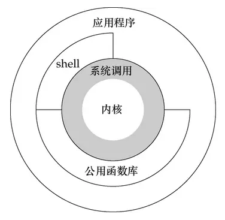

# OS 面试题收集

- [OS 面试题收集](#os-%e9%9d%a2%e8%af%95%e9%a2%98%e6%94%b6%e9%9b%86)
  - [用户态和内核态](#%e7%94%a8%e6%88%b7%e6%80%81%e5%92%8c%e5%86%85%e6%a0%b8%e6%80%81)
    - [为什么需要内核态和用户态](#%e4%b8%ba%e4%bb%80%e4%b9%88%e9%9c%80%e8%a6%81%e5%86%85%e6%a0%b8%e6%80%81%e5%92%8c%e7%94%a8%e6%88%b7%e6%80%81)
    - [从特权级来区分内核态和用户态](#%e4%bb%8e%e7%89%b9%e6%9d%83%e7%ba%a7%e6%9d%a5%e5%8c%ba%e5%88%86%e5%86%85%e6%a0%b8%e6%80%81%e5%92%8c%e7%94%a8%e6%88%b7%e6%80%81)
    - [用户态切换为内核态的场景](#%e7%94%a8%e6%88%b7%e6%80%81%e5%88%87%e6%8d%a2%e4%b8%ba%e5%86%85%e6%a0%b8%e6%80%81%e7%9a%84%e5%9c%ba%e6%99%af)
    - [用户态和内核态的代价在哪](#%e7%94%a8%e6%88%b7%e6%80%81%e5%92%8c%e5%86%85%e6%a0%b8%e6%80%81%e7%9a%84%e4%bb%a3%e4%bb%b7%e5%9c%a8%e5%93%aa)
  - [参考](#%e5%8f%82%e8%80%83)

## 用户态和内核态

- 内核态：控制计算机的硬件资源，并提供上层应用程序运行的环境
- 用户态：上层应用程序的活动空间，应用程序的执行必须依托于内核提供的资源。
- 系统调用：为了使上层应用能够访问到这些资源，内核为上层应用提供访问的接口。

### 为什么需要内核态和用户态

限制程序间的访问能力，给应用程序提供独立的运行空间，防止访问别的程序的内存数据，或者获取外围设备的数据, 并发送到网络, CPU 划分出两个权限等级 -- 用户态和内核态

`用户态`的应用程序通过`系统调用`获取`内核态`的计算机资源

`系统调用是操作系统中的最小功能单位`，上层应用通过 n 个系统调用，完成相应的功能。

`公共函数库`是对`系统调用`的封装，将简单的业务逻辑接口呈现给用户，方便用户调用。

### 从特权级来区分内核态和用户态

CPU 提供的指令中，某些指令是非常危险的，如果错用将导致整个系统崩溃。因此，CPU 指令分为特权指令和非特权指令。对于危险指令，只允许操作系统和相关模块使用。

intel CPU 提供`Ring0-Ring3`四种级别运行模式。依次由高到低，Linux 使用 Ring3 级别运行用户态，而 Ring0 作为内核态。

### 用户态切换为内核态的场景

- **系统调用**，在 CPU 中的实现称之为**陷阱指令**(Trap Instruction)
- **异常事件**：CPU 正在执行运行在用户态的程序时，突然发生某些预先不可知的异常事件，这个时候就会触发从当前用户态执行的进程转向内核态执行相关的异常事件，典型的如`缺页异常`。
- **外围设备的中断**：当外围设备完成用户的请求操作后，会像 CPU 发出中断信号，此时，CPU 就会暂停执行下一条即将要执行的指令，转而去执行中断信号对应的处理程序，如果先前执行的指令是在用户态下，则自然就发生从用户态到内核态的转换。

系统调用的本质其实也是中断，相对于`外围设备的硬中断`，这种中断称为`软中断`。从触发方式和效果上来看，这三种切换方式是完全一样的，都相当于是执行了一个中断响应的过程。但是从触发的对象来看，`系统调用是进程主动请求切换的，而异常和硬中断则是被动的`。

**系统调用工作流程**：

1. 用户态程序将一些数据值放在寄存器中，或者使用参数创建一个堆栈，,以此表明需要操作系统提供的服务.
2. 用户态程序执行陷阱指令
3. CPU 切换到内核态, 并跳到位于内存指定位置的指令, 这些指令是操作系统的一部分, 他们具有内存保护, 不可被用户态程序访问
4. 这些指令称之为陷阱(trap)或者系统调用处理器(system call handler). 他们会读取程序放入内存的数据参数, 并执行程序请求的服务
5. 系统调用完成后, 操作系统会重置 CPU 为用户态并返回系统调用的结果

`保护模式`是说通过内存页表操作等机制，保证进程间的地址空间不会互相冲突，一个进程的操作不会修改另一个进程的地址空间中的数据。

**由用户态切换到内核态的步骤主要包括**：

1. 从当前进程的描述符中提取其内核栈的 ss0 及 esp0 信息。

2. 使用 ss0 和 esp0 指向的内核栈将当前进程的 cs,eip,eflags,ss,esp 信息保存起来，这个过程也完成了由用户栈到内核栈的切换过程，同时保存了被暂停执行的程序的下一条指令。

3. 将先前由中断向量检索得到的中断处理程序的 cs,eip 信息装入相应的寄存器，开始执行中断处理程序，这时就转到了内核态的程序执行了。

### 用户态和内核态的代价在哪

每个进程有两个栈，一个内核态栈和一个用户态栈。

- 系统调用一般都需要保存用户程序得上下文(context), 在进入内核得时候需要保存用户态得寄存器，在内核态返回用户态得时候会恢复这些寄存器得内容。这是一个开销的地方。（栈切换开销）

- 如果需要在不同用户程序间切换的话，那么还要更新**cr3 寄存器**，这样会`更换每个程序的虚拟内存到物理内存映射表的地址`，也是一个比较高负担的操作。

## 参考

> - [用户态与内核态](https://www.jianshu.com/p/85e931636f27)
> - [为什么系统调用比普通的函数调用更耗时？用户态和内核态切换的代价在哪？](https://segmentfault.com/q/1010000000522752)
