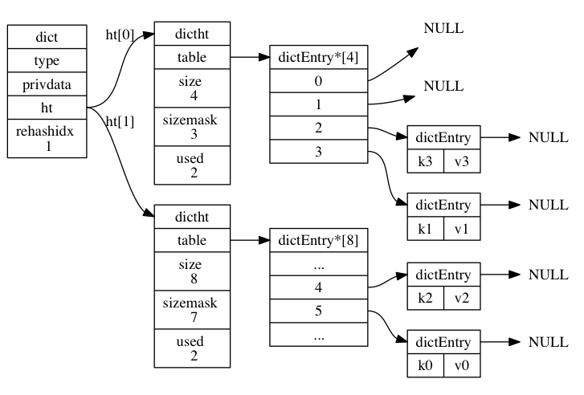
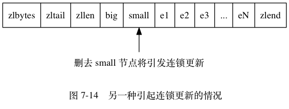
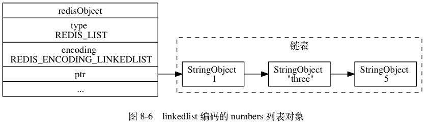
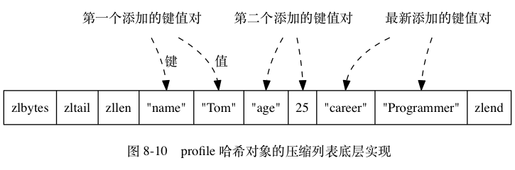

# Redis 数据类型和相关底层数据结构

- [Redis 数据类型和相关底层数据结构](#redis-%e6%95%b0%e6%8d%ae%e7%b1%bb%e5%9e%8b%e5%92%8c%e7%9b%b8%e5%85%b3%e5%ba%95%e5%b1%82%e6%95%b0%e6%8d%ae%e7%bb%93%e6%9e%84)
  - [Redis 介绍](#redis-%e4%bb%8b%e7%bb%8d)
  - [Redis 常见数据类型使用场景](#redis-%e5%b8%b8%e8%a7%81%e6%95%b0%e6%8d%ae%e7%b1%bb%e5%9e%8b%e4%bd%bf%e7%94%a8%e5%9c%ba%e6%99%af)
    - [String](#string)
    - [Hash](#hash)
    - [List](#list)
    - [Sets](#sets)
    - [Sorted Sets](#sorted-sets)
  - [Redis 数据结构和对象](#redis-%e6%95%b0%e6%8d%ae%e7%bb%93%e6%9e%84%e5%92%8c%e5%af%b9%e8%b1%a1)
    - [简单动态字符串(SDS)](#%e7%ae%80%e5%8d%95%e5%8a%a8%e6%80%81%e5%ad%97%e7%ac%a6%e4%b8%b2sds)
      - [重点回顾](#%e9%87%8d%e7%82%b9%e5%9b%9e%e9%a1%be)
    - [链表](#%e9%93%be%e8%a1%a8)
      - [重点回顾](#%e9%87%8d%e7%82%b9%e5%9b%9e%e9%a1%be-1)
    - [字典](#%e5%ad%97%e5%85%b8)
      - [字典相关结构定义](#%e5%ad%97%e5%85%b8%e7%9b%b8%e5%85%b3%e7%bb%93%e6%9e%84%e5%ae%9a%e4%b9%89)
        - [字典所使用的哈希表的结构定义](#%e5%ad%97%e5%85%b8%e6%89%80%e4%bd%bf%e7%94%a8%e7%9a%84%e5%93%88%e5%b8%8c%e8%a1%a8%e7%9a%84%e7%bb%93%e6%9e%84%e5%ae%9a%e4%b9%89)
        - [哈希表节点使用 dictEntry 结构表示](#%e5%93%88%e5%b8%8c%e8%a1%a8%e8%8a%82%e7%82%b9%e4%bd%bf%e7%94%a8-dictentry-%e7%bb%93%e6%9e%84%e8%a1%a8%e7%a4%ba)
        - [字典结构表示](#%e5%ad%97%e5%85%b8%e7%bb%93%e6%9e%84%e8%a1%a8%e7%a4%ba)
      - [哈希算法](#%e5%93%88%e5%b8%8c%e7%ae%97%e6%b3%95)
      - [解决键冲突](#%e8%a7%a3%e5%86%b3%e9%94%ae%e5%86%b2%e7%aa%81)
      - [rehash](#rehash)
        - [哈希表的扩展与收缩](#%e5%93%88%e5%b8%8c%e8%a1%a8%e7%9a%84%e6%89%a9%e5%b1%95%e4%b8%8e%e6%94%b6%e7%bc%a9)
      - [渐进式 rehash](#%e6%b8%90%e8%bf%9b%e5%bc%8f-rehash)
        - [渐进式 rehash 执行期间的哈希表操作](#%e6%b8%90%e8%bf%9b%e5%bc%8f-rehash-%e6%89%a7%e8%a1%8c%e6%9c%9f%e9%97%b4%e7%9a%84%e5%93%88%e5%b8%8c%e8%a1%a8%e6%93%8d%e4%bd%9c)
      - [重点回顾](#%e9%87%8d%e7%82%b9%e5%9b%9e%e9%a1%be-2)
    - [跳跃表](#%e8%b7%b3%e8%b7%83%e8%a1%a8)
      - [跳跃表实现](#%e8%b7%b3%e8%b7%83%e8%a1%a8%e5%ae%9e%e7%8e%b0)
        - [跳跃表节点](#%e8%b7%b3%e8%b7%83%e8%a1%a8%e8%8a%82%e7%82%b9)
          - [结构定义](#%e7%bb%93%e6%9e%84%e5%ae%9a%e4%b9%89)
        - [跳跃表结构](#%e8%b7%b3%e8%b7%83%e8%a1%a8%e7%bb%93%e6%9e%84)
          - [结构定义](#%e7%bb%93%e6%9e%84%e5%ae%9a%e4%b9%89-1)
      - [重点回顾](#%e9%87%8d%e7%82%b9%e5%9b%9e%e9%a1%be-3)
    - [整数集合](#%e6%95%b4%e6%95%b0%e9%9b%86%e5%90%88)
      - [整数集合的实现](#%e6%95%b4%e6%95%b0%e9%9b%86%e5%90%88%e7%9a%84%e5%ae%9e%e7%8e%b0)
      - [升级](#%e5%8d%87%e7%ba%a7)
      - [降级(不支持)](#%e9%99%8d%e7%ba%a7%e4%b8%8d%e6%94%af%e6%8c%81)
      - [重点回顾](#%e9%87%8d%e7%82%b9%e5%9b%9e%e9%a1%be-4)
    - [压缩列表](#%e5%8e%8b%e7%bc%a9%e5%88%97%e8%a1%a8)
      - [压缩列表的构成](#%e5%8e%8b%e7%bc%a9%e5%88%97%e8%a1%a8%e7%9a%84%e6%9e%84%e6%88%90)
      - [压缩列表节点的构成](#%e5%8e%8b%e7%bc%a9%e5%88%97%e8%a1%a8%e8%8a%82%e7%82%b9%e7%9a%84%e6%9e%84%e6%88%90)
        - [previous_entry_length](#previousentrylength)
        - [encoding](#encoding)
        - [content](#content)
      - [连锁更新](#%e8%bf%9e%e9%94%81%e6%9b%b4%e6%96%b0)
      - [重点回顾](#%e9%87%8d%e7%82%b9%e5%9b%9e%e9%a1%be-5)
    - [对象](#%e5%af%b9%e8%b1%a1)
      - [对象的类型与编码](#%e5%af%b9%e8%b1%a1%e7%9a%84%e7%b1%bb%e5%9e%8b%e4%b8%8e%e7%bc%96%e7%a0%81)
        - [类型(type)](#%e7%b1%bb%e5%9e%8btype)
        - [编码和底层实现](#%e7%bc%96%e7%a0%81%e5%92%8c%e5%ba%95%e5%b1%82%e5%ae%9e%e7%8e%b0)
      - [字符串对象](#%e5%ad%97%e7%ac%a6%e4%b8%b2%e5%af%b9%e8%b1%a1)
        - [字符串对象保存汇总](#%e5%ad%97%e7%ac%a6%e4%b8%b2%e5%af%b9%e8%b1%a1%e4%bf%9d%e5%ad%98%e6%b1%87%e6%80%bb)
        - [编码转换](#%e7%bc%96%e7%a0%81%e8%bd%ac%e6%8d%a2)
        - [字符串命令的实现](#%e5%ad%97%e7%ac%a6%e4%b8%b2%e5%91%bd%e4%bb%a4%e7%9a%84%e5%ae%9e%e7%8e%b0)
      - [列表对象](#%e5%88%97%e8%a1%a8%e5%af%b9%e8%b1%a1)
        - [编码转换](#%e7%bc%96%e7%a0%81%e8%bd%ac%e6%8d%a2-1)
        - [列表命令的实现](#%e5%88%97%e8%a1%a8%e5%91%bd%e4%bb%a4%e7%9a%84%e5%ae%9e%e7%8e%b0)
      - [哈希对象](#%e5%93%88%e5%b8%8c%e5%af%b9%e8%b1%a1)
        - [编码转换](#%e7%bc%96%e7%a0%81%e8%bd%ac%e6%8d%a2-2)
        - [哈希命令的实现](#%e5%93%88%e5%b8%8c%e5%91%bd%e4%bb%a4%e7%9a%84%e5%ae%9e%e7%8e%b0)
      - [集合对象](#%e9%9b%86%e5%90%88%e5%af%b9%e8%b1%a1)
        - [编码转换](#%e7%bc%96%e7%a0%81%e8%bd%ac%e6%8d%a2-3)
        - [集合命令的实现](#%e9%9b%86%e5%90%88%e5%91%bd%e4%bb%a4%e7%9a%84%e5%ae%9e%e7%8e%b0)
      - [有序集合对象](#%e6%9c%89%e5%ba%8f%e9%9b%86%e5%90%88%e5%af%b9%e8%b1%a1)
        - [编码转换](#%e7%bc%96%e7%a0%81%e8%bd%ac%e6%8d%a2-4)
        - [有序集合命令的实现](#%e6%9c%89%e5%ba%8f%e9%9b%86%e5%90%88%e5%91%bd%e4%bb%a4%e7%9a%84%e5%ae%9e%e7%8e%b0)
      - [类型检查与命令多态](#%e7%b1%bb%e5%9e%8b%e6%a3%80%e6%9f%a5%e4%b8%8e%e5%91%bd%e4%bb%a4%e5%a4%9a%e6%80%81)
        - [类型检查的实现](#%e7%b1%bb%e5%9e%8b%e6%a3%80%e6%9f%a5%e7%9a%84%e5%ae%9e%e7%8e%b0)
        - [多态命令的实现](#%e5%a4%9a%e6%80%81%e5%91%bd%e4%bb%a4%e7%9a%84%e5%ae%9e%e7%8e%b0)
      - [内存回收](#%e5%86%85%e5%ad%98%e5%9b%9e%e6%94%b6)
        - [对象共享](#%e5%af%b9%e8%b1%a1%e5%85%b1%e4%ba%ab)
        - [对象空转时长](#%e5%af%b9%e8%b1%a1%e7%a9%ba%e8%bd%ac%e6%97%b6%e9%95%bf)
      - [重点回顾](#%e9%87%8d%e7%82%b9%e5%9b%9e%e9%a1%be-6)

## Redis 介绍

[Redis](https://github.com/antirez/redis)是一个由 C 编写的开源`key-value`数据库, 支持存储的 value 类型包括 string、list、sets、sorted sets(有序集合)、hash。这些数据类型都支持 push/pop、add/remove 及取交集并集和差集及更丰富的操作，而且这些操作都是原子性的。在此基础上，redis 支持各种不同方式的排序。为了保证效率，数据都是缓存在内存中，redis 会周期性的把更新的数据写入磁盘或者把修改操作写入追加的记录文件，并且在此基础上实现了 master-slave(主从)同步。

## Redis 常见数据类型使用场景

### String

- 简单的 key-value 类型，适用于字符串(/数字)存储
- 常用命令：set, get, decr, incr, mget 等

### Hash

- 一个 string 类型的 field 和 value 的映射表，hash 特别适合用于存储对象。
- 常用命令：hget, hset, hgetall 等

### List

- List 是一个双向链表的实现，支持反向查找和遍历。
- 常用命令：lpush, rpush, lpop, rpop, lrange 等

### Sets

- Set 是 String 类型的无序集合，且集合元素不重复
- 常用命令：sadd，spop，smembers，sunion 等

### Sorted Sets

- 和 Set 相比，sorted sets 增加了一个权重参数 score，集合元素按照 score 进行排序。
- 常用命令：zadd，zrange，zrem，zcard 等

## Redis 数据结构和对象

### 简单动态字符串(SDS)

```c
struct sdshdr {

    // 记录 buf 数组中已使用字节的数量
    // 等于 SDS 所保存字符串的长度
    int len;

    // 记录 buf 数组中未使用字节的数量
    int free;

    // 字节数组，用于保存字符串
    char buf[];

};
```


SDS 遵循空字符结尾，可以直接重用部分 C 字符串函数库的函数

#### 重点回顾

比起 C 字符串，SDS 具有以下优点：

1. 常数复杂度获取字符串长度。
2. 杜绝缓冲区移出。（e.g.字符串拼接）
3. 减少修改字符串长度时所需的内存重分配次数。(空间预分配、惰性空间释放)
4. 二进制安全。（字符必须符合某种编码，并且除了字符串的末尾之外， 字符串里面不能包含空字符， 否则最先被程序读入的空字符将被误认为是字符串结尾 ）
5. 兼容部分 C 字符串函数

### 链表

```c
typedef struct listNode {

    // 前置节点
    struct listNode *prev;

    // 后置节点
    struct listNode *next;

    // 节点的值
    void *value;

} listNode;
```

多个 listNode 可以通过 prev 和 next 指针组成双端链表


```c
typedef struct list {

    // 表头节点
    listNode *head;

    // 表尾节点
    listNode *tail;

    // 链表所包含的节点数量
    unsigned long len;

    // 节点值复制函数
    void *(*dup)(void *ptr);

    // 节点值释放函数
    void (*free)(void *ptr);

    // 节点值对比函数
    int (*match)(void *ptr, void *key);

} list;
```

list 结构和三个 listNode 结构组成的链表：


Redis 链表实现特性总结：

- 双端
- 无环
- 带表头和表尾指针
- 带链表长度计数器
- 多态。节点使用 void\* 指针来保存节点值，可以用于保存各种不同类型的值。

#### 重点回顾

- 链表广泛运用于实现 Redis 的各种功能，比如列表键，发布与订阅，慢查询，监视器等。
- 链表节点由 listNode 结构表示，每个节点都有一个指向前置节点和后置节点的指针，所以实现是双端链表。
- 每个链表使用一个 list 结构来表示，这个结构带有表头节点指针、表尾节点指针、以及链表长度等信息。
- 因为链表表头节点的前置节点和表尾节点的后置节点都指向 NULL ， 所以 Redis 的链表实现是无环链表。
- 通过为链表设置不同的类型特定函数， Redis 的链表可以用于保存各种不同类型的值。

### 字典

#### 字典相关结构定义

##### 字典所使用的哈希表的结构定义

```c
typedef struct dictht {

    // 哈希表数组
    dictEntry **table;

    // 哈希表大小
    unsigned long size;

    // 哈希表大小掩码，用于计算索引值
    // 总是等于 size - 1
    unsigned long sizemask;

    // 该哈希表已有节点的数量
    unsigned long used;

} dictht;
```


##### 哈希表节点使用 dictEntry 结构表示

- 每个 dictEntry 结构都保存着一个键值对：

```c
typedef struct dictEntry {

    // 键
    void *key;

    // 值
    union {
        void *val;
        uint64_t u64;
        int64_t s64;
    } v;

    // 指向下个哈希表节点，形成链表
    struct dictEntry *next;

} dictEntry;
```


##### 字典结构表示

```c
typedef struct dict {

    // 类型特定函数
    dictType *type;

    // 私有数据
    void *privdata;

    // 哈希表
    dictht ht[2];

    // rehash 索引
    // 当 rehash 不在进行时，值为 -1
    int rehashidx; /* rehashing not in progress if rehashidx == -1 */

} dict;
```

- type 属性和 privdata 属性针对不同类型的键值对，为创建多态字典而设置的。

  - type 属性是一个指向 dictType 结构的指针， 每个 dictType 结构保存了一簇用于操作特定类型键值对的函数， Redis 会为用途不同的字典设置不同的类型特定函数。
  - 而 privdata 属性则保存了需要传给那些类型特定函数的可选参数。

- dictType 结构表示

```c
typedef struct dictType {

    // 计算哈希值的函数
    unsigned int (*hashFunction)(const void *key);

    // 复制键的函数
    void *(*keyDup)(void *privdata, const void *key);

    // 复制值的函数
    void *(*valDup)(void *privdata, const void *obj);

    // 对比键的函数
    int (*keyCompare)(void *privdata, const void *key1, const void *key2);

    // 销毁键的函数
    void (*keyDestructor)(void *privdata, void *key);

    // 销毁值的函数
    void (*valDestructor)(void *privdata, void *obj);

} dictType;
```

- ht 属性是一个包含两个项的数组， 数组中的每个项都是一个 dictht 哈希表， 一般情况下， 字典只使用 ht[0] 哈希表， ht[1] 哈希表只会在对 ht[0] 哈希表进行 `rehash` 时使用。

- 除了 ht[1] 之外， 另一个和 rehash 有关的属性就是 rehashidx ： 它记录了 rehash 目前的进度， 如果目前没有在进行 rehash ， 那么它的值为 -1 。


#### 哈希算法

Redis 计算哈希值和索引值的方法如下：

```c
# 使用字典设置的哈希函数，计算键 key 的哈希值
hash = dict->type->hashFunction(key);

# 使用哈希表的 sizemask 属性和哈希值，计算出索引值
# 根据情况不同， ht[x] 可以是 ht[0] 或者 ht[1]
index = hash & dict->ht[x].sizemask;
```

- 空字典


```c
#计算k0的哈希值
hash = dict->type->hashFunction(k0);

#假设哈希值为8，计算k0的索引值
index = hash & dict->ht[0].sizemask = 8 & 3 = 0;
```

- 添加键值对 k0 和 v0 之后的字典


- Redis 使用 MurmurHash2 算法来计算键的 hash

#### 解决键冲突

Redis 的哈希表使用链地址法(separate chaining)来解决键冲突：每个哈希表节点都有一个 next 指针， 多个哈希表节点可以用 next 指针构成一个单向链表， 被分配到同一个索引上的多个节点可以用这个单向链表连接起来， 这就解决了键冲突的问题。

- 例子： 假设将键值对 k2 和 v2 添加到下图所示的哈希表里面， 并且计算得出 k2 的索引值为 2 ， 那么键 k1 和 k2 将产生冲突， 而解决冲突的办法就是使用 next 指针将键 k2 和 k1 所在的节点连接起来。


- 因为 dictEntry 节点组成的链表没有指向链表表尾的指针， 所以为了速度考虑， 程序总是将新节点添加到链表的表头位置（复杂度为 O(1)）， 排在其他已有节点的前面。

#### rehash

随着操作的不断执行， 哈希表保存的键值对会逐渐地增多或者减少， 为了让哈希表的负载因子（load factor）维持在一个合理的范围之内， 当哈希表保存的键值对数量太多或者太少时， 程序需要对哈希表的大小进行相应的扩展或者收缩。该工作通过 rehash(重新散列)操作来完成。

- 步骤如下

1. 为字典的 ht[1]哈希表分配空间，该 hash 表的空间大小取决于要执行的操作，以及 ht[0]当前包含的键值对数量(ht[0].used 属性的值)
   1. 拓展操作：ht[1]大小为第一个大于等于 ht[0].used\*2 的 2^n;
   2. 收缩操作：ht[1]大小为第一个大于等于 ht[0].used 的 2^n。
2. 将 ht[0]中的所有键值对 rehash(重新计算键的哈希值和索引值)到 ht[1]
3. 当 ht[0]中所有键值对迁移到 ht[1]后，释放 ht[0]且将 ht[1]设置为 ht[0]，并在 ht[1]新创建一个空白 hash 表，为下次 rehash 准备。

- 例子，对图示字典的 ht[0]进行扩展操作
  - 执行 rehash 前的字典
    
  - ht[0].used 当前的值为 4 ， 4 \* 2 = 8 ， 而 8 （2^3）恰好是第一个大于等于 4 的 2 的 n 次方， 所以程序会将 ht[1] 哈希表的大小设置为 8。
    ![为字典的ht[1]哈希表分配空间](./img/为字典的ht[1]哈希表分配空间.png)
  - 将 ht[0] 包含的四个键值对都 rehash 到 ht[1]
    ![ht[0]rehash到ht[1]](./img/ht[0]rehash到ht[1].png)
  - 释放 ht[0] ，并将 ht[1] 设置为 ht[0] ，然后为 ht[1] 分配一个空白哈希表
    

##### 哈希表的扩展与收缩

当以下条件中的任一条件被满足时，程序会自动对 hash 表执行扩展操作：

1. 服务器目前没有在执行 BGSAVE 命令或 BGREWRITEAOF 命令，并且 hash 表的负载因子大于等于 1；
2. 服务器目前正在执行 BGSAVE 命令或者 BGREWRITEAOF 命令，并且 hash 表负载因子大于等于 5；

负载因子可以通过如下公式计算：

```c
# 负载因子 = 哈希表已保存节点数量 / 哈希表大小
load_factor = ht[0].used / ht[0].size
```

- 根据 BGSAVE 命令或 BGREWRITEAOF 命令是否正在执行， 服务器执行扩展操作所需的负载因子并不相同， 这是因为在执行 BGSAVE 命令或 BGREWRITEAOF 命令的过程中， Redis 需要创建当前服务器进程的子进程， 而大多数操作系统都采用写时复制（copy-on-write）技术来`优化子进程的使用效率`， 所以`在子进程存在期间， 服务器会提高执行扩展操作所需的负载因子， 从而尽可能地避免在子进程存在期间进行哈希表扩展操作， 这可以避免不必要的内存写入操作， 最大限度地节约内存`。
- 另一方面， 当哈希表的负载因子`小于 0.1` 时， 程序自动开始对哈希表执行`收缩`操作。

#### 渐进式 rehash

扩展或收缩哈希表需要将 ht[0] 里面的所有键值对 rehash 到 ht[1] 里面， 但是， 这个 rehash 动作并不是一次性、集中式地完成的， 而是`分多次、渐进式`地完成的。`避免`庞大的计算量导致服务器在一段时间内`停止服务`。

- 渐进式 rehash 详细步骤：
  1. 为 ht[1]分配空间，让字典同时持有 ht[0]和 ht[1]两个 hash 表。
  2. 在字典中维持一个索引计数器变量 rehashidx，并将它的值设置为 0，表示 rehash 工作正式开始。
  3. 在 rehash 进行期间，每次对字典执行 add、delete、find、update 时，除执行指定操作以外，还会顺带将 ht[0]在 rehashidx 索引上的所有键值对 rehash 到 ht[1]，当 rehash 工作完成后，rehashidx 属性值增 1。
  4. 随着字典操作的不断执行，最终在某个时间点上，ht[0]的所有键值对都会被 rehash 至 ht[1]，这是 rehashidx 为-1，表示 rehash 操作完成。
- 渐进式 rehash 的好处在于它采取分而治之的方式， 将 rehash 键值对所需的计算工作均滩到对字典的每个添加、删除、查找和更新操作上， 从而避免了集中式 rehash 而带来的庞大计算量。
- 图示展示了一次完整的渐进式 rehash 过程， 注意观察在整个 rehash 过程中， 字典的 rehashidx 属性是如何变化的。
  - 准备开始 rehash
    
  - rehash 索引 0 上的键值对
    
  - rehash 索引 1 上的键值对
    
  - rehash 索引 2 上的键值对
    
  - rehash 索引 3 上的键值对
    
  - rehash 执行完毕
    

##### 渐进式 rehash 执行期间的哈希表操作

- 因为在进行渐进式 rehash 的过程中， 字典会同时使用 ht[0] 和 ht[1] 两个哈希表， 所以`在渐进式 rehash 进行期间， 字典的删除（delete）、查找（find）、更新（update）等操作会在两个哈希表上进行`： 比如说， 要在字典里面查找一个键的话， 程序会先在 ht[0] 里面进行查找， 如果没找到的话， 就会继续到 ht[1] 里面进行查找， 诸如此类。

- 另外，`在渐进式 rehash 执行期间， 新添加到字典的键值对一律会被保存到 ht[1] 里面， 而 ht[0] 则不再进行任何添加操作`： 这一措施`保证了 ht[0] 包含的键值对数量会只减不增`， 并随着 rehash 操作的执行而最终变成空表。

#### 重点回顾

- 字典被广泛用于实现 Redis 的各种功能， 其中包括`数据库和哈希键`。
- Redis 中的字典使用哈希表作为底层实现， 每个字典带有两个哈希表， 一个用于平时使用， 另一个仅在进行 rehash 时使用。
- 当字典被用作数据库的底层实现， 或者哈希键的底层实现时， Redis 使用 MurmurHash2 算法来计算键的哈希值。
- 哈希表使用链地址法来解决键冲突， 被分配到同一个索引上的多个键值对会连接成一个单向链表。
- 在对哈希表进行扩展或者收缩操作时， 程序需要将现有哈希表包含的所有键值对 rehash 到新哈希表里面， 并且这个 rehash 过程并不是一次性地完成的， 而是渐进式地完成的。

### 跳跃表

跳跃表(skiplist)是一种有序数据结构，通过在每个`节点维持多个指向其他节点的指针`，从而达到`快速访问节点`的目的。

跳跃表支持平均 O(log N) 最坏 O(N) 复杂度的节点查找， 还可以通过顺序性操作来批量处理节点。

在大部分情况下， 跳跃表的效率可以和平衡树相媲美， 并且因为跳跃表的实现比平衡树要来得更为简单， 所以有不少程序都使用跳跃表来代替平衡树。

Redis 使用跳跃表作为有序集合键的底层实现之一： 如果一个有序集合包含的元素数量比较多， 又或者有序集合中元素的成员（member）是比较长的字符串时， Redis 就会使用跳跃表来作为有序集合键的底层实现。

和链表、字典等数据结构被广泛地应用在 Redis 内部不同， Redis `只在两个地方用到了跳跃表`， 一个是实现`有序集合键`， 另一个是在`集群节点中用作内部数据结构`， 除此之外， 跳跃表在 Redis 里面没有其他用途。

#### 跳跃表实现

跳跃表由`zskiplistNode`和`zskiplist` 两个结构定义，其中 zskiplistNode 结构用于表示跳跃表节点，而 zskiplist 结构用于保存跳跃表节点的相关信息，比如节点的数量， 以及指向表头节点和表尾节点的指针， 等等。

- 一个跳跃表示例


- 位于图片最左边的是 zskiplist 结构， 该结构包含以下属性：

  - header ：指向跳跃表的表头节点。
  - tail ：指向跳跃表的表尾节点。
  - level ：记录目前跳跃表内，层数最大的那个节点的层数（表头节点的层数不计算在内）。
  - length ：记录跳跃表的长度，也即是，跳跃表目前包含节点的数量（表头节点不计算在内）。

- 位于 zskiplist 结构右方的是四个 zskiplistNode 结构， 该结构包含以下属性：

  - 层（level）：节点中用 L1 、 L2 、 L3 等字样标记节点的各个层， L1 代表第一层， L2 代表第二层，以此类推。每个层都带有两个属性：前进指针和跨度。前进指针用于访问位于表尾方向的其他节点，而跨度则记录了前进指针所指向节点和当前节点的距离。在上面的图片中，连线上带有数字的箭头就代表前进指针，而那个数字就是跨度。当程序从表头向表尾进行遍历时，访问会沿着层的前进指针进行。
  - 后退（backward）指针：节点中用 BW 字样标记节点的后退指针，它指向位于当前节点的前一个节点。后退指针在程序从表尾向表头遍历时使用。
  - 分值（score）：各个节点中的 1.0 、 2.0 和 3.0 是节点所保存的分值。在跳跃表中，节点按各自所保存的分值从小到大排列。
  - 成员对象（obj）：各个节点中的 o1 、 o2 和 o3 是节点所保存的成员对象。

注意表头节点和其他节点的构造是一样的： 表头节点也有后退指针、分值和成员对象， 不过表头节点的这些属性都不会被用到， 所以图中省略了这些部分， 只显示了表头节点的各个层。

##### 跳跃表节点

###### 结构定义

```c
typedef struct zskiplistNode {

    // 后退指针
    struct zskiplistNode *backward;

    // 分值
    double score;

    // 成员对象
    robj *obj;

    // 层
    struct zskiplistLevel {

        // 前进指针
        struct zskiplistNode *forward;

        // 跨度
        unsigned int span;

    } level[];

} zskiplistNode;
```

- 层

  - level 数组可以包含多个元素，每个元素都包含一个指向其他节点的指针，程序可以通过这些层来加快访问其他节点的速度，一般来说，层数量越多，访问其他节点的速度就越快。
  - 每次创建一个新跳跃表节点时，根据幂次定律([幂次定律](http://note.huangz.me/algorithm/arithmetic/power-law.html),越大的数出现的概率越小) 随机生成一个介于 1 和 32 之间的值作为 level 数组的大小， 这个大小就是层的“高度”。

- 前进指针

  - 每层都有一个指向表尾方向的前进指针(level[i].forward 属性)，用于从表头向表尾方向访问节点。图示用虚线表示出了程序从表头向表尾方向，遍历跳跃表中所有节点的路径：
    

- 跨度

  - 层的跨度（level[i].span 属性）用于记录两个节点之间的距离：
    1. 两个节点的跨度越大，它们相距越远。
    2. 指向 NULL 的所有前进指针的跨度都为 0，因为它们没有连向任何节点。
  - 初看上去， 很容易以为跨度和遍历操作有关， 但实际上并不是这样 —— `遍历操作只使用前进指针就可以完成了， 跨度实际上是用来计算排位（rank）的`： 在查找某个节点的过程中， 将沿途访问过的所有层的跨度累计起来， 得到的结果就是目标节点在跳跃表中的排位。

- 后退指针

  - 节点的后退指针（backward 属性）用于从表尾向表头方向访问节点： 跟可以一次跳过多个节点的前进指针不同， 因为每个节点只有一个后退指针， 所以每次只能后退至前一个节点。
  - 图示用虚线展示了如果从表尾向表头遍历跳跃表中的所有节点： 程序首先通过跳跃表的 tail 指针访问表尾节点， 然后通过后退指针访问倒数第二个节点， 之后再沿着后退指针访问倒数第三个节点， 再之后遇到指向 NULL 的后退指针， 于是访问结束。
    

- 分值和成员
  - 节点的分值（score 属性）是一个 double 类型的浮点数， 跳跃表中的所有节点都按分值从小到大来排序。
  - 节点的成员对象（obj 属性）是一个指针， 它指向一个字符串对象， 而字符串对象则保存着一个 SDS 值。
  - 在同一个跳跃表中， 各个节点保存的成员对象必须是唯一的， 但是多个节点保存的分值却可以是相同的： 分值相同的节点将按照成员对象在字典序中的大小来进行排序， 成员对象较小的节点会排在前面（靠近表头的方向）， 而成员对象较大的节点则会排在后面（靠近表尾的方向）。

##### 跳跃表结构

###### 结构定义

```c
typedef struct zskiplist {

    // 表头节点和表尾节点
    struct zskiplistNode *header, *tail;

    // 表中节点的数量
    unsigned long length;

    // 表中层数最大的节点的层数
    int level;

} zskiplist;
```

- header 和 tail 指针分别指向跳跃表的表头和表尾节点， 通过这两个指针， 程序定位表头节点和表尾节点的复杂度为 O(1) 。

- 通过使用 length 属性来记录节点的数量， 程序可以在 O(1) 复杂度内返回跳跃表的长度。

- level 属性则用于在 O(1) 复杂度内获取跳跃表中层高最大的那个节点的层数量， 注意表头节点的层高并不计算在内。

#### 重点回顾

- 跳跃表是有序集合的底层实现之一， 除此之外它在 Redis 中没有其他应用。
- Redis 的跳跃表实现由 zskiplist 和 zskiplistNode 两个结构组成， 其中 zskiplist 用于保存跳跃表信息（比如表头节点、表尾节点、长度）， 而 zskiplistNode 则用于表示跳跃表节点。
- 每个跳跃表节点的层高都是 1 至 32 之间的随机数。
- 在同一个跳跃表中， 多个节点可以包含相同的分值， 但每个节点的成员对象必须是唯一的。
- 跳跃表中的节点按照分值大小进行排序， 当分值相同时， 节点按照成员对象的大小进行排序。

### 整数集合

#### 整数集合的实现

整数集合(intset)是 Redis 用于保存整数值的集合抽象数据结构，可以保存类型为 int16_t 、 int32_t 或者 int64_t 的整数值， 并且保证集合中不会出现重复元素。

```c
typedef struct intset {

    // 编码方式
    uint32_t encoding;

    // 集合包含的元素数量
    uint32_t length;

    // 保存元素的数组
    int8_t contents[];

} intset;
```

- contents 数组：集合的每个元素都是 contents 数组的一个数组项(item)，各项按值大小从小到大有序排列，并且数组中不包含任何重复项。
- length 属性记录了整数集合包含的元素数量，及 contents 数组的长度。
- 虽然 intset 结构将 contents 属性声明为 int8_t 类型的数组， 但实际上 contents 数组并不保存任何 int8_t 类型的值 —— `contents 数组的真正类型取决于 encoding 属性的值`：
  - encoding 属性值为 INTSET_ENC_INT16，则 contents 是一个 int16_t 类型的数组(min：-32,768，max：32,767)
  - encoding 属性值为 INTSET_ENC_INT32，则 contents 是一个 int32_t 类型的数组(min：-2,147,483,648 ，max：2,147,483,647)
  - encoding 属性值为 INTSET_ENC_INT64，则 contents 是一个 int64_t 类型的数组(min：-9,223,372,036,854,775,808 ，max：9,223,372,036,854,775,807 )
- 一个包含五个 int16_t 类型整数值的整数集合示例
  

#### 升级

当往整数集合新增元素，`新元素类型比整数集合现有类型都要长时`，整数集合需要先进行升级，然后才能将新元素添加到整数集合里面。

升级整数集合并添加新元素共分为三步进行：

1. 根据新元素类型，扩展集合底层数组空间大小，并未新元素分配空间。
2. 将底层数组现有的所有元素都转换成与新元素相同类型，将类型转换后出的元素放置到正确的位上，并维持底层数组的有序性质不变。
3. 将新元素添加到底层数组里面。

示例：

一个 INTSET_ENC_INT16 编码的整数集合， 集合中包含三个 int16_t 类型的元素


新增元素 65535,元素类型变为 int32_t，底层数组大小为 32 \* 4 = 128


完成添加操作之后的整数集合


- 因为每次向整数集合添加新元素都可能会引起升级， 而每次升级都需要对底层数组中已有的所有元素进行类型转换， 所以向整数集合添加新元素的时间复杂度为 O(N) 。

- 升级之后新元素的摆放位置
  - 在新元素小于所有现有元素的情况下， 新元素会被放置在底层数组的最开头（索引 0 ）；
  - 在新元素大于所有现有元素的情况下， 新元素会被放置在底层数组的最末尾（索引 length-1 ）。
- 升级的好处
  - 提升灵活性
  - 节约内存

#### 降级(不支持)

整数集合不支持降级操作，一旦对数组进行了升级，编码就会一直保持升级后的状态。

#### 重点回顾

- 整数集合是集合键的底层实现之一。
- 整数集合的底层实现为数组， 这个数组以有序、无重复的方式保存集合元素， 在有需要时， 程序会根据新添加元素的类型， 改变这个数组的类型。
- 升级操作为整数集合带来了操作上的灵活性， 并且尽可能地节约了内存。
- 整数集合只支持升级操作， 不支持降级操作。

### 压缩列表

压缩列表(ziplist)是列表键和 hash 键的底层实现之一。当一个列表键只包含少量列表项， 并且每个列表项要么就是小整数值， 要么就是长度比较短的字符串， 那么 Redis 就会使用压缩列表来做列表键的底层实现。

#### 压缩列表的构成

- 压缩列表为节约内存而开发，由一系列特殊编码的连续内存块组成的顺序型(sequential)数据结构。
- 一个压缩列表可以包含任意多个节点(entry)，每个节点保存一个字节数组或者一个整数值。
- 压缩列表各个组成部分

  

- 各个组成部分的类型、长度、以及用途

| 属性    | 类型     | 长度    | 用途                                                                                                                                                                                              |
| ------- | -------- | ------- | ------------------------------------------------------------------------------------------------------------------------------------------------------------------------------------------------- |
| zlbytes | unit32_t | 4 bytes | 记录整个压缩列表占用的内存字节数：在对压缩列表进行内存重分配， 或者计算 zlend 的位置时使用。                                                                                                      |
| zltail  | unit32_t | 4 bytes | 记录压缩列表表尾节点距离压缩列表的起始地址有多少字节： 通过这个偏移量，程序无须遍历整个压缩列表就可以确定表尾节点的地址。                                                                         |
| zllen   | unit16_t | 2 bytes | 记录了压缩列表包含的节点数量： 当这个属性的值小于 UINT16_MAX （65535）时， 这个属性的值就是压缩列表包含节点的数量； 当这个值等于 UINT16_MAX 时， 节点的真实数量需要遍历整个压缩列表才能计算得出。 |
| entryx  | 列表节点 | 不定    | 压缩列表包含的各个节点，节点的长度由节点保存的内容决定。                                                                                                                                          |
| zlend   | unit8_t  | 1 bytes | 特殊值 0xFF （十进制 255 ），用于标记压缩列表的末端。                                                                                                                                             |

示例：包含 3 个节点的压缩列表


#### 压缩列表节点的构成

每个节点可以保存一个字节数组或一个整数值；

`字节数组`可以是以下三种长度的其中一种：

1. 长度小于等于 63 （2^{6}-1）字节的字节数组；
2. 长度小于等于 16383 （2^{14}-1） 字节的字节数组；
3. 长度小于等于 4294967295 （2^{32}-1）字节的字节数组；

`整数值`可以是以下 6 种长度的其中一种：

1. 4 位长，介于 0 至 12 之间的无符号整数；
2. 1 字节长的有符号整数；
3. 3 字节长的有符号整数；
4. int16_t 类型整数；
5. int32_t 类型整数；
6. int64_t 类型整数。

节点由三部分组成


##### previous_entry_length

- 属性以字节为单位，记录压缩列表前一个节点的长度。
- 属性长度可以是 1 字节或者 5 字节：

  - 如果前一节点长度小于 254 字节，则属性长度为 1 字节：前一节点的长度就保存在这一个字节里面。
  - 如果前一节点长度大于等于 254 字节，则属性长度为 5 字节：其中属性的第一字节会被设置为 0xFE(十进制值 254)，而之后的四个字节则用于保存前一节点的长度。
  - 示例：

    
    

##### encoding

- 节点 encoding 属性记录节点的 content 属性所保存数据的类型及长度：

  - 1、2 或 5 字节长， 值的最高位为 00 、 01 或者 10 的是字节数组编码： 这种编码表示节点的 content 属性保存着字节数组， 数组的长度由编码除去最高两位之后的其他位记录；
  - 1 字节长， 值的最高位以 11 开头的是整数编码： 这种编码表示节点的 content 属性保存着整数值， 整数值的类型和长度由编码除去最高两位之后的其他位记录；

  

##### content

- 节点 content 属性负责保存节点的值，节点值可以是一个字节数组或者整数，值类型和长度由节点的 encoding 属性决定。
- 示例：


#### 连锁更新

现在， 考虑这样一种情况： 在一个压缩列表中， 有多个连续的、长度介于 250 字节到 253 字节之间的节点 e1 至 eN。


由于所有节点的长度都小于 254 字节，所有`previous_entry_length`只需要 1 字节来表示。这时新增一个长度大于 254 字节的新节点 new 设置为压缩列表的表头节点。


因为 e1 的 previous_entry_length 属性仅长 1 字节， 它没办法保存新节点 new 的长度， 所以程序将对压缩列表执行空间重分配操作， 并将 e1 节点的 previous_entry_length 属性从原来的 1 字节长扩展为 5 字节长。

现在， 麻烦的事情来了 —— e1 原本的长度介于 250 字节至 253 字节之间， 在为 previous_entry_length 属性新增四个字节的空间之后， e1 的长度就变成了介于 254 字节至 257 字节之间， 而这种长度使用 1 字节长的 previous_entry_length 属性是没办法保存的。

因此， 为了让 e2 的 previous_entry_length 属性可以记录下 e1 的长度， 程序需要再次对压缩列表执行空间重分配操作， 并将 e2 节点的 previous_entry_length 属性从原来的 1 字节长扩展为 5 字节长。

正如扩展 e1 引发了对 e2 的扩展一样， 扩展 e2 也会引发对 e3 的扩展， 而扩展 e3 又会引发对 e4 的扩展……为了让每个节点的 previous_entry_length 属性都符合压缩列表对节点的要求， 程序需要不断地对压缩列表执行空间重分配操作， 直到 eN 为止。

Redis 将这种在特殊情况下产生的连续多次空间扩展操作称之为“连锁更新”（cascade update）， 图 7-13 展示了这一过程。


- 除了添加新节点可能会引发连锁更新之外，删除节点也可能会引发连锁更新。

考虑图 7-14 所示的压缩列表， 如果 e1 至 eN 都是大小介于 250 字节至 253 字节的节点， big 节点的长度大于等于 254 字节（需要 5 字节的 previous_entry_length 来保存）， 而 small 节点的长度小于 254 字节（只需要 1 字节的 previous_entry_length 来保存）， 那么当我们将 small 节点从压缩列表中删除之后， 为了让 e1 的 previous_entry_length 属性可以记录 big 节点的长度， 程序将扩展 e1 的空间， 并由此引发之后的连锁更新。



因为连锁更新在最坏情况下需要对压缩列表执行 N 次空间重分配操作， 而每次空间重分配的最坏复杂度为 O(N) ， 所以连锁更新的最坏复杂度为 O(N^2) 。

要注意的是， 尽管连锁更新的复杂度较高， 但它真正造成性能问题的几率是很低的：

- 首先， 压缩列表里要恰好有多个连续的、长度介于 250 字节至 253 字节之间的节点， 连锁更新才有可能被引发， 在实际中， 这种情况并不多见；
- 其次， 即使出现连锁更新， 但只要被更新的节点数量不多， 就不会对性能造成任何影响： 比如说， 对三五个节点进行连锁更新是绝对不会影响性能的；

因为以上原因， ziplistPush 等命令的平均复杂度仅为 O(N) ， 在实际中， 我们可以放心地使用这些函数， 而不必担心连锁更新会影响压缩列表的性能。

#### 重点回顾

- 压缩列表是一种为节约内存而开发的顺序型数据结构。
- 压缩列表被用作列表键和哈希键的底层实现之一。
- 压缩列表可以包含多个节点，每个节点可以保存一个字节数组或者整数值。
- 添加新节点到压缩列表， 或者从压缩列表中删除节点， 可能会引发连锁更新操作， 但这种操作出现的几率并不高。

### 对象

- Redis`基于上述几种数据结构创建了一个对象系统来实现键值对数据库`，这个系统包含字符串对象、列表对象、哈希对象、集合对象和有序集合对象这五种类型的对象， 每种对象都用到了至少一种我们前面所介绍的数据结构。
- 通过这五种不同类型的对象， Redis 可以在`执行命令之前， 根据对象的类型来判断一个对象是否可以执行给定的命令`。
- 使用对象的另一个好处是， 我们可以`针对不同的使用场景， 为对象设置多种不同的数据结构实现`， 从而优化对象在不同场景下的使用效率。
- 除此之外， Redis 的对象系统还实现了`基于引用计数技术的内存回收机制`： 当程序不再使用某个对象的时候， 这个对象所占用的内存就会被自动释放；
- 另外， Redis 还通过引用计数技术`实现了对象共享机制`， 这一机制可以在适当的条件下， 通过让多个数据库键共享同一个对象来节约内存。
- 最后， Redis 的对象带有`访问时间记录信息`， 该信息可以用于计算数据库键的空转时长， 在服务器启用了 maxmemory 功能的情况下， 空转时长较大的那些键可能会优先被服务器删除。

#### 对象的类型与编码

Redis 使用对象来表示数据库的键和值，每当新建一个键值对时，会至少创建两个对象，一个键对象，一个值对象。

Redis 每个对象都由一个 redisObject 结构表示：

```c
typedef struct redisObject {

    // 类型
    unsigned type:4;

    // 编码
    unsigned encoding:4;

    // 指向底层实现数据结构的指针
    void *ptr;

    // ...

} robj;
```

##### 类型(type)

type 属性记录对象的类型,属性值可以是如下其中一个：

| 类型常量     | 对象名称     |
| ------------ | ------------ |
| REDIS_STRING | 字符串对象   |
| REDIS_LIST   | 列表对象     |
| REDIS_HASH   | 哈希对象     |
| REDIS_SET    | 集合对象     |
| REDIS_ZSET   | 有序集合对象 |

对于 Redis 的键值对，键总是一个字符串对象，而值可以是上述列表的其中一种。所以当我们称呼数据库键时，针对的是值对象，比如，“字符串键”指“这个数据键所对应的值是字符串对象”

TYPE 命令的实现方式也与此类似， 当我们对一个数据库键执行 TYPE 命令时， 命令返回的结果为数据库键对应的值对象的类型， 而不是键对象的类型：

```text
# 键为字符串对象，值为字符串对象

redis> SET msg "hello world"
OK

redis> TYPE msg
string

# 键为字符串对象，值为字符串对象

redis> SET msg "hello world"
OK

redis> TYPE msg
string
```

##### 编码和底层实现

对象的 ptr 指针指向对象的底层实现数据结构， 而这些数据结构由对象的 encoding 属性决定。

encoding 属性记录了对象所使用的编码， 也即是说这个对象使用了什么数据结构作为对象的底层实现， 这个属性的值可以是下列的常量的其中一个。

| 编码常量                  | 编码所对应的底层数据结构    |
| ------------------------- | --------------------------- |
| REDIS_ENCODING_INT        | long 类型的整数             |
| REDIS_ENCODING_EMBSTR     | embstr 编码的简单动态字符串 |
| REDIS_ENCODING_RAW        | 简单动态字符串              |
| REDIS_ENCODING_HT         | 字典                        |
| REDIS_ENCODING_LINKEDLIST | 双端链表                    |
| REDIS_ENCODING_ZIPLIST    | 压缩列表                    |
| REDIS_ENCODING_INTSET     | 整数集合                    |
| REDIS_ENCODING_SKIPLIST   | 跳跃表和字典                |

每种类型的对象都至少使用了两种不同的编码，下表列出了每种类型的对象可以使用的编码。

| 类型         | 编码                      | 对象                                               |
| ------------ | ------------------------- | -------------------------------------------------- |
| REDIS_STRING | REDIS_ENCODING_INT        | 使用整数值实现的字符串对象。                       |
| REDIS_STRING | REDIS_ENCODING_EMBSTR     | 使用 embstr 编码的简单动态字符串实现的字符串对象。 |
| REDIS_STRING | REDIS_ENCODING_RAW        | 使用简单动态字符串实现的字符串对象。               |
| REDIS_LIST   | REDIS_ENCODING_ZIPLIST    | 使用压缩列表实现的列表对象。                       |
| REDIS_LIST   | REDIS_ENCODING_LINKEDLIST | 使用双端链表实现的列表对象。                       |
| REDIS_HASH   | REDIS_ENCODING_ZIPLIST    | 使用压缩列表实现的哈希对象。                       |
| REDIS_HASH   | REDIS_ENCODING_HT         | 使用字典实现的哈希对象。                           |
| REDIS_SET    | REDIS_ENCODING_INTSET     | 使用整数集合实现的集合对象。                       |
| REDIS_SET    | REDIS_ENCODING_HT         | 使用字典实现的集合对象。                           |
| REDIS_ZSET   | REDIS_ENCODING_ZIPLIST    | 使用压缩列表实现的有序集合对象。                   |
| REDIS_ZSET   | REDIS_ENCODING_SKIPLIST   | 使用跳跃表和字典实现的有序集合对象。               |

使用 OBJECT ENCODING 命令可以查看一个数据库键的值对象的编码：

```text
redis> SET msg "hello wrold"
OK

redis> OBJECT ENCODING msg
"embstr"

redis> SET story "long long long long long long ago ..."
OK

redis> OBJECT ENCODING story
"raw"

redis> SADD numbers 1 3 5
(integer) 3

redis> OBJECT ENCODING numbers
"intset"

redis> SADD numbers "seven"
(integer) 1

redis> OBJECT ENCODING numbers
"hashtable"
```

下表列出了 OBJECT ENCODING 对不同编码的输出

| 对象所使用的底层数据结构           | 编码常量                  | OBJECT ENCODING 命令输出 |
| ---------------------------------- | ------------------------- | ------------------------ |
| 整数                               | REDIS_ENCODING_INT        | "int"                    |
| embstr 编码的简单动态字符串（SDS） | REDIS_ENCODING_EMBSTR     | "embstr"                 |
| 简单动态字符串                     | REDIS_ENCODING_RAW        | "raw"                    |
| 字典                               | REDIS_ENCODING_HT         | "hashtable"              |
| 双端链表                           | REDIS_ENCODING_LINKEDLIST | "linkedlist"             |
| 压缩列表                           | REDIS_ENCODING_ZIPLIST    | "ziplist"                |
| 整数集合                           | REDIS_ENCODING_INTSET     | "intset"                 |
| 跳跃表和字典                       | REDIS_ENCODING_SKIPLIST   | "skiplist"               |

- 通过 encoding 属性来设定对象所使用的编码， 而不是为特定类型的对象关联一种固定的编码， 极大地提升了 Redis 的灵活性和效率， 因为 Redis 可以根据不同的使用场景来为一个对象设置不同的编码， 从而优化对象在某一场景下的效率。

- 举个例子， 在列表对象包含的元素比较少时， Redis 使用压缩列表作为列表对象的底层实现：

  - 因为压缩列表比双端链表更节约内存， 并且在元素数量较少时， 在内存中以连续块方式保存的压缩列表比起双端链表可以更快被载入到缓存中；
  - 随着列表对象包含的元素越来越多， 使用压缩列表来保存元素的优势逐渐消失时， 对象就会将底层实现从压缩列表转向功能更强、也更适合保存大量元素的双端链表上面；

#### 字符串对象

字符串对象编码可以是 int、raw、embstr。

- 保存整数值


- 保存字符串值，且值长度大于 39(可修改 REIDS_ENCODING_EMBSTR_SIZE_LIMIT/OBJ_ENCODING_EMBSTR_SIZE_LIMIT(Redis5.0)) 字节，使用 SDS 保存，encoding 为 raw


- 保存字符串值，且值长度小于 39(可修改 REIDS_ENCODING_EMBSTR_SIZE_LIMIT) 字节，使用 embstr 编码方式来保存。

  - embstr 编码是专门用于保存短字符串的一种优化编码方式， 这种编码和 raw 编码一样， 都使用 redisObject 结构和 sdshdr 结构来表示字符串对象， 但 raw 编码会调用两次内存分配函数来分别创建 redisObject 结构和 sdshdr 结构， 而 embstr 编码则通过调用一次内存分配函数来分配一块连续的空间， 空间中依次包含 redisObject 和 sdshdr 两个结构， 如下图所示。

    

  - embstr 编码的字符串对象在执行命令时， 产生的效果和 raw 编码的字符串对象执行命令时产生的效果是相同的， 但使用 embstr 编码的字符串对象来保存短字符串值有以下好处：
    1. embstr 编码将创建字符串对象所需的`内存分配次数`从 raw 编码的`两次降低为一次`。
    2. 释放 embstr 编码的字符串对象`只需要调用一次内存释放函数`， 而释放 raw 编码的字符串对象需要调用两次内存释放函数。
    3. 因为 embstr 编码的字符串对象的`所有数据都保存在一块连续的内存里面`， 所以这种编码的字符串对象比起 raw 编码的字符串对象能够更好地利用缓存带来的优势。


- 可以用 long double 类型表示的浮点数在 Redis 中也是作为字符串值来保存的： 如果我们要保存一个浮点数到字符串对象里面， 那么程序会先将这个浮点数转换成字符串值， 然后再保存起转换所得的字符串值。

##### 字符串对象保存汇总

字符串对象保存各种不同类型的值所使用的编码方式

| 值                                                                                                                      | 编码            |
| ----------------------------------------------------------------------------------------------------------------------- | --------------- |
| 可以用 long 类型保存的整数。                                                                                            | int             |
| 可以用 long double 类型保存的浮点数。                                                                                   | embstr 或者 raw |
| 字符串值， 或者因为长度太大而没办法用 long 类型表示的整数， 又或者因为长度太大而没办法用 long double 类型表示的浮点数。 | embstr 或者 raw |

##### 编码转换

- int 编码的字符串对象和 embstr 编码的字符串对象在条件满足的情况下， 会被转换为 raw 编码的字符串对象。
- 另外， 因为 Redis 没有为 embstr 编码的字符串对象编写任何相应的修改程序 （只有 int 编码的字符串对象和 raw 编码的字符串对象有这些程序）， `所以 embstr 编码的字符串对象实际上是只读的`： 当我们对 embstr 编码的字符串对象执行任何修改命令时， 程序会先将对象的编码从 embstr 转换成 raw ， 然后再执行修改命令； 因为这个原因， embstr 编码的字符串对象在执行修改命令之后， 总会变成一个 raw 编码的字符串对象。

##### 字符串命令的实现

| 命令        | int 编码的实现方法                                                                                            | embstr 编码的实现方法                                                                                                                                                           | raw 编码的实现方法                                                                                                                                                              |     |
| ----------- | ------------------------------------------------------------------------------------------------------------- | ------------------------------------------------------------------------------------------------------------------------------------------------------------------------------- | ------------------------------------------------------------------------------------------------------------------------------------------------------------------------------- | --- |
| SET         | 使用 int 编码保存值。                                                                                         | 使用 embstr 编码保存值。                                                                                                                                                        | 使用 raw 编码保存值。                                                                                                                                                           |
| GET         | 拷贝对象所保存的整数值， 将这个拷贝转换成字符串值， 然后向客户端返回这个字符串值。                            | 直接向客户端返回字符串值。                                                                                                                                                      | 直接向客户端返回字符串值。                                                                                                                                                      |
| APPEND      | 将对象转换成 raw 编码， 然后按 raw 编码的方式执行此操作。                                                     | 将对象转换成 raw 编码， 然后按 raw 编码的方式执行此操作。                                                                                                                       | 调用 sdscatlen 函数， 将给定字符串追加到现有字符串的末尾。                                                                                                                      |
| INCRBYFLOAT | 取出整数值并将其转换成 long double 类型的浮点数， 对这个浮点数进行加法计算， 然后将得出的浮点数结果保存起来。 | 取出字符串值并尝试将其转换成 long double 类型的浮点数， 对这个浮点数进行加法计算， 然后将得出的浮点数结果保存起来。 如果字符串值不能被转换成浮点数， 那么向客户端返回一个错误。 | 取出字符串值并尝试将其转换成 long double 类型的浮点数， 对这个浮点数进行加法计算， 然后将得出的浮点数结果保存起来。 如果字符串值不能被转换成浮点数， 那么向客户端返回一个错误。 |
| INCRBY      | 对整数值进行加法计算， 得出的计算结果会作为整数被保存起来。                                                   | embstr 编码不能执行此命令， 向客户端返回一个错误。                                                                                                                              | raw 编码不能执行此命令， 向客户端返回一个错误。                                                                                                                                 |
| DECRBY      | 对整数值进行减法计算， 得出的计算结果会作为整数被保存起来。                                                   | embstr 编码不能执行此命令， 向客户端返回一个错误。                                                                                                                              | raw 编码不能执行此命令， 向客户端返回一个错误。                                                                                                                                 |
| STRLEN      | 拷贝对象所保存的整数值， 将这个拷贝转换成字符串值， 计算并返回这个字符串值的长度。                            | 调用 sdslen 函数， 返回字符串的长度。                                                                                                                                           | 调用 sdslen 函数， 返回字符串的长度。                                                                                                                                           |
| SETRANGE    | 将对象转换成 raw 编码， 然后按 raw 编码的方式执行此命令。                                                     | 将对象转换成 raw 编码， 然后按 raw 编码的方式执行此命令。                                                                                                                       | 将字符串特定索引上的值设置为给定的字符。                                                                                                                                        |
| GETRANGE    | 拷贝对象所保存的整数值， 将这个拷贝转换成字符串值， 然后取出并返回字符串指定索引上的字符。                    | 直接取出并返回字符串指定索引上的字符。                                                                                                                                          | 直接取出并返回字符串指定索引上的字符。                                                                                                                                          |

#### 列表对象

编码可以是 ziplist、linkedlist。

- 使用 ziplist 保存值对象


- 使用 linkedlist 保存值对象



注意， linkedlist 编码的列表对象在底层的双端链表结构中包含了多个字符串对象， 这种嵌套字符串对象的行为在哈希对象、集合对象和有序集合对象中都会出现， 字符串对象是 Redis 五种类型的对象中唯一一种会被其他四种类型对象嵌套的对象。

##### 编码转换

当列表对象可以同时满足以下两个条件时， 列表对象使用 ziplist 编码：

1. 列表对象保存的所有字符串元素的长度都小于 64 字节；
2. 列表对象保存的元素数量小于 512 个；

不能满足这两个条件的列表对象需要使用 linkedlist 编码。

> 以上两个条件的上限值是可以修改的， 具体请看配置文件中关于 list-max-ziplist-value 选项和 list-max-ziplist-entries 选项的说明。

##### 列表命令的实现

| 命令    | ziplist 编码的实现方法                                                                                                                      | linkedlist 编码的实现方法                                                                                          |
| ------- | ------------------------------------------------------------------------------------------------------------------------------------------- | ------------------------------------------------------------------------------------------------------------------ |
| LPUSH   | 调用 ziplistPush 函数， 将新元素推入到压缩列表的表头。                                                                                      | 调用 listAddNodeHead 函数， 将新元素推入到双端链表的表头。                                                         |
| RPUSH   | 调用 ziplistPush 函数， 将新元素推入到压缩列表的表尾。                                                                                      | 调用 listAddNodeTail 函数， 将新元素推入到双端链表的表尾。                                                         |
| LPOP    | 调用 ziplistIndex 函数定位压缩列表的表头节点， 在向用户返回节点所保存的元素之后， 调用 ziplistDelete 函数删除表头节点。                     | 调用 listFirst 函数定位双端链表的表头节点， 在向用户返回节点所保存的元素之后， 调用 listDelNode 函数删除表头节点。 |
| RPOP    | 调用 ziplistIndex 函数定位压缩列表的表尾节点， 在向用户返回节点所保存的元素之后， 调用 ziplistDelete 函数删除表尾节点。                     | 调用 listLast 函数定位双端链表的表尾节点， 在向用户返回节点所保存的元素之后， 调用 listDelNode 函数删除表尾节点。  |
| LINDEX  | 调用 ziplistIndex 函数定位压缩列表中的指定节点， 然后返回节点所保存的元素。                                                                 | 调用 listIndex 函数定位双端链表中的指定节点， 然后返回节点所保存的元素。                                           |
| LLEN    | 调用 ziplistLen 函数返回压缩列表的长度。                                                                                                    | 调用 listLength 函数返回双端链表的长度。                                                                           |
| LINSERT | 插入新节点到压缩列表的表头或者表尾时， 使用 ziplistPush 函数； 插入新节点到压缩列表的其他位置时， 使用 ziplistInsert 函数。                 | 调用 listInsertNode 函数， 将新节点插入到双端链表的指定位置。                                                      |
| LREM    | 遍历压缩列表节点， 并调用 ziplistDelete 函数删除包含了给定元素的节点。                                                                      | 遍历双端链表节点， 并调用 listDelNode 函数删除包含了给定元素的节点。                                               |
| LTRIM   | 调用 ziplistDeleteRange 函数， 删除压缩列表中所有不在指定索引范围内的节点。                                                                 | 遍历双端链表节点， 并调用 listDelNode 函数删除链表中所有不在指定索引范围内的节点。                                 |
| LSET    | 调用 ziplistDelete 函数， 先删除压缩列表指定索引上的现有节点， 然后调用 ziplistInsert 函数， 将一个包含给定元素的新节点插入到相同索引上面。 | 调用 listIndex 函数， 定位到双端链表指定索引上的节点， 然后通过赋值操作更新节点的值。                              |

#### 哈希对象

对象编码可以是 ziplist、hashtable。

ziplist 编码的哈希对象使用压缩列表作为底层实现， 每当有新的键值对要加入到哈希对象时， 程序会先将保存了键的压缩列表节点推入到压缩列表表尾， 然后再将保存了值的压缩列表节点推入到压缩列表表尾， 因此：

- 保存了同一键值对的两个节点总是紧挨在一起， 保存键的节点在前， 保存值的节点在后；
- 先添加到哈希对象中的键值对会被放在压缩列表的表头方向， 而后来添加到哈希对象中的键值对会被放在压缩列表的表尾方向。

- 举个例子， 如果我们执行以下 HSET 命令， 那么服务器将创建一个列表对象作为 profile 键的值：

```text
redis> HSET profile name "Tom"
(integer) 1

redis> HSET profile age 25
(integer) 1

redis> HSET profile career "Programmer"
(integer) 1
```




- hashtable 编码保存哈希对象：


##### 编码转换

当哈希对象可以同时满足以下两个条件时， 哈希对象使用 ziplist 编码：

1. 哈希对象保存的所有键值对的键和值的字符串长度都小于 64 字节；
2. 哈希对象保存的键值对数量小于 512 个；

不能满足这两个条件的哈希对象需要使用 hashtable 编码。

> 这两个条件的上限值是可以修改的， 具体请看配置文件中关于 hash-max-ziplist-value 选项和 hash-max-ziplist-entries 选项的说明。

##### 哈希命令的实现

| 命令    | ziplist 编码实现方法                                                                                                                           | hashtable 编码的实现方法                                                                              |
| ------- | ---------------------------------------------------------------------------------------------------------------------------------------------- | ----------------------------------------------------------------------------------------------------- |
| HSET    | 首先调用 ziplistPush 函数， 将键推入到压缩列表的表尾， 然后再次调用 ziplistPush 函数， 将值推入到压缩列表的表尾。                              | 调用 dictAdd 函数， 将新节点添加到字典里面。                                                          |
| HGET    | 首先调用 ziplistFind 函数， 在压缩列表中查找指定键所对应的节点， 然后调用 ziplistNext 函数， 将指针移动到键节点旁边的值节点， 最后返回值节点。 | 调用 dictFind 函数， 在字典中查找给定键， 然后调用 dictGetVal 函数， 返回该键所对应的值。             |
| HEXISTS | 调用 ziplistFind 函数， 在压缩列表中查找指定键所对应的节点， 如果找到的话说明键值对存在， 没找到的话就说明键值对不存在。                       | 调用 dictFind 函数， 在字典中查找给定键， 如果找到的话说明键值对存在， 没找到的话就说明键值对不存在。 |
| HDEL    | 调用 ziplistFind 函数， 在压缩列表中查找指定键所对应的节点， 然后将相应的键节点、 以及键节点旁边的值节点都删除掉。                             | 调用 dictDelete 函数， 将指定键所对应的键值对从字典中删除掉。                                         |
| HLEN    | 调用 ziplistLen 函数， 取得压缩列表包含节点的总数量， 将这个数量除以 2 ， 得出的结果就是压缩列表保存的键值对的数量。                           | 调用 dictSize 函数， 返回字典包含的键值对数量， 这个数量就是哈希对象包含的键值对数量。                |
| HGETALL | 遍历整个压缩列表， 用 ziplistGet 函数返回所有键和值（都是节点）。                                                                              | 遍历整个字典， 用 dictGetKey 函数返回字典的键， 用 dictGetVal 函数返回字典的值。                      |

#### 集合对象

编码可以是 intset、hashtable。

- 以 intset 编码保存集合


- 以 hashtable 编码保存集合


##### 编码转换

当集合对象可以同时满足以下两个条件时， 对象使用 intset 编码：

1. 集合对象保存的所有元素都是整数值；
2. 集合对象保存的元素数量不超过 512 个；

不能满足这两个条件的集合对象需要使用 hashtable 编码。

> 第二个条件的上限值是可以修改的， 具体请看配置文件中关于 set-max-intset-entries 选项的说明。

##### 集合命令的实现

| 命令        | intset 编码的实现方法                                                                                                                              | hashtable 编码的实现方法                                                                                                                                         |
| ----------- | -------------------------------------------------------------------------------------------------------------------------------------------------- | ---------------------------------------------------------------------------------------------------------------------------------------------------------------- |
| SADD        | 调用 intsetAdd 函数， 将所有新元素添加到整数集合里面。                                                                                             | 调用 dictAdd ， 以新元素为键， NULL 为值， 将键值对添加到字典里面。                                                                                              |
| SCARD       | 调用 intsetLen 函数， 返回整数集合所包含的元素数量， 这个数量就是集合对象所包含的元素数量。                                                        | 调用 dictSize 函数， 返回字典所包含的键值对数量， 这个数量就是集合对象所包含的元素数量。                                                                         |
| SISMEMBER   | 调用 intsetFind 函数， 在整数集合中查找给定的元素， 如果找到了说明元素存在于集合， 没找到则说明元素不存在于集合。                                  | 调用 dictFind 函数， 在字典的键中查找给定的元素， 如果找到了说明元素存在于集合， 没找到则说明元素不存在于集合。                                                  |
| SMEMBERS    | 遍历整个整数集合， 使用 intsetGet 函数返回集合元素。                                                                                               | 遍历整个字典， 使用 dictGetKey 函数返回字典的键作为集合元素。                                                                                                    |
| SRANDMEMBER | 调用 intsetRandom 函数， 从整数集合中随机返回一个元素。                                                                                            | 调用 dictGetRandomKey 函数， 从字典中随机返回一个字典键。                                                                                                        |
| SPOP        | 调用 intsetRandom 函数， 从整数集合中随机取出一个元素， 在将这个随机元素返回给客户端之后， 调用 intsetRemove 函数， 将随机元素从整数集合中删除掉。 | 调用 dictGetRandomKey 函数， 从字典中随机取出一个字典键， 在将这个随机字典键的值返回给客户端之后， 调用 dictDelete 函数， 从字典中删除随机字典键所对应的键值对。 |
| SREM        | 调用 intsetRemove 函数， 从整数集合中删除所有给定的元素。                                                                                          | 调用 dictDelete 函数， 从字典中删除所有键为给定元素的键值对。                                                                                                    |

#### 有序集合对象

编码可以是 ziplist、skiplist。

- ziplist 保存有序集合
  - 每个集合元素使用两个紧挨的 ziplist 节点保存。第一个节点保存元素的成员(member)，第二个节点保存元素的分值(score)。
  - 压缩列表内的集合元素按分值从小到大进行排序， 分值较小的元素被放置在靠近表头的方向， 而分值较大的元素则被放置在靠近表尾的方向。


- skiplist 保存有序集合

  - 有序集合对象使用 zset 结构作为底层实现， 一个 zset 结构同时包含一个字典和一个跳跃表：

  ```c
  typedef struct zset {
      zskiplist *zsl;
      dict *dict;
  } zset;
  ```

  - zset 结构中的 zsl 跳跃表按分值从小到大保存了所有集合元素， 每个跳跃表节点都保存了一个集合元素： 跳跃表节点的 object 属性保存了元素的成员， 而跳跃表节点的 score 属性则保存了元素的分值。 通过这个跳跃表， 程序可以对有序集合进行范围型操作， 比如 ZRANK 、 ZRANGE 等命令就是基于跳跃表 API 来实现的。
  - 除此之外， zset 结构中的 dict 字典为有序集合创建了一个从成员到分值的映射， 字典中的每个键值对都保存了一个集合元素： 字典的键保存了元素的成员， 而字典的值则保存了元素的分值。 通过这个字典， 程序可以用 O(1) 复杂度查找给定成员的分值， ZSCORE 命令就是根据这一特性实现的， 而很多其他有序集合命令都在实现的内部用到了这一特性。
  - 有序集合每个元素的成员都是一个字符串对象， 而每个元素的分值都是一个 double 类型的浮点数。 值得一提的是， 虽然 zset 结构同时使用跳跃表和字典来保存有序集合元素， 但这两种数据结构都会通过指针来共享相同元素的成员和分值， 所以同时使用跳跃表和字典来保存集合元素不会产生任何重复成员或者分值， 也不会因此而浪费额外的内存。

> 为什么有序集合需要同时使用跳跃表和字典来实现？
>
> > 在理论上来说， 有序集合可以单独使用字典或者跳跃表的其中一种数据结构来实现， 但无论单独使用字典还是跳跃表， 在性能上对比起同时使用字典和跳跃表都会有所降低。  
> > 举个例子， 如果我们只使用字典来实现有序集合， 那么虽然以 O(1) 复杂度查找成员的分值这一特性会被保留， 但是， 因为字典以无序的方式来保存集合元素， 所以每次在执行范围型操作 —— 比如 ZRANK 、 ZRANGE 等命令时， 程序都需要对字典保存的所有元素进行排序， 完成这种排序需要至少 O(N \log N) 时间复杂度， 以及额外的 O(N) 内存空间 （因为要创建一个数组来保存排序后的元素）。  
> > 另一方面， 如果我们只使用跳跃表来实现有序集合， 那么跳跃表执行范围型操作的所有优点都会被保留， 但因为没有了字典， 所以根据成员查找分值这一操作的复杂度将从 O(1) 上升为 O(\log N) 。  
> > 因为以上原因， 为了让有序集合的查找和范围型操作都尽可能快地执行， Redis 选择了同时使用字典和跳跃表两种数据结构来实现有序集合。


##### 编码转换

当有序集合对象可以同时满足以下两个条件时， 对象使用 ziplist 编码：

1. 有序集合保存的元素数量小于 128 个；
2. 有序集合保存的所有元素成员的长度都小于 64 字节；

不能满足以上两个条件的有序集合对象将使用 skiplist 编码。

> 以上两个条件的上限值是可以修改的， 具体请看配置文件中关于 zset-max-ziplist-entries 选项和 zset-max-ziplist-value 选项的说明。

##### 有序集合命令的实现

| 命令      | ziplist 编码的实现方法                                                                                                               | zset 编码的实现方法                                                                                                                |
| --------- | ------------------------------------------------------------------------------------------------------------------------------------ | ---------------------------------------------------------------------------------------------------------------------------------- |
| ZADD      | 调用 ziplistInsert 函数， 将成员和分值作为两个节点分别插入到压缩列表。                                                               | 先调用 zslInsert 函数， 将新元素添加到跳跃表， 然后调用 dictAdd 函数， 将新元素关联到字典。                                        |
| ZCARD     | 调用 ziplistLen 函数， 获得压缩列表包含节点的数量， 将这个数量除以 2 得出集合元素的数量。                                            | 访问跳跃表数据结构的 length 属性， 直接返回集合元素的数量。                                                                        |
| ZCOUNT    | 遍历压缩列表， 统计分值在给定范围内的节点的数量。                                                                                    | 遍历跳跃表， 统计分值在给定范围内的节点的数量。                                                                                    |
| ZRANGE    | 从表头向表尾遍历压缩列表， 返回给定索引范围内的所有元素。                                                                            | 从表头向表尾遍历跳跃表， 返回给定索引范围内的所有元素。                                                                            |
| ZREVRANGE | 从表尾向表头遍历压缩列表， 返回给定索引范围内的所有元素。                                                                            | 从表尾向表头遍历跳跃表， 返回给定索引范围内的所有元素。                                                                            |
| ZRANK     | 从表头向表尾遍历压缩列表， 查找给定的成员， 沿途记录经过节点的数量， 当找到给定成员之后， 途经节点的数量就是该成员所对应元素的排名。 | 从表头向表尾遍历跳跃表， 查找给定的成员， 沿途记录经过节点的数量， 当找到给定成员之后， 途经节点的数量就是该成员所对应元素的排名。 |
| ZREVRANK  | 从表尾向表头遍历压缩列表， 查找给定的成员， 沿途记录经过节点的数量， 当找到给定成员之后， 途经节点的数量就是该成员所对应元素的排名。 | 从表尾向表头遍历跳跃表， 查找给定的成员， 沿途记录经过节点的数量， 当找到给定成员之后， 途经节点的数量就是该成员所对应元素的排名。 |
| ZREM      | 遍历压缩列表， 删除所有包含给定成员的节点， 以及被删除成员节点旁边的分值节点。                                                       | 遍历跳跃表， 删除所有包含了给定成员的跳跃表节点。 并在字典中解除被删除元素的成员和分值的关联。                                     |
| ZSCORE    | 遍历压缩列表， 查找包含了给定成员的节点， 然后取出成员节点旁边的分值节点保存的元素分值。                                             | 直接从字典中取出给定成员的分值。                                                                                                   |

#### 类型检查与命令多态

Redis 中用于操作键的命令基本上可以分为两种类型。

- 其中一种命令可以`对任何类型的键执行`， 比如说 DEL 命令、 EXPIRE 命令、 RENAME 命令、 TYPE 命令、 OBJECT 命令， 等等。

```text
# 字符串键
redis> SET msg "hello"
OK

# 列表键
redis> RPUSH numbers 1 2 3
(integer) 3

# 集合键
redis> SADD fruits apple banana cherry
(integer) 3

redis> DEL msg
(integer) 1

redis> DEL numbers
(integer) 1

redis> DEL fruits
(integer) 1
```

而另一种命令只能`对特定类型的键执行`， 比如说：

- SET 、 GET 、 APPEND 、 STRLEN 等命令只能对字符串键执行；
- HDEL 、 HSET 、 HGET 、 HLEN 等命令只能对哈希键执行；
- RPUSH 、 LPOP 、 LINSERT 、 LLEN 等命令只能对列表键执行；
- SADD 、 SPOP 、 SINTER 、 SCARD 等命令只能对集合键执行；
- ZADD 、 ZCARD 、 ZRANK 、 ZSCORE 等命令只能对有序集合键执行；

##### 类型检查的实现

为了确保只有指定类型的键可以执行某些特定的命令， 在执行一个类型特定的命令之前， Redis 会先检查输入键的类型是否正确， 然后再决定是否执行给定的命令。

类型特定命令所进行的类型检查是通过 redisObject 结构的 type 属性来实现的：

- 在执行一个类型特定命令之前， 服务器会先检查输入数据库键的值对象是否为执行命令所需的类型， 如果是的话， 服务器就对键执行指定的命令；
- 否则， 服务器将拒绝执行命令， 并向客户端返回一个类型错误。

示例：


##### 多态命令的实现

Redis 除了会根据值对象的类型来判断键是否能够执行指定命令之外， 还会根据值对象的编码方式， 选择正确的命令实现代码来执行命令。

示例：


实际上， 我们可以将 DEL 、 EXPIRE 、 TYPE 等命令也称为多态命令， 因为无论输入的键是什么类型， 这些命令都可以正确地执行。

DEL 、 EXPIRE 等命令和 LLEN 等命令的区别在于， 前者是基于类型的多态 —— 一个命令可以同时用于处理多种不同类型的键， 而后者是基于编码的多态 —— 一个命令可以同时用于处理多种不同编码

#### 内存回收

Redis 在自己的对象系统中构建了一个引用计数（reference counting）技术实现的内存回收机制， 通过这一机制， 程序可以通过跟踪对象的引用计数信息， 在适当的时候自动释放对象并进行内存回收。

- 每个对象的引用计数信息由 redisObject 结构的 refcount 属性记录

```c
typedef struct redisObject {

    // ...

    // 引用计数
    int refcount;

    // ...

} robj;
```

- 对象的引用计数信息会随着对象的使用状态而不断变化：

  - 在创建一个新对象时， 引用计数的值会被初始化为 1 ；
  - 当对象被一个新程序使用时， 它的引用计数值会被增一；
  - 当对象不再被一个程序使用时， 它的引用计数值会被减一；
  - 当对象的引用计数值变为 0 时， 对象所占用的内存会被释放。

- 修改对象引用计数的 API

| 函数          | 作用                                                                                              |
| ------------- | ------------------------------------------------------------------------------------------------- |
| incrRefCount  | 将对象的引用计数值增一。                                                                          |
| decrRefCount  | 将对象的引用计数值减一， 当对象的引用计数值等于 0 时， 释放对象。                                 |
| resetRefCount | 将对象的引用计数值设置为 0 ， 但并不释放对象， 这个函数通常在需要重新设置对象的引用计数值时使用。 |

##### 对象共享

除了用于实现引用计数内存回收机制之外， 对象的引用计数属性还带有对象共享的作用。

在 Redis 中， 让多个键共享同一个值对象需要执行以下两个步骤：

- 将数据库键的值指针指向一个现有的值对象；
- 将被共享的值对象的引用计数增一。


> 创建共享字符串对象的数量可以通过修改 redis.h/REDIS_SHARED_INTEGERS 常量来修改。

另外， 这些共享对象不单单只有字符串键可以使用， 那些在数据结构中嵌套了字符串对象的对象（linkedlist 编码的列表对象、 hashtable 编码的哈希对象、 hashtable 编码的集合对象、以及 zset 编码的有序集合对象）都可以使用这些共享对象。

> 为什么 Redis 不共享包含字符串的对象？
>
> > 当服务器考虑将一个共享对象设置为键的值对象时， 程序需要先检查给定的共享对象和键想创建的目标对象是否完全相同， 只有在共享对象和目标对象完全相同的情况下， 程序才会将共享对象用作键的值对象， 而一个共享对象保存的值越复杂， 验证共享对象和目标对象是否相同所需的复杂度就会越高， 消耗的 CPU 时间也会越多：
> >
> > - 如果共享对象是保存整数值的字符串对象， 那么验证操作的复杂度为 O(1) ；
> > - 如果共享对象是保存字符串值的字符串对象， 那么验证操作的复杂度为 O(N) ；
> > - 如果共享对象是包含了多个值（或者对象的）对象， 比如列表对象或者哈希对象， 那么验证操作的复杂度将会是 O(N^2) 。
> >
> > 因此， 尽管共享更复杂的对象可以节约更多的内存， 但受到 CPU 时间的限制， Redis 只对包含整数值的字符串对象进行共享。

##### 对象空转时长

除了前面介绍过的 type 、 encoding 、 ptr 和 refcount 四个属性之外， redisObject 结构包含的最后一个属性为 lru 属性， 该属性记录了对象最后一次被命令程序访问的时间：

```c
typedef struct redisObject {

    // ...

    unsigned lru:22;

    // ...

} robj;
```

OBJECT IDLETIME 命令可以打印出给定键的空转时长， 这一空转时长就是通过将当前时间减去键的值对象的 lru 时间计算得出的：

```text
redis> SET msg "hello world"
OK

# 等待一小段时间
redis> OBJECT IDLETIME msg
(integer) 20

# 等待一阵子
redis> OBJECT IDLETIME msg
(integer) 180

# 访问 msg 键的值
redis> GET msg
"hello world"

# 键处于活跃状态，空转时长为 0
redis> OBJECT IDLETIME msg
(integer) 0
```

> OBJECT IDLETIME 命令的实现是特殊的， 这个命令在访问键的值对象时， 不会修改值对象的 lru 属性。

除了可以被 OBJECT IDLETIME 命令打印出来之外， 键的空转时长还有另外一项作用： `如果服务器打开了 maxmemory 选项， 并且服务器用于回收内存的算法为 volatile-lru 或者 allkeys-lru ， 那么当服务器占用的内存数超过了 maxmemory 选项所设置的上限值时， 空转时长较高的那部分键会优先被服务器释放， 从而回收内存。`

配置文件的 maxmemory 选项和 maxmemory-policy 选项的说明介绍了关于这方面的更多信息。

#### 重点回顾

- Redis 数据库中的每个键值对的键和值都是一个对象。
- Redis 共有字符串、列表、哈希、集合、有序集合五种类型的对象， 每种类型的对象至少都有两种或以上的编码方式， 不同的编码可以在不同的使用场景上优化对象的使用效率。
- 服务器在执行某些命令之前， 会先检查给定键的类型能否执行指定的命令， 而检查一个键的类型就是检查键的值对象的类型。
- Redis 的对象系统带有引用计数实现的内存回收机制， 当一个对象不再被使用时， 该对象所占用的内存就会被自动释放。
- `Redis 会共享值为 0 到 9999 的字符串对象。`
- 对象会记录自己的最后一次被访问的时间， 这个时间可以用于计算对象的空转时间。

> **参考来源**
>
> > - [Redis 设计与实现](http://redisbook.com/)
> > - [面试中关于 Redis 的问题看这篇就够了](https://juejin.im/post/5ad6e4066fb9a028d82c4b66)
