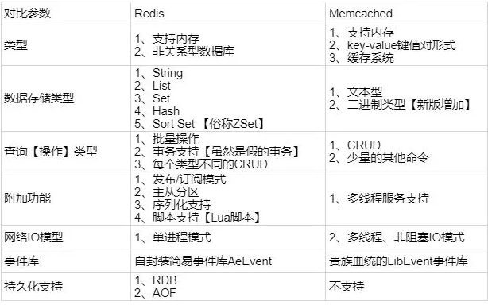
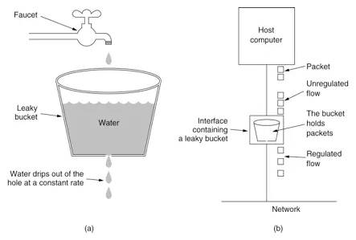
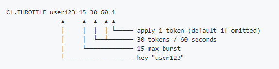

# Redis 面试题收集

- [Redis 面试题收集](#redis-%e9%9d%a2%e8%af%95%e9%a2%98%e6%94%b6%e9%9b%86)
  - [什么是 Redis?简述优缺点](#%e4%bb%80%e4%b9%88%e6%98%af-redis%e7%ae%80%e8%bf%b0%e4%bc%98%e7%bc%ba%e7%82%b9)
    - [Redis 是单进程的还是单线程的?](#redis-%e6%98%af%e5%8d%95%e8%bf%9b%e7%a8%8b%e7%9a%84%e8%bf%98%e6%98%af%e5%8d%95%e7%ba%bf%e7%a8%8b%e7%9a%84)
    - [Redis 为什么是单线程的?](#redis-%e4%b8%ba%e4%bb%80%e4%b9%88%e6%98%af%e5%8d%95%e7%ba%bf%e7%a8%8b%e7%9a%84)
    - [优点](#%e4%bc%98%e7%82%b9)
    - [缺点](#%e7%bc%ba%e7%82%b9)
  - [Redis 适用场景](#redis-%e9%80%82%e7%94%a8%e5%9c%ba%e6%99%af)
  - [Redis 各架构模式及特点](#redis-%e5%90%84%e6%9e%b6%e6%9e%84%e6%a8%a1%e5%bc%8f%e5%8f%8a%e7%89%b9%e7%82%b9)
    - [单机模式](#%e5%8d%95%e6%9c%ba%e6%a8%a1%e5%bc%8f)
    - [主从复制(master-slave)](#%e4%b8%bb%e4%bb%8e%e5%a4%8d%e5%88%b6master-slave)
    - [哨兵](#%e5%93%a8%e5%85%b5)
    - [集群(prxoy 型)](#%e9%9b%86%e7%be%a4prxoy-%e5%9e%8b)
    - [集群(直连型)](#%e9%9b%86%e7%be%a4%e7%9b%b4%e8%bf%9e%e5%9e%8b)
  - [Redis 基础问题](#redis-%e5%9f%ba%e7%a1%80%e9%97%ae%e9%a2%98)
    - [字符串类型的 value 能存储的最大容量](#%e5%ad%97%e7%ac%a6%e4%b8%b2%e7%b1%bb%e5%9e%8b%e7%9a%84-value-%e8%83%bd%e5%ad%98%e5%82%a8%e7%9a%84%e6%9c%80%e5%a4%a7%e5%ae%b9%e9%87%8f)
    - [为什么 Redis 把所有数据放到内存中](#%e4%b8%ba%e4%bb%80%e4%b9%88-redis-%e6%8a%8a%e6%89%80%e6%9c%89%e6%95%b0%e6%8d%ae%e6%94%be%e5%88%b0%e5%86%85%e5%ad%98%e4%b8%ad)
    - [Redis 设置密码和验证密码](#redis-%e8%ae%be%e7%bd%ae%e5%af%86%e7%a0%81%e5%92%8c%e9%aa%8c%e8%af%81%e5%af%86%e7%a0%81)
    - [Redis 怎么测试联通性](#redis-%e6%80%8e%e4%b9%88%e6%b5%8b%e8%af%95%e8%81%94%e9%80%9a%e6%80%a7)
    - [Redis key 的过期时间和永久有效分别怎么设置?](#redis-key-%e7%9a%84%e8%bf%87%e6%9c%9f%e6%97%b6%e9%97%b4%e5%92%8c%e6%b0%b8%e4%b9%85%e6%9c%89%e6%95%88%e5%88%86%e5%88%ab%e6%80%8e%e4%b9%88%e8%ae%be%e7%bd%ae)
    - [查看 Redis 使用情况及状态信息用什么命令](#%e6%9f%a5%e7%9c%8b-redis-%e4%bd%bf%e7%94%a8%e6%83%85%e5%86%b5%e5%8f%8a%e7%8a%b6%e6%80%81%e4%bf%a1%e6%81%af%e7%94%a8%e4%bb%80%e4%b9%88%e5%91%bd%e4%bb%a4)
    - [一个 Redis 实例最多能存放多少的 keys?List,Set,Sorted Set 他们最多能存放多少元素?](#%e4%b8%80%e4%b8%aa-redis-%e5%ae%9e%e4%be%8b%e6%9c%80%e5%a4%9a%e8%83%bd%e5%ad%98%e6%94%be%e5%a4%9a%e5%b0%91%e7%9a%84-keyslistsetsorted-set-%e4%bb%96%e4%bb%ac%e6%9c%80%e5%a4%9a%e8%83%bd%e5%ad%98%e6%94%be%e5%a4%9a%e5%b0%91%e5%85%83%e7%b4%a0)
    - [修改配置不重启 Redis 会实时生效吗?](#%e4%bf%ae%e6%94%b9%e9%85%8d%e7%bd%ae%e4%b8%8d%e9%87%8d%e5%90%af-redis-%e4%bc%9a%e5%ae%9e%e6%97%b6%e7%94%9f%e6%95%88%e5%90%97)
  - [Redis 和 Memcached](#redis-%e5%92%8c-memcached)
    - [区别](#%e5%8c%ba%e5%88%ab)
  - [Redis 的并发竞争问题](#redis-%e7%9a%84%e5%b9%b6%e5%8f%91%e7%ab%9e%e4%ba%89%e9%97%ae%e9%a2%98)
    - [介绍](#%e4%bb%8b%e7%bb%8d)
    - [解决方案](#%e8%a7%a3%e5%86%b3%e6%96%b9%e6%a1%88)
  - [Redis 内存回收](#redis-%e5%86%85%e5%ad%98%e5%9b%9e%e6%94%b6)
    - [Redis 内存回收机制](#redis-%e5%86%85%e5%ad%98%e5%9b%9e%e6%94%b6%e6%9c%ba%e5%88%b6)
    - [淘汰策略](#%e6%b7%98%e6%b1%b0%e7%ad%96%e7%95%a5)
    - [三种 Redis 过期策略](#%e4%b8%89%e7%a7%8d-redis-%e8%bf%87%e6%9c%9f%e7%ad%96%e7%95%a5)
    - [回收进程如何工作](#%e5%9b%9e%e6%94%b6%e8%bf%9b%e7%a8%8b%e5%a6%82%e4%bd%95%e5%b7%a5%e4%bd%9c)
    - [场景:MySQL 里有 2000w 数据,Redis 中只存 20w 的数据,如何保证 Redis 中的数据都是热点数据(redis 有哪些数据淘汰策略)](#%e5%9c%ba%e6%99%afmysql-%e9%87%8c%e6%9c%89-2000w-%e6%95%b0%e6%8d%aeredis-%e4%b8%ad%e5%8f%aa%e5%ad%98-20w-%e7%9a%84%e6%95%b0%e6%8d%ae%e5%a6%82%e4%bd%95%e4%bf%9d%e8%af%81-redis-%e4%b8%ad%e7%9a%84%e6%95%b0%e6%8d%ae%e9%83%bd%e6%98%af%e7%83%ad%e7%82%b9%e6%95%b0%e6%8d%aeredis-%e6%9c%89%e5%93%aa%e4%ba%9b%e6%95%b0%e6%8d%ae%e6%b7%98%e6%b1%b0%e7%ad%96%e7%95%a5)
  - [Redis 如何做内存优化?](#redis-%e5%a6%82%e4%bd%95%e5%81%9a%e5%86%85%e5%ad%98%e4%bc%98%e5%8c%96)
  - [Redis 大量数据插入](#redis-%e5%a4%a7%e9%87%8f%e6%95%b0%e6%8d%ae%e6%8f%92%e5%85%a5)
    - [netcat 命令](#netcat-%e5%91%bd%e4%bb%a4)
    - [pipe mode](#pipe-mode)
  - [Redis 持久化](#redis-%e6%8c%81%e4%b9%85%e5%8c%96)
    - [支持 RDB 和 AOF](#%e6%94%af%e6%8c%81-rdb-%e5%92%8c-aof)
    - [两种持久化的优缺点](#%e4%b8%a4%e7%a7%8d%e6%8c%81%e4%b9%85%e5%8c%96%e7%9a%84%e4%bc%98%e7%bc%ba%e7%82%b9)
      - [RDB 优缺点](#rdb-%e4%bc%98%e7%bc%ba%e7%82%b9)
      - [AOF 优缺点](#aof-%e4%bc%98%e7%bc%ba%e7%82%b9)
    - [如何选择 Redis 持久化策略方式](#%e5%a6%82%e4%bd%95%e9%80%89%e6%8b%a9-redis-%e6%8c%81%e4%b9%85%e5%8c%96%e7%ad%96%e7%95%a5%e6%96%b9%e5%bc%8f)
  - [Redis 分区](#redis-%e5%88%86%e5%8c%ba)
    - [优势](#%e4%bc%98%e5%8a%bf)
    - [不足](#%e4%b8%8d%e8%b6%b3)
    - [分区类型](#%e5%88%86%e5%8c%ba%e7%b1%bb%e5%9e%8b)
      - [范围分区](#%e8%8c%83%e5%9b%b4%e5%88%86%e5%8c%ba)
      - [哈希分区](#%e5%93%88%e5%b8%8c%e5%88%86%e5%8c%ba)
    - [有哪些 Redis 分区实现方案?](#%e6%9c%89%e5%93%aa%e4%ba%9b-redis-%e5%88%86%e5%8c%ba%e5%ae%9e%e7%8e%b0%e6%96%b9%e6%a1%88)
  - [Redis 持久化数据和缓存怎么做扩容?](#redis-%e6%8c%81%e4%b9%85%e5%8c%96%e6%95%b0%e6%8d%ae%e5%92%8c%e7%bc%93%e5%ad%98%e6%80%8e%e4%b9%88%e5%81%9a%e6%89%a9%e5%ae%b9)
  - [分布式 Redis 是前期做还是后期规模上来了再做好?为什么?](#%e5%88%86%e5%b8%83%e5%bc%8f-redis-%e6%98%af%e5%89%8d%e6%9c%9f%e5%81%9a%e8%bf%98%e6%98%af%e5%90%8e%e6%9c%9f%e8%a7%84%e6%a8%a1%e4%b8%8a%e6%9d%a5%e4%ba%86%e5%86%8d%e5%81%9a%e5%a5%bd%e4%b8%ba%e4%bb%80%e4%b9%88)
  - [Twemproxy 是什么?](#twemproxy-%e6%98%af%e4%bb%80%e4%b9%88)
  - [Redis 常见性能问题和解决方案](#redis-%e5%b8%b8%e8%a7%81%e6%80%a7%e8%83%bd%e9%97%ae%e9%a2%98%e5%92%8c%e8%a7%a3%e5%86%b3%e6%96%b9%e6%a1%88)
  - [Redis 与消息队列](#redis-%e4%b8%8e%e6%b6%88%e6%81%af%e9%98%9f%e5%88%97)
    - [Redis 做异步消息队列](#redis-%e5%81%9a%e5%bc%82%e6%ad%a5%e6%b6%88%e6%81%af%e9%98%9f%e5%88%97)
      - [实现](#%e5%ae%9e%e7%8e%b0)
      - [缺点](#%e7%bc%ba%e7%82%b9-1)
      - [能不能生产一次消费多次呢?](#%e8%83%bd%e4%b8%8d%e8%83%bd%e7%94%9f%e4%ba%a7%e4%b8%80%e6%ac%a1%e6%b6%88%e8%b4%b9%e5%a4%9a%e6%ac%a1%e5%91%a2)
    - [Redis 做延迟队列](#redis-%e5%81%9a%e5%bb%b6%e8%bf%9f%e9%98%9f%e5%88%97)
  - [Redis 集群](#redis-%e9%9b%86%e7%be%a4)
    - [Redis 哈希槽的概念](#redis-%e5%93%88%e5%b8%8c%e6%a7%bd%e7%9a%84%e6%a6%82%e5%bf%b5)
      - [基本思想](#%e5%9f%ba%e6%9c%ac%e6%80%9d%e6%83%b3)
      - [为什么要选择的槽是 16384 个？](#%e4%b8%ba%e4%bb%80%e4%b9%88%e8%a6%81%e9%80%89%e6%8b%a9%e7%9a%84%e6%a7%bd%e6%98%af-16384-%e4%b8%aa)
    - [Redis 集群的主从复制模型是怎样的?](#redis-%e9%9b%86%e7%be%a4%e7%9a%84%e4%b8%bb%e4%bb%8e%e5%a4%8d%e5%88%b6%e6%a8%a1%e5%9e%8b%e6%98%af%e6%80%8e%e6%a0%b7%e7%9a%84)
    - [Redis 集群会有写操作丢失吗?为什么?](#redis-%e9%9b%86%e7%be%a4%e4%bc%9a%e6%9c%89%e5%86%99%e6%93%8d%e4%bd%9c%e4%b8%a2%e5%a4%b1%e5%90%97%e4%b8%ba%e4%bb%80%e4%b9%88)
    - [Redis 集群方案](#redis-%e9%9b%86%e7%be%a4%e6%96%b9%e6%a1%88)
      - [codis](#codis)
      - [twemproxy](#twemproxy)
      - [redis cluster](#redis-cluster)
      - [业务代码层实](#%e4%b8%9a%e5%8a%a1%e4%bb%a3%e7%a0%81%e5%b1%82%e5%ae%9e)
    - [Redis 集群方案什么情况下会导致整个集群不可用?](#redis-%e9%9b%86%e7%be%a4%e6%96%b9%e6%a1%88%e4%bb%80%e4%b9%88%e6%83%85%e5%86%b5%e4%b8%8b%e4%bc%9a%e5%af%bc%e8%87%b4%e6%95%b4%e4%b8%aa%e9%9b%86%e7%be%a4%e4%b8%8d%e5%8f%af%e7%94%a8)
    - [Redis 集群之间如何复制?](#redis-%e9%9b%86%e7%be%a4%e4%b9%8b%e9%97%b4%e5%a6%82%e4%bd%95%e5%a4%8d%e5%88%b6)
    - [Redis 集群的最大节点数?](#redis-%e9%9b%86%e7%be%a4%e7%9a%84%e6%9c%80%e5%a4%a7%e8%8a%82%e7%82%b9%e6%95%b0)
    - [Redis 集群如何选择数据库?](#redis-%e9%9b%86%e7%be%a4%e5%a6%82%e4%bd%95%e9%80%89%e6%8b%a9%e6%95%b0%e6%8d%ae%e5%ba%93)
  - [Redis 支持的 Java 客户端都有哪些?官方推荐用哪个?](#redis-%e6%94%af%e6%8c%81%e7%9a%84-java-%e5%ae%a2%e6%88%b7%e7%ab%af%e9%83%bd%e6%9c%89%e5%93%aa%e4%ba%9b%e5%ae%98%e6%96%b9%e6%8e%a8%e8%8d%90%e7%94%a8%e5%93%aa%e4%b8%aa)
  - [Redis 和 Redisson 有什么关系?](#redis-%e5%92%8c-redisson-%e6%9c%89%e4%bb%80%e4%b9%88%e5%85%b3%e7%b3%bb)
  - [Jedis 与 Redisson 对比有什么优缺点?](#jedis-%e4%b8%8e-redisson-%e5%af%b9%e6%af%94%e6%9c%89%e4%bb%80%e4%b9%88%e4%bc%98%e7%bc%ba%e7%82%b9)
  - [支持一致性哈希的客户端有哪些?](#%e6%94%af%e6%8c%81%e4%b8%80%e8%87%b4%e6%80%a7%e5%93%88%e5%b8%8c%e7%9a%84%e5%ae%a2%e6%88%b7%e7%ab%af%e6%9c%89%e5%93%aa%e4%ba%9b)
  - [Redis 管道](#redis-%e7%ae%a1%e9%81%93)
  - [Redis 事务](#redis-%e4%ba%8b%e5%8a%a1)
    - [介绍](#%e4%bb%8b%e7%bb%8d-1)
    - [Redis 事务 5 个相关命令](#redis-%e4%ba%8b%e5%8a%a1-5-%e4%b8%aa%e7%9b%b8%e5%85%b3%e5%91%bd%e4%bb%a4)
    - [Redis 事务不支持 Rollback](#redis-%e4%ba%8b%e5%8a%a1%e4%b8%8d%e6%94%af%e6%8c%81-rollback)
  - [Redis 分布式锁](#redis-%e5%88%86%e5%b8%83%e5%bc%8f%e9%94%81)
    - [实现](#%e5%ae%9e%e7%8e%b0-1)
    - [如果在 setnx 之后执行 expire 之前进程意外 crash 或者要重启维护了,那会怎么样?](#%e5%a6%82%e6%9e%9c%e5%9c%a8-setnx-%e4%b9%8b%e5%90%8e%e6%89%a7%e8%a1%8c-expire-%e4%b9%8b%e5%89%8d%e8%bf%9b%e7%a8%8b%e6%84%8f%e5%a4%96-crash-%e6%88%96%e8%80%85%e8%a6%81%e9%87%8d%e5%90%af%e7%bb%b4%e6%8a%a4%e4%ba%86%e9%82%a3%e4%bc%9a%e6%80%8e%e4%b9%88%e6%a0%b7)
  - [缓存穿透](#%e7%bc%93%e5%ad%98%e7%a9%bf%e9%80%8f)
    - [介绍](#%e4%bb%8b%e7%bb%8d-2)
    - [如何避免?](#%e5%a6%82%e4%bd%95%e9%81%bf%e5%85%8d)
  - [缓存雪崩](#%e7%bc%93%e5%ad%98%e9%9b%aa%e5%b4%a9)
    - [介绍](#%e4%bb%8b%e7%bb%8d-3)
    - [如何避免?](#%e5%a6%82%e4%bd%95%e9%81%bf%e5%85%8d-1)
  - [缓存并发](#%e7%bc%93%e5%ad%98%e5%b9%b6%e5%8f%91)
  - [缓存预热](#%e7%bc%93%e5%ad%98%e9%a2%84%e7%83%ad)
    - [介绍](#%e4%bb%8b%e7%bb%8d-4)
    - [解决思路](#%e8%a7%a3%e5%86%b3%e6%80%9d%e8%b7%af)
  - [Redis 与其他 key-value 存储有什么不同?](#redis-%e4%b8%8e%e5%85%b6%e4%bb%96-key-value-%e5%ad%98%e5%82%a8%e6%9c%89%e4%bb%80%e4%b9%88%e4%b8%8d%e5%90%8c)
  - [Redis bitMap](#redis-bitmap)
    - [介绍](#%e4%bb%8b%e7%bb%8d-5)
    - [优势](#%e4%bc%98%e5%8a%bf-1)
    - [使用场景](#%e4%bd%bf%e7%94%a8%e5%9c%ba%e6%99%af)
    - [常用命令](#%e5%b8%b8%e7%94%a8%e5%91%bd%e4%bb%a4)
    - [适用于各类统计应用](#%e9%80%82%e7%94%a8%e4%ba%8e%e5%90%84%e7%b1%bb%e7%bb%9f%e8%ae%a1%e5%ba%94%e7%94%a8)
    - [延伸阅读-Redis 精确去重计数](#%e5%bb%b6%e4%bc%b8%e9%98%85%e8%af%bb-redis-%e7%b2%be%e7%a1%ae%e5%8e%bb%e9%87%8d%e8%ae%a1%e6%95%b0)
  - [Redis HyperLogLog](#redis-hyperloglog)
    - [介绍](#%e4%bb%8b%e7%bb%8d-6)
    - [pf 的内存只有 12k](#pf-%e7%9a%84%e5%86%85%e5%ad%98%e5%8f%aa%e6%9c%89-12k)
    - [什么是基数(不重复元素)](#%e4%bb%80%e4%b9%88%e6%98%af%e5%9f%ba%e6%95%b0%e4%b8%8d%e9%87%8d%e5%a4%8d%e5%85%83%e7%b4%a0)
    - [相关命令](#%e7%9b%b8%e5%85%b3%e5%91%bd%e4%bb%a4)
    - [相关场景](#%e7%9b%b8%e5%85%b3%e5%9c%ba%e6%99%af)
      - [**误差**](#%e8%af%af%e5%b7%ae)
  - [Redis 布隆过滤器](#redis-%e5%b8%83%e9%9a%86%e8%bf%87%e6%bb%a4%e5%99%a8)
    - [介绍](#%e4%bb%8b%e7%bb%8d-7)
    - [原理](#%e5%8e%9f%e7%90%86)
    - [Redis 中的布隆过滤器](#redis-%e4%b8%ad%e7%9a%84%e5%b8%83%e9%9a%86%e8%bf%87%e6%bb%a4%e5%99%a8)
    - [布隆过滤器基本使用](#%e5%b8%83%e9%9a%86%e8%bf%87%e6%bb%a4%e5%99%a8%e5%9f%ba%e6%9c%ac%e4%bd%bf%e7%94%a8)
    - [应用场景](#%e5%ba%94%e7%94%a8%e5%9c%ba%e6%99%af)
  - [Redis Geo](#redis-geo)
    - [命令](#%e5%91%bd%e4%bb%a4)
  - [Redis 限流](#redis-%e9%99%90%e6%b5%81)
    - [介绍](#%e4%bb%8b%e7%bb%8d-8)
    - [限流算法](#%e9%99%90%e6%b5%81%e7%ae%97%e6%b3%95)
      - [计数器](#%e8%ae%a1%e6%95%b0%e5%99%a8)
      - [漏桶](#%e6%bc%8f%e6%a1%b6)
      - [令牌桶](#%e4%bb%a4%e7%89%8c%e6%a1%b6)

## 什么是 Redis?简述优缺点

Redis 全称 **Remote Dictionary Server**，本质是一个**Key-Value**类型数据库，由 C 语言编写，和**Memcached**类似，整个数据库在内存中进行操作，定期通过异步操作将数据 flush 到硬盘存储。

### Redis 是单进程的还是单线程的?

Redis 是**单进程单线程**的，Redis 利用队列技术将并发访问变为串行访问，消除了传统数据库串行控制的开销。

### Redis 为什么是单线程的?

- 多线程会涉及到锁，且线程切换会消耗 CPU
- CPU 不是 Redis 的瓶颈，内存和网络带宽才是
- 可以通过单机多实例来发挥 CPU 性能

### 优点

- **性能非常出色**：数据存在内存中，每秒可处理超过 10 万次读写操作。自定义底层数据结构(SDS、ziplist、skiplist 等)
- **value 支持多种存储类型**：string，list，set，zset，hash，stream(5.x；流类型，应用于消息队列)。单个 value 的最大限制是 1GB。
- **提供丰富的操作**：add/remove，push/pop，交并差集(sinter,sunion,sdiff)等操作，且操作都是原子性的。
- **功能丰富**：支持部分事务，哨兵，集群，主从复制(master-slave)，持久化。
- **用途广泛**：可用于缓存，消息队列，为 key 设置过期时间，发布/订阅。

### 缺点

- 数据库**容量受物理内存限制**，不能用作海量数据的高性能读写，因此 Redis 适合的场景主要局限在较小数据量的高性能操作和运算上。

---

## Redis 适用场景

1. 会话缓存(Session Cache)
2. 全页缓存(FPC)
3. 队列，消息队列
4. 计数器/排行榜
5. 发布/订阅

---

## Redis 各架构模式及特点

### 单机模式

**特点**：简单

**不足**：

1. 内存容量有限
2. 处理能力有限
3. 无法高可用

### 主从复制(master-slave)

Redis 复制功能允许用户根据一个 Redis 服务器来创建任意多个该服务器的复制，主要主从服务器之间的网络连接正常，主从服务器两者会具有相同的数据，主服务器就会一直将发生在自己身上的数据更新同步给从服务器，从而一直保证主从服务器的数据相同。

**不足**：

1. 无法保证高可用
2. 没解决 master 写的压力

### 哨兵

Redis sentinel 是一个分布式系统中监控 redis 主从服务器，并在主服务器下线时自动进行故障转移。其中三个特性：

- 监控（Monitoring）： Sentinel 会不断地检查你的主服务器和从服务器是否运作正常。
- 提醒（Notification）： 当被监控的某个 Redis 服务器出现问题时， Sentinel 可以通过 API 向管理员或者其他应用程序发送通知。
- 自动故障迁移（Automatic failover）： 当一个主服务器不能正常工作时， Sentinel 会开始一次自动故障迁移操作。

**特点**：

1. 保证高可用
2. 监控各个节点
3. 自动故障迁移
4. 离线节点重启自动加入

**不足**：

1. 主从模式，切换需要时间，会丢失数据
2. 没有解决 master 写的压力

### 集群(prxoy 型)

Twemproxy 是一个 Twitter 开源的一个 redis 和 memcache 快速/轻量级代理服务器；

Twemproxy 是一个快速的单线程代理程序，支持 Memcached ASCII 协议和 redis 协议。

**特点**：

1. 多种 hash 算法：MD5、CRC16、CRC32、CRC32a、hsieh、murmur、Jenkin
2. 支持失败节点自动删除
3. 后端 Sharding 分片逻辑对**业务透明**，业务方的读写方式和操作单个 Redis 一致

**不足**：

1. 增加新 prxoy，需要维护其高可用
2. failover 逻辑需要自己实现，其本身不支持故障自动迁移，可扩展性差，扩容缩容需要手动干预

### 集群(直连型)

redis3.0 之后支持 Redis-Cluster，Redis-Cluster 采用**无中心结构**，每个节点保存数据和整个集群状态,每个节点都和其他所有节点连接。

**特点**：

1. 无中心架构(不存在哪个节点影响性能瓶颈)，少了 proxy 层。
2. 数据按 slot 存储分布在多个节点，节点间数据共享，可动态调整数据分布。
3. 可扩展性，可线性扩展到 1000 个节点，节点可动态添加或删除。
4. 高可用性，部分节点不可用时，集群仍可用。通过增加 Slave 做备份数据副本
5. 实时故障自动 failover，节点之间通过 gossip 协议交换状态信息，用投票机制完成 Slave 到 Master 的角色提升。

**不足**：

1. 资源隔离性较差，容易出现相互影响的情况。
2. 数据通过异步复制，不保证数据强一致性。

---

## Redis 基础问题

### 字符串类型的 value 能存储的最大容量

512M；一个 key 或是 value 大小最大是 512M

### 为什么 Redis 把所有数据放到内存中

Redis 为了更快的读写速度，同时避免磁盘 I/O 速度影响 Redis 性能，将数据加载到内存中，并通过异步方式将数据写入磁盘。

### Redis 设置密码和验证密码

设置密码：`config set requirepass 123456`

验证密码：`auth 123456`

### Redis 怎么测试联通性

PING

### Redis key 的过期时间和永久有效分别怎么设置?

- 设置过期时间：`EXPIRE key seconds`；`PEXPIRE key milliseconds`
- 设置过期时间戳：`EXPIREAT key timestamp`；`PEXPIREAT key milliseconds-timestamp`
- 移除过期时间(永久有效)：`PERSIST key`

### 查看 Redis 使用情况及状态信息用什么命令

INFO

### 一个 Redis 实例最多能存放多少的 keys?List,Set,Sorted Set 他们最多能存放多少元素?

理论上 Redis 可以处理多达 **2^32** 的 keys，并且在实际中进行了测试，每个实例至少存放了 2 亿 5 千万的 keys。

任何 list、set、和 sorted set 都可以放 2^32 个元素。

换句话说，Redis 的存储极限是系统中的可用内存值。

### 修改配置不重启 Redis 会实时生效吗?

针对运行实例，有许多配置选项可以通过 **CONFIG SET** 命令进行修改，而无需执行任何形式的重启。 从 Redis 2.2 开始，可以从 AOF 切换到 RDB 的快照持久性或其他方式而不需要重启 Redis。检索 ‘CONFIG GET \*’ 命令获取更多信息。

但偶尔重新启动是必须的，如为升级 Redis 程序到新的版本，或者当你需要修改某些目前 CONFIG 命令还不支持的配置参数的时候。

---

## Redis 和 Memcached

### 区别

1. 数据类型：Memcached 所有值均是简单的字符串；redis 支持更丰富的数据类型。
2. 速度：redis 速度比 Memcached 快很多。
3. 持久化：redis 可以持久化数据(AOF，快照 RDB)；Memcached 只在内存中存储数据。
4. 网络模型：Memcached 是多线程，非阻塞 IO 复用的网络模型；Redis 使用单线程 IO 复用模型。
5. 备份：Redis 支持 master-slave 模式的数据备份。



---

## Redis 的并发竞争问题

### 介绍

`Redis 并发竞争问题，主要是发生在并发写竞争`

例如：两个连接同时对 price 进行写操作，同时加 10，最终结果我们知道，应该为 30 才是正确。  
考虑到一种情况：  
T1 时刻，连接 1 将 price 读出，目标设置的数据为 10+10 = 20。  
T2 时刻，连接 2 也将数据读出，也是为 10，目标设置为 20。  
T3 时刻，连接 1 将 price 设置为 20。  
T4 时刻，连接 2 也将 price 设置为 20，则最终结果是一个错误值 20。

### 解决方案

**方案 1**

**利用 redis 自带的 incr 命令**(限速器模式)。http://doc.redisfans.com/string/incr.html

**方案 2**

可以**使用独占锁的方式**，利用 redis 的**setnx**实现内置的锁，类似操作系统的 mutex 机制。http://blog.csdn.net/black_ox/article/details/48972085

**方案 3**

使用**乐观锁**的方式进行解决（成本较低，非阻塞，性能较高）

```text
watch price

get price $price

$price = $price + 10

multi

set price $price

exec
```

watch 这里表示监控该 key 值，后面的事务是有条件的执行，如果从 watch 的 exec 语句执行时，watch 的 key 对应的 value 值被修改了，则事务不会执行。

**方案 4**

这个是针对客户端来的，在代码里要对 redis 操作的时候，针对同一 key 的资源，就先进行加锁（java 里的 synchronized 或 lock）。

---

## Redis 内存回收

**算法**：LRU 算法和引用计数算法

### Redis 内存回收机制

1. **Redis 键过期策略**：删除过期时间的 key-value
2. **Redis 内存淘汰策略**：内存使用达到 maxmemory 上限时触发内存淘汰数据

### 淘汰策略

**redis 提供 6 种数据淘汰策略：(内存大小达到 server.maxmemory 时)**

1. noeviction: 新写入操作会报错。
2. allkeys-lru：在键空间（server.db[i].dict）中，移除最近最少使用的 key（这个是最常用的）。
3. allkeys-random：在键空间（server.db[i].dict）中，随机移除某个 key。
4. volatile-lru：在设置了过期时间的键空间（server.db[i].expires）中，移除最近最少使用的 key。
5. volatile-random：在设置了过期时间的键空间（server.db[i].expires）中，随机移除某个 key。
6. volatile-ttl：在设置了过期时间的键空间（server.db[i].expires）中，有更早过期时间的 key 优先移除。

### 三种 Redis 过期策略

1. **定时过期**： 每个设置过期时间的 key 都需要创建一个定时器，到过期时间就会立即清除。该策略可以立即清除过期的数据，对内存很友好；但是会占用大量的 CPU 资源去处理过期的数据，从而影响缓存的响应时间和吞吐量。(到期删除；CPU 不友好，影响性能)
2. **惰性过期**：只有当访问一个 key 时，才会判断该 key 是否已过期，过期则清除。该策略可以最大化地节省 CPU 资源，却对内存非常不友好。极端情况可能出现大量的过期 key 没有再次被访问，从而不会被清除，占用大量内存。(访问才删除，会出现未访问的过期 key 无法删除；内存不友好)
3. **定期过期**：每隔一定的时间，会扫描一定数量的数据库的 expires 字典中一定数量的 key，并清除其中已过期的 key。该策略是前两者的一个折中方案。通过调整定时扫描的时间间隔和每次扫描的限定耗时，可以在不同情况下使得 CPU 和内存资源达到最优的平衡效果。(定期扫描过期 keys；折中平衡)

Redis 中同时使用了**惰性过期**和**定期过期**两种过期策略。

### 回收进程如何工作

1. 客户端执行数据写入操作;
2. redis server 接收到写入操作之后，检查 maxmemory 的限制，如果超过了限制，那么就根据对应的 policy 清理掉部分数据
3. 写入操作完成执行。

所以我们不断地穿越内存限制的边界，通过不断达到边界然后不断地回收回到边界以下。

如果一个命令的结果导致大量内存被使用（例如很大的集合的交集保存到一个新的键），不用多久内存限制就会被这个内存使用量超越。

### 场景:MySQL 里有 2000w 数据,Redis 中只存 20w 的数据,如何保证 Redis 中的数据都是热点数据(redis 有哪些数据淘汰策略)

redis 内存数据集大小上升到一定大小的时候，就会施行内存淘汰策略（回收策略）。

---

## Redis 如何做内存优化?

尽可能使用散列表（hashes），散列表（是说散列表里面存储的数少）使用的内存非常小，所以你应该尽可能的将你的数据模型抽象到一个散列表里面。比如你的 web 系统中有一个用户对象，不要为这个用户的名称，姓氏，邮箱，密码设置单独的 key,而是应该把这个用户的所有信息存储到一张散列表里面。

如果你使用的是 32 位的 Redis 实例，可以好好利用 Hash,list,sorted set,set 等集合类型数据，因为通常情况下很多小的 Key-Value 可以用更紧凑的方式存放到一起。

---

## Redis 大量数据插入

### netcat 命令

用 netcat 进行大规模插入时**不能检查错误**

```text
# data.txt包含大量数据
(cat data.txt; sleep 10) | nc localhost 6379 > /dev/null

```

### pipe mode

```text
cat data.txt | redis-cli --pipe

```

---

## Redis 持久化

### 支持 RDB 和 AOF

- **RDB 持久化**：原理是将 Redis 在内存中的数据记录定时 dump 到磁盘上的 RDB 文件。 指定的时间间隔内将内存中的数据集快照写入磁盘，实际操作过程是 fork 一个子进程，先将数据集写入临时文件，写入成功后，再替换之前的文件，用二进制压缩存储。

- **AOF（append only file）持久化**：原理是将 Redis 的操作日志以追加的方式写入文件。 以日志的形式记录服务器所处理的每一个写、删除操作，查询操作不会记录，以文本的方式记录，可以打开文件看到详细的操作记录。当服务器重启的时候会重新执行这些命令来恢复原始的数据。AOF 命令以 Reids 协议追加保存每次写的操作到文件末尾。Redis 还能对 AOF 文件进行后台重写，使得 AOF 文件的体积不至于过大。

### 两种持久化的优缺点

#### RDB 优缺点

**优点**：

- 文件紧凑，体积小，网络传输快，适合全量备份；
- 恢复速度比 AOF 快很多；
- 与 AOF 相比，对 Redis 性能影响相对较小

**缺点**：

- RDB 无法做到实时持久化，AOF 持久化称为主流。
- RDB 文件需要特定格式，兼容性差

#### AOF 优缺点

**优点**

- 支持秒级持久化(还可以每条命令都写入 aof)
- 文件兼容性好，使用与 Redis 命令一样的协议

**缺点**

- 文件大，恢复速度慢，对性能影响大

---

### 如何选择 Redis 持久化策略方式

首先要明白，无论是 RDB 还是 AOF，持久化的开启都是要付出性能方面的代价的。

对于 RDB，一方面**bgsave**在进行 fork 操作时 Redis 主进程会阻塞，另一方面，子进程向硬盘写数据也会带来 IO 压力；对于 AOF，向硬盘写数据的频率大大提高（everysec 策略下为秒级），IO 压力更大，设置肯能造成 AOF 追加阻塞文件。此外，AOF 文件的重写与 RDB 的 basave 类似，会有 fork 时的阻塞和子进程的 IO 压力问题。相对来说，由于 AOF 向硬盘中写数据的频率更高，因此对 Redis 主进程性能的影响会更大。

在实际生产环境中，根据**数据量**、**应用对数据的安全要求**、**预算限制**等不同情况，会有各种各样的持久化策略；如完全不使用任何持久化，使用 RDB 或 AOF 一种，或同时开启 RDB 和 AOF 持久化等。此外，持久化的选择必须与**Redis 的主从策略一起考虑**，因为主从复制与持久化同样具有数据备份的功能，而且主机 master 和从机 slave 可以独立的选择持久化方案。

## Redis 分区

**分区**：指分割数据到多个 Redis 实例的处理过程，因此每个实例只保存 key 的一个子集。

### 优势

- 通过利用多台计算机内存的和值，允许我们构造更大的数据库。(**增大内存，构造更大数据库**)
- 通过多核或多台计算机，允许我们扩展计算能力；通过多台计算机和网络适配器，允许我们扩展网络带宽。(**横向扩展计算能力，增加 PC 和 NIC 来扩展网络带宽**)

### 不足

Redis 的一些特性在分区方面表现不是很好：

- **涉及多个 key 的操作通常不被支持**。e.g. 当两个 set 映射到不同的 Redis 上时，不能对两个 set 执行交集操作。
- **涉及多个 key 的 redis 事务不能使用**。
- **使用分区时数据处理比较复杂**。e.g. 需要处理多个 rdb/aof 文件，并且从多个实例和主机备份持久化文件。
- **分区时动态扩容或缩容可能非常复杂**。redis 集群大多数支持在运行时增加、删除节点的透明数据平衡的能力，但是类似于客户端分区、代理分区等其他系统则不支持这项特性。然而，一种叫做 presharding 的技术对此是有帮助的。

### 分区类型

两种分区类型：**范围分区**、**哈希分区**

假设有 4 个 Redis 实例 R0，R1，R2，R3，和类似 user:1，user:2 这样的表示用户的多个 key，对既定的 key 有多种不同方式来选择这个 key 存放在哪个实例中。也就是说，有不同的系统来映射某个 key 到某个 Redis 服务。

#### 范围分区

最简单的分区方式，及映射一定范围的对象到特定的 Redis 实例。

比如，ID 从 0 到 10000 的用户会保存到实例 R0，ID 从 10001 到 20000 的用户会保存到 R1，以此类推。

这种方式是可行的，并且在实际中使用，**不足就是要有一个区间范围到实例的映射表**。这个表要被管理，同时还需要各种对象的映射表，通常对 Redis 来说并非是好的方法。(需要实例与区间的映射表，还需各种对象的映射表(user:1))

#### 哈希分区

对任何 key 都适用，也无需`oject_name:`这种形式，如下描述：

用一个 hash 函数将 key 转换为一个数字，比如使用 crc32 hash 函数。对 key foobar 执行 crc32(foobar)会输出类似 93024922 的整数。
对这个整数取模，将其转化为 0-3 之间的数字，就可以将这个整数映射到 4 个 Redis 实例中的一个了。93024922 % 4 = 2，就是说 key foobar 应该被存到 R2 实例中。注意：取模操作是取除的余数，通常在多种编程语言中用%操作符实现。

### 有哪些 Redis 分区实现方案?

- **客户端分区**：在客户端就已经决定数据会被存储到哪个 redis 节点或者从哪个 redis 节点读取。大多数客户端已经实现了客户端分区。
- **代理分区**：客户端请求发送给代理，由代理决定去哪个节点写数据或读取数据。代理根据分区规则决定请求哪些 Redis 实例，然后根据 Redis 的响应结果返回给客户端。Redis 和 Memcached 的一种代理实现就是 Twemproxy。
- **查询路由(Query routing)**：客户端随机地请求任意一个 redis 实例,然后由 Redis 将请求转发给正确的 Redis 节点。Redis Cluster 实现了一种混合形式的查询路由，但并不是直接将请求从一个 redis 节点转发到另一个 redis 节点，而是在客户端的帮助下直接 redirected 到正确的 redis 节点。

---

## Redis 持久化数据和缓存怎么做扩容?

- 缓存：**使用一致性哈希实现动态扩容缩容。**
- 持久化存储：必须**使用固定的 keys-to-nodes 映射关系**，节点的数量一旦确定不能变化。否则的话(即 Redis 节点需要动态变化的情况），必须使用可以在运行时进行数据再平衡的一套系统，而当前只有 Redis 集群可以做到这样。

---

## 分布式 Redis 是前期做还是后期规模上来了再做好?为什么?

**单实例资源占用小(1M);单机多实例转迁移为多机多实例容易些(presharding)**

既然 Redis 是如此轻量(单实例只使用 1M 内存)，为防止以后扩容，最好一开始就启动较多实例。即便只有一台服务器，也可以一开始就让 Redis 以分布式的方式运行，使用分区，在同一台服务器上启动多个实例。

一开始就多设置几个 Redis 实例，例如 32 或者 64 个实例，对大多数用户来说这操作起来可能比较麻烦，但是从长久来看做这点牺牲是值得的。

这样的话，当你的数据不断增长，需要更多的 Redis 服务器时，你需要做的就是仅仅将 Redis 实例从一台服务迁移到另外一台服务器而已（而不用考虑重新分区的问题）。一旦你添加了另一台服务器，你需要将你一半的 Redis 实例从第一台机器迁移到第二台机器。(单机的多实例移动部分实例到多机上，无需重新分区)

---

## Twemproxy 是什么?

Twemproxy 是 Twitter 维护的（缓存）代理系统，代理 Memcached 的 ASCII 协议和 Redis 协议。它是单线程程序，使用 c 语言编写，运行起来非常快。它是采用 Apache 2.0 license 的开源软件。 Twemproxy 支持自动分区，如果其代理的其中一个 Redis 节点不可用时，会自动将该节点排除（这将改变原来的 keys-instances 的映射关系，所以你应该仅在把 Redis 当缓存时使用 Twemproxy)。 Twemproxy 本身不存在单点问题，因为你可以启动多个 Twemproxy 实例，然后让你的客户端去连接任意一个 Twemproxy 实例。 Twemproxy 是 Redis 客户端和服务器端的一个中间层，由它来处理分区功能应该不算复杂，并且应该算比较可靠的。[github 地址](https://github.com/twitter/twemproxy)

---

## Redis 常见性能问题和解决方案

1. Master 最好不要做任何持久化工作，如 RDB 快照和 AOF 日志文件。(Master 不要持久化)
2. 如果数据比较重要，某个 slave 开启 AOF 备份数据，策略设置为每秒 1 次。(节点备份采用每秒 1 次)
3. 为了主从复制的速度和连接的稳定性，Master 和 Slave 最好在同一个局域网内。(同局域网)
4. 尽量避免在压力很大的主库上增加从库。
5. 主从复制不要用图状结构，用单向链表结构更为稳定，即：Master <- Slave1 <- Slave2 <- Slave3...；这样的结构方便解决单点故障问题，实现 Slave 对 Master 的替换。如果 Master 挂了，可以立刻启用 Slave1 做 Master，其他不变。

---

## Redis 与消息队列

> 作者：翁伟 链接：https://www.zhihu.com/question/20795043/answer/345073457

不要使用 redis 去做消息队列，这不是 redis 的设计目标。作者基于 redis 的核心代码，另外实现了一个消息队列：[disque](https://github.com/antirez/disque)部署、协议等方面都跟 redis 非常类似，并且支持集群，延迟消息等等。

### Redis 做异步消息队列

#### 实现

一般使用 list 结构作为队列，rpush 生产消息，lpop 消费消息。当 lpop 没有消息时，要适当 sleep 一会再重试。

#### 缺点

- 在消费者下线的情况下，生产的消息会丢失，得使用专业的消息队列如 rabbitmq 等。

#### 能不能生产一次消费多次呢?

使用 pub/sub 模式，可以实现 1:N 的消息队列。

### Redis 做延迟队列

顾名思义就是需要延迟一段时间后执行。Redis 可通过 **zset** 来实现。我们可以将有序集合的 value 设置为我们的消息任务，把 value 的 score 设置为消息的到期时间，然后轮询获取有序集合的中的到期消息进行处理。

这里又产生了一个问题，同一个任务可能会被多个进程取到之后再使用 zrem 进行争抢，那些没抢到的进程都是白取了一次任务，这是浪费。解决办法：将 **zrangebyscore** 和 **zrem** 使用 lua 脚本进行**原子化操作**,这样多个进程之间争抢任务时就不会出现这种浪费了。

---

## Redis 集群

### Redis 哈希槽的概念

Redis 集群**没有使用一致性 hash**,而是引入了哈希槽的概念，Redis 集群有 **16384 个哈希槽**(2k \* 8)，**每个 key 通过 CRC16 校验后对 16384 取模来决定放置哪个槽，集群的每个节点负责一部分 hash 槽。**

#### 基本思想

（1）一共有 16384 个槽，每台服务器分管其中的一部分
（2）插入一个数据的时候，先根据 CRC16 算法计算 key 对应的值，然后用该值对 16384 取余数（即 CRC16(key) mod 16384），确定将数据放到哪个槽里面
（3）在增加的时候，之前的节点各自分出一些槽给新节点，对应的数据也一起迁出
（4）客户端可以向任何一个 Redis 节点发送请求，然后由节点将请求重定向到正确的节点上

#### 为什么要选择的槽是 16384 个？

1. 如果槽位为 65536，发送心跳信息的消息头达 8k，发送的心跳包过于庞大。
2. redis 的集群主节点数量基本不可能超过 1000 个。
3. 槽位越小，节点少的情况下，压缩比高。

### Redis 集群的主从复制模型是怎样的?

为了使在部分节点失败或者大部分节点无法通信的情况下集群仍然可用，所以集群使用了主从复制模型,**每个节点都会有 N-1 个复制品**。

### Redis 集群会有写操作丢失吗?为什么?

Redis 并**不能保证数据的强一致性**，这意味这在实际中集群在特定的条件下可能会丢失写操作。

### Redis 集群方案

#### codis

目前用的最多的集群方案，基本和 twemproxy 一致的效果，但它支持在 节点数量改变情况下，旧节点数据可恢复到新 hash 节点。

[项目地址](https://github.com/CodisLabs/codis)

#### twemproxy

#### redis cluster

需要 Redis 3.0 或更高版本。特点在于他的分布式算法不是一致性 hash，而是 hash 槽的概念，以及自身支持节点设置从节点。具体看官方文档介绍。

#### 业务代码层实

在业务代码层实现，起几个毫无关联的 redis 实例，在代码层，对 key 进行 hash 计算(一致性 hash)，然后去对应的 redis 实例操作数据。 这种方式对 hash 层代码要求比较高，考虑部分包括，节点失效后的替代算法方案，数据震荡后的自动脚本恢复，实例的监控，等等。

### Redis 集群方案什么情况下会导致整个集群不可用?

有 A，B，C 三个节点的集群,在**没有复制模型**的情况下,如果节点 B 失败了，那么整个集群就会以为缺少 5501-11000 这个范围的槽而不可用。

### Redis 集群之间如何复制?

异步复制

### Redis 集群的最大节点数?

16384 = 2k \* 8

### Redis 集群如何选择数据库?

Redis 集群目前无法做数据库选择，默认在 0 数据库。

---

## Redis 支持的 Java 客户端都有哪些?官方推荐用哪个?

Redisson、Jedis、lettuce 等等，官方推荐使用 Redisson。

---

## Redis 和 Redisson 有什么关系?

Redisson 是一个高级的分布式协调 Redis 客服端，能帮助用户在分布式环境中轻松实现一些 Java 的对象 (Bloom filter, BitSet, Set, SetMultimap, ScoredSortedSet, SortedSet, Map, ConcurrentMap, List, ListMultimap, Queue, BlockingQueue, Deque, BlockingDeque, Semaphore, Lock, ReadWriteLock, AtomicLong, CountDownLatch, Publish / Subscribe, HyperLogLog)。

---

## Jedis 与 Redisson 对比有什么优缺点?

Jedis 是 Redis 的 Java 实现的客户端，其 API 提供了比较全面的 Redis 命令的支持；

Redisson 实现了分布式和可扩展的 Java 数据结构，和 Jedis 相比，功能较为简单，不支持字符串操作，不支持排序、事务、管道、分区等 Redis 特性。Redisson 的宗旨是促进使用者对 Redis 的关注分离，从而让使用者能够将精力更集中地放在处理业务逻辑上。

---

## 支持一致性哈希的客户端有哪些?

Redis-rb、Predis 等。

---

## Redis 管道

pipeline 通过减少客户端与 redis 的通信次数来实现降低往返延时时间，而且 Pipeline 实现的原理是队列，而队列的原理是时先进先出，这样就保证数据的顺序性。

一次请求/响应服务器能实现处理新的请求即使旧的请求还未被响应。这样就可以将多个命令发送到服务器，而不用等待回复，最后在一个步骤中读取该答复。

---

## Redis 事务

### 介绍

事务可以一次执行多个命令， 并且带有以下两个重要的保证：

- **事务是一个单独的隔离操作**：事务中的所有命令都会序列化、按顺序地执行。事务在执行的过程中，不会被其他客户端发送来的命令请求所打断。
- **事务是一个原子操作**：事务中的命令要么全部被执行，要么全部都不执行。

然而，如果 Redis 服务器因为某些原因被管理员杀死，或者遇上某种硬件故障，那么可能只有部分事务命令会被成功写入到磁盘中。

如果 Redis 在重新启动时发现 AOF 文件出了这样的问题，那么它会退出，并汇报一个错误。

使用 `redis-check-aof` 程序可以修复这一问题：它会移除 AOF 文件中不完整事务的信息，确保服务器可以顺利启动。

- 如果客户端在使用 MULTI 开启了一个事务之后，却因为断线而没有成功执行 EXEC ，那么事务中的所有命令都不会被执行。

- 另一方面，如果客户端成功在开启事务之后执行 EXEC ，那么事务中的所有命令都会被执行。

### Redis 事务 5 个相关命令

**MULTI** 、 **EXEC** 、 **DISCARD**、**WATCH**和**UNWATCH** 是 Redis 事务的基础。

### Redis 事务不支持 Rollback

**优点**：

- Redis 命令只会因为错误的语法而失败（并且这些问题不能在入队时发现），或是命令用在了错误类型的键上面：这也就是说，从实用性的角度来说，失败的命令是由编程错误造成的，而这些错误应该在开发的过程中被发现，而不应该出现在生产环境中。(人为的语法错误导致事务失败)
- 因为不需要对回滚进行支持，所以 Redis 的内部可以保持简单且快速。(保持简单和快速)

## Redis 分布式锁

### 实现

先拿 setnx 来争抢锁，抢到之后，再用 expire 给锁加一个过期时间防止锁忘记了释放。

使用 redis 来实现分布式锁主要用到以下命令：

- **`SETNX KEY VALUE`**：成功设置返回 1；失败返回 0
- **`expire KEY seconds`**：设置 key 的过期时间
- **`del key`**：删除 key

```text
eval "
local ok = redis.call('setnx', 'nxkey', '1')
if(ok == 1)
then
    redis.call('expire', 'nxkey', '30')
    redis.call('set', 'newkey', '123') -- do something
    redis.call('del', 'nxkey')
end
" 0
```

### 如果在 setnx 之后执行 expire 之前进程意外 crash 或者要重启维护了,那会怎么样?

set 指令有非常复杂的参数，这个应该是可以同时把 setnx 和 expire 合成一条指令来用的！

---

## 缓存穿透

### 介绍

一般的缓存系统，都是按照 key 去缓存查询，如果不存在对应的 value，就应该去后端系统查找（比如 DB）。一些恶意的请求会故意查询不存在的 key,请求量很大，就会对后端系统造成很大的压力。这就叫做缓存穿透。(查找不存在的 key，直接访问后端的 DB)

### 如何避免?

1. 对查询结果为空的情况也进行缓存，可将缓存时间设置短一点，或者该 key 对应的数据 insert 了之后清理缓存。
2. 对一定不存在的 key 进行过滤。可以把所有的可能存在的 key 放到一个大的 Bitmap 中，查询时通过该 bitmap 过滤。

---

## 缓存雪崩

### 介绍

当缓存服务器重启或者大量缓存集中在某一个时间段失效，这样在失效的时候，会给后端系统带来很大压力，导致系统崩溃。

### 如何避免?

1. 缓存失效后，通过加锁或者队列来控制读数据库写缓存的线程数。比如对某个 key 只允许一个线程查询数据和写缓存，其他线程等待。(**控制访问限制**)
2. 做**二级缓存**，A1 为原始缓存，A2 为拷贝缓存，A1 失效时，可以访问 A2，A1 缓存失效时间设置为短期，A2 设置为长期。
3. 不同的 key，设置不同的过期时间，让缓存失效的时间点尽量均匀。(**原始缓存失效时间+随机时间**)

---

## 缓存并发

这里的并发指的是多个 redis 的 client 同时 set key 引起的并发问题。其实 redis 自身就是单线程操作，多个 client 并发操作，按照先到先执行的原则，先到的先执行，其余的阻塞。当然，另外的解决方案是把 redis.set 操作放在队列中使其串行化，必须的一个一个执行。

## 缓存预热

### 介绍

缓存预热就是系统上线后，将相关的缓存数据直接加载到缓存系统。

这样就可以避免在用户请求的时候，先查询数据库，然后再将数据缓存的问题！用户直接查询事先被预热的缓存数据！

### 解决思路

- 直接写个缓存刷新页面，上线时手工操作下；
- 数据量不大，可以在项目启动的时候自动进行加载；

目的就是在系统上线前，将数据加载到缓存中。

---

## Redis 与其他 key-value 存储有什么不同?

1. Redis 有**更复杂的数据结构并提供原子操作**；
2. Redis 的**数据类型都是基于基本数据结构**的，同时**对程序员透明**，**无需进行额外的抽象**；
3. Redis**数据加载到内存中运行但同时提供持久化**，在对不同数据集进行高速读写时**需要权衡内存**，应为数据量不能大于硬件内存；
4. 相比在磁盘上相同的复杂的数据结构，在**内存中操作起来非常简单**，这样 Redis**可以做很多内部复杂性很强的事情**；
5. 在磁盘格式方面他们是**紧凑**的以追加的方式产生的，因为他们并**不需要进行随机访问**。

---

## Redis bitMap

### 介绍

**bitmap**就是通过最小的单位**bit**来进行 0 或者 1 的设置，表示某个元素对应的值或者状态。

位图并不是一种特殊的数据结构，其实本质上是二进制字符串，也可以看做是 byte 数组。可以使用普通的 get/set 直接获取和设置整个位图的内容，也可以使用位图操作 getbit/setbit 等将 byte 数组看成「位数组」来处理。

### 优势

1. 基于最小的单位 bit 进行存储，所以非常省空间。
2. 设置的时候时间复杂度 O(1)、读取的时候时间复杂度 O(n)，操作是非常快的
3. 二进制数据的存储，进行相关计算的时候非常快
4. 方便扩容(倒序存储)

### 使用场景

1. 用户签到
2. 用户在线状态
3. 统计活跃用户
4. 各种状态值

### 常用命令

- **`SETBIT key offset value`**：对 key 所储存的字符串值，设置或清除指定偏移量上的位(bit)，offset 参数必须大于或等于 0 ，小于 2^32 (bit 映射被限制在 512 MB 之内)。
- **`GETBIT key offset`**：对 key 所储存的字符串值，获取指定偏移量上的位(bit)。
- **`BITCOUNT key`**：计算给定字符串中，被设置为 1 的比特位的数量。
- **`BITPOS key bit [start] [end]`**：返回位图中第一个值为 bit 的二进制位的位置。
- **`BITOP operation destkey key [key …]`**：对一个或多个保存二进制位的字符串 key 进行位元操作，并将结果保存到 destkey 上。operation 可以是 **AND** 、 **OR** 、 **NOT** 、 **XOR** 这四种操作中的任意一种 `**BITOP AND destkey key [key ...]**` ，对一个或多个 key 求逻辑并，并将结果保存到 destkey 。
- **`BITFIELD key [GET type offset] [SET type offset value] [INCRBY type offset increment] [OVERFLOW WRAP|SAT|FAIL]`**：bitfield 有四个子指令，分别是 get/set/incrby/overflow，它们都可以对指定位片段进行读写，但是最多只能处理 64 个连续的位，如果超过 64 位，就得使用多个子指令，bitfield 可以一次执行多个子指令。

### 适用于各类统计应用

记录用户的签到，每日在线情况等，可以将当天或者当天的偏移量对应的 bit 位设置为 1 即可，使用 BITCOUNT 可以轻松统计签到次数。

还有一种使用比较多的情况，就是设置各类状态值，例如商城的设置：是否可以评价订单，是否展示售罄商品，是否正常营业等状态值可以使用 bitmap 来存储

在性能方面，如前面提到的签到，即使运行 10 年，占用的空间也只是每个用户 10\*365 比特位(bit)，也即是每个用户 456 字节。对于这种大小的数据来说， `BITCOUNT key [start] [end]` 的处理速度就像 GET key 和 INCR key 这种 O(1) 复杂度的操作一样快。

当然如果你的 bitmap 数据非常大，那么可以考虑使用以下两种方法：

- 将一个大的 bitmap 分散到不同的 key 中，作为小的 bitmap 来处理。使用 Lua 脚本可以很方便地完成这一工作。
- 使用 `BITCOUNT key [start] [end]` 的 start 和 end 参数，每次只对所需的部分位进行计算，然后在进行累加。

### 延伸阅读-Redis 精确去重计数

[咆哮位图](https://juejin.im/post/5cf5c817e51d454fbf5409b0)

---

## Redis HyperLogLog

### 介绍

Redis 在 2.8.9 版本添加了 HyperLogLog 结构。

Redis HyperLogLog 是用来做基数统计的算法，HyperLogLog 的优点是，**在输入元素的数量或者体积非常非常大时，计算基数所需的空间总是固定的、并且是很小的。**

在 Redis 里面，每个 HyperLogLog 键只需要花费 12 KB 内存，就可以计算接近 2^64 个不同元素的基数。这和计算基数时，元素越多耗费内存就越多的集合形成鲜明对比。

### pf 的内存只有 12k

HyperLogLog 实现中用到的是 16384 个桶，也就是 2^14，每个桶的 maxbits 需要 6 个 bits 来存储，最大可以表示 maxbits=63，于是总共占用内存就是 2^14 \* 6 / 8 = 12k 字节

但是，因为 HyperLogLog 只会根据输入元素来计算基数，而不会储存输入元素本身，所以 HyperLogLog 不能像集合那样，返回输入的各个元素。

### 什么是基数(不重复元素)

比如数据集 {1, 3, 5, 7, 5, 7, 8}， 那么这个数据集的基数集为 {1, 3, 5 ,7, 8}, 基数(不重复元素)为 5。 基数估计就是在误差可接受的范围内，快速计算基数。

### 相关命令

1. **`PFADD key element [element ...]`**： 添加指定元素到 HyperLogLog 中。
2. **`PFCOUNT key [key ...]`**： 返回给定 HyperLogLog 的基数估算值。
3. **`PFMERGE destkey sourcekey [sourcekey ...]`**： 将多个 HyperLogLog 合并为一个 HyperLogLog

### 相关场景

统计网站的 UV，它需要去重，当然你肯定想到了 Redis 中的去重的**Set**集合，当一个请求过来使用**sadd**添加用户 ID,通过**scard**取出集合的大小。但是如果上千万的 UV，使用集合来统计，就非常**浪费空间**了。而 Redis 提供的 HyperLogLog 数据结构正是来解决这类统计问题的，当然在数据量很大的情况下，他会有一定的误差。

#### **误差**

**HyperLogLog**算法是一种非常巧妙的近似统计海量去重元素数量的算法。它内部维护了 16384 个桶（bucket）来记录各自桶的元素数量。当一个元素到来时，它会散列到其中一个桶，以一定的概率影响这个桶的计数值。因为是概率算法，所以**单个桶的计数值并不准确**，但是将所有的桶计数值进行调合均值累加起来，结果就会非常接近真实的计数值。

```text
redis@cli> eval "
for i=1,100000,1 do
    redis.call('PFADD', 'hll', i)
end
" 0

redis@cli> pfcount hll
99562
```

---

## Redis 布隆过滤器

[原文链接](https://juejin.im/post/5d085832f265da1bd04ee22f)

### 介绍

布隆过滤器可以理解为一个不怎么精确的 **set** 结构，当你使用它的 **contains** 方法判断某个对象是否存在时，它可能会误判。但是布隆过滤器也不是特别不精确，只要参数设置的合理，它的精确度可以控制的相对足够精确，只会有小小的误判概率。当布隆过滤器说某个值存在时，这个值可能不存在；当它说不存在时，那就肯定不存在。

### 原理

其本质就是一个只包含 0 和 1 的数组。具体操作当一个元素被加入到集合里面后，该元素通过 K 个 Hash 函数运算得到 K 个 hash 后的值，然后将 K 个值映射到这个位数组对应的位置，把对应位置的值设置为 1。查询是否存在时，我们就看对应的映射点位置如果全是 1，他就很可能存在（跟 hash 函数的个数和 hash 函数的设计有关），如果有一个位置是 0，那这个元素就一定不存在。

### Redis 中的布隆过滤器

Redis 官方提供的布隆过滤器到了 Redis 4.0 提供了插件功能之后才正式登场。布隆过滤器作为一个插件加载到 Redis Server 中，给 Redis 提供了强大的布隆去重功能。

```sh
# 下载编译安装Rebloom插件
wget https://github.com/RedisLabsModules/rebloom/archive/v1.1.1.tar.gz
#解压 tar zxvf v1.1.1.tar.gz
cd rebloom-1.1.1
make
#redis服启动添加对应参数
rebloom_module="/usr/local/rebloom/rebloom.so"
daemon --user ${REDIS_USER-redis} "$exec $REDIS_CONFIG --loadmodule $rebloom_module --daemonize yes --pidfile $pidfile"

#重启redis服务
#测试命令
redis@cli>bf.add test testValue
#命令成功说明开启成功
```

### 布隆过滤器基本使用

主要命令有：

- **`bf.add`**：添加元素
- **`bf.exists`**：查询元素是否存在
- **`bf.madd`**：一次添加多个元素
- **`bf.mexists`**：一次查询多个元素是否存在

```text
# 127.0.0.1:6379> BF.ADD newFilter foo
(integer) 1

# 127.0.0.1:6379> BF.EXISTS newFilter foo
(integer) 1
```

在 redis 中有两个值决定布隆过滤器的准确率：

- error_rate：允许布隆过滤器的错误率，这个值越低过滤器的位数组的大小越大，占用空间也就越大。
- initial_size：布隆过滤器可以储存的元素个数，当实际存储的元素个数超过这个值之后，过滤器的准确率会下降。

redis 中有一个命令可以来设置这两个值：

    bf.reserve test 0.01 100

- 第一个值是过滤器的名字。
- 第二个值为 error_rate 的值。
- 第三个值为 initial_size 的值。

> 注意必须在 add 之前使用 bf.reserve 指令显式创建，如果对应的 key 已经存在，bf.reserve 会报错。同时设置的错误率越低，需要的空间越大。如果不使用 bf.reserve，默认的 error_rate 是 0.01，默认的 initial_size 是 100。

### 应用场景

主要是解决大规模数据下不需要精确过滤的场景，如检查垃圾邮件地址，爬虫 URL 地址去重，解决缓存穿透问题等。

---

## Redis Geo

### 命令

Redis 在 3.2 版本以后增加了地理位置的处理，其提供了 6 个地理位置相关的命令

- **`GEOADD key longitude latitude member [longitude latitude member ...]`**：将给定的空间元素（纬度、经度、名字）添加到指定的键里面
- **`GEOPOS key member [member ...]`**：从键里面返回所有给定位置元素的位置（经度和纬度）
- **`GEODIST key member1 member2 [m|km|ft|mi]`**： 返回两个给定位置之间的距离。
- **`GEORADIUS key longitude latitude radius m|km|ft|mi [WITHCOORD] [WITHDIST] [WITHHASH] [COUNT count] [ASC|DESC] [STORE key] [STOREDIST key]`**： 以给定的经纬度为中心， 返回与中心的距离不超过给定最大距离的所有位置元素。
- **`GEORADIUSBYMEMBER key member radius m|km|ft|mi [WITHCOORD] [WITHDIST] [WITHHASH] [COUNT count] [ASC|DESC] [STORE key] [STOREDIST key]`**：跟 GEORADIUS 类似，唯一的区别在于，它不使用经度和纬度值作为要查询的区域的中心，而是采用已存在于由排序集表示的地理空间索引中的成员的名称。
- **`GEOHASH key member [member ...]`**：返回一个或多个位置元素的 Geohash 表示。

---

## Redis 限流

### 介绍

在高并发场景下有三把利器保护系统：**缓存**、**降级**、和**限流**。

- **缓存**的目的是提升系统的访问速度和增大系统能处理的容量；
- **降级**是当服务出问题或影响到核心流程的性能则需要暂时屏蔽掉。
- 而有些场景则需要**限制并发请求量**，如秒杀、抢购、发帖、评论、恶意爬虫等。

### 限流算法

常见的限流算法有：**计数器**，**漏桶**、**令牌桶**。

#### 计数器

顾名思义就是来一个记一个，然后判断在有限时间窗口内的数量是否超过限制即可

#### 漏桶

漏桶(Leaky Bucket)算法思路很简单,水(请求)先进入到漏桶里,漏桶以一定的速度出水(接口有响应速率),当水流入速度过大会直接溢出(访问频率超过接口响应速率),然后就拒绝请求,可以看出漏桶算法能强行限制数据的传输速率.示意图如下:



**Redis-Cell**

Redis 4.0 提供了一个限流 Redis 模块，名称为 redis-cell，该模块提供漏斗算法，并提供原子的限流指令。

该模块只有一条指令 cl.throttle，其参数和返回值比较复杂。

**`CL.THROTTLE <key> <max_burst> <count per period> <period> [<quantity>]`**

其中 key 是要对其进行速率限制的标识符。例如：

1. 用户帐户的唯一标识符。
2. 传入请求的原始 IP 地址。
3. 静态字符串（例如全局）来限制整个系统的操作。



```text
> cl.throttle tom:reply 14 30 60 1
1) (integer) 0    # 0表示允许，1表示拒绝
2) (integer) 15    # 漏斗容量capacity
3) (integer) 14    # 漏斗剩余空间left_quota
4) (integer) -1    # 如果拒绝了，需要多长时间后再重试，单位秒
5) (integer) 2    # 多长时间后，漏斗完全空出来，单位秒
```

该指令意思为，允许用户 tom 的 reply 行为的频率为每 60s 最多 30 次，漏斗初始容量为 15（因为是从 0 开始计数，到 14 为 15 个），默认每个行为占据的空间为 1（可选参数）。
如果被拒绝，取返回数组的第四个值进行 sleep 即可作为重试时间，也可以异步定时任务来重试。

#### 令牌桶

令牌桶算法(Token Bucket)和 Leaky Bucket 效果一样但方向相反的算法,更加容易理解.随着时间流逝,系统会按恒定 1/QPS 时间间隔(如果 QPS=100,则间隔是 10ms)往桶里加入 Token(想象和漏洞漏水相反,有个水龙头在不断的加水),如果桶已经满了就不再加了.新请求来临时,会各自拿走一个 Token,如果没有 Token 可拿了就阻塞或者拒绝服务.

令牌桶的另外一个好处是可以方便的改变速度. 一旦需要提高速率,则按需提高放入桶中的令牌的速率. 一般会定时(比如 100 毫秒)往桶中增加一定数量的令牌, 有些变种算法则实时的计算应该增加的令牌的数量.

> **参考**
>
> - [面试中关于 Redis 的问题看这篇就够了](https://juejin.im/post/5ad6e4066fb9a028d82c4b66)
> - [史上最全 Redis 面试 49 题(含答案):哨兵+复制+事务+集群+持久化等](https://youzhixueyuan.com/redis-interview-question-49-answers.html)
> - [史上最全 Redis 面试题及答案](https://www.imooc.com/article/36399)
> - [《脚踏两只船的困惑 - Memcached 与 Redis》](imooc.com/article/23549)
> - [干货！Redis 面试必知必会](https://zhuanlan.zhihu.com/p/69232816)
> - [什么是 Redis 的并发竞争问题](https://www.cnblogs.com/shamo89/p/8385390.html)
> - [Redis 内存回收:LRU 算法](https://www.cnblogs.com/WJ5888/p/4371647.html)
> - [Redis 大量数据插入](http://www.redis.cn/topics/mass-insert.html)
> - [Redis 分区](https://www.redis.net.cn/tutorial/3524.html)
> - [哈希槽](https://www.jianshu.com/p/fa623e59fdcf)
> - [why redis-cluster use 16384 slots?](https://github.com/antirez/redis/issues/2576)
> - [为什么 Redis 集群有 16384 个槽](https://www.cnblogs.com/rjzheng/p/11430592.html)
> - [分布式缓存 Redis 之 Pipeline（管道）](https://blog.csdn.net/u011489043/article/details/78769428)
> - [你真的懂 Redis 事务吗？](https://cloud.tencent.com/developer/article/1189074)
> - [redis 一个实例能存多少 key，key 与 value 最大是多少？](https://blog.csdn.net/u011383596/article/details/80728241)
> - [Redis 应用-异步消息队列与延时队列](https://juejin.im/post/5cee4f59f265da1bb679faef)
> - [Redis 应用-分布式锁](https://juejin.im/post/5cee35d6f265da1b5f2637ae)
> - [Redis 应用-位图](https://juejin.im/post/5cf07df5f265da1b897ab561)
> - [Redis 精确去重计数 —— 咆哮位图](https://juejin.im/post/5cf5c817e51d454fbf5409b0)
> - [Redis HyperLogLog](https://www.redis.net.cn/tutorial/3513.html)
> - [Redis 应用-布隆过滤器](https://juejin.im/post/5d085832f265da1bd04ee22f)
> - [Redis 应用-Geo](https://juejin.im/post/5d1eff20f265da1b6150182a)
> - [Redis 应用-限流](https://juejin.im/post/5d1ec228f265da1bb56517cc)
