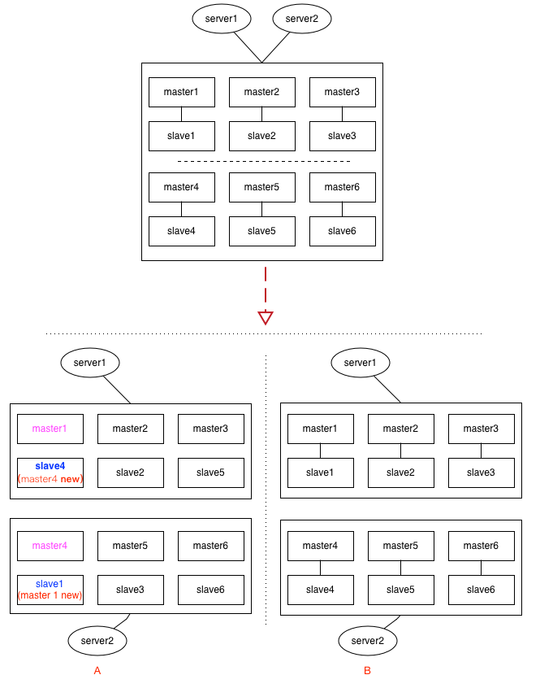
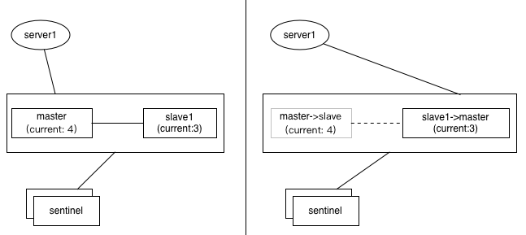

# Redis脑裂及应对

- [Redis脑裂及应对](#redis%e8%84%91%e8%a3%82%e5%8f%8a%e5%ba%94%e5%af%b9)
  - [哨兵模式的脑裂](#%e5%93%a8%e5%85%b5%e6%a8%a1%e5%bc%8f%e7%9a%84%e8%84%91%e8%a3%82)
  - [集群(cluster)模式下的脑裂](#%e9%9b%86%e7%be%a4cluster%e6%a8%a1%e5%bc%8f%e4%b8%8b%e7%9a%84%e8%84%91%e8%a3%82)
  - [主从迁移带来的不一致](#%e4%b8%bb%e4%bb%8e%e8%bf%81%e7%a7%bb%e5%b8%a6%e6%9d%a5%e7%9a%84%e4%b8%8d%e4%b8%80%e8%87%b4)
  - [总结](#%e6%80%bb%e7%bb%93)
  - [参考](#%e5%8f%82%e8%80%83)

## 哨兵模式的脑裂


初始状态是两个应用server连接到同一个master，当哨兵重选master，server2连接到新的master，而server1依旧连接到旧master。

当前会出现数据不一致，如基于setNX指令的分布式锁，可能会拿到相同的锁；基于incr生成的全局唯一id出现重复。

## 集群(cluster)模式下的脑裂




redis的配置文件中，存在两个参数：

```txt
min-slaves-to-write 3
min-slaves-max-lag 10

较新版本的redis.conf文件中的参数变成了
min-replicas-to-write 3
min-replicas-max-lag 10
```

第一个参数表示连接到master的最少slave数量

第二个参数表示slave连接到master的最大延迟时间

如果连接到master的slave数量小于第一个参数，且ping的延迟时间小于等于第二个参数，那么master就会拒绝写请求，配置了这两个参数之后，如果发生集群脑裂，原先的master节点接收到客户端的写入请求会拒绝，就可以减少数据同步之后的数据丢失。

## 主从迁移带来的不一致



如上图，1主1从，如果采用incr来生成全局唯一键，假如master上的值是4，但是尚未同步到slave上（slave上仍然是旧值3），这时候如果发生选举，slave被提升为新master，应用服务器server1切换到新主后，下次再incr获取的值，就可能重复了（3+1=4）

## 总结

上述情况比较极端，但都有可能发生，redis不能保证强一致性，对于强一致性应用，更应该倾向于RDBMS。

## 参考

> - [redis 脑裂等极端情况分析](https://www.cnblogs.com/yjmyzz/p/redis-split-brain-analysis.html)