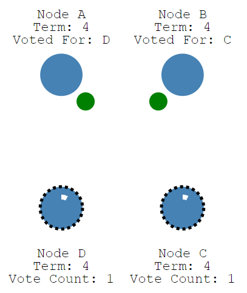
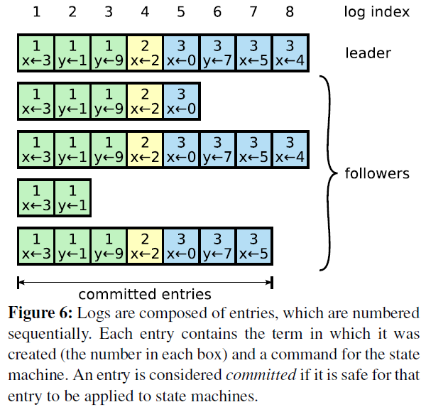

# Raft 算法

- [Raft 算法](#raft-%e7%ae%97%e6%b3%95)
  - [简介](#%e7%ae%80%e4%bb%8b)
  - [leader 选举](#leader-%e9%80%89%e4%b8%be)
  - [term](#term)
  - [选举过程](#%e9%80%89%e4%b8%be%e8%bf%87%e7%a8%8b)
  - [log replication](#log-replication)
    - [Replicated state machines](#replicated-state-machines)
  - [参考](#%e5%8f%82%e8%80%83)

## 简介

raft 算法是工程上使用较为广泛的强一致性、去中心化、高可用的分布式协议。相比 raft 算法，Paxos 算法更加复杂。

raft 算法是一个共识算法，及多个节点对某个事情达成一致看法。在分布式系统中，共识算法更多用于提高系统的容错性，比如分布式系统的复制(replication)。

## leader 选举

raft 协议中，一个节点任何时刻处于以下三个状态之一：

- leader
- follower
- candidate(候选人)

图中，所有节点启动时都是 follower 状态，在一段时间内如果没有收到来自 leader 的心跳包，从 follower 切换到 candidate，发起选举；如果某节点收到大多数赞成票，则切换到 leader 状态；如果发现其他节点比自己更新，则主动切换到 follower。

## term

上图中，leader 由所有节点投票选举，每个 leader 在工作一段时间后，选举新的 leader 继续负责。类似于现实中选举制度。每个 leader 有一个任期，在 raft 中用术语`term`表示。

term（任期）以选举（election）开始，然后就是一段或长或短的稳定工作期（normal Operation）。从上图可以看到，任期是递增的，这就充当了逻辑时钟的作用；另外，term 3 展示了一种情况，就是说没有选举出 leader 就结束了，然后会发起新的选举，后面会解释这种 split vote 的情况。

## 选举过程

- 增加节点本地的 current term，切换至 candidate 状态。
- 投自己一票
- 并行给其他节点发送 RequestVote RPCs
- 等待其他节点的回复

在这个过程中，根据来自其他节点的消息，可能出现三种结果：

1. 收到多数投票，赢得选举，成为 leader
2. 被告知其他节点已成为 leader，主动将自己变为 follower
3. 一段时间未收到多数投票，保持 candidate 状态，重新选举

对于第一种情况，成为 leader 后会立即给其他节点发消息，广而告之，避免其余节点触发新的选举。从投票者角度，有以下约束：

- 在任一 term 内，单个节点最多只能投一票
- 候选节点知道的信息不能比自己的少
- FCFS，先到先得

第二种情况，比如有三个节点 A B C。A B 同时发起选举，而 A 的选举消息先到达 C，C 给 A 投了一票，当 B 的消息到达 C 时，已经不能满足上面提到的第一个约束，即 C 不会给 B 投票，而 A 和 B 显然都不会给对方投票。A 胜出之后，会给 B,C 发心跳消息，`节点B发现节点A的term不低于自己的term`，知道已经有 Leader 了，于是转换成 follower。

第三种情况，没有任何节点获得多数投票，比如下图这种情况：

上图中，C,D 出现了平票 split vote 的情况，这个时候大家都在等啊等，直到超时后重新发起选举。如果出现平票的情况，那么就延长了系统不可用的时间（没有 leader 是不能处理客户端写请求的），因此 raft 引入了 `randomized election timeouts` 来尽量避免平票情况。同时，leader-based 共识算法中，节点的数目都是奇数个，尽量保证 `majority` 的出现。

## log replication

当选举出 leader，系统将进入对外服务阶段，leader 来调度来自客户端的并发请求顺序，并且保证 leader 与 followers 状态的一致性。raft 中的做法是，将这些请求以及执行顺序告知 followers。leader 和 followers 以相同的顺序来执行这些请求，保证状态一致。

### Replicated state machines

共识算法的实现一般是基于复制状态机，简单的来说就是`相同的初始状态+相同的输入=相同的结束状态`。不同节点要以相同且`确定性`的函数来处理输入，不要引入一个不确定的值，如本地时间。，使用 replicated log 是一个很不错的注意，log 具有持久化、保序的特点，是大多数分布式系统的基石。

因此，可以这么说，在 raft 中，leader 将客户端请求（command）封装到一个个 `log entry`，将这些 log entries 复制（replicate）到所有 follower 节点，然后大家按相同顺序应用（apply）log entry 中的 command，则状态肯定是一致的。

流程：

- leader append log entry
- leader issue AppendEntries RPC in parallel
- leader wait for majority response
- leader apply entry to state machine
- leader reply to client
- leader notify follower apply log

logs 由顺序编号的 log entry 组成 ，每个 log entry 除了包含 command，还包含产生该 log entry 时的 leader term。

从上图可以看到，五个节点的日志并不完全一致，raft 算法为了保证高可用，并不是强一致性，而是最终一致性，leader 会不断尝试给 follower 发 log entries，直到所有节点的 log entries 都相同。

上述流程，leader 只需要收到大多数 followers 的响应即可答复客户端，那么系统必须保证 log 在任何情况下都不会发生回滚。这里有两个词：commit（committed），apply(applied)，前者是指日志被复制到了大多数节点后日志的状态；而后者则是节点将日志应用到状态机，真正影响到节点状态。

在 redis 中，由于网络分区导致的脑裂情况，出现双 Leader，由上述的流程看出，旧的 leader 永远无法获取到 followers 的答复，在探测到新的 leader 时，自动降级为 follower

## 参考

> - [一文搞懂 Raft 算法](https://www.cnblogs.com/xybaby/p/10124083.html)
> - [Raft 为什么是更易理解的分布式一致性算法](https://www.cnblogs.com/mindwind/p/5231986.html)
