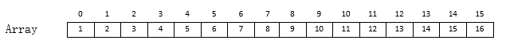
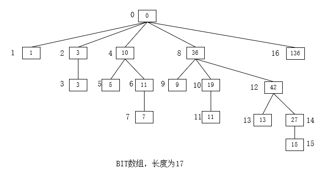
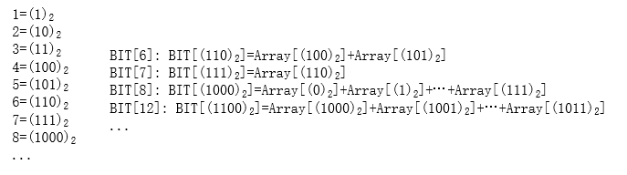

# 树状数组

## 介绍

树状数组或二元索引树（英语：Binary Indexed Tree），又以其发明者命名为 Fenwick 树。其初衷是解决数据压缩里的累积频率（Cumulative Frequency）的计算问题，现多用于高效计算数列的前缀和，区间和。它可以以 O(logN)的时间得到任意前缀和，并同时支持在 O(logN)时间内支持动态单点值的修改。空间复杂度 O(N)。

正如所有的整数都可以表示成 2 的幂和，我们也可以把一串序列表示成一系列子序列的和。采用这个想法，我们可**将一个前缀和划分成多个子序列的和，而划分的方法与数的 2 的幂和具有极其相似的方式**。一方面，**子序列的个数是其二进制表示中 1 的个数**，另一方面，**子序列代表的 f[i]的个数也是 2 的幂**

## 基本操作

### 预备函数

定义一个 Lowbit 函数，返回参数转为二进制后,最后一个 1 的位置所代表的数值.

例如,Lowbit(34)的返回值将是 2；而 Lowbit(12)返回 4；Lowbit(8)返回 8。程序上，**((Not I)+1) And I**表明了最后一位 1 的值

```c
int lowbit(int x) {
  return x&(-x)
}
```

### 新建

定义一个数组 BIT，用以维护 A 的前缀和，则：


**上述求和公式中 A 数组的起始下标是 1，所以在实际使用中，可以将求和的上限和下限都减 1(从 A[0]开始)**

```go
// 此处的list起始下标为0
func build(list []int) {
  BIT = make([]int, len(list)+1)
  for i := 1; i <= len(list); i++ {
    for j :=i-lowbit(i); j <= i-1; j++ {
      BIT[i] += list[j]
    }
  }
}
```







### 修改

假设要将 A[i]的值增加 delta，那么，需要将 BIT[i]覆盖的区间包含 A[i]的值加上 delta，需要计算的次数与数据规模 N 的二进制位数有关，即这部分的时间复杂度为 O(logN)

```go
func add(idx int, delta int) {
  for i := idx; i < len(BIT); i += lowbit(i) {
    BIT[i] += delta
  }
}
```

### 求和

```go
func sum(idx int) int {
  result := 0
  for i := idx+1; i > 0; i -= lowbit(i) {
    result += bitArr[i]
  }
  return result
}
```

### 区间求和

```go
func rangeSum(fromIdx, toIdx int) int {
  return sum(toIdx) - sum(fromIdx-1)
}
```

## 时空复杂度

初始化复杂度最优为 O(N)

单次询问复杂度 O(logN)，其中 N 为数组大小

单次修改复杂度 O(logN)，其中 N 为数组大小

空间复杂度 O(N)

## 应用

### 求逆序对数

逆序对数是一个数列中在它前面有比它大的个数。如 4312 的逆序对数是 0+1+2+2=5。

可以先把数列中的数按大小顺序转化成 1 到 n 的整数，使得原数列成为一个 1,2,...,n 的排列 P，创建一个树状数组，用来记录这样一个数组 A（下标从 1 算起）的前缀和：若排列中的数 i 当前已经出现，则 A[i]的值为 1，否则为 0。初始时数组 A 的值均为 0，从排列中的最后一个数开始遍历，每次在树状数组中查询有多少个数小于当前的数 P[j]（即用树状数组查询数组 A 目前 P[j]-1 个数的前缀和）并加入计数器，之后对树状数组执行修改数组 A 第 P[j]个数值加 1 的操作。

## 参考

> - [树状数组](https://zh.wikipedia.org/wiki/%E6%A0%91%E7%8A%B6%E6%95%B0%E7%BB%84)
> - [树状数组（Binary Indexed Tree），看这一篇就够了](https://blog.csdn.net/Yaokai_AssultMaster/article/details/79492190)
