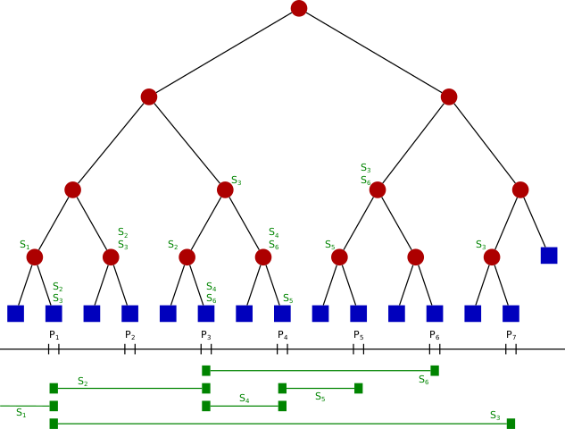

# 线段树

## 介绍

线段树（英语：Segment tree）是一种**二叉树形**数据结构，1977 年由 Jon Louis Bentley 发明，**用以存储区间或线段，并且允许快速查询结构内包含某一点的所有区间**。

一个包含 n 个区间的线段树，空间复杂度为 O(n)，查询的时间复杂度则为 O(logN+k)，其中 k 是符合条件的区间数量。

此数据结构亦可推广到高维度。

## 结构

上图，令 S 是一维线段的集合。将这些线段的端点坐标由小到大排序，令其为 X1,X2,...,Xm。我们将被这些端点切分的每一个区间称为“单位区间”（每个端点所在的位置会单独成为一个单位区间）。

线段树的结构为一个**二叉树**，每个节点都代表一个坐标区间，节点 N 所代表的区间记为 Int(N)，则其符合以下条件：

- 其每个叶节点，从左到右代表每个单位区间。
- 其内部节点代表的区间是其两个儿子代表的区间之联集。
- 每个节点（包含叶子）中有一个存储线段的数据结构。若一个线段 S 的坐标区间包含 Int(N)但不包含 Int(parent(N))，则节点 N 中会存储线段 S。

## 参考

> - [线段树](https://zh.wikipedia.org/wiki/%E7%B7%9A%E6%AE%B5%E6%A8%B9)
> - [线段树（segment tree)，看这一篇就够了](https://blog.csdn.net/Yaokai_AssultMaster/article/details/79599809)
